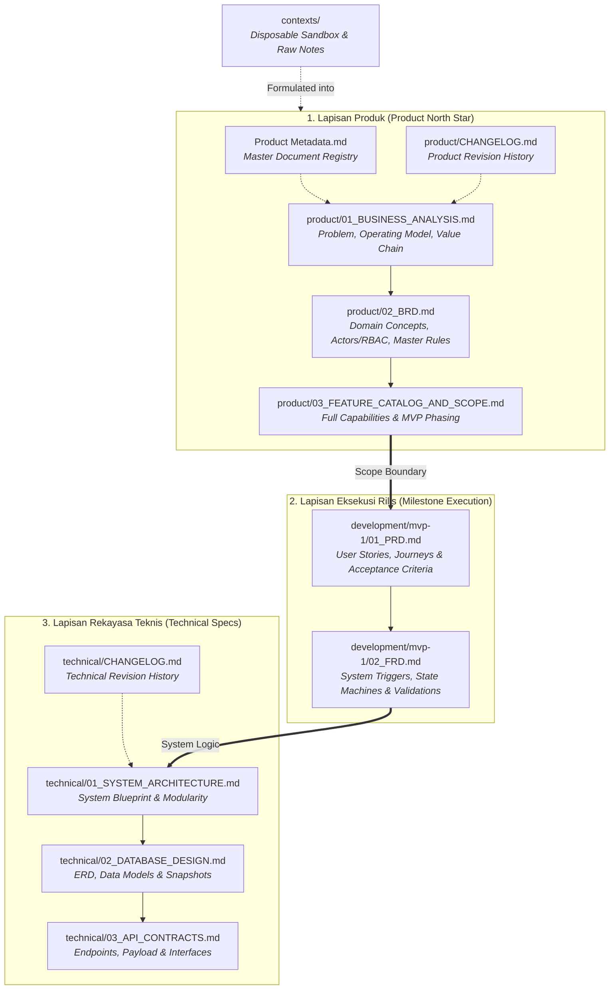

# Travel & Tour Operations System — Dokumentasi Hub (`tms-docs`)

Selamat datang di repositori dokumentasi sentral untuk **Travel & Tour Operations System (TMS)**.

---

## 1. Tujuan & Scope Repositori

> [!IMPORTANT]
> **Repositori Khusus Dokumentasi (Pure Documentation Repository):**
> Repositori ini didedikasikan **khusus untuk dokumentasi analisis bisnis, spesifikasi produk, kebutuhan fungsional rilis, dan arsitektur teknis**.
> 
> Kode implementasi (*backend, frontend, mobile apps, infrastructure scripts*) berada di repositori terpisah.

---

## 2. Arsitektur Direktori & Alur Informasi

Dokumentasi terbagi menjadi 3 pilar utama yang saling terhubung:



---

## 3. Struktur Direktori Resmi

```text
tms-docs/
├── contexts/                             # Sandbox / Temporary Notes (Disposable)
│
├── product/                              # Fondasi Bisnis & Visi Produk Global
│   ├── CHANGELOG.md                      # Catatan Riwayat Revisi Seluruh Dokumen Produk
│   ├── Product Metadata.md               # Master Registry Pemetaan Dokumen ke Target Rilis Produk
│   ├── 01_BUSINESS_ANALYSIS.md           # Problem Statement, Operating Model, Value Chain & Metrik Bisnis
│   ├── 02_BRD.md                         # Konsep Domain, Aktor/RBAC, & Master Aturan Bisnis (Harga, D-5, Disrupsi)
│   └── 03_FEATURE_CATALOG_AND_SCOPE.md   # Katalog Seluruh Fitur & Pembagian Scope (MVP-1 vs Phase 2)
│
├── development/                          # Spesifikasi Rilis per Milestone / MVP
│   └── mvp-1/
│       ├── 01_PRD.md                     # User Stories, Screen Flows & Kriteria Penerimaan MVP-1
│       └── 02_FRD.md                     # Functional System Specs (State Machine, Trigger, Validasi) MVP-1
│
├── technical/                            # Arsitektur & Spesifikasi Rekayasa Teknis
│   ├── CHANGELOG.md                      # Catatan Riwayat Revisi Seluruh Dokumen Teknikal
│   ├── 01_SYSTEM_ARCHITECTURE.md         # Blueprint Sistem, Modul & Tech Stack
│   ├── 02_DATABASE_DESIGN.md             # ERD, Model Data & Snapshotting Logic
│   └── 03_API_CONTRACTS.md              # Spesifikasi Endpoint API & Payload
│
├── .gitignore
└── README.md                             # Panduan Navigasi & Standar Dokumentasi
```

---

## 4. Peran Direktori

### 1. `contexts/` (Disposable / Scratchpad)
Direktori kerja sementara untuk menampung *raw notes*, rekaman diskusi, dan ide awal. Direktori ini bersifat *disposable* (tidak dijadikan rujukan resmi setelah disintesis ke folder `product/`).

### 2. `product/` (Business & Product North Star)
- **`CHANGELOG.md`**: Catatan riwayat revisi dan perubahan dokumen produk secara terpusat.
- **`Product Metadata.md`**: Master registri dokumen yang memetakan versi revisi setiap dokumen ke target rilis produk (misal: `v1.0 - TMS Core Operations MVP`).
- **`01_BUSINESS_ANALYSIS.md`**: Fondasi bisnis makro, analisis masalah operasional agensi, posisi sebagai *Tour Orchestrator*, struktur biaya BEP, dan target keberhasilan (KPI/OKR).
- **`02_BRD.md`**: Spesifikasi kebutuhan bisnis menyeluruh, konsep entitas (*Tour Package vs. Departure*), hak akses aktor (RBAC), serta katalog aturan bisnis baku (misal: *Price Snapshotting, Evaluasi Kuota D-5, Matriks Disrupsi, Kebijakan Refund*).
- **`03_FEATURE_CATALOG_AND_SCOPE.md`**: Daftar komprehensif seluruh kapabilitas sistem beserta pemetaannya ke dalam milestone rilis (*MVP-1 vs. Phase 2*).

### 3. `development/` (Milestone Deliverables)
Spesifikasi eksekusi per milestone atau MVP (misal: `mvp-1/`, `mvp-2/`).
- **`01_PRD.md`**: Kebutuhan produk dari sudut pandang *User & UX* (*User Stories, User Journeys, Acceptance Criteria*).
- **`02_FRD.md`**: Spesifikasi fungsional sistem (*State transitions, formula kalkulasi, event triggers, validation rules*).

### 4. `technical/` (Engineering & System Architecture)
Spesifikasi implementasi teknis untuk developer:
- **`CHANGELOG.md`**: Catatan riwayat revisi seluruh dokumen teknikal, arsitektur, dan database.
- **`01_SYSTEM_ARCHITECTURE.md`**: Arsitektur modul, bounded context, dan aplikasi.
- **`02_DATABASE_DESIGN.md`**: Skema database relasional, ERD, dan struktur snapshot harga/manifest.
- **`03_API_CONTRACTS.md`**: Format request, response, dan endpoint REST API.

---

## 5. Standar Universal Struktur & Metadata Dokumen

`product/` adalah sumber aturan normatif yang disetujui. `contexts/` adalah material discovery/reference dan tidak boleh mengoverride aturan pada `product/`.

### Documentation Validation

Run `python scripts/validate_docs.py` from the repository root before opening a documentation change.


Seluruh dokumen dalam repositori ini mengikuti tata kelola standar berikut:

1. **Tabel Metadata Teratas (Wajib pada Setiap File)**: Setiap dokumen `.md` wajib mencantumkan tabel metadata 2-kolom tepat di bawah judul utama (`# Title`).
2. **Sentralisasi Riwayat Revisi (`CHANGELOG.md`)**: Setiap perubahan isi dokumen tidak dicatat di bagian footer file, melainkan dicatat secara terpusat pada file `CHANGELOG.md` di root direktori masing-masing (`product/CHANGELOG.md` dan `technical/CHANGELOG.md`).
3. **Master Mapping Dokumen (`Product Metadata.md`)**: Pemetaan versi dokumen independen ke target rilis produk terpusat di `product/Product Metadata.md`.

---

### 5.1 Template Header Universal Dokumen

Setiap file `.md` wajib diawali dengan format metadata baku berikut:

```markdown
# [Nomor & Judul Dokumen]

## Document Information

| Item | Detail |
| :--- | :--- |
| **Document ID** | [ID Unik Dokumen, contoh: BA-01 / BRD-01 / PRD-MVP1 / ARCH-01] |
| **Document Title** | [Nama Lengkap Dokumen] |
| **Product Name** | Travel & Tour Operations System (TMS) |
| **Document Type** | Business Analysis / BRD / Scope / PRD / FRD / Architecture / DB Design / API Contracts |
| **Phase / Milestone** | Entire Product / Foundation / MVP-1 / MVP-2 |
| **Document Version** | 1.0 *(Format SemVer internal dokumen: 1.0, 1.1, dst.)* |
| **Document Status** | Draft / In Review / Approved / Final / Deprecated |
| **Implementation Status** | Planned / In Progress / Implemented / N/A |
| **Last Updated** | YYYY-MM-DD |
| **Author / Owner** | [Nama PIC / Tim Pemilik] |

---

## 1. [Bab Pertama Konten Dokumen]
...
```

---

### 5.2 Format Pencatatan pada `CHANGELOG.md`

Format pencatatan perubahan pada `product/CHANGELOG.md` dan `technical/CHANGELOG.md`:

```markdown
## [YYYY-MM-DD]

### [Document ID] Nama_File.md - Version X.X
- **Status:** Draft / In Review / Approved / Final
- **Author:** [Nama Penulis / Tim]
- **Changes:**
  - Rincian perubahan 1.
  - Rincian perubahan 2.
```

---

### 5.3 Nilai Standar & Enums (Conventions & Enums)

| Field Metadata | Nilai Standar yang Diizinkan | Keterangan |
| :--- | :--- | :--- |
| **Document Status** | `Draft`, `In Review`, `Approved`, `Final`, `Deprecated` | Status kesepakatan dan persetujuan isi dokumen. |
| **Implementation Status** | `Planned`, `In Progress`, `Implemented`, `Blocked`, `N/A` | Status realisasi pengembangan kode oleh tim engineering. |
| **Priority (pada PRD)** | `Must Have`, `Should Have`, `Could Have`, `Won't Have` (MoSCoW) | Prioritas penyelesaian fitur dalam satu milestone rilis. |
| **Document ID Format** | `BA-01`, `BRD-01`, `SCOPE-01`, `PRD-MVP1`, `FRD-MVP1`, `ARCH-01`, `DB-01`, `API-01` | Kode pengenal unik untuk perujukan silang (*cross-referencing*). |
| **Feature ID Format** | `[DOMAIN]-[ROLE]-[INDEX]`<br>Contoh: `CATALOG-ADMIN-01`, `BOOKING-CUST-02`, `OPS-TL-01` | ID fitur kanonikal untuk keterlacakan dari PRD $\rightarrow$ FRD $\rightarrow$ DB $\rightarrow$ Test. |

---

### 5.4 Kaidah Penulisan Bersih (Formatting Rules)
1. **Bebas Emoji**: Tidak menggunakan karakter emoji pada teks, judul tabel, maupun diagram Mermaid untuk menjaga profesionalitas dan konsistensi rendering.
2. **Keterlacakan Silang (*Cross-Linking*)**: Setiap perujukan dokumen wajib menggunakan relative link Markdown yang valid.
3. **Penomoran Berurutan (Prefix)**: Menggunakan penomoran dua digit (`01_`, `02_`, dst.) untuk memastikan urutan baca yang seragam.
