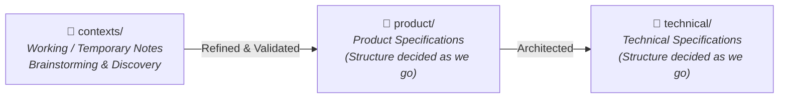

# Travel & Tour Operations System — Documentation Hub (`tms-docs`)

Welcome to the central documentation repository for the **Travel & Tour Operations System (TMS)**.

---

## 1. Repository Purpose & Scope

> [!IMPORTANT]
> **Pure Documentation Repository:**
> This repository is dedicated **exclusively to system documentation, business discovery, product requirements, and technical architecture specifications**. 
> 
> Implementation code (backend, frontend, mobile apps, infrastructure scripts) resides in separate, dedicated repositories.

---

## 2. Directory Architecture & Information Flow

The documentation progresses through distinct maturity stages:



### Directory Structure

```text
tms-docs/
├── contexts/                 # Temporary working documents, brainstorms, meeting notes, raw ideas
│   ├── 01_BRD_Travel_Trip_Management.md
│   ├── 02_FLOW_Travel_Trip_Management.md
│   ├── 03_BPMN_Travel_Trip_Management.md
│   └── 04_MODULE_DESIGN_Travel_Trip_Management.md
├── product/                  # (Upcoming) Product documentation & requirements
├── technical/                # (Upcoming) Technical documentation & architecture
├── .gitignore
└── README.md
```

---

## 3. The Role of `contexts/`

The `contexts/` directory serves as an **active brainstorming and discovery sandbox**:
- **Temporary & Working State**: Files here capture emerging ideas, operational notes, discussion transcripts, and exploratory designs before they are finalized into formal specifications.
- **Graduation Lifecycle**: Once concepts and business policies in `contexts/` are validated by stakeholders, they are synthesized and graduated into formal documents under `product/` or `technical/` (the exact sub-structures will be decided and refined as we go).

---

## 4. Current Context Reading Order

For onboarding or understanding the current business discovery status, review documents in the numbered sequence:

| Step | Document | Focus Area |
|---|---|---|
| **01** | [`contexts/01_BRD_Travel_Trip_Management.md`](contexts/01_BRD_Travel_Trip_Management.md) | **Business Requirements**: Operating model, domain concepts (`Tour Plan` vs `Tour Departure`), confirmed business rules, and open policy decisions. |
| **02** | [`contexts/02_FLOW_Travel_Trip_Management.md`](contexts/02_FLOW_Travel_Trip_Management.md) | **End-to-End Flow**: Narrative journey from customer acquisition, booking, D-5 evaluation to trip closing. |
| **03** | [`contexts/03_BPMN_Travel_Trip_Management.md`](contexts/03_BPMN_Travel_Trip_Management.md) | **BPMN & Decision Gateways**: Swimlane responsibilities (Customer, Admin, Finance, Operational, Owner) and decision branching. |
| **04** | [`contexts/04_MODULE_DESIGN_Travel_Trip_Management.md`](contexts/04_MODULE_DESIGN_Travel_Trip_Management.md) | **Module Architecture**: High-level module decomposition, entity relationships, and state lifecycles. |

---

## 5. Documentation Standards & Guidelines

1. **Keep Requirements Decoupled from Implementation**: In discovery and product phases, document *what* the business needs and *why*, rather than prescribing premature database schemas or UI libraries.
2. **Explicit Uncertainty**: Always distinguish between:
   - **Confirmed**: Firm business rules signed off by management.
   - **Assumptions to Validate**: Working assumptions that require verification.
   - **Open Questions**: Unresolved business policies.
3. **Numbered Prefixes**: Use two-digit prefixes (`01_`, `02_`, etc.) for sequential reading order within directories.
