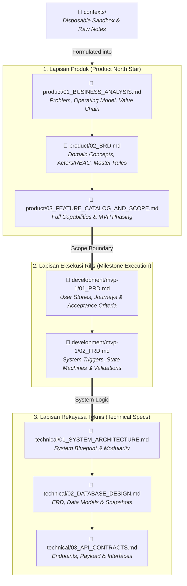

# Travel & Tour Operations System — Dokumentasi Hub (`tms-docs`)

Selamat datang di repositori dokumentasi sentral untuk **Travel & Tour Operations System (TMS)**.

---

## 1. Tujuan & Scope Repositori

> [!IMPORTANT]
> **Repositori Khusus Dokumentasi (Pure Documentation Repository):**
> Repositori ini didedikasikan **khusus untuk dokumentasi analisis bisnis, spesifikasi produk, kebutuhan fungsional rilis, dan arsitektur teknis**.
> 
> Kode implementasi (*backend, frontend, mobile apps, infrastructure scripts*) berada di repositori terpisah.

---

## 2. Arsitektur Direktori & Alur Informasi

Dokumentasi terbagi menjadi 3 pilar utama yang saling terhubung:



---

## 3. Struktur Direktori Resmi

```text
tms-docs/
├── contexts/                             # Sandbox / Temporary Notes (Disposable)
│
├── product/                              # Fondasi Bisnis & Visi Produk Global
│   ├── 01_BUSINESS_ANALYSIS.md           # Problem Statement, Operating Model, Value Chain & Metrik Bisnis
│   ├── 02_BRD.md                         # Konsep Domain, Aktor/RBAC, & Master Aturan Bisnis (Harga, D-5, Disrupsi)
│   └── 03_FEATURE_CATALOG_AND_SCOPE.md   # Katalog Seluruh Fitur & Pembagian Scope (MVP-1 vs Phase 2)
│
├── development/                          # Spesifikasi Rilis per Milestone / MVP
│   └── mvp-1/
│       ├── 01_PRD.md                     # User Stories, Screen Flows & Kriteria Penerimaan MVP-1
│       └── 02_FRD.md                     # Functional System Specs (State Machine, Trigger, Validasi) MVP-1
│
├── technical/                            # Arsitektur & Spesifikasi Rekayasa Teknis
│   ├── 01_SYSTEM_ARCHITECTURE.md         # Blueprint Sistem, Modul & Tech Stack
│   ├── 02_DATABASE_DESIGN.md             # ERD, Model Data & Snapshotting Logic
│   └── 03_API_CONTRACTS.md              # Spesifikasi Endpoint API & Payload
│
├── .gitignore
└── README.md                             # Panduan Navigasi Dokumentasi
```

---

## 4. Peran Direktori

### 1. `contexts/` (Disposable / Scratchpad)
Direktori kerja sementara untuk menampung *raw notes*, rekaman diskusi, dan ide awal. Direktori ini bersifat *disposable* (tidak dijadikan rujukan resmi setelah disintesis ke folder `product/`).

### 2. `product/` (Business & Product North Star)
- **`01_BUSINESS_ANALYSIS.md`**: Fondasi bisnis makro, analisis masalah operasional agensi, posisi sebagai *Tour Orchestrator*, dan target keberhasilan (KPI/OKR).
- **`02_BRD.md`**: Spesifikasi kebutuhan bisnis menyeluruh, konsep entitas (*Package Blueprint vs. Departure Instance*), hak akses aktor (RBAC), serta katalog aturan bisnis baku (misal: *Price Snapshotting, Evaluasi Kuota D-5, Matriks Disrupsi, Kebijakan Refund*).
- **`03_FEATURE_CATALOG_AND_SCOPE.md`**: Daftar komprehensif seluruh kapabilitas sistem beserta pemetaannya ke dalam milestone rilis (*MVP-1 vs. Phase 2*).

### 3. `development/` (Milestone Deliverables)
Spesifikasi eksekusi per milestone atau MVP (misal: `mvp-1/`, `mvp-2/`).
- **`01_PRD.md`**: Kebutuhan produk dari sudut pandang *User & UX* (*User Stories, User Journeys, Acceptance Criteria*).
- **`02_FRD.md`**: Spesifikasi fungsional sistem (*State transitions, formula kalkulasi, event triggers, validation rules*).

### 4. `technical/` (Engineering & System Architecture)
Spesifikasi implementasi teknis untuk developer:
- **`01_SYSTEM_ARCHITECTURE.md`**: Arsitektur modul dan aplikasi.
- **`02_DATABASE_DESIGN.md`**: Skema database relasional, ERD, dan struktur snapshot harga/manifest.
- **`03_API_CONTRACTS.md`**: Format request, response, dan endpoint REST API.

---

## 5. Standar & Panduan Dokumentasi

1. **Pisahkan Requirements dari Implementasi**: Folder `product/` berfokus pada *apa* dan *mengapa*, sedangkan detail implementasi fungsional dan teknis berada di `development/` dan `technical/`.
2. **Penomoran Berurutan (Numbered Prefixes)**: Gunakan format dua digit (`01_`, `02_`, dst.) untuk memastikan urutan membaca yang runut dan terstruktur.
