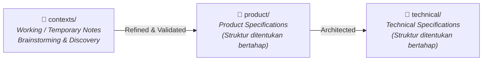

# Travel & Tour Operations System — Dokumentasi Hub (`tms-docs`)

Selamat datang di repositori dokumentasi sentral untuk **Travel & Tour Operations System (TMS)**.

---

## 1. Tujuan & Scope Repositori

> [!IMPORTANT]
> **Repositori Khusus Dokumentasi (Pure Documentation Repository):**
> Repositori ini didedikasikan **khusus untuk dokumentasi sistem, business discovery, product requirements, dan spesifikasi arsitektur teknis**. 
> 
> Kode implementasi (*backend, frontend, mobile apps, infrastructure scripts*) berada di repositori terpisah.

---

## 2. Arsitektur Direktori & Alur Informasi

Dokumentasi berkembang melalui tahapan maturitas yang terstruktur:



### Struktur Direktori

```text
tms-docs/
├── contexts/                 # Catatan kerja sementara, brainstorm, meeting notes, raw ideas
│   ├── 01_BRD_Travel_Trip_Management.md
│   ├── 02_FLOW_Travel_Trip_Management.md
│   ├── 03_BPMN_Travel_Trip_Management.md
│   └── 04_MODULE_DESIGN_Travel_Trip_Management.md
├── product/                  # (Mendatang) Dokumentasi produk formal & requirements
├── technical/                # (Mendatang) Engineering blueprints, data schemas, API contracts
├── .gitignore
└── README.md
```

---

## 3. Peran Direktori `contexts/`

Direktori `contexts/` berfungsi sebagai **sandbox brainstorming dan discovery aktif**:
- **Status Sementara & Kerja (Temporary & Working State)**: File di sini menampung ide-ide awal, catatan operasional, transkrip diskusi, dan desain eksploratif sebelum difinalisasi ke dalam spesifikasi formal.
- **Siklus Kelulusan (Graduation Lifecycle)**: Setelah konsep dan aturan bisnis di `contexts/` divalidasi oleh *stakeholder*, dokumen akan disintesis dan dipindahkan ke dalam dokumen formal di folder `product/` atau `technical/` (struktur sub-folder akan disesuaikan seiring berjalannya proyek).

---

## 4. Urutan Membaca Dokumen Konteks Saat Ini

Untuk proses *onboarding* atau memahami status *business discovery* saat ini, baca dokumen dengan urutan nomor berikut:

| Urutan | Dokumen | Area Fokus |
|---|---|---|
| **01** | [`contexts/01_BRD_Travel_Trip_Management.md`](contexts/01_BRD_Travel_Trip_Management.md) | **Business Requirements**: Model operasional, konsep domain (`Tour Plan` vs `Tour Departure`), aturan bisnis yang telah dikonfirmasi, dan keputusan kebijakan yang masih terbuka. |
| **02** | [`contexts/02_FLOW_Travel_Trip_Management.md`](contexts/02_FLOW_Travel_Trip_Management.md) | **End-to-End Flow**: Alur perjalanan naratif dari akuisisi pelanggan, *booking*, evaluasi D-5, hingga *trip closing*. |
| **03** | [`contexts/03_BPMN_Travel_Trip_Management.md`](contexts/03_BPMN_Travel_Trip_Management.md) | **BPMN & Decision Gateways**: Pembagian tanggung jawab *swimlane* (*Customer, Admin, Finance, Operational, Owner*) dan percabangan keputusan. |
| **04** | [`contexts/04_MODULE_DESIGN_Travel_Trip_Management.md`](contexts/04_MODULE_DESIGN_Travel_Trip_Management.md) | **Module Architecture**: Dekomposisi modul tingkat tinggi, relasi entitas, dan *state lifecycles*. |

---

## 5. Standar & Panduan Dokumentasi

1. **Pisahkan Requirements dari Implementasi**: Pada fase *discovery* dan *product*, dokumentasikan *apa* yang dibutuhkan bisnis dan *mengapa*, hindari menentukan skema database atau *UI library* secara prematur.
2. **Eksplisitkan Ketidakpastian**: Selalu bedakan antara:
   - **Confirmed**: Aturan bisnis pasti yang telah disetujui manajemen.
   - **Assumptions to Validate**: Asumsi kerja yang masih membutuhkan verifikasi.
   - **Open Questions**: Kebijakan bisnis yang belum diputuskan.
3. **Penomoran Berurutan (Numbered Prefixes)**: Gunakan format dua digit (`01_`, `02_`, dst.) untuk urutan membaca dalam setiap direktori.
