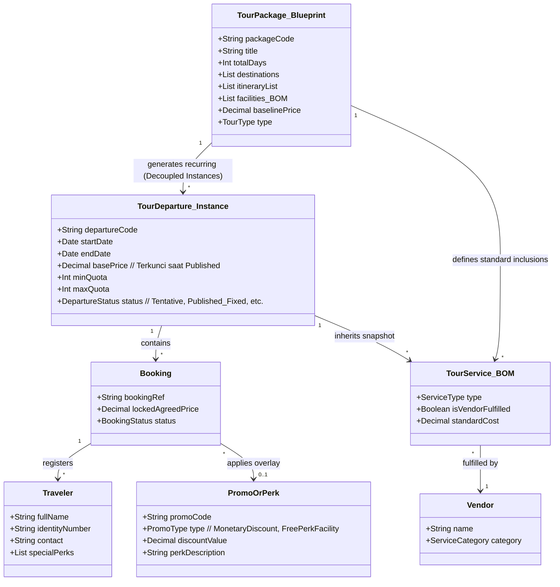
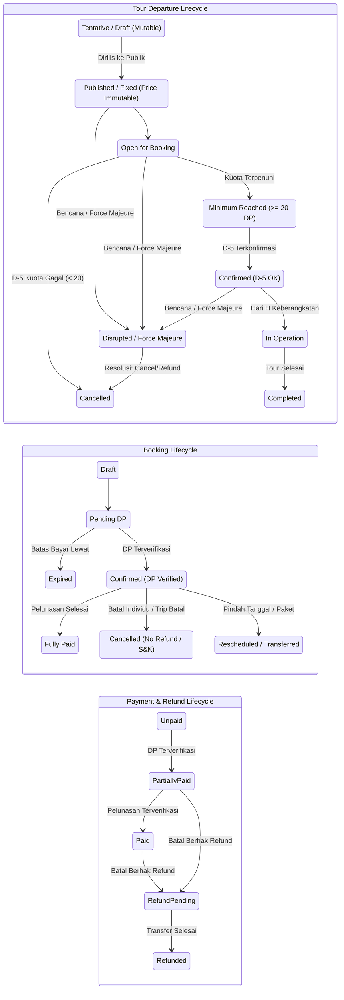

# BRD — Travel & Tour Operations System

## 1. Konteks Dokumen & Sprint Objective
Dokumen ini berfungsi sebagai **Business Requirements Document (BRD)** untuk Travel & Tour Operations System pada fase penemuan (*discovery*) dan *brainstorming*.

> **Prinsip:** Fokus pada tahap ini adalah menemukan dan memvalidasi **Business Context, Business Processes, dan Business Rules**, serta mencatat secara eksplisit asumsi dan *open questions*. Dokumen ini mendefinisikan batasan domain, integritas data, dan logika operasional secara terstruktur.

---

## 2. Konteks Bisnis & Operating Model
Organisasi merupakan sebuah **travel agency / tour operator** yang mengorkestrasi perjalanan wisata secara *end-to-end*.

Agensi bertanggung jawab untuk:
- Merencanakan, mengemas (*packaging* — merangkai *itinerary*, transportasi, akomodasi, konsumsi, tiket aktivitas, dan pemandu menjadi satu paket wisata terpadu dengan satu struktur harga), dan menjadwalkan tour (baik *pre-packaged* untuk Open Tour maupun *custom packaging* untuk Private Tour).
- Mengelola *booking pipeline* dan hubungan pelanggan (*customer relations*).
- Menugaskan dan mengelola **Tour Leader**.
- Mengoordinasikan *travelers* dan mengelola *manifest*.
- Mengoordinasikan vendor pihak ketiga untuk pemenuhan layanan (*Transport, Accommodations, Activities, Meals*).
- Memonitor pelaksanaan tour secara *live* dan menangani *incident/complaint/force majeure*.
- Mengelola transaksi keuangan (*Customer Invoicing, DP/Settlement collections, Promo & Discounts, Vendor Payables, Refunds, Disruption Ledgers*).
- Menghasilkan dokumen operasional, komersial, dan keuangan.

Agensi bertindak terutama sebagai **tour orchestrator/operator** yang mengoordinasikan sumber daya internal serta penyedia layanan eksternal (*vendors*).

---

## 3. Konsep Inti Domain Bisnis



1. **Tour Package / Master Plan (Blueprint):** Cetak biru paket wisata yang mendefinisikan durasi hari, *itinerary*, destinasi, dan daftar fasilitas baku (*Bill of Materials / BOM*) beserta *baseline price*. Bersifat stabil dan dapat digunakan berulang (*reusable*).
2. **Tour Departure (Decoupled Instance):** Eksekusi kalender spesifik dari suatu *Tour Package* pada tanggal tertentu. Memiliki siklus status mandiri (*Tentative* $\rightarrow$ *Published_Fixed*), kuota, *Tour Leader*, reservasi vendor, dan harga yang terkunci (*immutable*) saat dirilis.
3. **Booking & Price Snapshot:** Kontrak reservasi komersial pelanggan yang mengunci harga pada saat transaksi disepakati (*price snapshot*), kebal terhadap perubahan harga di masa depan.
4. **Promo & Perks Overlay:** Lapisan modifikasi transaksi (diskon moneter % / nominal flat atau fasilitas cuma-cuma seperti *free meals/merchandise*) yang diterapkan di atas harga dasar tanpa mengubah *base price* master paket.
5. **Traveler / Participant:** Individu peserta tour yang tercatat dalam *manifest* dengan hak fasilitas standar maupun *special perks*.
6. **Tour Leader:** Koordinator lapangan yang memimpin perjalanan dan memvalidasi fasilitas peserta di lapangan.
7. **Vendor:** Pihak ketiga penyedia akomodasi, transportasi, konsumsi, atau tiket aktivitas.

---

## 4. Tipe Tour & Penyediaan Layanan

### 4.1 Open Tour (Recurring / Multi-Customer)
- Tour publik terstandarisasi di mana peserta independen bergabung dalam satu keberangkatan (*batch*).
- Menggunakan *Tour Package Blueprint* dengan penjadwalan berulang (*flexible recurrence*).
- Diatur oleh **kuota minimum peserta** (standar: 20 peserta terverifikasi DP).
- Tanggal dan harga bersifat tentatif saat perencanaan, namun menjadi **kontrak baku mutlak (*fixed & immutable*)** begitu dipublikasikan (*Published*).

### 4.2 Private / Custom Tour (Bespoke)
- Rencana perjalanan (*itinerary*) khusus yang disesuaikan untuk satu grup/klien tertentu.
- **Workflow:** Customer Request $\rightarrow$ Custom Tour Plan $\rightarrow$ Service Sourcing $\rightarrow$ Cost Estimation $\rightarrow$ Quotation $\rightarrow$ Negotiation $\rightarrow$ Final Agreed Price $\rightarrow$ Booking Confirmation.

---

## 5. Katalog Aturan Bisnis (Business Rules Catalog)

### 5.1 Aturan Bisnis yang Telah Dikonfirmasi (Confirmed)

| ID | Pernyataan Aturan Bisnis | Kategori |
|---|---|---|
| **BR-001** | Booking berstatus **Confirmed hanya ketika Down Payment (DP) yang dipersyaratkan telah dibayar dan diverifikasi** oleh Finance. | Booking & Finance |
| **BR-002** | Keberangkatan *Open Tour* dapat dibatalkan jika syarat minimum peserta tidak tercapai pada milestone evaluasi. | Tour Operations |
| **BR-003** | Standar ambang batas kuota minimum *Open Tour* saat ini adalah **20 peserta terverifikasi DP**. | Quota Validation |
| **BR-004** | Validasi DP dievaluasi pada **H-5 / D-5 (5 hari sebelum keberangkatan)**. *Inquiry* tanpa DP terverifikasi atau formulir belum bayar **tidak dihitung** ke kuota. | Quota Validation |
| **BR-005** | Jika keberangkatan dibatalkan oleh agensi pada D-5 (kuota tidak tercapai), opsi penyelesaian adalah **100% Full Refund** atau **Transfer to Travel Partner** berdasarkan keputusan Owner. | Quota Failure Policy |
| **BR-006** | Proses *Refund* dapat terjadi bahkan setelah booking mencapai status Confirmed. | Refund Policy |
| **BR-007** | **Flexible Recurrence Engine:** Penjadwalan *Open Tour* mendukung pembuatan otomatis (*cron/generator*) dan manual (*on-demand*) dengan berbagai pola (mingguan, bulanan, interval hari, atau *date-picker*). | Scheduling & Recurrence |
| **BR-008** | **Pre-Publish Schedule Adjustment:** Jadwal yang dihasilkan mesin rekurensi berstatus *Tentative/Draft* dan dapat disesuaikan tanggalnya secara manual oleh Admin (misal: penyesuaian libur nasional) sebelum dirilis. | Scheduling & Operations |
| **BR-009** | *Private tour* dikustomisasi melalui mekanisme *quotation* dan negosiasi tersendiri. | Sales & Quotation |
| **BR-010** | **Price Immutability upon Publish:** Harga *Tour Departure* yang berstatus **PUBLISHED_FIXED terkunci mutlak (*immutable*)** dan tidak dapat diubah langsung (bahkan jika peserta masih 0). Perubahan harga master paket hanya berdampak pada jadwal berstatus *Tentative*. | Pricing Policy |
| **BR-011** | Setiap keberangkatan aktif wajib memiliki **Tour Leader** yang ditugaskan sebelum trip dimulai. | Operations |
| **BR-012** | Layanan pihak ketiga (*Bus, Penginapan, Restoran, Tiket*) wajib dicatat melalui *Vendor Records* dan *Purchase Order (PO)*. | Vendor Management |
| **BR-013** | **Individual Cancellation Policy:** Kebijakan default pembatalan sepihak oleh peserta adalah **Strict No-Refund** (dana hangus). Namun sistem mendukung mesin konfigurasi S&K bertingkat (potongan biaya operasional) serta *Admin Discretionary Override* (dengan pencatatan alasan & *audit log*). | Customer Cancellation |
| **BR-014** | **Disruption & Force Majeure Resolution:** Jika terjadi bencana/kondisi darurat, Admin memiliki konsol resolusi 4 opsi: *(1) Cancel with Terms/Full Refund, (2) Reschedule (paket sama), (3) Switch Plan/Destination, (4) Switch Package (Cross-package)*. | Disruption Management |
| **BR-015** | **Cross-Package Transfer Reconciliation:** Perpindahan ke paket lain mendukung 2 mode: *(a) Standar Komersial (tagih kekurangan / kembalikan kelebihan)* dan *(b) Free Waiver / Goodwill (tanpa biaya tambahan, selisih diserap agensi sebagai kompensasi)*. | Finance & Disruption |
| **BR-016** | **Promo & Discount Overlay:** Diskon moneter (% atau nominal tetap) mengurangi total tagihan pada *Invoice*, tanpa mengubah *base price* departure. Default bersifat *non-stackable* dan dibatasi kuota/periode masa berlaku. | Marketing & Pricing |
| **BR-017** | **Value-Add Facility Perks:** Tambahan fasilitas cuma-cuma (contoh: *free extra lunch, free drone photo*) tidak mengurangi harga invoice, melainkan ditandai pada *Manifest & Vendor PO* sebagai biaya promosi internal (*Marketing Expense*). | Marketing & Operations |

---

## 6. Pemisahan Lifecycle & Transisi Status (Decoupled Lifecycles)

Sistem memisahkan siklus hidup *Booking*, *Tour Departure*, dan *Payment* agar integritas data tetap terjaga:



---

## 7. Cakupan Fungsional Berdasarkan Area Bisnis

```text
TRAVEL & TOUR OPERATIONS SYSTEM
├── CRM & Customer Management (Profil Pelanggan, Riwayat Tour, Dokumen Identitas)
├── Sales, Quotation & Booking Pipeline
│   ├── Private Tour Quotation Generator
│   ├── Order & Booking Management (Price Snapshotting)
│   ├── Promo & Perks Engine (Diskon %, Potongan Tetap, Voucher, Complimentary Perks)
│   └── Traveler Registration & Manifest Manager
├── Tour Planning & Master Catalog
│   ├── Master Tour Package (Blueprint Itinerary, Destinasi, Fasilitas BOM)
│   └── Baseline Cost & Standard Pricing Calculator
├── Tour Operations & Execution
│   ├── Flexible Recurrence Engine (Pola Mingguan, Bulanan, Interval, Date-picker)
│   ├── Pre-Publish Departure Adjuster (Manual Date/Quota Override)
│   ├── D-5 Minimum Quota Evaluation Engine (Ambang batas 20 DP)
│   ├── Disruption & Crisis Console (4 Opsi Resolusi: Cancel, Reschedule, Switch Plan/Package)
│   └── Tour Leader Assignment & Dispatch
├── Tour Leader Field Module (Real-time Manifest, Check-in, Special Perks Badge, Incident Log)
├── Vendor Procurement & Management (Direktori Vendor, Penerbitan PO & Voucher, Pelacakan Tagihan)
├── Finance, Billing & Ledgers
│   ├── Customer Invoicing & DP/Pelunasan Allocation
│   ├── Payment Verification Queue
│   ├── Cancellation & Refund Processing Engine
│   ├── Disruption Financial Reconciliation (Standard Difference vs Free Waiver / Goodwill Loss)
│   ├── Marketing Expense Allocation (Biaya Promo & Facility Perks)
│   └── Tour Financial Closing Ledger (Gross Revenue, Vendor Cost, Net Margin)
├── Document Generation Vault (Invoices, Receipts, Service Vouchers, Itineraries, Booking Confirmations, POs)
└── Management Dashboard & Reporting (Executive View, Pipeline Keberangkatan, Margin Realisasi)
```

---

## 8. Stakeholder & Tanggung Jawab

| Role | Tanggung Jawab Utama |
|---|---|
| **Customer / Traveler** | Mengajukan *inquiry*, mengisi formulir registrasi, menerapkan kupon promo, membayar DP & pelunasan, menerima dokumen konfirmasi. |
| **Admin / Sales** | Menangani komunikasi pelanggan, membuat *booking*, menerapkan diskon/penyesuaian promo, memproses permintaan *reschedule/cancellation*, dan mengoperasikan konsol disrupsi. |
| **Finance** | Memverifikasi pembayaran masuk, mengeksekusi pengembalian dana (*refund*), membayar tagihan vendor, mencatat subsidi *Free Waiver/Goodwill*, dan melakukan *financial closing*. |
| **Operational** | Mengelola *Master Tour Package*, mengatur aturan rekurensi jadwal, menyesuaikan jadwal draf sebelum rilis, menerbitkan PO vendor, dan menugaskan *Tour Leader*. |
| **Tour Leader** | Mengakses *live manifest* di lapangan, memeriksa hak fasilitas & *special perks* peserta, memimpin perjalanan, dan melaporkan insiden/kondisi darurat. |
| **Owner / Executive** | Memberikan persetujuan pembatalan kuota D-5 (*Full Refund* vs *Transfer Partner*), menyetujui kebijakan kompensasi *Free Waiver*, dan meninjau profitabilitas agensi. |
| **Vendor / Travel Partner** | Menerima PO dan menyediakan transportasi/akomodasi/konsumsi, serta menerima delegasi peserta jika terjadi pengalihan. |

---

## 9. Pertanyaan Terbuka & Keputusan Kebijakan Lanjutan

| Topik | Pertanyaan untuk Diselesaikan | Dampak / Risiko |
|---|---|---|
| **Ketentuan Nominal DP** | Apakah DP berupa nominal flat (contoh: Rp 500.000/org) atau persentase (contoh: 30% dari harga paket)? | Menentukan logika kalkulasi tagihan invoice awal. |
| **Plafon Biaya Free Waiver** | Apakah ada batas selisih harga maksimum ketika peserta dipindahkan ke paket lain secara gratis (*Free Waiver*) saat *Force Majeure*? | Melindungi agensi dari kerugian kompensasi operasional yang melebihi batas toleransi. |
| **Sunk Cost Pembayaran Vendor** | Bagaimana perlakuan uang muka vendor yang hangus (*non-refundable*) saat agensi membatalkan keberangkatan? | Mempengaruhi laporan kerugian trip dan klausul negosiasi kontrak vendor. |
| **Otomasi Tindakan D-5** | Apakah sistem otomatis membatalkan *departure* berkuota < 20 pada D-5, atau membuat notifikasi darurat untuk konfirmasi Owner? | Mencegah pembatalan tidak sengaja pada trip yang ingin disubsidi oleh Owner. |
