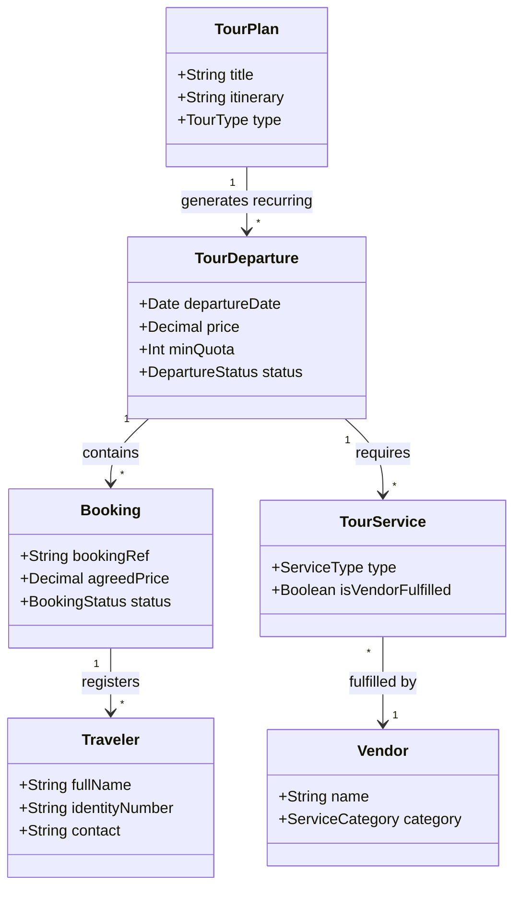
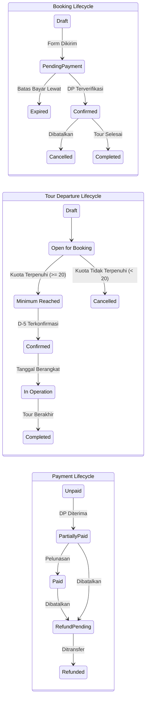
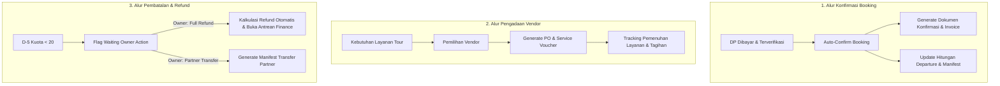

# BRD — Travel & Tour Operations System

## 1. Konteks Dokumen & Sprint Objective
Dokumen ini berfungsi sebagai **Business Requirements Document (BRD)** untuk Travel & Tour Operations System pada fase penemuan (*discovery*) dan *brainstorming*.

> **Prinsip:** Fokus pada tahap ini adalah menemukan dan memvalidasi **Business Context, Business Processes, dan Business Rules**, serta mencatat secara eksplisit asumsi dan *open questions*. Dokumen ini tidak menentukan skema database, API, batasan *microservice*, maupun implementasi UI secara prematur.

---

## 2. Konteks Bisnis & Operating Model
Organisasi merupakan sebuah **travel agency / tour operator** yang mengorkestrasi perjalanan wisata secara *end-to-end*.

Agensi bertanggung jawab untuk:
- Merencanakan, mengemas (*packaging* — merangkai *itinerary*, transportasi, akomodasi, konsumsi, tiket aktivitas, dan pemandu menjadi satu paket wisata terpadu dengan satu struktur harga), dan menjadwalkan tour (baik *pre-packaged* untuk Open Tour maupun *custom packaging* untuk Private Tour).
- Mengelola *booking pipeline* dan hubungan pelanggan (*customer relations*).
- Menugaskan dan mengelola **Tour Leader**.
- Mengoordinasikan *travelers* dan mengelola *manifest*.
- Mengoordinasikan vendor pihak ketiga untuk pemenuhan layanan (*Transport, Accommodations, Activities, Meals*).
- Memonitor pelaksanaan tour secara *live* dan menangani *incident/complaint*.
- Mengelola transaksi keuangan (*Customer Invoicing, DP/Settlement collections, Vendor Payables, Refunds*).
- Menghasilkan dokumen operasional, komersial, dan keuangan.

Agensi bertindak terutama sebagai **tour orchestrator/operator** yang mengoordinasikan sumber daya internal serta penyedia layanan eksternal (*vendors*).

---

## 3. Konsep Inti Domain Bisnis



1. **Tour / Tour Plan:** *Master itinerary* dan struktur rencana perjalanan wisata (dapat digunakan kembali untuk *open tour* berulang).
2. **Tour Departure:** Eksekusi kalender spesifik dari suatu *Tour Plan* pada tanggal tertentu dengan kuota, harga, *Tour Leader*, dan reservasi vendor tersendiri.
3. **Booking:** Kontrak/reservasi komersial yang dibuat oleh pelanggan untuk satu atau lebih *traveler* pada *Tour Departure* tertentu.
4. **Traveler / Participant:** Individu yang menjadi peserta dalam perjalanan wisata.
5. **Tour Leader:** Koordinator yang ditunjuk oleh agensi untuk memimpin dan mendampingi perjalanan di lapangan.
6. **Tour Service:** Komponen layanan individual yang dibutuhkan untuk pelaksanaan tour (*Transport, Hotel, Activity, Restaurant, Guiding*).
7. **Vendor:** Pihak ketiga eksternal yang menyediakan pemenuhan layanan tour (*service fulfillment*).

---

## 4. Tipe Tour & Penyediaan Layanan

### 4.1 Open Tour (Recurring / Multi-Customer)
- Tour publik yang telah ditentukan polanya, di mana banyak pelanggan/rombongan independen bergabung dalam keberangkatan (*departure*) yang sama.
- Memiliki *Tour Plan* yang dapat dipakai ulang dengan jadwal keberangkatan kalender berulang (*recurring departures*).
- Diatur oleh **kuota minimum peserta** (contoh: minimum 20 peserta terverifikasi DP).
- Harga dan detail operasional dapat berbeda antar keberangkatan (*departures*).

### 4.2 Private / Custom Tour (Bespoke)
- Rencana perjalanan (*itinerary*) yang disesuaikan secara khusus untuk pelanggan atau grup tertentu.
- **Workflow:** Customer Request $\rightarrow$ Custom Tour Plan $\rightarrow$ Service Sourcing $\rightarrow$ Cost Estimation $\rightarrow$ Quotation $\rightarrow$ Negotiation $\rightarrow$ Final Agreed Price $\rightarrow$ Booking Confirmation.

---

## 5. Katalog Aturan Bisnis (Business Rules Catalog)

### 5.1 Aturan Bisnis yang Telah Dikonfirmasi (Confirmed)

| ID | Pernyataan Aturan Bisnis | Kategori |
|---|---|---|
| **BR-001** | Booking berstatus **Confirmed hanya ketika Down Payment (DP) yang dipersyaratkan telah dibayar dan diverifikasi**. | Booking & Finance |
| **BR-002** | Keberangkatan *Open Tour* dapat dibatalkan jika syarat minimum peserta tidak tercapai. | Tour Operations |
| **BR-003** | Standar ambang batas kuota minimum *Open Tour* saat ini adalah **20 peserta terverifikasi DP**. | Quota Validation |
| **BR-004** | Validasi DP dievaluasi pada **H-5 / D-5 (5 hari sebelum keberangkatan)**. *Inquiry* tanpa DP terverifikasi atau form belum bayar **tidak dihitung**. | Quota Validation |
| **BR-005** | Kebijakan pembatalan yang diinisiasi agensi (misal: kuota tidak tercapai) saat ini adalah **100% Full Refund** atau **Transfer to Travel Partner** berdasarkan keputusan Owner. | Refund Policy |
| **BR-006** | Proses *Refund* dapat terjadi bahkan setelah booking mencapai status Confirmed. | Refund Policy |
| **BR-007** | *Open tour* bersifat berulang (*recurring*) dengan *departure events* yang terpisah. | Tour Planning |
| **BR-008** | *Itinerary* dan komponen layanan dapat bervariasi antar keberangkatan yang berbeda dari *Tour Plan* yang sama. | Tour Planning |
| **BR-009** | *Private tour* dapat dikustomisasi oleh pelanggan melalui mekanisme *quotation*. | Sales & Quotation |
| **BR-010** | Harga *Tour Departure* bersifat fluktuatif/dapat berubah (*mutable*) mengikuti musim, tanggal, dan periode *early-bird*. | Pricing Policy |
| **BR-011** | Setiap keberangkatan aktif wajib memiliki **Tour Leader** yang ditugaskan. | Operations |
| **BR-012** | Layanan pihak ketiga (*Bus, Penginapan, Restoran*) wajib dicatat melalui *Vendor Records*. | Vendor Management |

### 5.2 Prinsip Penetapan Harga & Asumsi yang Perlu Divalidasi

> [!IMPORTANT]
> **Immutability Harga pada Booking yang Disepakati (Asumsi untuk Divalidasi):**
> Meskipun harga dasar *Tour Departure* dapat berubah seiring waktu (contoh: Keberangkatan Agustus Rp 3,5 jt $\rightarrow$ September Rp 3,7 jt), **begitu booking pelanggan disepakati/diterbitkan (*agreed booking*), penyesuaian harga *departure* di kemudian hari TIDAK BOLEH mengubah kewajiban pembayaran pelanggan secara retroaktif.**

**Kapabilitas Penetapan Harga di Masa Depan:**
- *Seasonal pricing* & diskon *early-bird*.
- *Tiered pricing* berdasarkan ukuran grup atau kategori traveler (*Adult, Child, Infant*).
- Tarif negosiasi khusus untuk *private tour*.

---

## 6. Pemisahan Lifecycle & Transisi Status (Decoupled Lifecycles)

Sistem memisahkan siklus hidup *Booking*, *Tour Departure*, dan *Payment* agar tidak terjadi *state lock-in* yang tidak valid:



*Contoh kombinasi status yang valid:*
- `Booking = CANCELLED`
- `Payment = PARTIALLY_PAID` (atau `PAID`)
- `Refund = PENDING`

---

## 7. Cakupan Fungsional Berdasarkan Area Bisnis

```text
TRAVEL & TOUR OPERATIONS SYSTEM
├── CRM & Customer Management (Customer Profiles, Riwayat Tour, Document Repository)
├── Sales & Quotation (Private Tour Estimator, Generator Quotation, Tracking Revisi)
├── Booking & Registration (Manajemen Manifest, Detail Traveler, Rooming Lists)
├── Tour Planning & Master Catalog (Master Tour Plans, Day-by-Day Itinerary, Katalog Aktivitas)
├── Tour Operations (Departure Scheduler, Monitor Kuota D-5, Dispatch Manifest)
├── Tour Leader Operations (Field Itinerary View, Traveler Check-in, Laporan Insiden)
├── Vendor Procurement & Management (Direktori Vendor, Request Layanan, Tracking PO)
├── Finance & Billing (Customer Invoicing, Verifikasi DP/Pelunasan, Vendor Payables, Profit & Loss)
├── Cancellation & Refund Management (Pemrosesan Full Refund, Disposisi Transfer Partner)
├── Document Generation (Invoices, Receipts, Vouchers, Itineraries, Booking Confirmations, POs)
└── Management Dashboard & Reporting (Pipeline Keberangkatan, Cash Flow, Okupansi, Analisis Margin)
```

---

## 8. Peluang Otomasi & Efisiensi Operasional



---

## 9. Stakeholder & Tanggung Jawab

| Role | Tanggung Jawab Utama |
|---|---|
| **Customer / Traveler** | Mengajukan *inquiry*, mengisi form registrasi, membayar DP/pelunasan, menerima voucher & itinerary. |
| **Admin / Sales** | Merespons *inquiry*, menerbitkan *quotation*, menyiapkan form booking, membuat *invoice* customer. |
| **Finance** | Memverifikasi bukti pembayaran masuk, memproses *refund*, membayar tagihan vendor, melakukan *financial closing*. |
| **Operational** | Menjadwalkan *tour departure*, menugaskan *Tour Leader*, mereservasi layanan vendor, memonitor pemenuhan vendor. |
| **Tour Leader** | Mengakses *manifest* traveler secara *real-time*, memimpin koordinasi lapangan, melaporkan insiden tour. |
| **Owner / Executive** | Memberikan keputusan pembatalan (*Full Refund* vs *Transfer Partner*), menyetujui *override* kebijakan, meninjau profitabilitas agensi. |
| **Vendor / Travel Partner** | Menerima *service request/PO*, menyediakan transportasi/penginapan/konsumsi, menerima pengalihan peserta (*transferred bookings*). |

---

## 10. Pertanyaan Terbuka & Keputusan Kebijakan yang Perlu Diselesaikan

| Topik | Pertanyaan untuk Diselesaikan | Dampak / Risiko |
|---|---|---|
| **Ketentuan Nominal DP** | Apakah DP berupa nominal tetap/flat (contoh: Rp 500rb) atau persentase (contoh: 30%)? Apakah dapat diatur per tour? | Berdampak pada logika pembuatan *invoice* dan *trigger* konfirmasi booking. |
| **Pembatalan oleh Customer** | Bagaimana kebijakan refund jika pembatalan diinisiasi oleh *customer* (sebelum D-5 vs setelah D-5)? | Memerlukan aturan berjenjang (contoh: DP hangus vs refund parsial). |
| **Otomasi Tindakan D-5** | Apakah sistem otomatis membatalkan *departure* berkuota < 20 pada D-5, atau membuat notifikasi darurat untuk konfirmasi Owner? | Mencegah pembatalan tidak sengaja pada trip yang ingin disubsidi oleh Owner. |
| **Override Kuota oleh Owner** | Apakah Owner memiliki kewenangan *override* agar trip tetap berangkat meskipun peserta < 20? | Memerlukan pencatatan *audit log* dan peringatan margin profit. |
| **Sunk Cost Pembayaran Vendor** | Bagaimana perlakuan uang muka vendor yang hangus (*non-refundable*) saat agensi membatalkan keberangkatan? | Mempengaruhi laporan kerugian trip dan klausul kontrak vendor. |
| **Prosedur Transfer ke Partner** | Bagaimana mekanisme persetujuan peserta dan penyesuaian harga ketika peserta dialihkan ke *travel partner*? | Menjaga kepuasan pelanggan dan kepatuhan hukum/kewajiban agensi. |
