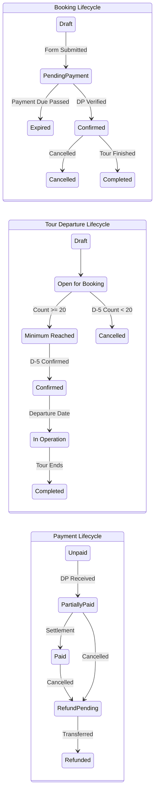
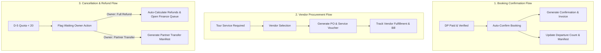

# BRD — Travel & Tour Operations System

## 1. Document Context & Sprint Objective
This document serves as the **Business Requirements Document (BRD)** for the Travel & Tour Operations System in its discovery and brainstorming phase.

> **Principle:** The focus of this stage is to discover and validate **Business Context, Business Processes, and Business Rules**, while explicitly recording assumptions and open questions. It does not prescribe database schemas, APIs, microservice boundaries, or UI implementations.

---

## 2. Business Context & Operating Model
The organization is a **travel agency / tour operator** that orchestrates tours end-to-end. 

The agency is responsible for:
- Planning, packaging, and scheduling tours.
- Managing booking pipelines and customer relations.
- Assigning and managing **Tour Leaders**.
- Coordinating travelers and managing manifests.
- Coordinating third-party vendors for fulfilled services (Transport, Accommodations, Activities, Meals).
- Monitoring live tour execution and managing incidents/complaints.
- Managing financial transactions (Customer Invoicing, DP/Settlement collections, Vendor Payables, Refunds).
- Generating operational, commercial, and financial documents.

The agency acts primarily as the **tour orchestrator/operator** coordinating both internal resources and external service providers.

---

## 3. Core Business Domain Concepts


1. **Tour / Tour Plan:** The master itinerary and planned structure of a tour (reusable for recurring open tours).
2. **Tour Departure:** A specific calendar execution of a Tour Plan on a particular date with its own quota, price, Tour Leader, and vendor bookings.
3. **Booking:** The commercial contract/reservation made by a customer for one or more travelers on a specific Tour Departure.
4. **Traveler / Participant:** The individual participating in the tour.
5. **Tour Leader:** The agency's designated coordinator responsible for leading the tour on the ground.
6. **Tour Service:** An individual component required for tour execution (Transport, Hotel, Activity, Restaurant, Guiding).
7. **Vendor:** An external third-party providing fulfilled tour services.

---

## 4. Tour Types & Service Delivery

### 4.1 Open Tour (Recurring / Multi-Customer)
- Predefined public tours where multiple independent travelers/groups join the same departure.
- Reusable Tour Plan with multiple recurring calendar departures.
- Governed by **minimum participant quotas** (e.g., minimum 20 verified participants).
- Prices and operational details may vary between departures.

### 4.2 Private / Custom Tour (Bespoke)
- Customized itineraries for a specific customer or group.
- **Workflow:** Customer Request $\rightarrow$ Custom Tour Plan $\rightarrow$ Service Sourcing $\rightarrow$ Cost Estimation $\rightarrow$ Quotation $\rightarrow$ Negotiation $\rightarrow$ Final Agreed Price $\rightarrow$ Booking Confirmation.

---

## 5. Business Rules Catalog

### 5.1 Confirmed Business Rules

| ID | Rule Statement | Category |
|---|---|---|
| **BR-001** | A Booking becomes **confirmed only when the required Down Payment (DP) is paid and verified**. | Booking & Finance |
| **BR-002** | Open Tour departures may be cancelled if the minimum participant requirement is not met. | Tour Operations |
| **BR-003** | Standard Open Tour minimum threshold is **20 DP-verified participants**. | Quota Validation |
| **BR-004** | DP validation is evaluated at **D-5 (5 days prior to departure)**. Unverified inquiries or unpaid forms are **excluded**. | Quota Validation |
| **BR-005** | Current agency policy for agency-initiated cancellation (e.g. quota unmet) is **100% Full Refund** or **Transfer to Travel Partner** upon Owner decision. | Refund Policy |
| **BR-006** | Refunds can occur even after a booking has already reached Confirmed status. | Refund Policy |
| **BR-007** | Open tours are recurring with separate departure events. | Tour Planning |
| **BR-008** | Itineraries and service components may vary between different departures of the same tour plan. | Tour Planning |
| **BR-009** | Private tours can be customized by customers through quotations. | Sales & Quotation |
| **BR-010** | Tour departure prices are mutable/fluctuating across seasons, dates, and early-bird periods. | Pricing Policy |
| **BR-011** | Every active departure must have an assigned **Tour Leader**. | Operations |
| **BR-012** | Third-party services (Bus, Accommodations, Restaurants) must be tracked via Vendor Records. | Vendor Management |

### 5.2 Pricing Principles & Assumptions to Validate

> [!IMPORTANT]
> **Price Immutability on Agreed Bookings (Assumption to Validate):**
> While Tour Departure baseline prices fluctuate over time (e.g., August Rp 3.5M $\rightarrow$ September Rp 3.7M), **once a customer's booking is agreed/issued, subsequent departure price adjustments must NOT retroactively alter the customer's financial obligation.**

**Future Pricing Capabilities:**
- Seasonal pricing & early-bird discounts.
- Tiered pricing based on group size or traveler category (Adult, Child, Infant).
- Custom negotiated rates for private tours.

---

## 6. Decoupled Lifecycles & State Transitions

The system decouples Booking, Tour Departure, and Payment lifecycles to avoid invalid state lock-in:



*Example of valid decoupled state:*
- Booking = CANCELLED
- Payment = PARTIALLY_PAID (or PAID)
- Refund = PENDING

---

## 7. Functional Scope by Business Area

```text
TRAVEL & TOUR OPERATIONS SYSTEM
├── CRM & Customer Management (Customer Profiles, Travel History, Document Repository)
├── Sales & Quotation (Private Tour Estimator, Quotation Generator, Revision Tracking)
├── Booking & Registration (Manifest Management, Traveler Details, Rooming Lists)
├── Tour Planning & Master Catalog (Master Tour Plans, Day-by-Day Itineraries, Activity Catalog)
├── Tour Operations (Departure Scheduler, D-5 Quota Monitor, Manifest Dispatch)
├── Tour Leader Operations (Field Itinerary View, Traveler Check-in, Incident Reporting)
├── Vendor Procurement & Management (Vendor Directory, Service Requests, PO Tracking)
├── Finance & Billing (Customer Invoicing, DP/Full Payment Verification, Vendor Payables, Profit & Loss)
├── Cancellation & Refund Management (Full Refund Processing, Travel Partner Transfer)
├── Document Generation (Invoices, Receipts, Vouchers, Itineraries, Booking Confirmations, POs)
└── Management Dashboard & Reporting (Departure Pipeline, Cash Flow, Occupancy, Margin Analysis)
```

---

## 8. Automation & Operational Efficiency Opportunities



---

## 9. Stakeholders & Responsibilities

| Role | Core Responsibilities |
|---|---|
| **Customer / Traveler** | Submits inquiries, completes registration forms, pays DP/settlements, receives vouchers & itineraries. |
| **Admin / Sales** | Handles customer inquiries, issues quotations, prepares booking forms, generates customer invoices. |
| **Finance** | Verifies incoming payment proofs, authorizes refunds, manages vendor disbursements, performs financial closing. |
| **Operational** | Schedules tour departures, assigns Tour Leaders, books vendor services, tracks vendor deliverables. |
| **Tour Leader** | Accesses real-time traveler manifests, conducts field coordination, reports ground incidents. |
| **Owner / Executive** | Authorizes cancellation dispositions (Refund vs Transfer), approves policy overrides, reviews company-wide profitability. |
| **Vendor / Travel Partner** | Receives service requests/POs, provides transport/hotel/meals, accepts transferred bookings. |

---

## 10. Open Questions & Policy Decisions to Resolve

| Topic | Question to Resolve | Impact / Risk |
|---|---|---|
| **DP Threshold** | Is DP a fixed flat nominal (e.g. Rp 500k) or a percentage (e.g. 30%)? Is it configurable per tour? | Impacts invoice generation logic and booking confirmation triggers. |
| **Customer-Initiated Cancellation** | What is the refund policy if a *customer* cancels (before D-5 vs after D-5)? | Requires clear tiering (e.g. non-refundable DP vs partial refund). |
| **D-5 Action Automation** | Does the system hard-cancel departures under 20 automatically on D-5, or raise an urgent action task for Owner confirmation? | Protects against accidental cancellation of trips Owner intends to subsidize. |
| **Owner Quota Override** | Can the Owner override the 20-participant rule and force a departure with lower headcount? | Requires audit logging and financial margin warning. |
| **Vendor Sunk Costs** | How are non-refundable vendor down payments accounted for when an agency cancels a departure? | Affects trip loss reporting and vendor contract terms. |
| **Partner Transfer Protocol** | What is the customer consent and price adjustment mechanism when transferring to a partner travel agency? | Customer satisfaction and legal liability protection. |
