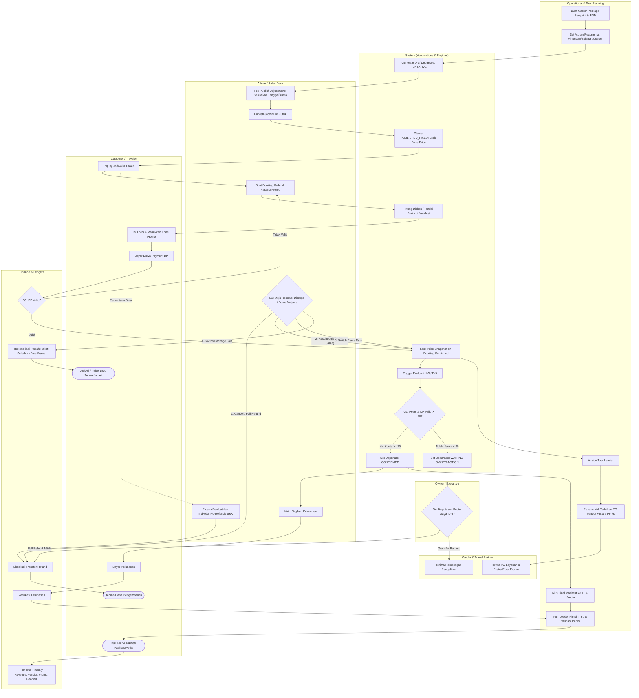

# BPMN — Travel & Tour Operations Management System (To-Be)

## 1. Pool
**Travel & Tour Operations System**

## 2. Swimlane (Aktor & Tanggung Jawab)
1. **Customer:** Mengajukan inquiry, mengisi form, memanfaatkan kupon/promo, membayar DP & pelunasan, mengajukan reschedule/batal jika ada kendala.
2. **Admin / Sales:** Menangani inquiry, menerapkan promo, membuat order & invoice, menyesuaikan draf jadwal pre-publish, menangani meja resolusi disrupsi & pembatalan.
3. **Finance:** Verifikasi pembayaran (DP & Pelunasan), memproses refund, membayar tagihan vendor, mencatat beban promo & goodwill, melakukan *financial closing*.
4. **Operational:** Mengelola master paket (BOM), mengatur mesin rekurensi jadwal, menugaskan Tour Leader, menerbitkan PO & voucher layanan ke vendor.
5. **Tour Leader:** Mengakses live manifest di lapangan, memvalidasi kehadiran & *special perks* peserta, melaporkan status & insiden.
6. **Owner / Executive:** Persetujuan pembatalan kuota D-5 (*Full Refund* vs *Partner Transfer*), persetujuan *override* dan subsidi *Free Waiver*.
7. **Vendor & Travel Partner:** Menerima PO layanan, menyediakan akomodasi/transportasi/konsumsi, menerima peserta transfer.
8. **System (Automations):** Mesin rekurensi jadwal, penguncian harga *published*, kalkulasi kuota D-5 otomatis, kalkulasi promo & invoice, snapshot harga booking.

---

## 3. Main BPMN Flow (Diagram Alur Lintas Peran)

---

## 4. Decision Gateways Summary

| Gateway | Penanggung Jawab | Kondisi & Cabang Keputusan |
|---|---|---|
| **G1: Evaluasi Kuota D-5** | System (Otomatis) | • **$\ge 20$ Peserta DP Valid:** Trip CONFIRMED $\rightarrow$ Terbitkan pelunasan. • **$< 20$ Peserta DP Valid:** WAITING OWNER ACTION. |
| **G2: Meja Resolusi Disrupsi / Force Majeure** | Admin / Sales | • **1. Cancel:** Pengembalian dana darurat. • **2. Reschedule:** Pindah tanggal 1:1. • **3. Switch Plan:** Pindah rute alternatif. • **4. Switch Package:** Pindah paket (Mode Standar vs Free Waiver). |
| **G3: Verifikasi DP Masuk** | Finance | • **Valid:** Booking status CONFIRMED, harga di-snapshot, kuota terkunci. • **Tidak Valid:** Notifikasi ke Admin/Customer untuk perbaikan bukti bayar. |
| **G4: Keputusan Kuota Gagal D-5** | Owner / Executive | • **Full Refund 100%:** Dana dikembalikan utuh ke seluruh peserta. • **Transfer Partner:** Manifest dan alokasi dana didelegasikan ke mitra. |
