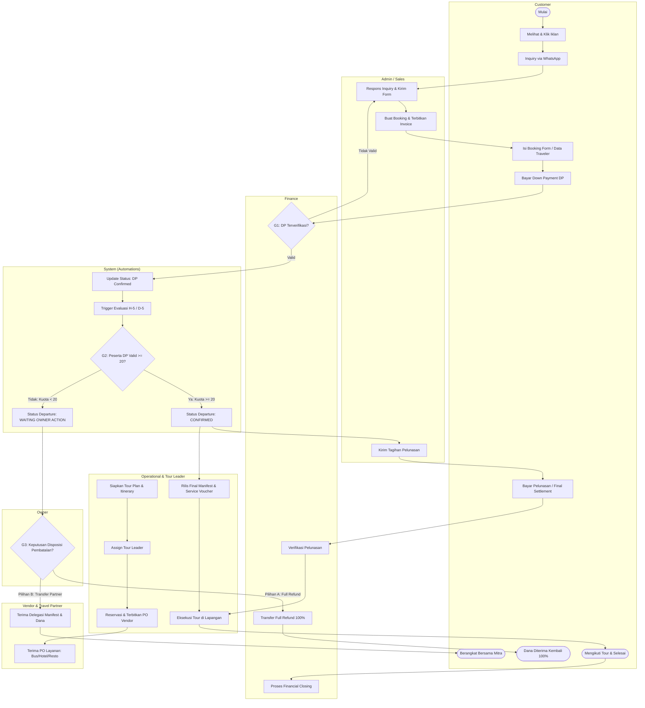

# BPMN — Travel & Tour Operations Management System (To-Be)

## 1. Pool
**Travel & Tour Operations System**

## 2. Swimlane (Aktor & Tanggung Jawab)
1. **Customer:** Mengajukan inquiry, mengisi formulir registrasi, membayar DP & pelunasan.
2. **Admin:** Menangani inquiry, menerbitkan order & invoice, komunikasi peserta.
3. **Finance:** Verifikasi pembayaran (DP & Pelunasan), memproses refund, membayar vendor.
4. **Operational:** Menyiapkan itinerary, menugaskan Tour Leader, reservasi & PO vendor.
5. **Tour Leader:** Mengakses manifest, mendampingi peserta, melaporkan status & insiden lapangan.
6. **Owner:** Approval keputusan kuota D-5 (Full Refund / Transfer Partner), override kebijakan.
7. **Vendor / Travel Partner:** Menerima PO layanan, menyediakan akomodasi/transportasi, menerima pengalihan peserta.
8. **System:** Trigger otomatis evaluasi H-5 / D-5, kalkulasi kuota, pembuatan dokumen.

---

## 3. Main BPMN Flow (Diagram Alur Lintas Peran)

---

## 4. Decision Gateways Kritis

### **Gateway 1 (G1) — Payment Verification Gateway**
- **Trigger:** Bukti transfer pembayaran DP diunggah oleh Customer/Admin.
- **Logika:** 
  - `NO` $\rightarrow$ Status tetap `Pending Verification` / Notifikasi perbaikan bukti bayar ke Customer.
  - `YES` $\rightarrow$ Status pembayaran berubah menjadi `VERIFIED`, status booking menjadi `CONFIRMED`, data *traveler* resmi dihitung ke dalam kuota keberangkatan.

### **Gateway 2 (G2) — D-5 Minimum Quota Gateway**
- **Trigger:** Pemicu otomatis dari sistem pada **H-5 / D-5 (00:00 WIB)** sebelum tanggal keberangkatan.
- **Logika:**
  - $\text{Count(DP Verified)} \ge 20 \rightarrow$ Status departure berubah ke `CONFIRMED`, memicu penagihan pelunasan (*Final Settlement*) dan penerbitan manifes operasional.
  - $\text{Count(DP Verified)} < 20 \rightarrow$ Status departure berubah ke `CANCELLED / WAITING_OWNER_ACTION`, memicu notifikasi darurat kepada Owner.

### **Gateway 3 (G3) — Owner Decision Gateway**
- **Trigger:** Keberangkatan gagal memenuhi kuota minimum 20 peserta pada evaluasi D-5.
- **Pilihan Tindakan:**
  1. **Full Refund (100%):** Membuka antrean kerja bagi Tim Finance untuk memproses transfer pengembalian seluruh dana masuk ke rekening masing-masing *Customer*.
  2. **Transfer to Travel Partner:** Mengalihkan manifes peserta dan alokasi dana ke agensi mitra setelah konfirmasi dan persetujuan peserta.

---

## 5. Catatan Arsitektur BPMN
1. **Audit Trail:** Transisi status dari `WAITING_OWNER_ACTION` menuju `REFUNDING` atau `TRANSFERRED` wajib mencatat aktor pengambil keputusan (*Owner ID*), *timestamp*, serta catatan disposisi.
2. **Pemisahan Notifikasi:** Setiap perubahan jalur keputusan otomatis memicu notifikasi berbasis template WhatsApp/Email kepada Customer dan Vendor terkait.
