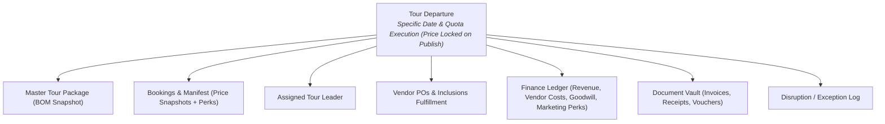

# MODULE DESIGN — Arsitektur Modul & Spesifikasi Sistem

## 1. Arsitektur Dekomposisi Modul

```text
TRAVEL & TOUR OPERATIONS SYSTEM
├── Dashboard & Executive Analytics Module
├── CRM & Customer Profile Module
├── Tour Catalog & Blueprint Module
│   ├── Master Tour Package Definition
│   ├── Day-by-Day Itinerary Builder
│   ├── Destination & Point of Interest (POI)
│   ├── Facilities Bill of Materials (BOM) & Inclusions
│   └── Baseline Cost & Pricing Calculator
├── Tour Operations & Departure Module
│   ├── Flexible Recurrence Engine (RRule, Auto-Cron & On-Demand)
│   ├── Pre-Publish Departure Adjuster (Manual Date/Quota Override)
│   ├── Departure State Machine (Tentative vs Published Price-Lock)
│   ├── D-5 Minimum Quota Evaluation Engine
│   ├── Disruption & Crisis Resolution Console (4 Action Paths)
│   ├── Manifest & Rooming List Manager (Perk Badging)
│   └── Tour Leader Assignment & Dispatch
├── Promo & Perks Engine (Marketing Overlay)
│   ├── Monetary Discount Rules (% & Flat Nominal)
│   ├── Coupon / Voucher Code Generator & Validator
│   ├── Complimentary Facility Perks Tracker (Free Meals/Merch/Upgrade)
│   └── Promo Guardrails (Quota, Validity Dates, Non-stackable Rules)
├── Booking & Sales Pipeline Module
│   ├── Quotation Generator (Private / Custom Tour)
│   ├── Order & Booking Management (Price Snapshotting Engine)
│   ├── Traveler Registration & Identity Vault
│   └── Individual Cancellation Engine (No-Refund / S&K / Override)
├── Finance, Billing & Ledgers Module
│   ├── Customer Invoicing & DP Allocation Engine
│   ├── Payment Verification Queue
│   ├── Vendor Invoicing & PO Disbursement
│   ├── Refund Processing & Payout Engine
│   ├── Cross-Package Disruption Reconciler (Standard vs Free Waiver)
│   ├── Marketing Expense Allocation (Perks Accounting)
│   └── Tour Financial Closing Ledger
├── Vendor & Procurement Module
│   ├── Vendor Master Directory (Transport, Hotel, Resto, Activity)
│   ├── Purchase Order (PO) & Service Voucher Generator
│   └── Travel Partner Network Management
├── Tour Leader Field Module
│   ├── Field Live Manifest & Check-in
│   ├── Special Perks & Facility Inclusions Viewer
│   ├── Real-time Itinerary & Emergency Contacts
│   └── Incident & Field Exception Logger
├── Document Management & Generation Vault
└── Access Control & Audit Trail (RBAC)
```

---

## 2. Tour Departure sebagai Pusat Data (*Single Source of Truth*)

Setiap entitas operasional, finansial, dan pemenuhan layanan terikat langsung pada **Tour Departure**:



---

## 3. State Machine & Transisi Status Utama

### 3.1 Status Tour Departure
- **Skenario Normal:**
  `TENTATIVE` (Draft / Mutable) $\rightarrow$ `PUBLISHED_FIXED` (Price Locked) $\rightarrow$ `IN_BOOKING` $\rightarrow$ `D5_VALIDATION` $\rightarrow$ `CONFIRMED` $\rightarrow$ `IN_OPERATION` $\rightarrow$ `COMPLETED` $\rightarrow$ `FINANCIAL_CLOSED`
- **Skenario Kuota Gagal pada D-5:**
  `D5_VALIDATION` $\rightarrow$ `CANCELLED_WAITING_OWNER_ACTION` $\rightarrow$ `REFUNDING` $\rightarrow$ `CLOSED_REFUNDED`
  *(atau)*
  `D5_VALIDATION` $\rightarrow$ `CANCELLED_WAITING_OWNER_ACTION` $\rightarrow$ `TRANSFERRED_PARTNER` $\rightarrow$ `CLOSED_TRANSFERRED`
- **Skenario Disrupsi / Bencana (Force Majeure):**
  `PUBLISHED_FIXED` / `IN_BOOKING` / `CONFIRMED` $\rightarrow$ `DISRUPTED_EXTREME` $\rightarrow$ `RESCHEDULED` / `SWITCHED_PACKAGE` / `CLOSED_DISRUPTED_REFUND`

### 3.2 Status Booking / Traveler
- **Skenario Normal:**
  `DRAFT` $\rightarrow$ `PENDING_DP` $\rightarrow$ `DP_CONFIRMED` (Price Snapshot Locked) $\rightarrow$ `FULLY_PAID` $\rightarrow$ `CHECKED_IN` $\rightarrow$ `COMPLETED`
- **Jalur Eksepsi:**
  - *Batal Individu (No-Refund / S&K):* $\rightarrow$ `CANCELLED_BY_CUSTOMER`
  - *Reschedule / Pindah Jadwal:* $\rightarrow$ `RESCHEDULED_TO_NEW_DEPARTURE`
  - *Pindah Paket Lain:* $\rightarrow$ `TRANSFERRED_TO_NEW_PACKAGE`

### 3.3 Status Pembayaran & Refund
- **Payment:** `PENDING_VERIFICATION` $\rightarrow$ `VERIFIED` $\rightarrow$ `ALLOCATED` $\rightarrow$ `RECONCILED`
- **Refund:** `REQUESTED` $\rightarrow$ `OWNER_APPROVED` $\rightarrow$ `PROCESSING` $\rightarrow$ `REFUNDED`

---

## 4. Role & Matrix Tanggung Jawab (RBAC)

| Role | Domain & Hak Akses Utama |
|---|---|
| **Admin / Sales** | Mengelola Customer, membuat Booking, menerapkan promo (% / flat / perks), menerbitkan invoice, mengoperasikan *Disruption Resolution Console*, dan memproses pembatalan individu. |
| **Finance** | Verifikasi pembayaran masuk, pemrosesan *Refund*, pembayaran tagihan Vendor, pembukuan *Marketing Expense* (promo perks), pencatatan *Goodwill Loss* (*Free Waiver*), dan *Financial Closing*. |
| **Operational** | Mengelola Master Paket (*BOM*), mengatur *Recurrence Engine*, menyesuaikan tanggal batch draf (*Pre-publish adjustment*), merilis jadwal (*Publish*), menerbitkan PO Vendor, dan menugaskan Tour Leader. |
| **Tour Leader** | Tampilan *mobile-friendly* untuk melihat *manifest real-time*, badge hak fasilitas/*special perks* peserta, kontak darurat, dan pelaporan insiden lapangan. |
| **Owner / Executive** | *Executive Dashboard*, persetujuan penanganan trip kuota gagal D-5, persetujuan subsidi *Free Waiver*, dan persetujuan *override* kebijakan khusus. |

---

## 5. Spesifikasi Mesin Rekurensi Fleksibel (Flexible Recurrence Engine)

- **Input Parameter:**
  - `package_id` (Referensi ke Master Tour Package)
  - `frequency_type`: `WEEKLY` | `BI_WEEKLY` | `MONTHLY` | `CUSTOM_INTERVAL` | `SPECIFIC_DATES`
  - `interval_rule`: misal setiap hari Jumat, minggu ke-2 tiap bulan, atau interval 21 hari
  - `start_range` & `end_range` (contoh: 6 bulan ke depan)
  - `default_quota_min` (20) & `default_quota_max`
- **Output:**
  - Sekumpulan entitas `Tour Departure` berstatus `TENTATIVE`.
  - Masing-masing batch memiliki `departure_id` mandiri (*decoupled instance*).
- **Manual Adjustment Capability:**
  - Admin dapat mengedit `start_date`, `end_date`, atau menghapus satu batch tertentu yang bentrok sebelum menekan tombol **"Publish All / Publish Selected"**.

---

## 6. Spesifikasi Mesin Promo & Perks (Promo & Perks Engine)

- **Komponen Validasi:**
  1. `promo_code`: Kode unik kupon (opsional untuk promo otomatis seperti Early Bird).
  2. `type`: `MONETARY_PERCENT` | `MONETARY_FLAT` | `COMPLIMENTARY_PERK`.
  3. `value`: Nilai diskon (misal: 10% atau Rp 100.000) atau deskripsi fasilitas (*"Free Lunch Day 2"*).
  4. `usage_limit`: Batas maksimal penggunaan (misal: 5 orang pertama).
  5. `validity_window`: Tanggal mulai & berakhir promo.
  6. `stackable_flag`: Default `FALSE`.
- **Integrasi Transaksi:**
  - *Monetary Discount:* Mengurangi `subtotal` pada `Invoice` $\rightarrow$ dicatat sebagai potongan penjualan.
  - *Complimentary Perk:* Tidak memotong nominal uang $\rightarrow$ menambahkan *flag* `has_extra_perk` pada tabel `manifest_travelers` $\rightarrow$ menerbitkan *line item* ekstra pada PO vendor bersangkutan yang dialokasikan ke akun *Marketing Expense*.
