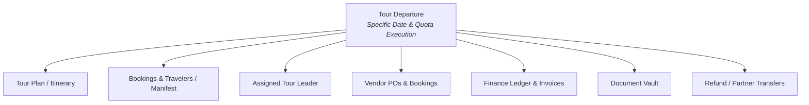

# MODULE DESIGN — Arsitektur Modul & Spesifikasi Sistem

## 1. Arsitektur Dekomposisi Modul

```text
TRAVEL & TOUR OPERATIONS SYSTEM
├── Dashboard & Analytics Module
├── CRM & Customer Management Module
├── Tour Catalog & Planning Module
│   ├── Master Tour Plan
│   ├── Itinerary Builder
│   ├── Destination & Point of Interest (POI)
│   └── Activity Catalog
├── Tour Departure & Operations Module
│   ├── Departure Scheduler & Quota Engine
│   ├── D-5 Minimum Quota Evaluation Engine
│   ├── Manifest & Rooming List Manager
│   └── Tour Leader Assignment
├── Booking & Sales Pipeline Module
│   ├── Quotation Generator (Private Tour)
│   ├── Booking & Order Management
│   └── Traveler Registration
├── Finance & Billing Module
│   ├── Customer Invoicing & DP Allocation
│   ├── Payment Verification Queue
│   ├── Vendor Invoicing & Disbursement
│   ├── Refund Processing Engine
│   └── Tour Financial Closing Ledger
├── Vendor & Procurement Module
│   ├── Vendor Master Directory (Transport, Hotel, Resto, Activity)
│   ├── Purchase Order (PO) & Service Voucher
│   └── Travel Partner Management
├── Tour Leader Field Module
│   ├── Field Manifest & Check-in
│   ├── Real-time Itinerary & Vendor Contact
│   └── Incident & Complaint Logger
├── Document Management & Generation Vault
└── Access Control & Audit Trail (RBAC)
```

---

## 2. Tour Departure sebagai Pusat Data (*Single Source of Truth*)

Setiap entitas operasional dan finansial terikat langsung pada **Tour Departure**:



---

## 3. State Machine & Transisi Status Utama

### 3.1 Status Tour Departure
- **Skenario Normal:**
  `DRAFT` $\rightarrow$ `OPEN_FOR_BOOKING` $\rightarrow$ `D5_VALIDATION` $\rightarrow$ `CONFIRMED` $\rightarrow$ `PREPARATION` $\rightarrow$ `IN_OPERATION` $\rightarrow$ `COMPLETED` $\rightarrow$ `FINANCIAL_CLOSED`
- **Skenario Kuota Gagal pada D-5:**
  `D5_VALIDATION` $\rightarrow$ `CANCELLED_WAITING_OWNER_ACTION` $\rightarrow$ `REFUNDING` $\rightarrow$ `CLOSED_REFUNDED`
  *(atau)*
  `D5_VALIDATION` $\rightarrow$ `CANCELLED_WAITING_OWNER_ACTION` $\rightarrow$ `TRANSFERRED` $\rightarrow$ `CLOSED_TRANSFERRED`

### 3.2 Status Booking / Traveler
`DRAFT` $\rightarrow$ `PENDING_DP` $\rightarrow$ `DP_CONFIRMED` $\rightarrow$ `FULLY_PAID` $\rightarrow$ `CHECKED_IN` $\rightarrow$ `COMPLETED`
*(Jalur Eksepsi: `EXPIRED`, `CANCELLED_BY_CUSTOMER`, `REFUNDED`, `TRANSFERRED`)*

### 3.3 Status Pembayaran (Payment)
`PENDING_VERIFICATION` $\rightarrow$ `VERIFIED` $\rightarrow$ `ALLOCATED` $\rightarrow$ `RECONCILED`

### 3.4 Status Pengembalian Dana (Refund)
`REQUESTED` $\rightarrow$ `OWNER_APPROVED` $\rightarrow$ `PROCESSING` $\rightarrow$ `REFUNDED`

---

## 4. Role & Matrix Tanggung Jawab (RBAC)

| Role | Domain & Hak Akses Utama |
|---|---|
| **Admin / Sales** | Mengelola Customer, Booking, penerbitan Invoice, pengiriman formulir registrasi, dan komunikasi via WhatsApp. |
| **Finance** | Antrean verifikasi bukti pembayaran (*Payment Verification*), pemrosesan *Refund*, pembayaran tagihan Vendor, dan *Financial Closing*. |
| **Operational** | Mengelola *Tour Plan*, menyusun *Itinerary*, reservasi dan penerbitan PO ke Vendor, penugasan *Tour Leader*. |
| **Tour Leader** | Tampilan *mobile-friendly* untuk melihat detail *manifest* peserta, kontak darurat, *itinerary* lapangan, dan pelaporan insiden. |
| **Owner / Executive** | *Executive Dashboard*, persetujuan penanganan trip tidak memenuhi kuota (*Refund* vs *Transfer*), dan persetujuan *override* kebijakan. |

---

## 5. Spesifikasi Mesin Evaluasi H-5 (D-5 Evaluation Engine)

- **Input:**
  - `tour_departure_id`
  - `departure_date`
  - `min_quota` (default: 20 peserta)
  - `dp_verified_traveler_count`
- **Proses:**
  1. Trigger otomatis berjalan pada H-5 pukul 00:00 WIB (atau waktu yang ditentukan).
  2. Query seluruh *Traveler* dengan status `Booking = Confirmed` dan `Payment = DP_Verified`.
  3. Bandingkan `count` dengan `min_quota`.
  4. Jika $\ge \text{min\_quota} \rightarrow$ Update status departure ke `CONFIRMED`, kirim tagihan pelunasan.
  5. Jika $< \text{min\_quota} \rightarrow$ Update status departure ke `CANCELLED_WAITING_OWNER_ACTION`, kirim notifikasi darurat ke Owner.
  6. Tangkap keputusan Owner: **Full Refund** atau **Transfer Partner**.

---

## 6. Spesifikasi Modul Keuangan (Finance Module)

### 6.1 Customer Finance
`Invoice Total` $\rightarrow$ `DP Payment(s)` $\rightarrow$ `Settlement Payment(s)` $\rightarrow$ `Outstanding Balance = Rp 0`

### 6.2 Vendor Finance
`Service PO Amount` $\rightarrow$ `Vendor DP` $\rightarrow$ `Vendor Final Payment` $\rightarrow$ `Receipt Attachment`

### 6.3 Trip Financial Reconciliation
\[
\text{Gross Margin} = \sum \text{Customer Revenue Received} - \sum \text{Vendor Fulfilled Costs} - \sum \text{Operational Expenses}
\]

---

## 7. Modul Manajemen Dokumen (Document Vault)

Seluruh dokumen digital (PDF, JPG, PNG) disimpan secara kontekstual terikat pada entitas transaksi:
- `Tour Departure`: Master Itinerary PDF, Final Manifest, Vendor Contracts.
- `Booking`: Invoice Customer, Bukti Transfer DP, Bukti Pelunasan, Service Voucher.
- `Vendor`: Purchase Order (PO), Invoice Vendor, Bukti Pembayaran Vendor.
- `Cancellation`: Form Persetujuan Transfer, Bukti Transfer Refund 100%.

---

## 8. Spesifikasi Dashboard & Pelaporan

- **Operational Metrics:** Keberangkatan aktif bulan ini, status *pipeline* D-5, peringatan keberangkatan di bawah kuota minimum.
- **Occupancy Metrics:** Total kursi tersedia, total kursi terisi (DP confirmed vs Lunas), rasio konversi *inquiry-to-booking*.
- **Financial Metrics:** Total piutang customer (*Accounts Receivable*), total hutang vendor (*Accounts Payable*), estimasi vs realisasi margin keuntungan per *departure*.
