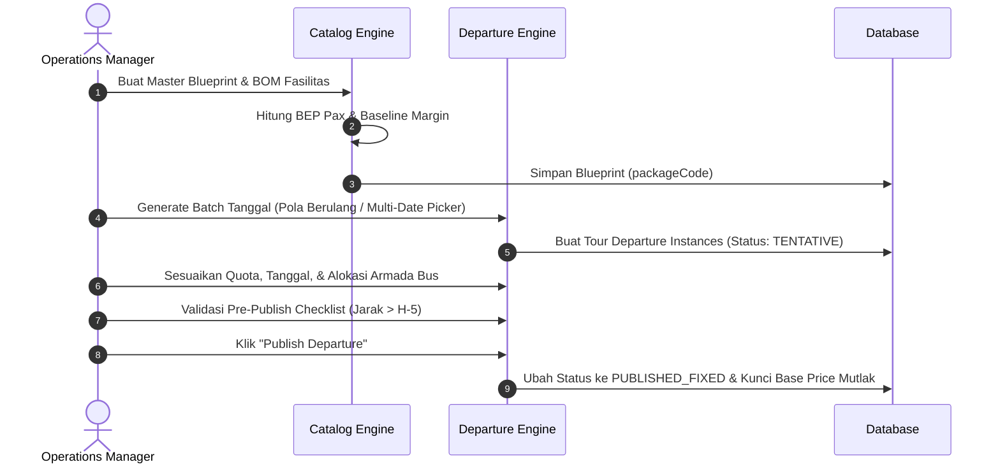
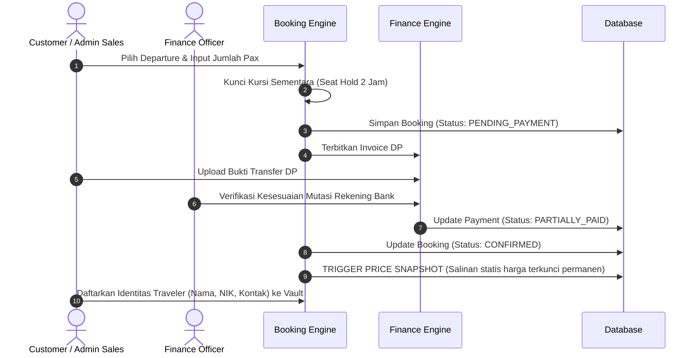
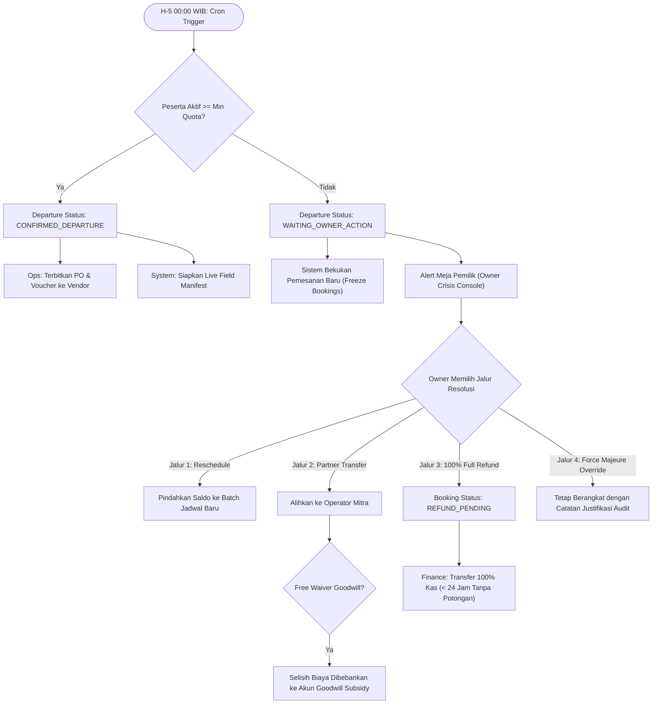
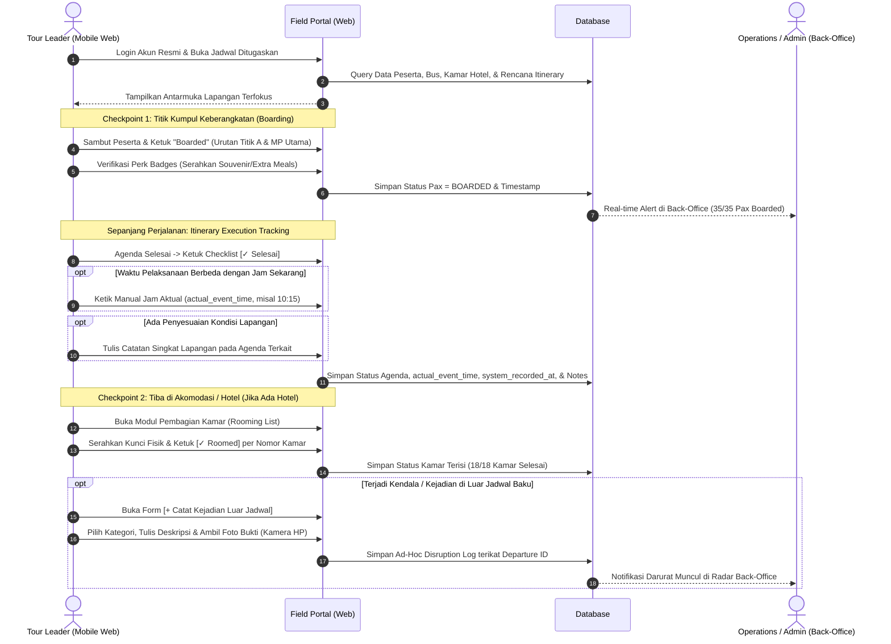
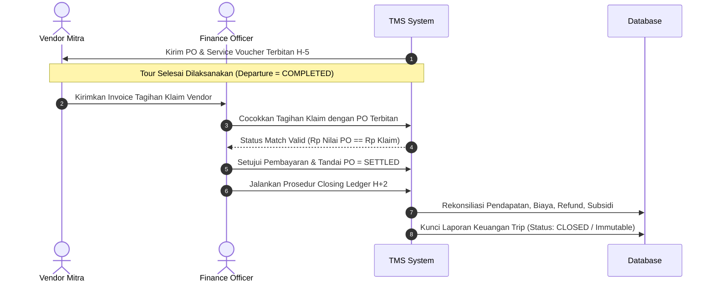

# 01 — Product Requirements Document (PRD) — MVP-1 (Core Operations)

## Document Information

| Item | Detail |
| :--- | :--- |
| **Document ID** | PRD-MVP1 |
| **Document Title** | Product Requirements Document (PRD) — MVP-1 (Core Operations) |
| **Product Name** | Travel & Tour Operations System (TMS) |
| **Document Type** | Product Requirements Document (PRD) |
| **Phase / Milestone** | MVP-1 |
| **Document Version** | 1.0 |
| **Document Status** | Approved Baseline |
| **Implementation Status** | In Development |
| **Last Updated** | 2026-09-15 |
| **Author / Owner** | Product & Operations Team |

---

## 1. Ringkasan Eksekutif, Masalah Bisnis, & Objektif MVP-1

Dokumen Product Requirements Document (PRD) ini mendefinisikan spesifikasi fungsional, kebutuhan produk, *User Stories*, alur pengguna (*User Journeys*), aturan bisnis, dan kriteria penerimaan (*Acceptance Criteria*) untuk rilis **MVP-1 (TMS Core Operations)**.

### 1.1 Masalah Utama Operasional Tour Operator
Berdasarkan analisis operasional agensi wisata sebagai *Tour Orchestrator*:
1. **Margin Leakage (Kebocoran Laba)**: Fluktuasi tarif vendor dan perubahan harga paket di kemudian hari sering menggerus margin laba pemesanan lama karena ketiadaan penguncian harga (*Price Snapshotting*).
2. **Krisis Pembatalan H-5**: Ketiadaan evaluasi kuota otomatis menyebabkan penanganan keterlambatan pembatalan sewa armada bus/vendor, sehingga agensi terkena denda penalti atau kehilangan uang sewa (*full loss*).
3. **Disrupsi Tanpa Standar**: Penanganan trip di bawah kuota (*under-quota*) sering menimbulkan konflik akuntansi antara biaya operasional murni dengan beban kompensasi/pemasaran.
4. **Disorganisasi Lapangan**: Penggunaan manifest manual (spreadsheet) menyulitkan Tour Leader memantau kehadiran peserta, titik jemput (*pick-up points*), dan alokasi fasilitas ekstra (*perk badges*).
5. **Keterlambatan Penutupan Buku**: Rekonsiliasi keuangan trip dan pencocokan klaim tagihan vendor membutuhkan waktu berminggu-minggu pasca-tour.

### 1.2 Objektif Utama MVP-1
1. **Otomatisasi Orkestrasi Jadwal**: Menghilangkan gesekan pembuatan jadwal tour berulang (*recurring*) dari cetak biru master (*blueprint*).
2. **Perlindungan Margin Mutlak**: Mengunci harga jual dan rincian transaksi secara permanen (*Price Snapshotting Engine*) saat DP terkonfirmasi.
3. **Mitigasi Risiko Kuota H-5**: Menjalankan evaluasi kuota otomatis pada H-5 00:00 WIB dan menyediakan konsol resolusi krisis 4-jalur berotoritas Owner.
4. **Visibilitas Operasional Lapangan**: Menyediakan *Field Operations Portal* berbasis web seluler terintegrasi bagi Tour Leader terautentikasi (RBAC), mencakup presensi bertahap (keberangkatan & penginapan), pelacakan realisasi itinerary aktual (dual-timestamp), dan pencatatan disrupsi ad-hoc dengan foto.
5. **Akurasi & Integritas Finansial**: Memastikan pencatatan kas terverifikasi, antrean refund transparan, dan rekonsiliasi laba-rugi per trip selesai maksimal H+2.
6. **Proteksi Pasokan Armada Peak Season**: Memberikan sistem peringatan dini H-1 Bulan sebelum musim liburan/tanggal merah agar Manajer Operasional mengunci unit bus dan kamar hotel lebih awal.

### 1.3 Key Performance Indicators (KPIs) MVP-1
- **0% Margin Drift**: Tidak ada perubahan nominal tagihan pada pemesanan yang telah membayar DP.
- **100% On-Time Gate Evaluation**: Evaluasi kuota H-5 tereksekusi tepat waktu pada 00:00 WIB tanpa kegagalan cron.
- **$\le 24$ Jam Waktu Resolusi Disrupsi**: Keputusan eksekutif atas trip gagal kuota diselesaikan dalam waktu 24 jam sejak alert H-5.
- **100% Validitas PO Vendor**: Seluruh komitmen vendor memiliki PO terdaftar sebelum hari keberangkatan.
- **Financial Closing H+2**: Rekonsiliasi laba-rugi trip selesai maksimal 48 jam pasca-keberangkatan.

---

## 2. Batasan Ruang Lingkup (Scope Boundaries)

### 2.1 In-Scope (MVP-1)
1. **Cetak Biru Paket & Kalkulator BEP**: Master Blueprint, BOM Fasilitas, kalkulator Titik Impas (BEP) dan margin dasar.
2. **Manajemen Jadwal Keberangkatan**: Recurring date generator, penyesuaian kuota pre-publish, penguncian harga (`PUBLISHED_FIXED`), alokasi Tour Leader, alokasi multi-armada bus, dan **Peak Season Supply Alert H-1 Bulan**.
3. **Evaluasi Kuota H-5 & Resolusi Krisis**: Cron gatekeeper H-5 00:00 WIB, transisi status otomatis, pembekuan booking baru, dan konsol 4 jalur krisis (*Reschedule, Partner Transfer with Free Waiver Goodwill Subsidy, 100% Full Refund, Force Majeure Override*).
4. **Pemesanan & Price Snapshotting**: Reservasi, *seat locking* 2 jam, registrasi identitas *Traveler* (Pax) dalam vault, dan pembuatan salinan harga statis permanen (*immutable price snapshot*).
5. **Promo Diskon & Perk Overlay**: Diskon moneter, *Perk Badge* fasilitas cuma-cuma, dan guardrails kuota promo/non-stackable.
6. **Keuangan & Verifikasi Kas**: Dual invoicing (DP & Pelunasan), verifikasi bukti transfer manual, antrean pencairan refund disrupsi, dan *Closing Ledger* H+2.
7. **Pengadaan Vendor**: Direktori vendor, generator dokumen PO/Service Voucher PDF, dan pencocokan klaim tagihan vendor.
8. **Operasional Lapangan Tour Leader (Field Operations Portal)**: Mobile-web terautentikasi (RBAC) untuk Tour Leader yang ditugaskan, mencakup presensi bertahap (*Departure Boarding & Hotel Rooming Check-in*), *Itinerary Execution Tracker* (checklist agenda, input jam aktual manual, dan catatan lapangan), verifikasi *Perk Badges*, serta *Ad-Hoc Disruption Logger* dengan unggahan foto.
9. **Generator Dokumen Standar**: Rendering PDF otomatis untuk Invoice, Kuitansi, PO, Voucher, dan Export Manifest XLSX/PDF.
10. **Dashboard & RBAC**: Dashboard metrik eksekutif, radar milestone H-30 s/d H+7, RBAC 5 peran internal terautentikasi (Owner, Ops, Finance, Admin Sales, Tour Leader) + akses publik tamu, dan *immutable audit log*.

### 2.2 Out-of-Scope (Fase Lanjutan)
- **Phase 2**: Payment Gateway otomatis (VA/QRIS otomatis pihak ketiga), Vendor Self-Service Portal, Dynamic Pricing Engine berbasis okupansi/yield management real-time, Program Loyalitas Pelanggan (Points/Tiers).
- **Phase 3**: Multi-Cabang / Multi-Branch Organization, Aplikasi Seluler Native Store (Android APK / iOS IPA offline-first; seluruh interaksi lapangan MVP-1 diakomodasi via Mobile Web responsif), Rekomendasi Paket Berbasis AI, Integrasi Global Distribution System (GDS) Tiket Pesawat API, Late-Joiner on-the-go pricing.

---

## 3. Taksonomi Aktor & Matriks Hak Akses (RBAC)

Sistem berinteraksi dengan 8 persona yang diklasifikasikan ke dalam 4 kelompok akses: **5 Peran Internal Terautentikasi (Wajib Akun & Login)**, **1 Aktor Publik Tamu**, **1 Entitas Eksternal Non-Login**, dan **1 Engine Otomasi**:

### A. Pengguna Internal Terautentikasi (RBAC)
| Peran (Role) | Tanggung Jawab Utama | Lingkup Wewenang Sistem |
| :--- | :--- | :--- |
| **Business Owner** | Penentu kebijakan & otorisasi krisis | Menyetujui jalur resolusi H-5, diskresi override refund, dan memantau seluruh metrik profit margin. |
| **Operations Manager** | Perencana & pengelola operasional tour | Mengelola Blueprint, rilis jadwal, konfigurasi BOM, alokasi armada, penugasan TL (data assignment), respon alert peak season, penerbitan PO vendor, dan ekspor manifest lapangan. |
| **Finance & Settlement Officer** | Pengelola kas & rekonsiliasi keuangan | Memverifikasi bukti transfer bank, memproses antrean pencairan refund, memverifikasi klaim tagihan vendor, dan melakukan closing ledger H+2. |
| **Admin Sales** | Pelaksana layanan pelanggan & reservasi | Mendaftarkan pemesanan manual, melengkapi data traveler, input preferensi titik jemput, sinkronisasi/monitoring status presensi lapangan, dan memproses pembatalan standar. |
| **Tour Leader** | Koordinator & pemandu perjalanan lapangan | Mengakses *Field Operations Portal* khusus untuk departure yang ditugaskan padanya: melakukan presensi keberangkatan (boarding) & penginapan (hotel rooming), checklist realisasi itinerary tur (dengan pencatatan waktu aktual manual), verifikasi perk badges, dan mencatat log ad-hoc / insiden darurat dengan foto bukti. *Dibatasi secara ketat dari modul keuangan, blueprint master, database seluruh customer, atau jadwal di luar penugasannya.* |

### B. Aktor Publik Tamu (Tanpa Akun Login)
| Peran (Role) | Tanggung Jawab Utama | Lingkup Wewenang Sistem |
| :--- | :--- | :--- |
| **Customer** | Pemesan komersial tour | Mengakses katalog publik jadwal aktif, membuat pemesanan (guest checkout), mengunggah bukti transfer, mengisi data identitas peserta, dan melihat ringkasan status booking via tautan pesanan. |

### C. Entitas Eksternal Non-Login (Penerima Dokumen Resmi)
| Entitas | Peran Operasional | Interaksi Sistem |
| :--- | :--- | :--- |
| **Vendor PIC** | Penyedia jasa pihak ketiga (Armada/Hotel/Resto) | Menerima dokumen Purchase Order (PO) dan Service Voucher resmi dalam format PDF dari tim Operations. *Tidak memiliki portal akun pada MVP-1 (ditangguhkan ke Phase 2).* |

### D. Otomasi Sistem
| Entitas | Peran Operasional | Interaksi Sistem |
| :--- | :--- | :--- |
| **System Automation Engine** | Mesin otomasi terjadwal sistem | Menjalankan expiry hold kursi 2 jam, evaluasi kuota H-5 00:00 WIB, dan radar peak season H-30 hari. |

---

## 4. Konsep Arsitektur Inti & Invariants

1. **Decoupled Blueprint vs Instance**: *Tour Package* bertindak sebagai cetak biru abstrak (*blueprint*), sedangkan *Tour Departure* adalah eksekusi kalender independen yang mewarisi konfigurasi saat di-generate.
2. **Price Immutability**: Begitu departure berstatus `PUBLISHED_FIXED`, harga dasar terkunci mutlak dan tidak terpengaruh oleh perubahan master paket di kemudian hari.
3. **Price Snapshotting**: Saat pembayaran DP booking diverifikasi Finance, sistem menyimpan salinan statis (*immutable snapshot*) rincian harga transaksi.
4. **D-5 Milestone Gate & Freeze**: Pukul 00:00 WIB H-5 kalender, evaluasi kuota berlangsung secara idempotent. Jika kuota kurang, pemesanan baru dibekukan (*freeze*) dan tiket krisis dialihkan ke meja Owner.
5. **Strategi Musim (Seasonality Architecture)**:
   - **Peak Season**: Fokus pada *Volume Optimization* dan *Multi-Bus Batching*, bukan menaikkan harga jual secara agresif karena pasar menghadapi perang harga ketat.
   - **Peak Season Supply Alert H-1 Bulan (`OPS-SEAS-07`)**: Sistem memicu peringatan dini H-30 hari sebelum musim liburan/tanggal merah agar Manajer Operasional mengunci unit armada bus dan kamar hotel sebelum kehabisan pasokan.
   - **Low Season**: Fokus pada *BEP Defense* dengan menurunkan batas kuota minimum BEP melalui armada lebih kecil (HiAce/Elf).

---

## 5. Alur Pengguna (User Journeys) & Diagram Alur

### 5.1 Journey 1: Dari Blueprint ke Publikasi Jadwal (CAT & OPS)



### 5.2 Journey 2: Booking, Seat Hold (2 Jam), & Price Snapshotting (BOOK & FIN)



### 5.3 Journey 3: H-5 Quota Gatekeeper & Disruption Resolution (OPS & FIN)



### 5.4 Journey 4: Field Operations, Multi-Checkpoint Attendance & Itinerary Execution (TL)



### 5.5 Journey 5: Settlement Vendor & Financial Closing H+2 (VEND & FIN)



---

## 6. Spesifikasi State Machines

### 6.1 Departure State Machine
```text
[TENTATIVE] ──(Publish Departure)──> [PUBLISHED_FIXED]
                                            │
               ┌────────────────────────────┴────────────────────────────┐
               ▼ (H-5 Gate: Kuota Cukup)                                 ▼ (H-5 Gate: Kuota Kurang)
     [CONFIRMED_DEPARTURE]                                      [WAITING_OWNER_ACTION]
               │                                                         │
               ▼ (Hari H Berangkat)                                      ├──(Jalur 1/2/3)──> [CANCELLED]
         [ON_TRIP]                                                       └──(Jalur 4)──────> [CONFIRMED_DEPARTURE]
               │
               ▼ (Trip Selesai)
        [COMPLETED] ──(H+2 Closing)──> [FINANCIALLY_CLOSED]
```

### 6.2 Booking State Machine
```text
[DRAFT] ──(Submit Booking)──> [PENDING_PAYMENT] ──(2 Jam Expiry)──> [EXPIRED]
                                     │
                                     ▼ (Verifikasi Bayar DP)
                                [CONFIRMED] ──(Trigger Price Snapshot)
                                     │
                                     ▼ (Pelunasan H-7)
                                [FULLY_PAID]
                                     │
          ┌──────────────────────────┴──────────────────────────┐
          ▼ (Trip Sukses)                                       ▼ (Batal / Krisis H-5)
     [COMPLETED]                                         [REFUND_PENDING]
                                                                │
                                                                ▼ (Pencairan Kas)
                                                            [REFUNDED]
```

---

## 7. Katalog User Stories & Acceptance Criteria

### Epic 1: Tour Catalog & Master Blueprint (`CAT`)

#### `US-CAT-01` (Feature ID: `CAT-BLUE-01`)
- **Judul**: Pembuatan & Pengelolaan Master Blueprint Paket Wisata
- **Prioritas**: Must Have | **Aktor**: Operations Manager
- **User Story**:
  - *Sebagai* **Operations Manager**,
  - *Saya ingin* membuat dan mengedit cetak biru master paket wisata (*Tour Package Blueprint*) yang memuat nama paket, durasi hari, daftar destinasi, rincian *day-by-day itinerary*, dan tipe paket (*Open Tour* atau *Private Tour*),
  - *Sehingga* tim operasional memiliki acuan standar yang dapat digunakan berulang kali untuk menghasilkan tanggal-tanggal keberangkatan.
- **Kriteria Penerimaan (Acceptance Criteria)**:
  1. *Given* user memiliki peran Operations Manager, *When* mengisi formulir pembuatan master blueprint dan menyimpan, *Then* sistem menyimpan entitas master dengan kode paket unik (`packageCode`) dan status aktif.
  2. *Given* master blueprint telah tersimpan, *When* blueprint tersebut diubah di kemudian hari, *Then* perubahan tersebut tidak boleh mengubah konfigurasi pada *Tour Departure* yang telah dirilis berstatus `PUBLISHED_FIXED`.

#### `US-CAT-02` (Feature ID: `CAT-BOM-02`)
- **Judul**: Konfigurasi Bill of Materials (BOM) Fasilitas Paket
- **Prioritas**: Must Have | **Aktor**: Operations Manager
- **User Story**:
  - *Sebagai* **Operations Manager**,
  - *Saya ingin* menyusun daftar fasilitas baku (*Bill of Materials / BOM*) yang mencakup *inclusions* (transportasi, hotel, resto, tiket wisata) dan *exclusions*, serta menghubungkannya dengan kategori vendor,
  - *Sehingga* sistem dapat memetakan kebutuhan vendor dan mengestimasi biaya variabel per pax secara otomatis.
- **Kriteria Penerimaan (Acceptance Criteria)**:
  1. *Given* master blueprint dipilih, *When* manajer menambahkan item fasilitas dengan menandai `isVendorFulfilled = true`, *Then* sistem mewajibkan pemilihan kategori vendor dan estimasi biaya standar per pax.
  2. *Given* daftar BOM terdefinisi, *When* cetak biru di-generate menjadi departure, *Then* item BOM ini diwariskan sebagai komponen standar layanan departure.

#### `US-CAT-03` (Feature ID: `CAT-PRIC-03`)
- **Judul**: Kalkulator Biaya Dasar & Titik Impas (BEP)
- **Prioritas**: Must Have | **Aktor**: Operations Manager, Finance
- **User Story**:
  - *Sebagai* **Operations Manager & Finance**,
  - *Saya ingin* menghitung biaya dasar (*baseline price*) dan titik impas (*BEP Pax*) berdasarkan estimasi Biaya Tetap armada dan Biaya Variabel per pax,
  - *Sehingga* agensi dapat menetapkan harga jual paket dengan target margin yang aman dan mengetahui batas kuota minimum keberangkatan.
- **Kriteria Penerimaan (Acceptance Criteria)**:
  1. *Given* input Biaya Tetap ($FC$) dan Biaya Variabel per pax ($VC$) serta Harga Jual Bersih ($P$), *When* sistem menghitung BEP, *Then* sistem menampilkan $\text{BEP Pax} = \lceil FC / (P - VC) \rceil$.
  2. *Given* target margin ditetapkan, *When* harga jual yang dimasukkan menghasilkan margin negatif pada kuota minimum, *Then* sistem memberikan peringatan visual bahwa harga di bawah batas BEP.

---

### Epic 2: Operations & Departure Management (`OPS`)

#### `US-OPS-01` (Feature ID: `OPS-REC-01`)
- **Judul**: Flexible Recurrence & Multi-Date Generator
- **Prioritas**: Must Have | **Aktor**: System Automation Engine, Operations Manager
- **User Story**:
  - *Sebagai* **Operations Manager**,
  - *Saya ingin* men-generate batch tanggal keberangkatan secara massal menggunakan pola jadwal berulang maupun pemilihan tanggal bebas (*multi-date picker*),
  - *Sehingga* saya dapat merilis puluhan jadwal keberangkatan untuk beberapa bulan ke depan tanpa input manual satu per satu.
- **Kriteria Penerimaan (Acceptance Criteria)**:
  1. *Given* master blueprint yang valid, *When* memilih pola rekurensi atau memilih tanggal kalender tertentu, *Then* sistem membentuk instans *Tour Departure* independen untuk setiap tanggal dengan status awal `TENTATIVE`.
  2. *Given* instans departure berstatus `TENTATIVE` terbentuk, *Then* setiap instans mewarisi salinan snapshot harga dasar, kuota default, dan BOM dari master blueprint.

#### `US-OPS-02` (Feature ID: `OPS-ADJ-02`)
- **Judul**: Penyesuaian Jadwal & Parameter Pre-Publish
- **Prioritas**: Must Have | **Aktor**: Operations Manager, Admin
- **User Story**:
  - *Sebagai* **Operations Manager / Admin**,
  - *Saya ingin* mengubah tanggal, menyesuaikan batas kuota (`minQuota`, `maxQuota`), kapasitas armada, atau harga dasar pada departure yang masih berstatus `TENTATIVE`,
  - *Sehingga* parameter operasional dapat disesuaikan dengan kondisi spesifik musim liburan (*high/peak season*) sebelum dijual ke publik.
- **Kriteria Penerimaan (Acceptance Criteria)**:
  1. *Given* departure berstatus `TENTATIVE`, *When* user mengedit tanggal atau kuota, *Then* sistem berhasil menyimpan perubahan.
  2. *Given* departure telah berstatus selain `TENTATIVE` (misal: `PUBLISHED_FIXED`), *When* user mencoba mengedit harga dasar melalui formulir ini, *Then* sistem menolak aksi tersebut dan menampilkan error `PRICE_IS_LOCKED`.

#### `US-OPS-03` (Feature ID: `OPS-LOCK-03`)
- **Judul**: Penerbitan Jadwal & Penguncian Harga Dasar (Publishing)
- **Prioritas**: Must Have | **Aktor**: Operations Manager
- **User Story**:
  - *Sebagai* **Operations Manager**,
  - *Saya ingin* mengubah status keberangkatan dari `TENTATIVE` menjadi `PUBLISHED_FIXED`,
  - *Sehingga* jadwal tersebut resmi tampil di katalog publik/sales dan harga dasarnya terkunci mutlak dari modifikasi.
- **Kriteria Penerimaan (Acceptance Criteria)**:
  1. *Given* departure berstatus `TENTATIVE` dengan tanggal mulai $> \text{H-5}$, *When* manajer menekan tombol "Publish Departure", *Then* status berubah menjadi `PUBLISHED_FIXED`.
  2. *Given* departure berstatus `PUBLISHED_FIXED`, *When* ada perubahan pada master package blueprint, *Then* base price departure tidak berubah sama sekali.

#### `US-OPS-04` (Feature ID: `OPS-GATE-04`)
- **Judul**: D-5 Automated Minimum Quota Gatekeeper
- **Prioritas**: Must Have | **Aktor**: System Automation Engine
- **User Story**:
  - *Sebagai* **System Automation Engine**,
  - *Saya ingin* mengevaluasi jumlah peserta aktif terverifikasi pada H-5 pukul 00:00 WIB untuk setiap departure aktif,
  - *Sehingga* status keberangkatan dapat diperbarui secara otomatis dan mencegah keterlambatan pembatalan ke vendor pihak ketiga.
- **Kriteria Penerimaan (Acceptance Criteria)**:
  1. *Given* waktu sistem mencapai H-5 00:00 WIB dari tanggal `startDate` departure, *When* cron evaluator berjalan dan jumlah peserta aktif $\ge \text{minQuota}$, *Then* status departure otomatis bertransisi dari `PUBLISHED_FIXED` menjadi `CONFIRMED_DEPARTURE` dan notifikasi kesiapan rilis dikirimkan ke tim Operasional.
  2. *Given* waktu mencapai H-5 00:00 WIB, *When* jumlah peserta aktif $< \text{minQuota}$, *Then* status departure otomatis bertransisi menjadi `WAITING_OWNER_ACTION`, sistem membekukan penerimaan booking baru (*freeze bookings*), dan tiket evaluasi disrupsi diteruskan ke meja Business Owner.
  3. *Given* eksekusi gatekeeper berjalan, *Then* sistem memastikan operasi bersifat *idempotent* (eksekusi ulang tidak menggandakan status transition atau audit log).

#### `US-OPS-05` (Feature ID: `OPS-DISR-05`)
- **Judul**: Disruption & Crisis Resolution Console
- **Prioritas**: Must Have | **Aktor**: Business Owner, Operations Manager
- **User Story**:
  - *Sebagai* **Business Owner / Operations Manager**,
  - *Saya ingin* mengeksekusi 1 dari 4 jalur resolusi resmi (*Reschedule, Partner Transfer, 100% Full Refund, Force Majeure Override*) untuk departure yang gagal kuota pada H-5,
  - *Sehingga* penanganan pelanggan terdampak berlangsung cepat, legal, dan beban akuntansi tercatat jelas.
- **Kriteria Penerimaan (Acceptance Criteria)**:
  1. *Given* departure berstatus `WAITING_OWNER_ACTION`, *When* Owner memilih **Jalur 1 (Reschedule)**, *Then* saldo pembayaran dipindahkan ke booking jadwal batch baru yang dipilih customer.
  2. *Given* departure berstatus `WAITING_OWNER_ACTION`, *When* Owner memilih **Jalur 2 (Partner Transfer)** dengan opsi `Free Waiver`, *Then* selisih kenaikan harga paket mitra dialokasikan otomatis sebagai akun `Goodwill Subsidy` tanpa membebani customer.
  3. *Given* departure berstatus `WAITING_OWNER_ACTION`, *When* Owner memilih **Jalur 3 (100% Full Refund)**, *Then* seluruh transaksi booking terkait bertransisi ke status `REFUND_PENDING` dan masuk ke antrean pencairan kas Finance tanpa potongan administrasi.
  4. *Given* departure berstatus `WAITING_OWNER_ACTION`, *When* Owner memilih **Jalur 4 (Force Majeure Override)**, *Then* departure dapat dilanjutkan/disesuaikan dengan kewajiban input catatan justifikasi wajib pada log audit.

#### `US-OPS-06` (Feature ID: `OPS-DISP-06`)
- **Judul**: Penugasan Bebas Tour Leader & Alokasi Multi-Armada Bus (Fleet Expansion)
- **Prioritas**: Must Have | **Aktor**: Operations Manager, Admin, Owner
- **User Story**:
  - *Sebagai* **Operations Manager / Admin**,
  - *Saya ingin* menugaskan Tour Leader dan mendaftarkan satu atau lebih unit armada bus (Multi-Bus Batching) pada departure yang sama jika jumlah peserta melebihi kapasitas 1 bus,
  - *Sehingga* agensi dapat menampung lonjakan rombongan baru tanpa harus membuat departure terpisah, dengan kapasitas `maxQuota` dan alokasi TL yang tersinkronisasi.
- **Kriteria Penerimaan (Acceptance Criteria)**:
  1. *Given* departure yang sedang aktif mengalami lonjakan permintaan peserta, *When* Operations Manager menambahkan unit armada bus ke-2 (misal: kapasitas 30 seat), *Then* sistem memperbarui kapasitas total `maxQuota` (misal: menjadi 60 seat), menyesuaikan rekalkulasi Biaya Tetap/BEP armada, dan membuka kembali ketersediaan kuota pemesanan.
  2. *Given* beberapa armada bus dialokasikan pada satu departure, *When* admin menugaskan Tour Leader, *Then* sistem memungkinkan pemetaan Tour Leader spesifik per unit bus (Bus 1: TL A, Bus 2: TL B) serta menghasilkan sub-manifest per bus di lapangan.

#### `US-OPS-07` (Feature ID: `OPS-SEAS-07`)
- **Judul**: Peak Season Early Warning & Early Bus PO Generator (H-1 Bulan / H-30 Hari)
- **Prioritas**: Must Have | **Aktor**: Operations Manager, Business Owner
- **User Story**:
  - *Sebagai* **Operations Manager**,
  - *Saya ingin* menerima peringatan otomatis pada H-1 Bulan (H-30 hari) sebelum rentang periode *Peak Season* dimulai dan langsung menerbitkan dokumen Purchase Order (PO) pemesanan unit bus awal (*Early Bus Reservation PO*),
  - *Sehingga* agensi dapat mengikat unit armada bus dan kamar hotel secara sah dan legal sebelum kehabisan armada atau terkena lonjakan tarif vendor *last-minute*.
- **Kriteria Penerimaan (Acceptance Criteria)**:
  1. *Given* kalender sistem mendeteksi rentang tanggal merah atau libur semester sekolah resmi, *When* tanggal sistem mencapai H-30 hari sebelum periode tersebut dimulai, *Then* sistem memunculkan banner peringatan prioritas tinggi di dashboard operasional dan mengirimkan notifikasi tugas (*actionable task*) kepada Operations Manager.
  2. *Given* alert H-30 hari aktif, *When* Operations Manager membuka alert dan memilih PO Bus mitra, *Then* sistem memungkinkan penerbitan dokumen **Early Bus Purchase Order (PO Blok Armada)** lengkap dengan nomor registrasi PO resmi, identitas pool bus vendor, rincian unit/kapasitas seat, klausul penguncian tarif sewa, dan pencatatan komitmen DP vendor.

---

### Epic 3: Booking & Traveler Vault (`BOOK`)

#### `US-BOOK-01` (Feature ID: `BOOK-PIPE-01`)
- **Judul**: Pengelolaan Alur Pemesanan & Reservasi
- **Prioritas**: Must Have | **Aktor**: Admin Sales, Customer
- **User Story**:
  - *Sebagai* **Admin Sales / Customer**,
  - *Saya ingin* membuat pesanan paket wisata pada tanggal keberangkatan yang tersedia,
  - *Sehingga* sistem menerbitkan invoice draf pemesanan dan mengunci kursi sementara.
- **Kriteria Penerimaan (Acceptance Criteria)**:
  1. *Given* customer memilih departure `PUBLISHED_FIXED` dengan sisa kuota cukup, *When* mengisi formulir pemesanan, *Then* pesanan dibuat dengan status `PENDING_PAYMENT` dan kode referensi pemesanan unik (`bookingRef`).

#### `US-BOOK-02` (Feature ID: `BOOK-HOLD-02`)
- **Judul**: Temporary Seat Locking & Quota Hold (2 Jam)
- **Prioritas**: Must Have | **Aktor**: System Automation Engine
- **User Story**:
  - *Sebagai* **System Automation Engine**,
  - *Saya ingin* menahan (*hold*) alokasi kursi pesanan selama 2 jam sejak invoice diterbitkan,
  - *Sehingga* tidak terjadi perebutan kursi (*race condition / overbooking*) antara beberapa calon peserta.
- **Kriteria Penerimaan (Acceptance Criteria)**:
  1. *Given* booking baru dibuat, *When* status berada pada `PENDING_PAYMENT`, *Then* sisa kuota publik berkurang sesuai jumlah kursi yang dipesan selama rentang waktu expiry time (default: 2 jam).
  2. *Given* batas waktu 2 jam berakhir tanpa verifikasi pembayaran DP, *When* sistem mendeteksi invoice kadaluwarsa, *Then* status booking otomatis berubah menjadi `EXPIRED` dan kuota kursi dilepaskan kembali ke publik.

#### `US-BOOK-03` (Feature ID: `BOOK-SNAP-03`)
- **Judul**: Price Snapshotting Engine saat DP Terkonfirmasi
- **Prioritas**: Must Have | **Aktor**: System Automation Engine, Finance
- **User Story**:
  - *Sebagai* **System Automation Engine & Finance**,
  - *Saya ingin* mengunci seluruh rincian harga transaksi (*Price Snapshot*) secara permanen saat bukti bayar DP diverifikasi,
  - *Sehingga* nilai tagihan pelanggan tidak akan pernah berubah meskipun harga paket di master katalog dinaikkan di masa depan.
- **Kriteria Penerimaan (Acceptance Criteria)**:
  1. *Given* bukti transfer DP disetujui Finance, *When* status booking berubah menjadi `CONFIRMED`, *Then* sistem membuat catatan salinan statis (*immutable snapshot*) yang memuat base price per pax, diskon promo yang disetujui, dan total tagihan bersih.
  2. *Given* snapshot telah terbuat, *When* ada query ke data tagihan booking, *Then* sistem selalu membaca dari tabel snapshot dan bukan dari relasi master katalog.

#### `US-BOOK-04` (Feature ID: `BOOK-VAULT-04`)
- **Judul**: Registrasi Identitas Peserta & Pemilihan Titik Jemput Sejalan (Traveler Vault)
- **Prioritas**: Must Have | **Aktor**: Customer, Admin Sales
- **User Story**:
  - *Sebagai* **Customer / Admin**,
  - *Saya ingin* mendaftarkan data identitas lengkap setiap peserta (Nama Lengkap, NIK/Paspor, No. Kontak, Gender, Preferensi Alergi/Khusus) dan memilih 1 dari 2 titik jemput resmi yang disediakan biro (Titik A Sejalan Rute Pool Bus atau Meeting Point Utama),
  - *Sehingga* rute penjemputan efisien, data manifest akurat untuk asuransi/hotel, dan Tour Leader mengetahui titik penjemputan setiap peserta secara presisi.
- **Kriteria Penerimaan (Acceptance Criteria)**:
  1. *Given* booking terdaftar, *When* customer/admin melengkapi data peserta sesuai kuota kursi, *Then* data traveler tersimpan dalam vault dan terikat dengan booking tersebut.
  2. *Given* rute keberangkatan ditentukan berdasarkan vendor bus yang ditugaskan, *Then* sistem menyediakan 2 opsi titik jemput:
     - **Titik A (*En-Route Pick-up Point*)**: Titik antara yang sejalan dari arah pool vendor bus menuju meeting point, dengan jadwal waktu jemput lebih awal.
     - **Meeting Point Utama**: Titik kumpul utama akhir sebelum armada meluncur ke kota tujuan.
  3. *Given* status booking `CONFIRMED`, *Then* data traveler otomatis diproyeksikan ke dalam *Live Field Manifest* departure.

#### `US-BOOK-05` (Feature ID: `BOOK-CANC-05`)
- **Judul**: Penanganan Pembatalan Mandiri oleh Peserta
- **Prioritas**: Must Have | **Aktor**: Admin Sales, Finance, Business Owner
- **User Story**:
  - *Sebagai* **Admin & Finance**,
  - *Saya ingin* memproses pembatalan sepihak oleh peserta sesuai aturan S&K paket (*strict no-refund*, penalti bertingkat, atau *discretionary override* dari Owner),
  - *Sehingga* status kursi dibatalkan dan pencatatan hak pengembalian dana dilakukan secara sah.
- **Kriteria Penerimaan (Acceptance Criteria)**:
  1. *Given* permintaan pembatalan sepihak peserta pada paket *Strict No-Refund*, *When* admin memproses, *Then* booking berubah menjadi `CANCELLED`, nominal refund Rp 0, dan kursi dikembalikan ke kuota kosong.
  2. *Given* persetujuan override refund oleh Business Owner atas alasan kemanusiaan, *When* memproses pembatalan, *Then* sistem mewajibkan pengisian catatan alasan wajib pada audit trail sebelum meneruskan antrean pencairan ke Finance.

#### `US-BOOK-06` (Feature ID: `BOOK-QUOT-06`)
- **Judul**: Custom Tour Quotation Pipeline
- **Prioritas**: Should Have | **Aktor**: Admin Sales, Operations Manager
- **User Story**:
  - *Sebagai* **Admin & Operations Manager**,
  - *Saya ingin* menyusun proposal penawaran harga (*quotation*) khusus untuk rombongan *Private Tour* dan mengunci kontrak setelah disetujui,
  - *Sehingga* transaksi rombongan B2B/privat dapat diakomodasi dengan margin terkontrol.
- **Kriteria Penerimaan (Acceptance Criteria)**:
  1. *Given* inquiry Private Tour masuk, *When* admin memasukkan kustomisasi fasilitas dan harga penawaran, *Then* sistem mencatat quotation dengan versi dan masa berlaku penawaran.
  2. *Given* customer menyetujui penawaran dan membayar DP kontrak, *When* diverifikasi, *Then* status bertransisi menjadi `CONFIRMED` dan departure privat terbuat.

---

### Epic 4: Promo & Perks Overlay (`PROMO`)

#### `US-PROMO-01` (Feature ID: `PROMO-RULE-01`)
- **Judul**: Monetary Discount Engine
- **Prioritas**: Must Have | **Aktor**: Admin Sales, Customer
- **User Story**:
  - *Sebagai* **Admin / Customer**,
  - *Saya ingin* memasukkan kode promo diskon moneter (persentase % atau nominal flat) pada saat pembuatan pesanan,
  - *Sehingga* total invoice tagihan berkurang secara otomatis dan transparan.
- **Kriteria Penerimaan (Acceptance Criteria)**:
  1. *Given* kode promo diskon aktif dan valid, *When* diterapkan pada booking, *Then* sistem menghitung potongan nilai dan menampilkan subtotal kotor, nilai diskon, dan tagihan bersih (*net invoice*).

#### `US-PROMO-02` (Feature ID: `PROMO-PERK-02`)
- **Judul**: Complimentary Facility Perks & Perk Badge Tracker
- **Prioritas**: Must Have | **Aktor**: Admin Sales, Operations Manager
- **User Story**:
  - *Sebagai* **Admin / Operations Manager**,
  - *Saya ingin* memberikan promo fasilitas gratis (*free extra meals, merchandise upgrade, airport handling*) tanpa memotong harga invoice,
  - *Sehingga* hak fasilitas peserta ditandai dengan *Perk Badge* di manifest dan biaya fasilitas dialokasikan ke pos *Marketing Expense*.
- **Kriteria Penerimaan (Acceptance Criteria)**:
  1. *Given* kode promo bertipe *Complimentary Perk* diterapkan pada booking, *When* invoice terbit, *Then* harga tagihan customer tidak berkurang (Rp 0 diskon tunai).
  2. *Given* booking terkonfirmasi dengan perk gratis, *Then* profil peserta di manifest menampilkan ikon *Perk Badge* dan sistem mencatat estimasi biaya perk ke akun beban pemasaran trip.

#### `US-PROMO-03` (Feature ID: `PROMO-GRD-03`)
- **Judul**: Promo Guardrails & Quota Validator
- **Prioritas**: Must Have | **Aktor**: System Automation Engine
- **User Story**:
  - *Sebagai* **System Automation Engine**,
  - *Saya ingin* memvalidasi aturan penggunaan promo (kuota pemakaian, tanggal aktif, batasan tipe tour, dan aturan *non-stackable*),
  - *Sehingga* tidak terjadi manipulasi diskon liar atau penggabungan promo yang merugikan margin agensi.
- **Kriteria Penerimaan (Acceptance Criteria)**:
  1. *Given* kode promo telah mencapai batas kuota maksimal penggunaan, *When* user mencoba mengaplikasikan promo tersebut, *Then* sistem menolak dengan pesan error `PROMO_QUOTA_EXCEEDED`.
  2. *Given* user mencoba memasukkan dua promo bertipe diskon moneter pada booking yang sama, *When* promo tersebut tidak ditandai `isStackable = true`, *Then* sistem menolak aplikasi promo kedua.

---

### Epic 5: Finance, Invoicing & Settlement (`FIN`)

#### `US-FIN-01` (Feature ID: `FIN-INV-01`)
- **Judul**: Dual Invoicing Engine (DP & Pelunasan Bertahap)
- **Prioritas**: Must Have | **Aktor**: System Automation Engine, Admin Sales
- **User Story**:
  - *Sebagai* **System Automation Engine & Admin**,
  - *Saya ingin* menerbitkan invoice pembayaran DP dan invoice pelunasan dengan tenggat waktu (*due date*) terpisah,
  - *Sehingga* customer dapat membayar bertahap dengan kejelasan status pelunasan sebelum trip berangkat.
- **Kriteria Penerimaan (Acceptance Criteria)**:
  1. *Given* booking dibuat, *When* diterbitkan, *Then* sistem menghasilkan Invoice DP dengan nilai minimum DP dan due date pembayaran (misal: 2 jam untuk booking baru).
  2. *Given* DP terverifikasi, *When* memasuki masa pelunasan, *Then* sistem menghasilkan Invoice Pelunasan dengan batas waktu maksimal H-7 sebelum keberangkatan.

#### `US-FIN-02` (Feature ID: `FIN-VERIF-02`)
- **Judul**: Antrean Verifikasi Pembayaran Kas Manual
- **Prioritas**: Must Have | **Aktor**: Finance & Settlement Officer
- **User Story**:
  - *Sebagai* **Finance & Settlement Officer**,
  - *Saya ingin* memeriksa antrean unggahan bukti transfer bank dari customer, memverifikasi kesesuaian nominal dengan mutasi rekening resmi, dan menyetujui/menolak pembayaran,
  - *Sehingga* uang yang masuk terjamin riil sebelum tiket/manifest konfirmasi diterbitkan.
- **Kriteria Penerimaan (Acceptance Criteria)**:
  1. *Given* customer mengunggah bukti bayar, *When* staf Finance menekan tombol "Approve Payment" dengan memasukkan nomor referensi bank, *Then* status pembayaran booking bertransisi dari `UNPAID` $\rightarrow$ `PARTIALLY_PAID` (jika DP) atau `PAID` (jika lunas).
  2. *Given* bukti bayar tidak valid / palsu, *When* staf Finance menolak pembayaran dengan alasan, *Then* notifikasi penolakan dikirim ke customer dan booking tetap menunggu bukti bayar valid sebelum expired.

#### `US-FIN-03` (Feature ID: `FIN-REF-03`)
- **Judul**: Disruption Refund Payout Queue
- **Prioritas**: Must Have | **Aktor**: Finance & Settlement Officer
- **User Story**:
  - *Sebagai* **Finance & Settlement Officer**,
  - *Saya ingin* mengelola antrean pencairan dana pengembalian 100% (*Disruption Refund*) akibat trip dibatalkan pada H-5,
  - *Sehingga* proses transfer dana ke rekening nasabah terpantau, tepat waktu (< 24 jam), dan tercatat tanpa potongan.
- **Kriteria Penerimaan (Acceptance Criteria)**:
  1. *Given* departure dibatalkan melalui Jalur 3 (Full Refund), *When* daftar refund masuk ke antrean Finance, *Then* sistem menampilkan nomor rekening tujuan, nama bank, dan nominal 100% pembayaran tanpa potongan administrasi.
  2. *Given* staf Finance telah mentransfer dana dan mengunggah struk refund, *When* mengonfirmasi pencairan, *Then* status bertransisi menjadi `REFUNDED` dan bukti bayar terlampir.

#### `US-FIN-04` (Feature ID: `FIN-SUB-04`)
- **Judul**: Goodwill Subsidy & Expense Reconciler
- **Prioritas**: Must Have | **Aktor**: Finance & Settlement Officer
- **User Story**:
  - *Sebagai* **Finance & Settlement Officer**,
  - *Saya ingin* mencatat beban subsidi agensi (*Free Waiver* selisih harga transfer partner) dan alokasi beban pemasaran untuk complimentary perks,
  - *Sehingga* laporan pembukuan trip memisahkan biaya operasional murni dari beban biaya kepuasan pelanggan/marketing.
- **Kriteria Penerimaan (Acceptance Criteria)**:
  1. *Given* peserta dipindahkan ke operator mitra dengan biaya lebih tinggi dan persetujuan Free Waiver, *When* rekonsiliasi dilakukan, *Then* selisih biaya dicatat ke pos akun `Goodwill Subsidy Expense`.

#### `US-FIN-05` (Feature ID: `FIN-CLOSE-05`)
- **Judul**: Trip Financial Closing Ledger (H+2)
- **Prioritas**: Must Have | **Aktor**: Finance & Settlement Officer
- **User Story**:
  - *Sebagai* **Finance & Settlement Officer**,
  - *Saya ingin* menutup buku laporan laba-rugi per keberangkatan (*Financial Closing*) maksimal H+2 setelah tour selesai,
  - *Sehingga* manajemen mendapatkan data riil pendapatan bersih, total biaya vendor terbayar, komisi, dan profit margin aktual per trip.
- **Kriteria Penerimaan (Acceptance Criteria)**:
  1. *Given* departure berstatus `COMPLETED`, *When* seluruh klaim tagihan vendor telah tervalidasi dan Finance melakukan closing, *Then* sistem mengunci laporan keuangan departure tersebut menjadi `CLOSED` (immutable ledger).

---

### Epic 6: Vendor & Procurement Management (`VEND`)

#### `US-VEND-01` (Feature ID: `VEND-DIR-01`)
- **Judul**: Vendor Master Directory
- **Prioritas**: Must Have | **Aktor**: Operations Manager
- **User Story**:
  - *Sebagai* **Operations Manager**,
  - *Saya ingin* mencatat direktori mitra penyedia jasa (Transportasi, Hotel, Restoran, Tiket Wisata, Operator Aliansi) lengkap dengan kontak PIC dan nomor rekening bank resmi,
  - *Sehingga* tim operasional dapat memilih vendor dengan cepat saat mempersiapkan departure.
- **Kriteria Penerimaan (Acceptance Criteria)**:
  1. *Given* form vendor baru, *When* diisi lengkap dengan data kategori layanan dan data rekening, *Then* sistem menyimpan entitas vendor dalam status aktif.

#### `US-VEND-02` (Feature ID: `VEND-PO-02`)
- **Judul**: Purchase Order (PO) & Service Voucher Generator
- **Prioritas**: Must Have | **Aktor**: Operations Manager
- **User Story**:
  - *Sebagai* **Operations Manager**,
  - *Saya ingin* menerbitkan dokumen Purchase Order (PO) resmi dan Service Voucher berformat PDF kepada vendor berdasarkan jumlah peserta terkonfirmasi pada H-5,
  - *Sehingga* pihak vendor mendapatkan kepastian reservasi dan bukti tagihan yang sah.
- **Kriteria Penerimaan (Acceptance Criteria)**:
  1. *Given* departure berstatus `CONFIRMED_DEPARTURE`, *When* manajer memilih vendor terikat BOM dan menekan "Generate PO", *Then* sistem menerbitkan dokumen PO dengan nomor unik, rincian kuantitas pax, dan total nilai kontrak.

#### `US-VEND-03` (Feature ID: `VEND-CLAIM-03`)
- **Judul**: Pelacakan Tagihan Klaim Vendor (Settlement Tracker)
- **Prioritas**: Must Have | **Aktor**: Finance & Settlement Officer
- **User Story**:
  - *Sebagai* **Finance & Settlement Officer**,
  - *Saya ingin* mencocokkan invoice klaim yang dikirimkan vendor dengan PO yang telah diterbitkan dan mencatat status pembayarannya,
  - *Sehingga* tidak terjadi pembayaran ganda atau selisih tagihan vendor di luar kesepakatan PO.
- **Kriteria Penerimaan (Acceptance Criteria)**:
  1. *Given* invoice vendor masuk, *When* nominal klaim sesuai dengan nilai PO, *Then* Finance dapat menyetujui pembayaran dan menandai PO sebagai `SETTLED`.

---

### Epic 7: Tour Leader Field Operations (`TL`)

#### `US-TL-01` (Feature ID: `TL-ATTN-01`)
- **Judul**: Multi-Checkpoint Attendance (Keberangkatan & Penginapan)
- **Prioritas**: Must Have | **Aktor**: Tour Leader
- **User Story**:
  - *Sebagai* **Tour Leader**,
  - *Saya ingin* melakukan presensi kehadiran digital secara bertahap saat keberangkatan (boarding armada bus) dan saat tiba di penginapan (pembagian kamar hotel) melalui web seluler,
  - *Sehingga* saya dapat memvalidasi kehadiran fisik peserta di titik kumpul serta memastikan seluruh peserta menerima kunci dan menempati kamar yang sesuai tanpa ada yang tertinggal atau tertukar.
- **Kriteria Penerimaan (Acceptance Criteria)**:
  1. *Given* Tour Leader telah login dan membuka jadwal yang ditugaskan, *When* membuka tab Presensi Keberangkatan, *Then* sistem menyajikan daftar peserta yang dikelompokkan secara sekuensial berdasarkan rute penjemputan (**Titik A En-route** lebih awal, disusul **Meeting Point Utama**).
  2. *Given* peserta tiba di titik penjemputan, *When* TL menekan tombol presensi peserta, *Then* status peserta bertransisi menjadi `BOARDED` dengan timestamp waktu kehadiran; sistem juga menyediakan opsi penandaan `NO_SHOW` bagi peserta yang tidak hadir.
  3. *Given* jadwal keberangkatan memiliki fasilitas hotel pada BOM, *When* rombongan tiba di penginapan dan TL membuka tab Presensi Kamar (*Hotel Rooming*), *Then* sistem menyajikan daftar alokasi kamar lengkap dengan nomor kamar, tipe kamar (*twin/double/single*), dan nama-nama peserta sekamar.
  4. *Given* kunci fisik kamar diserahkan kepada peserta, *When* TL menekan tombol `Roomed` pada kartu kamar terkait, *Then* sistem menandai kamar tersebut telah terisi dan memperbarui penghitung progres (*rooming progress counter*, misal: "18/18 Kamar Terisi").

#### `US-TL-02` (Feature ID: `TL-ITIN-02`)
- **Judul**: Itinerary Execution Checklist & Dual-Timestamp Tracker
- **Prioritas**: Must Have | **Aktor**: Tour Leader
- **User Story**:
  - *Sebagai* **Tour Leader**,
  - *Saya ingin* melihat daftar rencana kegiatan (*planned itinerary*) tur dan mencentang agenda yang telah selesai dilaksanakan, serta memiliki fleksibilitas mengetik manual jam pelaksanaan aktual dan menambahkan catatan kondisi lapangan,
  - *Sehingga* realisasi jadwal perjalanan tercatat akurat (meskipun saya baru sempat mengisi beberapa saat setelah kegiatan selesai) dan kantor pusat dapat memantau ketepatan waktu tur (*on-time performance*).
- **Kriteria Penerimaan (Acceptance Criteria)**:
  1. *Given* jadwal tur sedang berlangsung, *When* TL membuka tab Itinerary, *Then* sistem menampilkan seluruh rangkaian agenda tur yang diwarisi dari cetak biru master (*Blueprint*), terurut berdasarkan hari dan jam rencana.
  2. *Given* suatu agenda tur selesai dilaksanakan, *When* TL menekan tombol checklist `[✓ Selesai]`, *Then* kolom waktu pelaksanaan aktual (`actual_event_time`) otomatis terisi dengan jam perangkat saat ini (format `HH:mm`).
  3. *Given* TL baru sempat melakukan checklist beberapa waktu setelah kegiatan berlangsung (misal baru sempat menginput 30 menit setelah tiba di destinasi), *When* TL memilih kolom jam aktual, *Then* TL dapat mengetik manual jam kejadian riil di lapangan (misal mengubah `10:50` menjadi `10:15`) tanpa tombol pintas tambahan.
  4. *Given* checklist agenda disimpan, *Then* sistem secara permanen menyimpan dua atribut waktu terpisah: `actual_event_time` (waktu riil lapangan yang dimasukkan/diedit TL) dan `system_recorded_at` (timestamp audit server saat data disimpan), serta menyimpan catatan teks lapangan opsional jika TL mengisinya.

#### `US-TL-03` (Feature ID: `TL-LOG-03`)
- **Judul**: Ad-Hoc Field Activity & Disruption Logger
- **Prioritas**: Must Have | **Aktor**: Tour Leader
- **User Story**:
  - *Sebagai* **Tour Leader**,
  - *Saya ingin* mencatat kejadian tak terduga atau aktivitas tambahan di luar rencana itinerary baku (seperti kendala teknis bus mogok, destinasi tutup mendadak, perubahan rute darurat, atau mampir belanja oleh-oleh) disertai bukti foto dari kamera ponsel,
  - *Sehingga* kantor pusat menerima pemberitahuan kendala lapangan secara *real-time* dan agensi memiliki rekam jejak bukti sah untuk penanganan krisis serta rekonsiliasi klaim/penalti vendor pasca-trip.
- **Kriteria Penerimaan (Acceptance Criteria)**:
  1. *Given* terjadi kejadian di luar jadwal baku, *When* TL menekan tombol `[+ Catat Kejadian Luar Jadwal]`, *Then* sistem memunculkan formulir ringkas yang memuat: Kategori Kejadian (Kendala Armada/Vendor, Pemberhentian Tambahan, Perubahan Rute, Insiden Medis, Lainnya), Waktu Kejadian (dapat diketik manual), Deskripsi Kronologi, dan Tombol Unggah Foto.
  2. *Given* formulir diisi dan foto dilampirkan via kamera ponsel, *When* TL menekan tombol simpan, *Then* sistem menyimpan entri log ad-hoc yang terikat pada ID departure tersebut dan menyisipkannya ke dalam timeline perjalanan dengan penanda visual khusus.
  3. *Given* log ad-hoc berkategori kendala/insiden disimpan, *Then* radar operasional Back-Office seketika memunculkan peringatan disrupsi aktif agar tim Operations Manager dapat segera memberikan bantuan penanganan lapangan.

#### `US-TL-04` (Feature ID: `TL-PERK-04`)
- **Judul**: Perk Badge & Facility Inclusion Validator Lapangan
- **Prioritas**: Must Have | **Aktor**: Tour Leader
- **User Story**:
  - *Sebagai* **Tour Leader**,
  - *Saya ingin* melihat ikon lencana fasilitas khusus (*Perk Badge*) pada nama peserta di kartu presensi lapangan,
  - *Sehingga* saya dapat membagikan paket promosi cuma-cuma (seperti *Free Extra Meals*, upgrade souvenir, atau layanan bagasi khusus) kepada peserta yang berhak secara tepat sasaran tanpa salah bagi.
- **Kriteria Penerimaan (Acceptance Criteria)**:
  1. *Given* peserta terdaftar memiliki promo fasilitas gratis (misal: *Free Merchandise Kit*), *When* kartu presensi peserta dibuka di portal lapangan, *Then* sistem menampilkan lencana visual (*badge*) warna mencolok beserta rincian fasilitas ekstra yang menjadi hak peserta tersebut.
  2. *Given* fasilitas ekstra telah diserahkan kepada peserta, *When* TL mengetuk lencana tersebut, *Then* sistem menandai fasilitas tersebut telah diserahterimakan (*Perk Distributed*).

---

### Epic 8: Document Management & Templates (`DOC`)

#### `US-DOC-01` (Feature ID: `DOC-GEN-01`)
- **Judul**: Otomatisasi Generator PDF Dokumen Standar
- **Prioritas**: Must Have | **Aktor**: System Automation Engine
- **User Story**:
  - *Sebagai* **System Automation Engine**,
  - *Saya ingin* menghasilkan dokumen PDF resmi terstandarisasi untuk E-Invoice, Kuitansi Pembayaran, Purchase Order (PO), dan Service Voucher,
  - *Sehingga* staf operasional tidak perlu membuat dokumen secara manual di aplikasi pengolah kata.
- **Kriteria Penerimaan (Acceptance Criteria)**:
  1. *Given* aksi penerbitan invoice atau PO dipicu, *When* sistem merender PDF, *Then* file PDF terbuat dengan tata letak baku, nomor registrasi dokumen resmi, rincian biaya, dan kop agensi.

#### `US-DOC-02` (Feature ID: `DOC-MANI-02`)
- **Judul**: Export Manifest Keberangkatan & Print-Ready Field Checklist (PDF/XLSX)
- **Prioritas**: Must Have | **Aktor**: Operations Manager, Admin Sales
- **User Story**:
  - *Sebagai* **Operations Manager & Admin Sales**,
  - *Saya ingin* mengekspor daftar manifest keberangkatan ke format PDF atau Excel (XLSX) yang siap cetak (*print-ready*) dengan kotak centang absensi fisik dan penanda fasilitas promo (*Perk Badge*),
  - *Sehingga* Tour Leader dapat melakukan presensi kehadiran peserta secara verbal/kertas di lapangan dan dokumen resmi dapat diserahkan ke otoritas pelabuhan/KSOP, asuransi perjalanan, serta manajemen hotel.
- **Kriteria Penerimaan (Acceptance Criteria)**:
  1. *Given* departure berstatus `CONFIRMED_DEPARTURE`, *When* menekan tombol "Export Field Manifest (PDF)", *Then* sistem menghasilkan dokumen PDF siap cetak dengan layout terstruktur yang memuat:
     - Header dokumen: Kode Departure, Nama Paket, Tanggal Berangkat, Nama & Kontak Tour Leader, Nomor Armada/Plat Bus.
     - Pengelompokan sekuensial rute: Daftar peserta otomatis dikelompokkan berdasarkan urutan penjemputan (**Titik A / En-route Point** di bagian atas dengan jam jemput lebih awal, disusul **Meeting Point Utama**).
     - Kolom tabel: Kotak Centang Presensi Fisik (`[  ]`), No, Nama Lengkap Peserta, Gender, No Telp/WhatsApp, NIK/Paspor (termasking untuk kepatuhan privasi), Nomor Kursi/Kamar, Catatan Khusus/Alergi, dan Lencana Fasilitas Promo (**Perk Badges**, misal: `[Extra Meal]`, `[Free Souvenir]`).
  2. *Given* admin membutuhkan rekap data digital mentah, *When* memilih export XLSX, *Then* file spreadsheet terunduh berisi seluruh data traveler dan kontak darurat untuk pelaporan asuransi dan mitra hotel.
  3. *Given* trip selesai dilaksanakan atau terjadi kejadian no-show/pembatalan di lapangan yang dilaporkan TL via WhatsApp, *When* Admin Sales membuka departure di sistem back-office, *Then* admin dapat melakukan sinkronisasi status presensi peserta secara batch (*Mark as Boarded / No-Show*) sebelum prosedur *Financial Closing* dijalankan.

---

### Epic 9: Dashboard & Executive Analytics (`DASH`)

#### `US-DASH-01` (Feature ID: `DASH-EXEC-01`)
- **Judul**: Executive Health & Margin Dashboard
- **Prioritas**: Must Have | **Aktor**: Business Owner, Operations Manager
- **User Story**:
  - *Sebagai* **Business Owner & Operations Manager**,
  - *Saya ingin* memantau ringkasan metrik performa bisnis (total pendapatan kotor, estimasi biaya terkomit, margin kontribusi, dan utilisasi kuota / *load factor*) per batch keberangkatan,
  - *Sehingga* saya dapat melihat kesehatan finansial seluruh trip yang sedang berjalan dalam satu layar.
- **Kriteria Penerimaan (Acceptance Criteria)**:
  1. *Given* user memiliki peran Owner atau Ops Manager, *When* mengakses dashboard, *Then* sistem menyajikan kartu metrik ringkasan pendapatan, total peserta aktif, dan tabel daftar keberangkatan terurut berdasarkan tanggal terdekat.

#### `US-DASH-02` (Feature ID: `DASH-OPS-02`)
- **Judul**: Operational Milestone Radar (H-30 s/d H+7)
- **Prioritas**: Must Have | **Aktor**: Operations Manager, Admin Sales
- **User Story**:
  - *Sebagai* **Operations Manager & Admin**,
  - *Saya ingin* melihat status pemenuhan milestone operasional setiap batch trip (H-30 review & Early Bus PO, H-14 demand check, H-7 pelunasan, H-5 quota gate, H-2 konfirmasi penjemputan Titik A, H-1 finalisasi manifest, H+2 closing),
  - *Sehingga* tidak ada tahapan persiapan operasional yang terlewat atau terlambat ditangani.
- **Kriteria Penerimaan (Acceptance Criteria)**:
  1. *Given* daftar departure aktif, *When* radar milestone dibuka, *Then* setiap departure menampilkan indikator tahapan waktu saat ini dan status penyelesaian tugas pada tahapan tersebut.
  2. *Given* jadwal memasuki tahapan H-2 kalender, *Then* sistem memunculkan tugas konfirmasi penjemputan (*Pick-up Reconfirmation Task*) bagi Admin Sales untuk menanyakan kepada peserta apakah ingin dijemput di Titik A (dengan jam lebih awal) atau di Meeting Point Utama, dan sistem mencatat hasil konfirmasi tersebut langsung ke Live Manifest.

#### `US-DASH-03` (Feature ID: `DASH-RISK-03`)
- **Judul**: Quota & Disruption Early Warning Center
- **Prioritas**: Must Have | **Aktor**: Business Owner, Operations Manager
- **User Story**:
  - *Sebagai* **Business Owner & Operations Manager**,
  - *Saya ingin* menerima peringatan visual awal untuk departure yang berada pada rentang H-10 s/d H-6 dengan jumlah peserta aktif masih di bawah kuota BEP,
  - *Sehingga* tim sales dapat menggenjot promosi darurat atau tim operasional dapat menyiapkan opsi mitra aliansi sebelum jatuh tempo H-5.
- **Kriteria Penerimaan (Acceptance Criteria)**:
  1. *Given* keberangkatan berjarak $\le 10$ hari menuju tanggal mulai dan peserta $< \text{minQuota}$, *Then* sistem menandai departure dengan badge peringatan merah (*At Risk of Cancellation*) di dashboard.

---

### Epic 10: Access Control, Security & Audit Trail (`SEC`)

#### `US-SEC-01` (Feature ID: `SEC-RBAC-01`)
- **Judul**: Role-Based Access Control (RBAC) Enforcer
- **Prioritas**: Must Have | **Aktor**: System Admin
- **User Story**:
  - *Sebagai* **System Admin**,
  - *Saya ingin* membatasi akses menu dan hak eksekusi data berdasarkan 5 peran pengguna internal terautentikasi (Owner, Operations, Finance, Admin Sales, Tour Leader) serta akses publik tamu,
  - *Sehingga* integritas data back-office dan kerahasiaan data manifest terjaga serta tidak ada aktor yang mengeksekusi wewenang di luar otoritasnya.
- **Kriteria Penerimaan (Acceptance Criteria)**:
  1. *Given* user dengan peran Admin Sales, *When* mencoba mengakses menu persetujuan pembayaran Finance atau konsol disrupsi Owner, *Then* sistem mengembalikan respons `403 Forbidden`.
  2. *Given* user dengan peran Tour Leader login ke sistem, *Then* sistem mengarahkan antarmuka khusus *Field Operations Portal* dan membatasi data hanya untuk keberangkatan (*departure*) yang secara resmi ditugaskan kepadanya, serta menolak akses ke modul keuangan, kalkulator BEP, dan pengaturan sistem agensi (`403 Forbidden`).
  3. *Given* pengguna publik (Customer), *Then* akses dilayani melalui endpoint formulir publik (*Guest Booking Mode*) tanpa hak akses ke data internal agensi.

#### `US-SEC-02` (Feature ID: `SEC-AUDIT-02`)
- **Judul**: Immutable Audit Trail & Override Logger
- **Prioritas**: Must Have | **Aktor**: System Admin, Business Owner
- **User Story**:
  - *Sebagai* **System Admin & Owner**,
  - *Saya ingin* setiap tindakan penting (*status transitions, cancellation override, payment approvals, quota changes, TL check-in & logs*) tercatat permanen dalam log audit yang tidak dapat diubah atau dihapus,
  - *Sehingga* seluruh rekam jejak operasional dan finansial dapat diaudit secara akuntabel.
- **Kriteria Penerimaan (Acceptance Criteria)**:
  1. *Given* terjadi perubahan status keberangkatan, persetujuan refund khusus, atau checklist presensi/itinerary TL, *Then* sistem otomatis menuliskan baris log yang mencatat: `actor_id`, `event_type`, `entity_id`, `previous_state`, `new_state`, `reason`, `ip_address`, dan `timestamp`.

#### `US-SEC-03` (Feature ID: `SEC-MASK-03`)
- **Judul**: Masking Data Sensitif Peserta (Data Privacy)
- **Prioritas**: Must Have | **Aktor**: System Automation Engine
- **User Story**:
  - *Sebagai* **System Automation Engine**,
  - *Saya ingin* menyamarkan sebagian digit nomor NIK dan nomor paspor peserta pada tampilan layar umum selain bagian operasional berwenang,
  - *Sehingga* kerahasiaan identitas dan privasi data pribadi peserta terlindungi sesuai standar kepatuhan perlindungan data.
- **Kriteria Penerimaan (Acceptance Criteria)**:
  1. *Given* tampilan data traveler pada antarmuka umum / sales, *Then* nomor NIK ditampilkan dalam format terpotong (misal: `320101******0001`).

---

## 8. Kebutuhan Non-Fungsional (Non-Functional Requirements / NFRs)

1. **Kinerja & Responsivitas (Performance)**:
   - Waktu respons API rata-rata $\le 200\text{ ms}$ untuk operasi baca (*read*) dan $\le 500\text{ ms}$ untuk transaksi tulis (*write*).
   - Antarmuka *Field Operations Portal* terbuka dalam waktu $\le 2$ detik pada jaringan seluler 3G/4G, dengan penyimpanan cache lokal per sesi untuk toleransi fluktuasi sinyal.
   - Rendering dan unduhan dokumen PDF manifest lapangan $\le 3$ detik untuk kapasitas hingga 200 peserta per keberangkatan.
2. **Integritas Transaksi & Konkurensi (Concurrency Control)**:
   - Penerapan mekanisme *Concurrency Locking* pada kuota kursi saat pembuatan pesanan guna mencegah *race condition* dan *overbooking*.
   - Operasi cron evaluator kuota H-5 bersifat mutlak *idempotent*.
3. **Keamanan & Privasi Data (Security & Compliance)**:
   - Enkripsi data dalam transmisi (HTTPS/TLS 1.3) dan data at rest (AES-256 untuk dokumen identitas NIK/Paspor).
   - Enforcing RBAC di tingkat gateway dan controller layer.
   - Masking otomatis NIK/Paspor pada antarmuka non-operasional.
4. **Auditabilitas & Imutabilitas (Audit Trail)**:
   - Seluruh perubahan status keberangkatan, persetujuan pembayaran kas, checklist itinerary lapangan, dan override diskresi Owner disimpan dalam tabel audit *append-only* yang tidak dapat dimodifikasi (`UPDATE`/`DELETE` di-revoke).
5. **Ketersediaan & Keandalan (Reliability)**:
   - Target ketersediaan sistem 99.5% uptime.
   - Backup basis data otomatis setiap 24 jam dengan retensi 30 hari.

---

## 9. Matriks Ketertelusuran (Traceability Matrix)

| User Story ID | Feature ID Kanonikal | Sumber Aturan BRD | Modul Terkait |
| :--- | :--- | :--- | :--- |
| `US-CAT-01` | `CAT-BLUE-01` | BRD 2.1, Rule 4.1 | Modul 02 (`CAT`) |
| `US-CAT-02` | `CAT-BOM-02` | BRD 2.1, Rule 4.1 | Modul 02 (`CAT`) |
| `US-CAT-03` | `CAT-PRIC-03` | BRD 4.3, BR-FIN-001 | Modul 02 (`CAT`) |
| `US-OPS-01` | `OPS-REC-01` | BRD Rule 4.1.1 | Modul 03 (`OPS`) |
| `US-OPS-02` | `OPS-ADJ-02` | BRD Rule 4.1.2 | Modul 03 (`OPS`) |
| `US-OPS-03` | `OPS-LOCK-03` | BRD Rule 4.1.3 | Modul 03 (`OPS`) |
| `US-OPS-04` | `OPS-GATE-04` | BRD Rule 4.4 | Modul 03 (`OPS`) |
| `US-OPS-05` | `OPS-DISR-05` | BRD Rule 4.5, 4.5.1 | Modul 03 (`OPS`) |
| `US-OPS-06` | `OPS-DISP-06` | BRD 3 (Ops Manager) | Modul 03 (`OPS`) |
| `US-OPS-07` | `OPS-SEAS-07` | BRD 1.1, Scope Modul 03 | Modul 03 (`OPS`) |
| `US-BOOK-01` | `BOOK-PIPE-01` | BRD Rule 4.2.1 | Modul 04 (`BOOK`) |
| `US-BOOK-02` | `BOOK-HOLD-02` | BRD Rule 4.2.2 | Modul 04 (`BOOK`) |
| `US-BOOK-03` | `BOOK-SNAP-03` | BRD Rule 4.2.3 | Modul 04 (`BOOK`) |
| `US-BOOK-04` | `BOOK-VAULT-04` | BRD 2.1, BR-DATA-001| Modul 04 (`BOOK`) |
| `US-BOOK-05` | `BOOK-CANC-05` | BRD Rule 4.6 | Modul 04 (`BOOK`) |
| `US-BOOK-06` | `BOOK-QUOT-06` | BRD Rule 4.1 (Private) | Modul 04 (`BOOK`) |
| `US-PROMO-01` | `PROMO-RULE-01`| BRD Rule 4.3.1 | Modul 05 (`PROMO`) |
| `US-PROMO-02` | `PROMO-PERK-02`| BRD Rule 4.3.2 | Modul 05 (`PROMO`) |
| `US-PROMO-03` | `PROMO-GRD-03` | BRD Rule 4.3.3 | Modul 05 (`PROMO`) |
| `US-FIN-01` | `FIN-INV-01` | BRD 3, Rule 4.2 | Modul 06 (`FIN`) |
| `US-FIN-02` | `FIN-VERIF-02`| BRD Rule 4.2.3 | Modul 06 (`FIN`) |
| `US-FIN-03` | `FIN-REF-03` | BRD Rule 4.5 | Modul 06 (`FIN`) |
| `US-FIN-04` | `FIN-SUB-04` | BRD Rule 4.5, 4.5.2 | Modul 06 (`FIN`) |
| `US-FIN-05` | `FIN-CLOSE-05`| BRD 1.1, BA 4.5 | Modul 06 (`FIN`) |
| `US-VEND-01` | `VEND-DIR-01` | BRD 2.1 | Modul 07 (`VEND`) |
| `US-VEND-02` | `VEND-PO-02` | BRD 1.1, 4.4.2 | Modul 07 (`VEND`) |
| `US-VEND-03` | `VEND-CLAIM-03`| BRD 1.1, 3 | Modul 07 (`VEND`) |
| `US-TL-01` | `TL-ATTN-01` | BRD 3 (Tour Leader) | Modul 08 (`TL`) |
| `US-TL-02` | `TL-ITIN-02` | BRD 3, 6 (Itinerary) | Modul 08 (`TL`) |
| `US-TL-03` | `TL-LOG-03` | BRD 3 (Tour Leader) | Modul 08 (`TL`) |
| `US-TL-04` | `TL-PERK-04` | BRD Rule 4.3.2 | Modul 08 (`TL`) |
| `US-DOC-01` | `DOC-GEN-01` | BRD 1.1, 6 | Modul 09 (`DOC`) |
| `US-DOC-02` | `DOC-MANI-02` | BRD 6 | Modul 09 (`DOC`) |
| `US-SEC-01` | `SEC-RBAC-01` | BRD 3 (RBAC) | Modul 10 (`SEC`) |
| `US-SEC-02` | `SEC-AUDIT-02`| BRD 7.1, BA 4.3 | Modul 10 (`SEC`) |
| `US-SEC-03` | `SEC-MASK-03` | BRD BR-DATA-001 | Modul 10 (`SEC`) |
