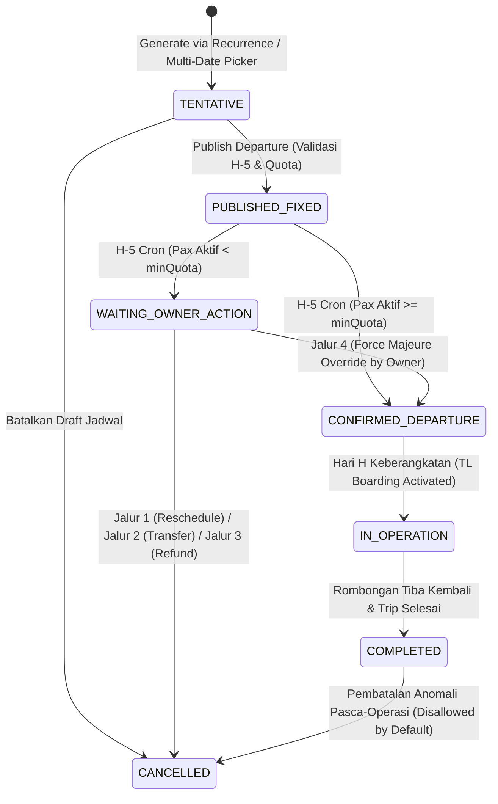
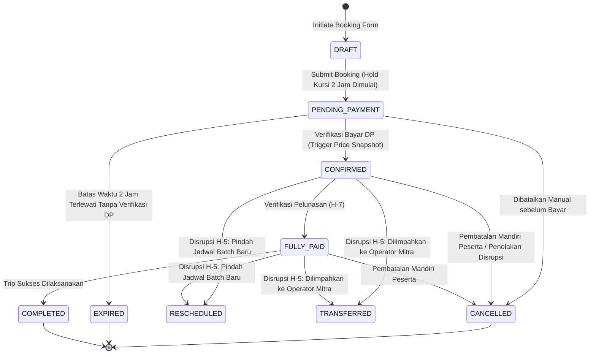
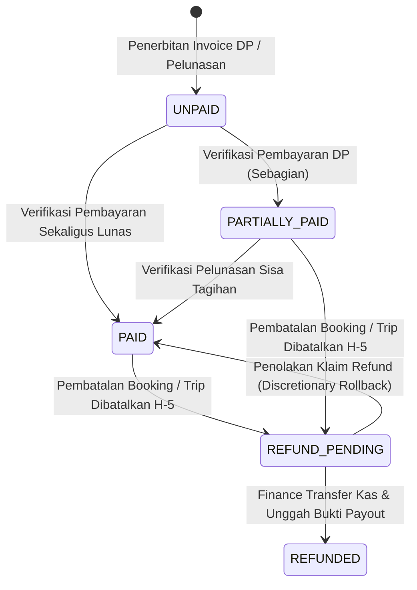
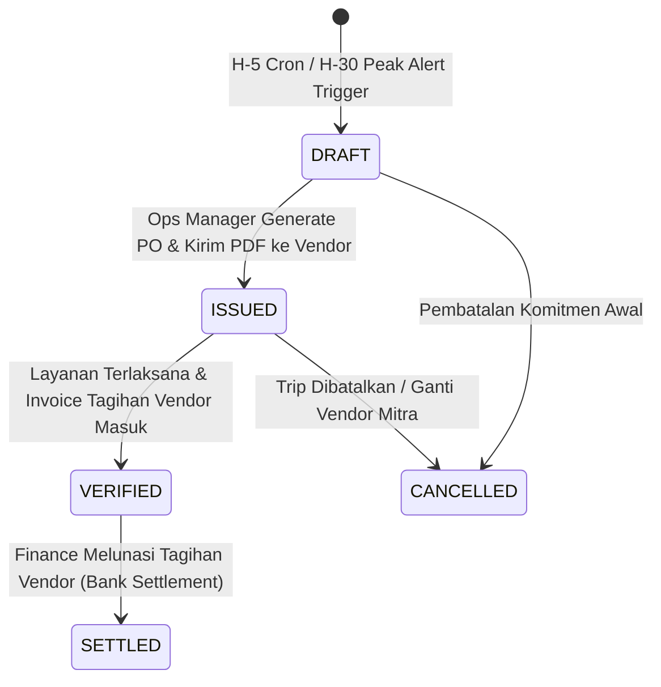
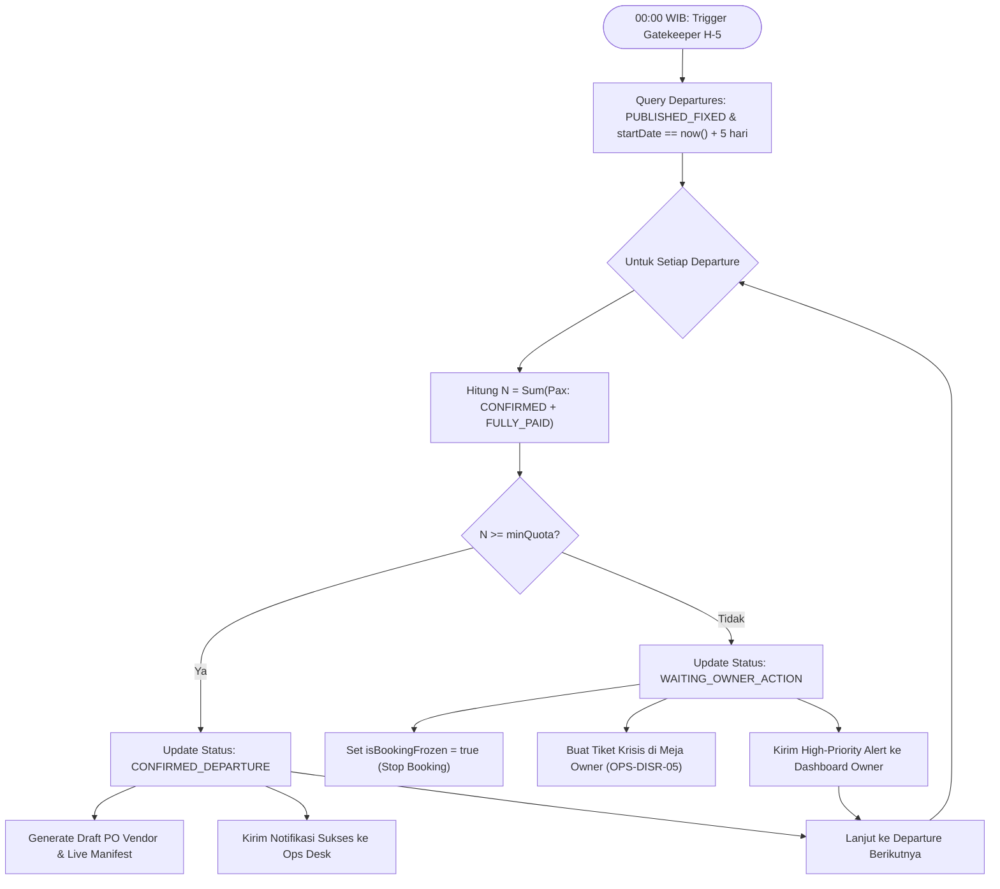

# 02 — Functional Requirements Document (FRD) — MVP-1 (Core Operations)

## Document Information

| Item | Detail |
| :--- | :--- |
| **Document ID** | FRD-MVP1 |
| **Document Title** | Functional Requirements Document (FRD) — MVP-1 (Core Operations) |
| **Product Name** | Travel & Tour Operations System (TMS) |
| **Document Type** | Functional Requirements Document (FRD) |
| **Phase / Milestone** | MVP-1 |
| **Document Version** | 1.0 |
| **Document Status** | Draft |
| **Implementation Status** | Planned |
| **Last Updated** | 2026-10-07 |
| **Author / Owner** | Product & Operations Team |

---

## 1. Ringkasan Eksekutif & Dekomposisi Sistem

Dokumen Functional Requirements Document (FRD) ini mendefinisikan spesifikasi perilaku fungsional sistem (*system behavior*), mesin status (*state machines*), aturan kalkulasi (*calculation rules*), pemicu otomatisasi (*event triggers & cron jobs*), kontrak validasi data, serta antarmuka operasional untuk rilis **MVP-1 (TMS Core Operations)**.

FRD ini merupakan turunan langsung dari dokumen produk [01 PRD MVP-1](01_PRD.md), [02 BRD](../../product/02_BRD.md), dan [00 Domain Model](../../technical/00_DOMAIN_MODEL.md). Jika PRD menjabarkan kebutuhan pengguna (*User Stories*) dan skenario perjalanan (*User Journeys*), maka FRD menetapkan bagaimana sistem TMS merespons, memproses, menghitung, dan menjaga integritas data secara deterministik.

### 1.1 Prinsip Desain Fungsional MVP-1
1. **Decoupled Architecture**: Pemisahan absolut antara cetak biru master paket (*Tour Package Blueprint*) dan instans jadwal kalender (*Tour Departure Instance*). Modifikasi pada cetak biru tidak boleh merevisi jadwal yang telah diterbitkan.
2. **Price Immutability & Snapshotting**: Penguncian harga dasar pada saat penerbitan departure (`PUBLISHED_FIXED`) serta penguncian rincian harga transaksi (*Price Snapshot*) pada saat verifikasi pembayaran DP booking (`CONFIRMED`).
3. **Automated Quota Gatekeeper**: Penegakan evaluasi kuota keberangkatan secara otomatis dan idempoten pada H-5 pukul 00:00 WIB guna melindungi agensi dari penalti sewa armada vendor.
4. **Disruption Governance**: Standardisasi eksekusi 4 jalur resolusi krisis kuota (*Reschedule, Partner Transfer, 100% Full Refund, Force Majeure Override*) dengan pemisahan beban akuntansi operasional vs subsidi agensi (*Goodwill Subsidy*).
5. **Mobile-First Field Operations**: Operasional lapangan Tour Leader terautentikasi melalui *Field Operations Portal* berbasis web seluler responsif, mencakup presensi bertahap (keberangkatan & penginapan), pelacakan agenda perjalanan dengan *Dual-Timestamp* dan unggahan foto bukti kendala, validator fasilitas promo (*Perk Badges*), katalog konsumsi lapangan non-PO, serta pencatatan insiden ad-hoc.
6. **Strict Post-Trip Financial Closing**: Pembundelan Dokumen Riwayat Trip terpadu pada H+1 dan penutupan buku laba-rugi trip (*Financial Closing*) maksimal pada H+2.

### 1.2 Dekomposisi 10 Modul Fungsional TMS

```text
TRAVEL & TOUR OPERATIONS SYSTEM (TMS) — CORE ENGINE (MVP-1)
├── 01. DASH : Dashboard & Executive Analytics Engine
├── 02. CAT  : Tour Catalog & Master Blueprint Engine
├── 03. OPS  : Tour Operations, Departure & Disruption Engine
├── 04. BOOK : Booking Pipeline, Seat Hold & Traveler Vault Engine
├── 05. PROMO: Promo, Discount & Perks Overlay Engine
├── 06. FIN  : Finance, Billing, Settlement & Closing Ledger Engine
├── 07. VEND : Vendor & Procurement Obligation Engine
├── 08. TL   : Tour Leader Field Operations Mobile Engine
├── 09. DOC  : Document Management, PDF Generator & Manifest Exporter
└── 10. SEC  : Role-Based Access Control, Audit Trail & Privacy Masking
```

---

## 2. Spesifikasi Formal State Machines & Transisi Status

### 2.1 Departure State Machine

Instans keberangkatan (*Tour Departure*) mengikuti siklus hidup yang mengontrol izin pemesanan, penguncian harga, dan eksekusi lapangan.



#### Tabel Matriks Transisi Departure:

| State Awal | Event / Trigger | Guard Conditions | State Akhir | Aksi Sistem & Efek Samping | Aktor Berwenang |
| :--- | :--- | :--- | :--- | :--- | :--- |
| `[*]` | Create Departure | Blueprint valid & aktif | `TENTATIVE` | Salin snapshot harga dasar, BOM, dan kuota default dari master blueprint. | Operations Manager, Automation |
| `TENTATIVE` | Publish Action | Tanggal mulai $> \text{H-5}$, `minQuota` $> 0$, armada teralokasi | `PUBLISHED_FIXED` | Kunci harga dasar secara permanen (`isLocked = true`); tampilkan jadwal di katalog publik. | Operations Manager |
| `TENTATIVE` | Discard Draft | Belum ada pemesanan terikat | `CANCELLED` | Nonaktifkan instans jadwal. | Operations Manager |
| `PUBLISHED_FIXED` | H-5 00:00 WIB Cron | $\text{Traveler Aktif} \ge \text{minQuota}$ | `CONFIRMED_DEPARTURE` | Terbitkan draf PO vendor; siapkan Live Field Manifest; kirim alert kesiapan trip ke Ops Desk. | System Automation Engine |
| `PUBLISHED_FIXED` | H-5 00:00 WIB Cron | $\text{Traveler Aktif} < \text{minQuota}$ | `WAITING_OWNER_ACTION` | Bekukan pemesanan baru (`freezeBookings = true`); kirim alert krisis ke konsol Business Owner. | System Automation Engine |
| `WAITING_OWNER_ACTION` | Resolution: Jalur 1, 2, atau 3 | Dipilih oleh Owner di konsol disrupsi | `CANCELLED` | Batalkan jadwal; teruskan booking ke alur Reschedule, Transfer Partner, atau Antrean Full Refund. | Business Owner |
| `WAITING_OWNER_ACTION` | Resolution: Jalur 4 (Override) | Otorisasi tertulis Owner + catatan justifikasi | `CONFIRMED_DEPARTURE` | Rekam justifikasi audit log; izinkan trip jalan di bawah kuota; buka akses penerbitan PO vendor. | Business Owner |
| `CONFIRMED_DEPARTURE` | Departure Start | Tanggal kalender = `startDate` & TL memulai presensi | `IN_OPERATION` | Buka form presensi dan itinerary checklist pada portal mobile Tour Leader. | Tour Leader, System Automation |
| `IN_OPERATION` | Trip Finished | Tanggal kalender = `endDate` & seluruh agenda terlaksana | `COMPLETED` | Kunci Live Manifest lapangan; buka akses input rekapitulasi pengeluaran riil lapangan (`OPS-HIST-08`). | Tour Leader, Operations Desk |
| `COMPLETED` | Financial Closing H+2 | Seluruh klaim vendor tervalidasi & Dokumen Riwayat Trip terunggah | `COMPLETED` *(Ledger: `CLOSED`)* | Rekonsiliasi seluruh pendapatan dan pengeluaran; kunci buku laba-rugi trip menjadi immutable. | Finance & Settlement Officer |

---

### 2.2 Booking Lifecycle State Machine

Setiap pemesanan komersial (*Booking*) mewakili transaksi antara Customer dan agensi terhadap satu Departure.



#### Tabel Matriks Transisi Booking:

| State Awal | Event / Trigger | Guard Conditions | State Akhir | Aksi Sistem & Efek Samping | Aktor Berwenang |
| :--- | :--- | :--- | :--- | :--- | :--- |
| `[*]` | Create Draft | Departure `PUBLISHED_FIXED`, kuota tersedia | `DRAFT` | Alokasikan ID booking sementara. | Customer, Admin Sales |
| `DRAFT` | Submit Booking | Jumlah pax $\le$ sisa kapasitas kursi | `PENDING_PAYMENT` | Kunci kuota sementara (`holdExpiresAt = now() + 2 jam`); terbitkan Invoice DP. | Customer, Admin Sales |
| `PENDING_PAYMENT` | Expiry Cron | `now() > holdExpiresAt` dan belum ada DP terverifikasi | `EXPIRED` | Lepaskan kursi kembali ke kuota publik; nonaktifkan invoice pembayaran. | System Automation Engine |
| `PENDING_PAYMENT` | Verify DP Payment | Bukti transfer valid & nominal $\ge$ tagihan DP | `CONFIRMED` | Buat **Price Snapshot** permanen; masukkan data traveler ke manifest; hitung ke kuota aktif. | Finance Officer |
| `PENDING_PAYMENT` | Discard Booking | Pembatalan sepihak sebelum bayar | `CANCELLED` | Lepaskan kursi kembali ke kuota publik. | Customer, Admin Sales |
| `CONFIRMED` | Verify Settlement Payment | Nominal bayar = sisa tagihan pelunasan | `FULLY_PAID` | Terbitkan Kuitansi Lunas; perbarui status pembayaran traveler di manifest menjadi LUNAS. | Finance Officer |
| `CONFIRMED` / `FULLY_PAID` | Disruption: Jalur 1 | Disetujui Owner & Customer memilih batch baru | `RESCHEDULED` | Pindahkan saldo verified bayar ke booking baru; batalkan alokasi kursi di departure lama. | Business Owner, Admin Sales |
| `CONFIRMED` / `FULLY_PAID` | Disruption: Jalur 2 | Disetujui Owner & transfer mitra disepakati | `TRANSFERRED` | Tandai transfer eksternal; jika opsi Free Waiver aktif, catat tagihan subsidi ke agensi. | Business Owner, Admin Sales |
| `CONFIRMED` / `FULLY_PAID` | Disruption: Jalur 3 / Pembatalan | Jalur 3 dipilih atau pembatalan mandiri disetujui | `CANCELLED` | Lepaskan kursi; teruskan data pembayaran ke antrean refund (`REFUND_PENDING`). | Business Owner, Finance Officer |
| `FULLY_PAID` | Departure Completed | Departure selesai (`COMPLETED`) | `COMPLETED` | Tutup siklus komersial booking; rekam riwayat kepuasan/partisipasi traveler. | System Automation Engine |

---

### 2.3 Payment & Refund State Machine

Entitas transaksi pembayaran (*Payment*) melacak penerimaan kas masuk serta pengeluaran restitusi (*Refund*).



#### Tabel Matriks Transisi Payment & Refund:

| State Awal | Event / Trigger | Guard Conditions | State Akhir | Aksi Sistem & Efek Samping | Aktor Berwenang |
| :--- | :--- | :--- | :--- | :--- | :--- |
| `[*]` | Issue Invoice | Booking dibuat / masuk termin pelunasan | `UNPAID` | Generate nomor invoice unik, detail rekening tujuan, dan QRIS/instruksi transfer. | System Automation Engine |
| `UNPAID` | Verify DP | Bukti transfer diverifikasi Finance | `PARTIALLY_PAID` | Catat nominal terverifikasi; kurangi sisa piutang tagihan; ubah booking ke `CONFIRMED`. | Finance Officer |
| `UNPAID` / `PARTIALLY_PAID` | Verify Full Settle | Total pembayaran terverifikasi = total net invoice | `PAID` | Catat tanggal pelunasan; terbitkan kuitansi pelunasan resmi; ubah booking ke `FULLY_PAID`. | Finance Officer |
| `PARTIALLY_PAID` / `PAID` | Trigger Refund Request | Trip batal kuota H-5 atau pembatalan disetujui | `REFUND_PENDING` | Hitung hak restitusi sesuai formula; masukkan ke antrean kerja pencairan kas Finance. | Business Owner, Admin Sales |
| `REFUND_PENDING` | Process Payout | Transfer bank berhasil & struk transfer dilampirkan | `REFUNDED` | Simpan referensi bank payout; rekam bukti bayar; mutasi pembukuan kas keluar. | Finance Officer |

---

### 2.4 Procurement & Purchase Order (PO) State Machine

Entitas komitmen pengadaan (*Procurement Obligation / PO*) mengatur pengikatan layanan vendor pihak ketiga.



#### Tabel Matriks Transisi PO:

| State Awal | Event / Trigger | Guard Conditions | State Akhir | Aksi Sistem & Efek Samping | Aktor Berwenang |
| :--- | :--- | :--- | :--- | :--- | :--- |
| `[*]` | Generate PO Event | Departure `CONFIRMED_DEPARTURE` atau Peak Alert H-30 | `DRAFT` | Susun item pengadaan berdasarkan BOM departure dan kuantitas pax terkonfirmasi. | System, Operations Manager |
| `DRAFT` | Issue PO | Vendor PIC terpilih, nilai komitmen valid | `ISSUED` | Kunci nominal PO; generate file PO PDF resmi dengan nomor unik; catat komitmen biaya. | Operations Manager |
| `ISSUED` | Receive Claim Invoice | Tagihan fisik/PDF vendor diterima tim Finance | `VERIFIED` | Cocokkan nilai invoice vendor dengan nilai PO (`3-way match`); tandai kesiapan bayar. | Finance Officer |
| `VERIFIED` | Settle PO Payment | Kas ditransfer ke rekening vendor mitra | `SETTLED` | Lampirkan bukti transfer; ubah status PO menjadi lunas; masukkan ke pos biaya aktual trip. | Finance Officer |
| `ISSUED` / `DRAFT` | Cancel PO Obligation | Trip dibatalkan atau vendor diganti | `CANCELLED` | Rekam alasan pembatalan; batalkan voucher layanan; lakukan rekonsiliasi denda jika ada. | Operations Manager |

---

## 3. Spesifikasi Event Triggers, Otomasi & Cron Jobs

Sistem TMS mengandalkan otomasi terjadwal (*scheduled cron engine*) yang berjalan secara otonom di latar belakang. Setiap pekerjaan cron wajib memenuhi prinsip **idempotensi mutlak**: eksekusi ulang pada jendela waktu yang sama tidak boleh menggandakan data, mengubah status yang sudah stabil, atau mengirimkan notifikasi duplikat.

### 3.1 CRON-01: D-5 Quota Gatekeeper (`OPS-GATE-04`)

- **Jadwal Eksekusi**: Setiap hari pukul `00:00:00 WIB` (Zona Waktu Asia/Jakarta, UTC+7).
- **Target Entitas**: Seluruh instans `Tour Departure` dengan kriteria:
  - `status == 'PUBLISHED_FIXED'`
  - `startDate == CURRENT_DATE + 5 hari`
- **Algoritma Eksekusi**:
  1. *Perhitungan Peserta Terverifikasi ($N$)*:
     $$N = \sum \text{Pax dari Booking aktif dengan status } (\text{CONFIRMED} \lor \text{FULLY_PAID})$$
     *Catatan*: Booking dengan status `DRAFT`, `PENDING_PAYMENT`, `EXPIRED`, atau `CANCELLED` tidak dihitung.
  2. *Kondisi A ($N \ge \text{minQuota}$)*:
     - Ubah status departure: `PUBLISHED_FIXED` $\rightarrow$ `CONFIRMED_DEPARTURE`.
     - Buat draf Purchase Order (PO) untuk seluruh vendor terikat BOM fasilitas (`VEND-PO-02`).
     - Inisialisasi *Live Field Manifest* keberangkatan (`DOC-MANI-02`).
     - Buat notifikasi prioritas normal kepada Operations Manager: *"Departure [Code] memenuhi kuota (N=[N] Pax). Siap rilis PO & manifest."*
  3. *Kondisi B ($N < \text{minQuota}$)*:
     - Ubah status departure: `PUBLISHED_FIXED` $\rightarrow$ `WAITING_OWNER_ACTION`.
     - Kunci penerimaan booking baru: set flag `isBookingFrozen = true`. Seluruh request booking baru ditolak dengan pesan `DEPARTURE_BOOKING_FROZEN`.
     - Tolak verifikasi bukti transfer yang baru masuk untuk departure tersebut.
     - Terbitkan tiket krisis disrupsi ke meja Business Owner di konsol krisis (`OPS-DISR-05`).
     - Buat notifikasi prioritas tinggi (*High Priority Alert*) kepada Business Owner dan Operations Manager: *"PERINGATAN: Departure [Code] Gagal Kuota (N=[N]/min=[minQuota]). Membutuhkan intervensi resolusi Owner segera."*
  4. *Log Audit*: Tulis rekam jejak audit pada `SEC-AUDIT-02` dengan payload kuota, status transisi, dan timestamp server.



---

### 3.2 CRON-02: Temporary Seat Hold Expiry Engine (`BOOK-HOLD-02`)

- **Jadwal Eksekusi**: Setiap 2 menit secara berkala.
- **Target Entitas**: Booking dengan `status == 'PENDING_PAYMENT'` dan `holdExpiresAt < CURRENT_TIMESTAMP`.
- **Algoritma Eksekusi**:
  1. Identifikasi booking yang telah melewati jendela waktu reservasi (default: 120 menit sejak pembuatan booking).
  2. Periksa apakah terdapat unggahan bukti transfer yang sedang menunggu verifikasi Finance (`isUnderReview == true`).
  3. Jika `isUnderReview == false`:
     - Ubah status booking: `PENDING_PAYMENT` $\rightarrow$ `EXPIRED`.
     - Lepaskan kuota kursi: kembalikan kapasitas `reservedSeats` pada departure terkait.
     - Nonaktifkan tagihan invoice DP.
     - Tulis log audit: `event: BOOKING_EXPIRED_TIMEOUT`.
  4. Jika `isUnderReview == true`:
     - Berikan perpanjangan waktu tenggang toleransi verifikasi kas (*grace period*) sebesar 60 menit.

---

### 3.3 CRON-03: Peak Season Early Warning Radar (`OPS-SEAS-07`, `DASH-OPS-02`)

- **Jadwal Eksekusi**: Harian setiap pukul `06:00:00 WIB`.
- **Target Entitas**: Kalender libur nasional, musim liburan sekolah resmi, dan periode cuti bersama.
- **Algoritma Eksekusi**:
  1. Sistem memeriksa apakah tanggal sistem berada tepat pada H-30 hari kalender sebelum tanggal mulai periode *Peak Season*.
  2. Jika kondisi terpenuhi:
     - Tampilkan Banner Peringatan Prioritas Tinggi (*High-Priority Supply Alert*) pada Dashboard Operasional dan Dashboard Eksekutif.
     - Generate tugas actionable: *"Peringatan H-1 Bulan Peak Season: Terbitkan PO Blok Armada Bus Mitra Sekarang"*.
     - Buka akses langsung ke generator **Early Bus Purchase Order (PO Blok Armada)** untuk mengunci unit bus dan tarif sewa sebelum terjadi lonjakan harga sewa bus pasar.

---

### 3.4 CRON-04: Operational Milestone Radar (`DASH-OPS-02`)

- **Jadwal Eksekusi**: Harian setiap pukul `00:30:00 WIB`.
- **Target Entitas**: Seluruh keberangkatan aktif dalam rentang H-30 hari kalender hingga H+7 hari pasca-keberangkatan.
- **Matriks Evaluasi Milestone**:
  - **H-30**: Evaluasi kesiapan pasokan armada peak season & Early Bus PO (`OPS-SEAS-07`).
  - **H-14**: Evaluasi tren pemesanan (*demand checkpoint*) & peringatan awal promosi.
  - **H-7**: Pengecekan jatuh tempo pelunasan tagihan sisa peserta (`FIN-INV-01`).
  - **H-5**: Evaluasi gatekeeper kuota minimum keberangkatan (`OPS-GATE-04`).
  - **H-2**: Tugas konfirmasi titik penjemputan (*Pick-up Reconfirmation Task*): Admin menghubungi peserta untuk verifikasi pilihan penjemputan di Titik A (dengan jam lebih awal) atau Meeting Point Utama (`BOOK-VAULT-04`, `US-DASH-02`).
  - **H-1**: Finalisasi manifest keberangkatan, ekspor cetak manifest fisik (`DOC-MANI-02`), pembagian template listing menu makan WA ke peserta (`TL-MEAL-05`).
  - **Hari H**: Pembukaan portal lapangan Tour Leader, aktivasi presensi keberangkatan Titik A & MP Utama (`TL-ATTN-01`), dan pelacakan agenda perjalanan itinerary dual-timestamp (`TL-ITIN-02`).
  - **H+1**: Serah terima fisik lembar rekapitulasi pengeluaran riil lapangan dan bon/nota oleh TL kepada Admin Operasional (`OPS-HIST-08`).
  - **H+2**: Tenggat waktu akhir rekonsiliasi kas dan penutupan buku laba-rugi trip (*Financial Closing Ledger*, `FIN-CLOSE-05`).

---

### 3.5 CRON-05: Quota & Disruption Early Warning Center (`DASH-RISK-03`)

- **Jadwal Eksekusi**: Harian setiap pukul `07:00:00 WIB`.
- **Target Entitas**: Keberangkatan `PUBLISHED_FIXED` dengan `startDate` berada pada interval $\text{H-10}$ s/d $\text{H-6}$.
- **Algoritma Eksekusi**:
  - Jika $\text{Traveler Aktif} < \text{BEP Pax}$, tandai departure dengan lencana merah **At Risk of Cancellation** pada dashboard.
  - Hitung defisit kuota: $\Delta = \text{minQuota} - \text{Traveler Aktif}$.
  - Kirimkan alert ke tim Sales untuk mengintensifkan promosi darurat atau ke tim Ops untuk menyiapkan opsi aliansi operator mitra sebelum evaluasi resmi H-5.

---

## 4. Mesin Kalkulasi, Algoritma & Formula Bisnis

### 4.1 Kalkulator Titik Impas (BEP) & Baseline Margin (`CAT-PRIC-03`)

Kalkulator BEP menghitung kuota minimum keberangkatan agar pendapatan kotor menutup seluruh biaya operasional trip.

- **Formula Komponen Biaya**:
  - *Biaya Tetap ($FC$ / Fixed Costs)*: Biaya sewa unit bus, jasa Tour Leader, retribusi tol bus, dan biaya perizinan armada.
    $$FC = \text{Sewa Bus} + \text{Fee Tour Leader} + \text{Alokasi Tol \& Parkir}$$
  - *Biaya Variabel per Pax ($VC$ / Variable Cost per Pax)*: Biaya tiket objek wisata, porsi makan lokal, asuransi per orang, kamar hotel per pax (berdasarkan okupansi standar twin-share), dan souvenir kit.
    $$VC = \sum \text{standardCost item BOM fasilitas bertipe } \text{isVendorFulfilled}$$
  - *Harga Jual Bersih ($P$ / Net Selling Price)*: Harga paket yang ditawarkan ke publik sebelum diskon promo.
  - *Margin Kontribusi per Pax ($CM$)*:
    $$CM = P - VC$$

- **Formula Titik Impas (BEP Pax)**:
  $$\text{BEP Pax} = \left\lceil \frac{FC}{P - VC} \right\rceil$$

- **Guardrail Validasi**:
  - Jika $P \le VC$, sistem menolak simpan dengan pesan error `INVALID_NEGATIVE_CONTRIBUTION_MARGIN`.
  - Jika $\text{BEP Pax} > \text{maxQuota}$ kapasitas armada, sistem memunculkan peringatan visual: `BEP_EXCEEDS_FLEET_CAPACITY` (paket berpotensi merugi meskipun seluruh kursi terisi penuh).

---

### 4.2 Algoritma Multi-Bus Expansion & Fleet Recalculation (`OPS-DISP-06`)

Ketika permintaan peserta melonjak melampaui kapasitas 1 armada bus pada satu departure yang sama:

- **Algoritma Alokasi Bus Baru**:
  1. Input unit bus tambahan ke departure (misal: Unit Bus 2 kapasitas 30 kursi).
  2. Sistem memperbarui kapasitas maksimum total:
     $$\text{maxQuota}_{baru} = \text{maxQuota}_{lama} + \text{kapasitas\_kursi}_{bus\_baru}$$
  3. Sistem mengalkulasi ulang Biaya Tetap total ($FC_{total}$):
     $$FC_{total} = FC_{lama} + \text{Sewa Bus Baru} + \text{Fee TL Tambahan}$$
  4. Sistem memperbarui nilai BEP Pax gabungan:
     $$\text{BEP Pax}_{gabungan} = \left\lceil \frac{FC_{total}}{P - VC} \right\rceil$$
  5. Sistem membuka kembali sisa kuota penjualan tiket publik sebesar kapasitas kursi tambahan tersebut.
  6. Sistem membentuk sub-manifest per unit armada bus (Bus 1 dan Bus 2) dan memungkinkan pemetaan Tour Leader spesifik per armada (`TL-1` pada `Bus-1`, `TL-2` pada `Bus-2`).

---

### 4.3 Algoritma Perhitungan Tagihan, Promo Overlay & Invoicing (`PROMO-RULE-01`, `FIN-INV-01`)

Perhitungan tagihan komersial dilakukan secara berurutan dan deterministik:

1. **Tagihan Kotor (*Gross Invoice*)**:
   $$\text{gross\_invoice} = \text{pax\_count} \times \text{locked\_base\_price}$$

2. **Evaluasi Diskon Moneter (*Monetary Discount*)**:
   - Jika promo persentase: $\text{discount\_nominal} = \min(\text{gross\_invoice} \times \frac{\text{promo\_pct}}{100}, \text{max\_discount\_cap})$
   - Jika promo flat: $\text{discount\_nominal} = \min(\text{promo\_flat\_amount}, \text{gross\_invoice})$
   - *Guardrail Non-Stackable*: Sistem hanya memperbolehkan maksimal 1 promo diskon moneter pada satu booking kecuali atribut `isStackable == true`.

3. **Tagihan Bersih (*Net Invoice*)**:
   $$\text{net\_invoice} = \text{gross\_invoice} - \text{eligible\_discount}$$

4. **Jadwal Dual-Invoicing (DP & Pelunasan)**:
   - **Termin 1 (Invoice DP)**:
     $$\text{dp\_amount} = \max(\text{minimum\_dp\_fixed} \times \text{pax\_count}, \text{net\_invoice} \times \text{dp\_percentage})$$
     *Jatuh Tempo DP*: `createdAt` + 2 jam (saat booking awal) atau 24 jam (input sales desk).
   - **Termin 2 (Invoice Pelunasan / Final Balance)**:
     $$\text{remaining\_balance} = \text{net\_invoice} - \text{verified\_dp\_paid}$$
     *Jatuh Tempo Pelunasan*: Maksimal $\text{H-7}$ kalender sebelum tanggal mulai departure pukul 23:59 WIB.

5. **Complimentary Perk Treatment (`PROMO-PERK-02`)**:
   - Nilai potongan pada tagihan pelanggan adalah **Rp 0** (harga invoice tidak berkurang).
   - Profil peserta pada manifest ditandai dengan **Perk Badge** (misal: `[Extra Meal]`, `[Souvenir Upgrade]`).
   - Estimasi biaya fasilitas perk dialokasikan ke pos akuntansi terpisah:
     $$\text{perk\_cost\_total} = \text{pax\_count} \times \text{perk\_unit\_cost} \longrightarrow \text{Akun: Marketing Expense Allocation}$$

---

### 4.4 Algoritma Price Snapshotting (`BOOK-SNAP-03`)

Mekanisme perlindungan margin yang menjamin harga jual pelanggan kebal terhadap perubahan master blueprint di masa depan:

- **Kondisi Pemicu**: Eksekusi mutasi status booking menjadi `CONFIRMED` saat pembayaran DP diverifikasi oleh Finance.
- **Payload Snapshot yang Disimpan Permanen**:
  ```json
  {
    "snapshot_id": "SNAP-202610-00129",
    "booking_id": "BKG-202610-0087",
    "departure_id": "DEP-BALI-20261105",
    "snapshot_created_at": "2026-10-07T08:30:00+07:00",
    "currency": "IDR",
    "pax_count": 2,
    "unit_base_price": 1850000.00,
    "gross_total": 3700000.00,
    "promo_applied": {
      "code": "EARLYBIRD10",
      "type": "PERCENTAGE",
      "discount_nominal": 370000.00
    },
    "net_total_contract": 3330000.00,
    "dp_required": 1000000.00,
    "balance_due": 2330000.00,
    "inclusions_snapshot": [
      "Transportasi Bus Pariwisata AC Executive",
      "Hotel 1 Malam Twin-Share Standard",
      "Makan 4x Sesuai Itinerary",
      "Tiket Masuk Seluruh Objek Wisata",
      "Asuransi Perjalanan Standar"
    ]
  }
  ```
- **Aturan Immutability**:
  - Kolom harga pada invoice tagihan dan kuitansi pembayaran selanjutnya **hanya boleh** dibaca dari tabel `price_snapshots`.
  - Modifikasi harga dasar pada cetak biru master paket (`Tour Package`) atau departure tidak boleh memperbarui data yang telah berada dalam `price_snapshots`.

---

### 4.5 Formula Finansial Jalur Resolusi Disrupsi H-5 (`OPS-DISR-05`, `FIN-SUB-04`)

Jika departure gagal kuota pada evaluasi H-5 (`WAITING_OWNER_ACTION`), Business Owner memilih 1 dari 4 jalur:

#### Jalur 1: Reschedule (Ganti Jadwal / Batch Baru)
- Seluruh dana yang telah diverifikasi dialihkan ke booking baru:
  $$\text{credit\_transferred} = \text{verified\_paid\_amount}$$
- Jika harga paket batch baru berbeda:
  $$\Delta_{\text{reschedule}} = \text{net\_price}_{\text{batch\_baru}} - \text{net\_price}_{\text{batch\_lama}}$$
  - Jika $\Delta > 0$, selisih ditagihkan pada invoice pelunasan baru.
  - Jika $\Delta < 0$, selisih dikembalikan ke rekening peserta atau dijadikan voucher deposit.

#### Jalur 2: Partner Transfer (Aliansi Operator Mitra)
- Peserta dilimpahkan ke operator rekanan dengan destinasi dan tanggal setara.
- **Opsi A: Free Waiver (Customer Goodwill Subsidy)**:
  - Pelanggan tidak dikenakan kenaikan tarif.
  - Jika tarif operator mitra lebih mahal daripada tarif paket agensi:
    $$\text{subsidy\_amount} = \max(0, \text{partner\_published\_price} - \text{customer\_locked\_price})$$
  - Nilai $\text{subsidy\_amount}$ dibukukan ke pos akun: `Goodwill Subsidy Expense` (beban kepuasan pelanggan agensi).
- **Opsi B: Standard Price Delta**:
  - Selisih biaya dibebankan kepada pelanggan: $\text{customer\_delta} = \text{partner\_price} - \text{customer\_price}$.

#### Jalur 3: 100% Full Refund (Pengembalian Dana Penuh)
- Hak pengembalian dana dihitung tanpa potongan biaya administrasi apapun:
  $$\text{refund\_amount} = \text{verified\_paid\_amount}$$
  $$\text{deduction\_fee} = 0$$
- Sistem menerbitkan instruksi pembayaran pada antrean kas Finance (`FIN-REF-03`) dengan tenggat waktu pencairan maksimal $24\text{ jam}$ sejak keputusan Owner.

#### Jalur 4: Force Majeure Override
- Keberangkatan tetap dijalankan dengan kuota di bawah BEP atas diskresi tertulis Owner.
- Sistem memproyeksikan potensi defisit margin operasional:
  $$\text{projected\_margin\_deficit} = FC + (N \times VC) - (N \times P)$$
- Otorisasi wajib mencatat nomor memo persetujuan Owner dan sumber dana penjaminan defisit pada audit trail.

---

### 4.6 Formula Rekapitulasi Kas Lapangan & Closing Ledger H+2 (`OPS-HIST-08`, `FIN-CLOSE-05`)

Rekonsiliasi keuangan trip dilakukan maksimal H+2 setelah trip selesai (`COMPLETED`):

1. **Rekapitulasi Total Pengeluaran Riil Lapangan (`total_real_field_expense`)**:
   $$\text{total\_real\_field\_expense} = \sum (\text{BBM} + \text{Tol} + \text{Resto Non-PO} + \text{Parkir} + \text{Retribusi} + \text{Biaya Ad-Hoc})$$
   *Prasyarat*: Data diinput oleh Admin Operasional berdasarkan lembar rekap TL beserta lampiran bukti bon/nota fisik berstatus `ATTACHED` (`OPS-HIST-08`).

2. **Rekapitulasi Biaya Komitmen Vendor PO (`total_settled_vendor_po`)**:
   $$\text{total\_settled\_vendor\_po} = \sum \text{Nilai PO Vendor terverifikasi lunas (Bus, Hotel, Tiket Wisata)}$$

3. **Laba Bersih Aktual Trip (*Actual Net Trip Profit*)**:
   $$\text{Actual Net Profit} = \text{Total Verified Revenue} - \text{total\_settled\_vendor\_po} - \text{total\_real\_field\_expense} - \text{goodwill\_subsidy} - \text{perk\_marketing\_expense}$$

4. **Penguncian Ledger**:
   - Status ledger departure diubah menjadi `CLOSED`.
   - Data laporan laba-rugi trip menjadi *immutable* (hanya dapat dibaca / *read-only*).

---

## 5. Spesifikasi Fungsional Rinci per Modul

### 5.1 Modul 01: Dashboard & Executive Analytics (`DASH`)

#### `DASH-EXEC-01`: Executive Health & Margin Dashboard
- **Fungsi**: Menyajikan visualisasi performa bisnis secara agregat per batch keberangkatan.
- **Input Data**: Parameter filter periode tanggal, status departure, paket wisata.
- **Output / Metrik Layar**:
  - Total Pendapatan Kotor (*Gross Realized Revenue*).
  - Total Biaya Terkomitmen (*Total Committed Cost: Vendor PO + Estimasi Lapangan*).
  - Margin Kontribusi Agregat (% dan nominal IDR).
  - Utilisasi Kuota Rata-rata (*Average Load Factor* = $\frac{\sum \text{Pax Aktif}}{\sum \text{maxQuota}}$).
  - Tabel keberangkatan aktif terurut berdasarkan tanggal keberangkatan terdekat.
- **Aturan Akses**: Terbatas untuk peran `OWNER` dan `OPERATIONS`.

#### `DASH-OPS-02`: Operational Milestone Radar (H-30 s/d H+7)
- **Fungsi**: Melacak status kesiapan operasional setiap batch trip berdasarkan jadwal waktu.
- **Indikator Tahapan**:
  - `H-30`: Status kesiapan armada peak season & PO blok armada awal (`OPS-SEAS-07`).
  - `H-14`: Status okupansi kuota vs target BEP.
  - `H-7`: Status pelunasan piutang peserta (% terbayar).
  - `H-5`: Status kelulusan kuota gatekeeper (`CONFIRMED_DEPARTURE` vs `WAITING_OWNER_ACTION`).
  - `H-2`: Status tugas konfirmasi titik penjemputan Titik A vs Meeting Point Utama (`BOOK-VAULT-04`).
  - `H-1`: Status finalisasi manifest & penyebaran format listing makan WA (`TL-MEAL-05`).
  - `Hari H`: Status boarding peserta di lapangan (`TL-ATTN-01`).
  - `H+1`: Status input Dokumen Riwayat Trip & upload bon fisik TL (`OPS-HIST-08`).
  - `H+2`: Status penyelesaian penutupan buku laba-rugi (*Financial Closing*, `FIN-CLOSE-05`).

#### `DASH-RISK-03`: Quota & Disruption Warning Center
- **Fungsi**: Mendeteksi keberangkatan rawan pembatalan pada rentang H-10 s/d H-6 yang masih berada di bawah kuota BEP.
- **Tampilan**: Kartu peringatan merah dengan badge `At Risk of Cancellation`, menampilkan sisa kekurangan kursi dan rekomendasi aksi mitigasi (promosi kilat atau aliansi mitra).

---

### 5.2 Modul 02: Tour Catalog & Master Blueprint (`CAT`)

#### `CAT-BLUE-01`: Master Package Blueprint Builder
- **Fungsi**: Membuat dan mengelola cetak biru paket wisata standar yang dapat digunakan berulang kali.
- **Atribut Entitas**: `packageCode` (unik), `title`, `durationDays`, `durationNights`, `tourType` (`OPEN_TOUR` | `PRIVATE_TOUR`), `destinationsList`, `dayByDayItinerary`, `status` (`ACTIVE` | `INACTIVE`).
- **Aturan Fungsional**:
  - Pembaruan pada cetak biru master paket tidak boleh mengubah departure yang telah dibuat dan berstatus `PUBLISHED_FIXED`.
  - Format kode paket: alfabetik huruf kapital dan tanda strip (misal: `PKG-BROMO-01`).

#### `CAT-BOM-02`: Facilities Bill of Materials (BOM) Configurator
- **Fungsi**: Mengonfigurasi daftar komponen fasilitas baku yang membentuk paket tour.
- **Struktur Item BOM**:
  - `serviceCategory`: `TRANSPORTATION`, `ACCOMMODATION`, `MEAL`, `ATTRACTION_TICKET`, `GUIDING`, `LOGISTICS`.
  - `serviceName`: Nama fasilitas (misal: "Sewa Bus Pariwisata 35-Seat", "Hotel 1 Malam Twin-Share").
  - `isVendorFulfilled`: Boolean (`true` jika dipenuhi oleh mitra pihak ketiga, `false` jika aset internal).
  - `vendorCategory`: Kategori vendor yang wajib dihubungkan jika `isVendorFulfilled == true`.
  - `standardCost`: Estimasi biaya standar per pax atau per rombongan.
  - `inclusionType`: `INCLUSION` (termasuk dalam paket) atau `EXCLUSION` (tidak termasuk).

#### `CAT-PRIC-03`: Baseline Cost & Target Margin Calculator
- **Fungsi**: Menghitung biaya dasar paket, margin kontribusi, dan kuota BEP minimum secara otomatis.
- **Input Form**: Estimasi Biaya Tetap ($FC$), akumulasi Biaya Variabel ($VC$) dari BOM, dan rencana Harga Jual ($P$).
- **Output Fungsional**: Menghasilkan nilai `BEP Pax` terhitung dengan pembulatan ke atas ($\lceil \dots \rceil$) dan persentase laba proyeksi pada kapasitas kuota penuh.

---

### 5.3 Modul 03: Tour Operations & Departure (`OPS`)

#### `OPS-REC-01`: Flexible Recurrence & Multi-Date Generator
- **Fungsi**: Menghasilkan instans keberangkatan (*Tour Departure*) secara massal dari Master Blueprint.
- **Metode Pembentukan**:
  1. *Pola Berulang (Recurrence Engine)*: Pola mingguan (setiap hari Sabtu), dwimingguan, atau bulanan dalam rentang tanggal tertentu.
  2. *Multi-Date Picker*: Pemilihan tanggal kalender bebas/acak secara simultan.
- **Hasil Eksekusi**: Membentuk entitas departure mandiri dengan status awal `TENTATIVE`, mewarisi salinan snapshot harga dasar, BOM fasilitas, dan kuota default dari master paket.

#### `OPS-ADJ-02`: Pre-Publish Departure Adjuster
- **Fungsi**: Menyesuaikan parameter operasional pada keberangkatan yang masih berstatus `TENTATIVE`.
- **Parameter yang Dapat Diubah**: Tanggal mulai/selesai, `minQuota`, `maxQuota`, armada bus, alokasi Tour Leader, dan baseline price spesifik batch.
- **Validasi**: Perubahan ditolak jika departure telah berstatus selain `TENTATIVE`.

#### `OPS-LOCK-03`: Departure Publishing & Price Locking
- **Fungsi**: Mempublikasikan jadwal ke katalog publik dan mengunci parameter dasar secara permanen.
- **Pemicu**: Tombol "Publish Departure" ditekan oleh Operations Manager.
- **Validasi Pre-Publish**:
  - Tanggal mulai keberangkatan harus $> \text{CURRENT_DATE} + 5\text{ hari}$.
  - Kuota minimum $\ge 1$ dan kuota maksimum $\ge \text{minQuota}$.
- **Efek Sistem**: Status berubah dari `TENTATIVE` menjadi `PUBLISHED_FIXED`. Seluruh atribut harga dasar terkunci permanen (`isLocked = true`).

#### `OPS-GATE-04`: D-5 Automated Minimum Quota Gatekeeper
- **Fungsi**: Menjalankan evaluasi kuota otomatis tepat pada H-5 pukul 00:00 WIB sesuai spesifikasi di Bagian 3.1.

#### `OPS-DISR-05`: Disruption & Crisis Resolution Console
- **Fungsi**: Menyediakan antarmuka terpusat bagi Business Owner untuk mengeksekusi 1 dari 4 jalur krisis pada departure berstatus `WAITING_OWNER_ACTION`:
  - **Jalur 1**: Reschedule ke batch tanggal baru.
  - **Jalur 2**: Partner Transfer ke operator rekanan (dengan opsi Free Waiver Goodwill Subsidy).
  - **Jalur 3**: 100% Full Refund tanpa potongan administrasi.
  - **Jalur 4**: Force Majeure Override dengan kewajiban input catatan justifikasi log audit.

#### `OPS-DISP-06`: Tour Leader & Resource Dispatcher (Fleet Expansion)
- **Fungsi**: Menugaskan Tour Leader secara manual dan bebas berdasarkan diskresi operasional, serta menambahkan unit armada bus ke-2/ke-N (*Multi-Bus Batching*) pada keberangkatan yang sama saat terjadi lonjakan peserta sesuai algoritma di Bagian 4.2.

#### `OPS-SEAS-07`: Peak Season Early Warning & Early Bus PO Generator (H-1 Bulan)
- **Fungsi**: Memicu peringatan dini H-30 hari sebelum libur sekolah atau tanggal merah panjang, serta memfasilitasi penerbitan dokumen **Early Bus Purchase Order (PO Blok Armada)** untuk mengunci armada bus dan tarif sewa lebih awal sesuai aturan di Bagian 3.3.

#### `OPS-HIST-08`: Input Rekapitulasi Pengeluaran Riil Lapangan & Dokumen Riwayat Trip
- **Fungsi**: Menyediakan formulir bagi Admin Operasional pada H+1 untuk menginput pos pengeluaran riil lapangan dari lembar rekap TL (makan resto lokal non-PO, BBM, tol, retribusi, parkir, ad-hoc) dan mengunggah multi-file foto/scan bon/nota fisik.
- **Efek Fungsional**: Sistem membundel pos biaya dan bukti berkas ke dalam **Dokumen Riwayat Trip (*Trip Operational History & Expense Archive*)** terpadu, terhubung dengan manifest presensi (`TL-ATTN-01`), jam aktual agenda dan foto kendala (`TL-ITIN-02`), serta log insiden (`TL-LOG-03`), sebagai prasyarat wajib sebelum Finance menjalankan *Financial Closing* pada H+2.

---

### 5.4 Modul 04: Booking & Traveler Vault (`BOOK`)

#### `BOOK-PIPE-01`: Booking Pipeline & Commercial Reservation
- **Fungsi**: Melayani pembuatan pesanan paket tour baik melalui formulir publik (*Guest Checkout*) maupun input manual oleh Admin Sales.
- **Validasi Ketersediaan**:
  $$\text{Sisa Kursi} = \text{maxQuota} - (\text{Pax Confirmed} + \text{Pax Held 2 Jam})$$
  Jika jumlah kursi yang diminta $>$ Sisa Kursi, request ditolak dengan kode `INSUFFICIENT_SEAT_QUOTA`.
- **Hasil Pembuatan**: Booking terbit dengan status `PENDING_PAYMENT`, menghasilkan nomor unik `bookingRef` (misal: `BKG-202610-0087`).

#### `BOOK-HOLD-02`: Temporary Seat Locking (2 Jam)
- **Fungsi**: Mengunci kapasitas kursi sementara selama 120 menit sejak invoice DP terbit.
- **Otomasi**: Jika melewati batas waktu tanpa bukti pembayaran yang diverifikasi, cron otomatis mengalihkan status booking ke `EXPIRED` dan melepaskan alokasi kursi ke publik.

#### `BOOK-SNAP-03`: Price Snapshotting Engine
- **Fungsi**: Mengunci rincian harga transaksi (*Price Snapshot*) secara permanen saat pembayaran DP diverifikasi oleh Finance sesuai algoritma di Bagian 4.4.

#### `BOOK-VAULT-04`: Registrasi Identitas Peserta & Pemilihan Titik Jemput (Traveler Vault)
- **Fungsi**: Menyimpan identitas setiap peserta (*Traveler/Pax*) dan mengunci preferensi titik jemput resmi.
- **Field Data Traveler**: Nama Lengkap (sesuai KTP/Paspor), Nomor NIK/Paspor (terenkripsi & termasking), Nomor WhatsApp, Jenis Kelamin, Catatan Khusus/Alergi Makanan.
- **Pilihan Titik Penjemputan Resmi**:
  1. **Titik A (*En-Route Pick-up Point*)**: Titik antara yang sejalan dari arah pool vendor bus menuju meeting point utama, dengan jadwal waktu penjemputan lebih awal.
  2. **Meeting Point Utama**: Titik kumpul utama akhir seluruh rombongan sebelum bus berangkat ke kota tujuan.
- **Protokol Konfirmasi H-2**: Pada H-2 keberangkatan, Admin Sales melakukan konfirmasi ulang pilihan titik penjemputan peserta; sistem mencatat hasil konfirmasi dan memproyeksikannya secara sekuensial ke manifest lapangan.

#### `BOOK-CANC-05`: Penanganan Pembatalan Mandiri oleh Peserta
- **Fungsi**: Memproses permohonan pembatalan sepihak oleh pelanggan sebelum keberangkatan.
- **Aturan Kebijakan**:
  - *Strict No-Refund (Default)*: Status booking berubah ke `CANCELLED`, hak refund Rp 0, kursi dikembalikan ke kuota kosong.
  - *Discretionary Override*: Business Owner berhak menetapkan nominal pengembalian khusus atas pertimbangan kemanusiaan dengan kewajiban input catatan alasan pada log audit.

#### `BOOK-QUOT-06`: Custom Tour Quotation Pipeline (Private Tour)
- **Fungsi**: Menyusun proposal penawaran harga khusus (*Quotation*) untuk rombongan privat.
- **Lifecycle Komersial**: `REQUESTED` $\rightarrow$ `PLANNING` $\rightarrow$ `QUOTED` $\rightarrow$ `NEGOTIATING` $\rightarrow$ `AGREED` $\rightarrow$ `BOOKING_CONFIRMED`.
- **Aturan**: Proposal quotation mencakup nomor versi, masa berlaku penawaran, dan komitmen harga khusus vendor. Recurrence dan gate H-5 tidak berlaku untuk Private Tour kecuali disepakati dalam kontrak.

---

### 5.5 Modul 05: Promo & Perks Overlay Engine (`PROMO`)

#### `PROMO-RULE-01`: Monetary Discount Engine
- **Fungsi**: Memvalidasi dan menerapkan kode voucher potongan harga moneter (persentase % atau nominal flat IDR) pada formulir pemesanan sesuai formula di Bagian 4.3.

#### `PROMO-PERK-02`: Complimentary Facility Perks & Perk Badge Tracker
- **Fungsi**: Memberikan fasilitas cuma-cuma (*free meals, souvenir upgrade, executive lounge*) tanpa memotong nilai invoice pelanggan.
- **Efek Sistem**:
  - Tagihan invoice bernilai Rp 0 diskon tunai.
  - Profil peserta di manifest menampilkan ikon lencana **Perk Badge**.
  - Nilai estimasi fasilitas perk dibukukan ke pos akun `Marketing Expense Allocation`.

#### `PROMO-GRD-03`: Promo Guardrails & Quota Validator
- **Fungsi**: Menegakkan batasan aturan penggunaan promo:
  - Batas kuota total klaim promo (`quotaLimit`).
  - Periode berlaku kode voucher (`startDate` s/d `endDate`).
  - Batasan tipe paket tour (`OPEN_TOUR` saja atau seluruh paket).
  - Larangan penggabungan multi-promo (*Non-Stackable Rule*): Menolak aplikasi promo kedua jika sudah terdapat promo aktif pada booking terkait.

---

### 5.6 Modul 06: Finance, Billing & Settlement (`FIN`)

#### `FIN-INV-01`: Dual Invoicing Engine (DP & Pelunasan Bertahap)
- **Fungsi**: Menerbitkan invoice pembayaran terpisah untuk uang muka (DP) dan termin pelunasan.
- **Spesifikasi Dokumen**: Memuat nomor invoice unik, rincian biaya paket, nomor rekening resmi agensi, batas waktu jatuh tempo (*due date*), dan instruksi pembayaran.

#### `FIN-INV-02`: Antrean Verifikasi Pembayaran Kas Manual (`FIN-VERIF-02`)
- **Fungsi**: Menyediakan antrean kerja bagi petugas Finance untuk memvalidasi bukti transfer bank yang diunggah pelanggan.
- **Aksi Petugas**:
  - *Setujui (Approve)*: Input nomor referensi transaksi mutasi bank; sistem memicu transisi status booking (`CONFIRMED` atau `FULLY_PAID`) dan membuat Price Snapshot jika merupakan pembayaran DP.
  - *Tolak (Reject)*: Input alasan penolakan (misal: "Nominal tidak sesuai", "Struk buram/palsu"); sistem mengirimkan notifikasi penolakan ke pelanggan dan mempertahankan invoice dalam status `UNPAID` hingga batas kedaluwarsa.

#### `FIN-REF-03`: Disruption Refund Payout Queue
- **Fungsi**: Mengelola antrean pencairan dana pengembalian 100% (*Disruption Refund*) akibat trip dibatalkan pada evaluasi H-5.
- **Spesifikasi Antrean**: Menampilkan nama penerima, nama bank, nomor rekening tujuan, dan nominal 100% tanpa potongan. Petugas Finance mentransfer dana, mengunggah bukti transfer bank, dan menandai status sebagai `REFUNDED`.

#### `FIN-SUB-04`: Goodwill Subsidy & Expense Reconciler
- **Fungsi**: Mencatat beban subsidi selisih harga transfer rekanan (*Free Waiver*) dan alokasi beban pemasaran complimentary perk ke buku besar, memisahkan biaya operasional murni trip dari beban kepuasan pelanggan / marketing agensi.

#### `FIN-CLOSE-05`: Trip Financial Closing Ledger (H+2)
- **Fungsi**: Menutup buku laporan laba-rugi per keberangkatan maksimal H+2 setelah trip selesai.
- **Validasi Prasyarat**: Seluruh tagihan vendor (PO) telah berstatus `SETTLED` dan Dokumen Riwayat Trip terpadu (`OPS-HIST-08`) telah diverifikasi. Setelah closing dijalankan, sistem mengunci buku laporan trip menjadi `CLOSED` (immutable ledger).

---

### 5.7 Modul 07: Vendor & Procurement Management (`VEND`)

#### `VEND-DIR-01`: Vendor Master Directory
- **Fungsi**: Mencatat direktori mitra penyedia jasa (Armada Bus, Hotel, Restoran, Objek Wisata, Aliansi Operator Rekanan).
- **Atribut**: ID Vendor, Nama Perusahaan/Pool, Kategori Layanan, Alamat, Nama PIC & No Telepon/WhatsApp, Nomor Rekening Bank Resmi (Nama Bank, Nomor Rekening, Atas Nama).

#### `VEND-PO-02`: Purchase Order (PO) & Service Voucher Generator
- **Fungsi**: Menerbitkan dokumen resmi Purchase Order (PO) dan Service Voucher dalam format PDF kepada vendor terpilih berdasarkan jumlah peserta terkonfirmasi pada evaluasi H-5 atau alert peak season H-30.
- **Spesifikasi PO**: Memuat nomor registrasi unik (misal: `PO-BUS-20261105-01`), rincian kapasitas unit/kamar, tanggal pemakaian layanan, total nilai komitmen kontrak, dan tanda tangan digital agensi.

#### `VEND-CLAIM-03`: Pelacakan Tagihan Klaim Vendor (Settlement Tracker)
- **Fungsi**: Mencocokkan tagihan klaim yang dikirim vendor dengan PO yang telah diterbitkan (*3-way matching*: PO vs Realisasi Lapangan vs Invoice Vendor). Petugas Finance memvalidasi kesesuaian nominal sebelum melakukan pembayaran dan menandai PO sebagai `SETTLED`.

---

### 5.8 Modul 08: Tour Leader Field Operations (`TL`)

Portal operasi lapangan berbasis web seluler responsif yang hanya dapat diakses oleh Tour Leader terautentikasi (RBAC: `TOUR_LEADER`) untuk keberangkatan yang secara resmi ditugaskan kepadanya.

#### `TL-ATTN-01`: Multi-Checkpoint Attendance (Keberangkatan & Penginapan)
- **Fungsi**: Melakukan presensi digital kehadiran fisik peserta secara bertahap:
  1. *Checkpoint 1: Presensi Keberangkatan (Boarding)*: Daftar peserta disajikan secara sekuensial berdasarkan rute penjemputan (**Titik A En-route** lebih awal, disusul **Meeting Point Utama**). TL mengetuk status `BOARDED` saat peserta naik bus, atau menandai `NO_SHOW` jika peserta tidak hadir.
  2. *Checkpoint 2: Presensi Penginapan (Hotel Rooming)*: Jika paket mencakup hotel, TL membuka modul pembagian kamar (*Rooming List*), menyerahkan kunci fisik kepada peserta, dan mengetuk `[✓ Roomed]` per nomor kamar untuk memperbarui indikator progres kamar terisi.

#### `TL-ITIN-02`: Itinerary Execution Checklist, Dual-Timestamp & Trouble Activity Logger
- **Fungsi**: Memantau realisasi agenda perjalanan tur dan mencatat kondisi aktual lapangan:
  1. *Checklist Agenda*: Menampilkan seluruh agenda tur yang diwarisi dari Blueprint, terurut berdasarkan hari dan jam rencana. Saat agenda selesai, TL mengetuk `[✓ Selesai]`.
  2. *Pola Dual-Timestamp*:
     - `actual_event_time`: Jam kejadian riil di lapangan. Sistem otomatis mengisinya dengan jam perangkat saat ini, namun TL memiliki fleksibilitas mengetik manual jam kejadian (misal mengubah `10:50` menjadi `10:15` jika baru sempat mencatat 30 menit kemudian).
     - `system_recorded_at`: Timestamp server saat data disimpan secara permanen untuk kebutuhan audit log.
  3. *Trouble Flag & Photo Upload*: Jika terjadi kendala/trouble di perjalanan atau di lokasi agenda (misal: macet parah, bus mogok/kendala teknis en-route, fasilitas objek wisata tutup/rusak, cuaca ekstrem), TL dapat mengaktifkan penanda kendala (*Trouble Flag*), menuliskan catatan teks deskripsi kendala, dan mengunggah foto bukti visual via kamera ponsel (`trouble_photo_url`).
  4. *Efek Sistem*: Bukti foto muncul sebagai thumbnail di timeline TL, memicu badge peringatan kendala aktivitas secara real-time pada radar Back-Office, dan dibundel ke Dokumen Riwayat Trip pasca-trip (`OPS-HIST-08`).

#### `TL-LOG-03`: Ad-Hoc Field Activity & Disruption Logger
- **Fungsi**: Mencatat kejadian insidental di luar rencana jadwal baku (misal: pergantian rute darurat, mampir belanja oleh-oleh spontan, insiden medis peserta).
- **Input Data**: Kategori Kejadian, Waktu Kejadian (dapat diketik manual), Deskripsi Kronologi, Unggahan Foto Bukti Kamera Ponsel.
- **Efek Sistem**: Data tersimpan terikat pada ID departure, muncul di timeline perjalanan dengan penanda visual khusus, dan memicu notifikasi peringatan pada radar Back-Office secara real-time.

#### `TL-PERK-04`: Perk Badge & Facility Inclusion Validator Lapangan
- **Fungsi**: Menampilkan ikon lencana visual berwarna mencolok (**Perk Badge**) pada nama peserta yang berhak atas fasilitas promosi gratis (seperti *Free Extra Meals*, upgrade souvenir, atau layanan bagasi khusus). TL menyerahkan fasilitas ekstra kepada peserta dan mengetuk lencana untuk menandai fasilitas telah diserahterimakan (*Perk Distributed*).

#### `TL-MEAL-05`: Field Meal Manifest & WhatsApp Listing Helper (Pemesanan Resto Non-PO)
- **Fungsi**: Mengelola konsumsi makan di rumah makan lokal destinasi tanpa sistem PO:
  1. *WhatsApp Listing Helper*: Menghasilkan template teks listing format siap salin (*clipboard ready*) untuk disebarkan di WhatsApp Group peserta pada H-3 s/d H-1 guna mendata pilihan menu dan catatan alergi.
  2. *Aggregated Meal Summary*: Saat rombongan tiba di rumah makan, portal menyajikan kartu ringkasan total porsi per varian menu (misal: "Ayam Bakar: 18 porsi, Nila Bakar: 12 porsi") agar TL dapat memesan langsung ke kasir/pelayan resto.
  3. *Detail Distribusi Pax*: TL mencocokkan distribusi hidangan ke meja peserta sesuai nama dan pantangan alergi, lalu meminta bon/nota pembayaran fisik untuk diserahkan ke Admin pada H+1.

---

### 5.9 Modul 09: Document Management & Templates (`DOC`)

#### `DOC-GEN-01`: Generator Dokumen Standar Otomatis (PDF)
- **Fungsi**: Menghasilkan dokumen resmi PDF terstandarisasi untuk E-Invoice Pelanggan, Kuitansi Pembayaran, Purchase Order (PO) Vendor, dan Service Voucher.
- **Standar Dokumen**: Memuat kop surat resmi biro perjalanan, nomor registrasi dokumen unik, tanggal penerbitan, rincian biaya/kuantitas, dan barcode/QR verifikasi keabsahan.

#### `DOC-MANI-02`: Export Manifest Keberangkatan & Print-Ready Field Checklist (PDF/XLSX)
- **Fungsi**: Mengekspor daftar manifest keberangkatan ke format PDF atau Excel (XLSX) yang siap cetak (*print-ready*) dengan kotak centang absensi fisik `[  ]`.
- **Layout Manifest Cetak (PDF)**:
  - Header: Kode Departure, Nama Paket Wisata, Tanggal Berangkat, Nama & Kontak Tour Leader, Nomor Plat/Armada Bus.
  - Pengelompokan Sekuensial Rute: Daftar peserta dikelompokkan berdasarkan urutan penjemputan (**Titik A En-route** di bagian atas dengan jam jemput lebih awal, disusul **Meeting Point Utama**).
  - Kolom Data: Kotak Centang Presensi Fisik `[  ]`, No Urut, Nama Lengkap Peserta, Jenis Kelamin, No WhatsApp, Nomor NIK (termasking), Nomor Kursi/Kamar, Catatan Khusus/Alergi, dan Lencana Fasilitas Promo (**Perk Badges**).
- **Export XLSX**: Menyajikan data mentah traveler untuk kebutuhan pelaporan asuransi perjalanan dan administrasi hotel.
- **Sinkronisasi Presensi Batch**: Admin Back-Office dapat melakukan sinkronisasi status presensi peserta secara massal (*Mark as Boarded / No-Show*) berdasarkan laporan verbal TL.

---

### 5.10 Modul 10: Access Control, Security & Audit Trail (`SEC`)

#### `SEC-RBAC-01`: Role-Based Access Control (RBAC) Enforcer
- **Fungsi**: Membatasi hak akses menu dan eksekusi endpoint API berdasarkan peran pengguna internal terautentikasi dan akses tamu publik sesuai matriks di Bagian 7.

#### `SEC-AUDIT-02`: Immutable Audit Trail & Override Logger
- **Fungsi**: Merekam seluruh perubahan status penting, aksi keuangan, dan override diskresi ke dalam tabel audit *append-only* yang tidak dapat diubah atau dihapus (`UPDATE`/`DELETE` di-revoke di level database).
- **Struktur Baris Audit**:
  ```json
  {
    "audit_id": "AUD-202610-09882",
    "timestamp": "2026-10-07T08:30:00.123Z",
    "actor_id": "USR-FIN-003",
    "actor_role": "FINANCE",
    "ip_address": "192.168.1.45",
    "event_type": "PAYMENT_APPROVED",
    "entity_name": "Booking",
    "entity_id": "BKG-202610-0087",
    "previous_state": "PENDING_PAYMENT",
    "new_state": "CONFIRMED",
    "justification_note": "Mutasi Bank BCA ID 9928312 cocok nominal DP Rp 1.000.000",
    "metadata_payload": { "amount": 1000000, "bank": "BCA" }
  }
  ```

#### `SEC-MASK-03`: Masking Data Sensitif Peserta (Data Privacy)
- **Fungsi**: Menyamarkan sebagian digit nomor identitas NIK dan paspor peserta pada antarmuka umum atau non-operasional.
- **Format Masking**: Nomor NIK 16 digit ditampilkan dalam format terpotong (misal: `320101******0001`). Akses unmasked hanya diberikan kepada peran Operations Manager dan dokumen manifest pelaporan asuransi resmi.

---

## 6. Spesifikasi Kontrak Validasi Data, Aturan Integritas & Error Codes

### 6.1 Aturan Integritas & Invariants Sistem

1. **INV-01 (Departure Immutability)**: Begitu status departure berubah menjadi `PUBLISHED_FIXED`, atribut `lockedBasePrice` tidak boleh diubah oleh API atau background job apapun.
2. **INV-02 (Snapshot Immutability)**: Record dalam tabel `price_snapshots` bersifat read-only mutlak. Tidak ada endpoint yang mengizinkan mutasi atau penghapusan snapshot harga transaksi.
3. **INV-03 (Single Active Monetary Promo)**: Satu booking hanya boleh mengaplikasikan maksimal 1 kode voucher diskon moneter aktif, kecuali promo tersebut memiliki atribut `isStackable == true`.
4. **INV-04 (Idempotent H-5 Gate)**: Eksekusi cron H-5 kuota gatekeeper harus menghasilkan status yang sama jika dijalankan berulang kali pada hari yang sama, tanpa membuat draf PO ganda atau entri audit duplikat.
5. **INV-05 (No PO for Destination Restaurants)**: Sistem dilarang menerbitkan dokumen PO untuk rumah makan lokal destinasi; seluruh pemesanan makanan lokal diproses secara langsung di tempat oleh Tour Leader (`TL-MEAL-05`).
6. **INV-06 (No Cash Payments in Field)**: Tour Leader dan kru lapangan dilarang keras menerima transaksi pembayaran kas masuk dari peserta di lapangan; seluruh pembayaran wajib melalui transfer bank resmi agensi yang diverifikasi Finance.

---

### 6.2 Katalog Error Codes Kanonikal

| Error Code | HTTP Status | Kondisi Pemicu | Pesan Respons Standar |
| :--- | :--- | :--- | :--- |
| `INSUFFICIENT_SEAT_QUOTA` | 400 Bad Request | Permintaan kursi melebihi sisa kapasitas | Kursi yang diminta melebihi sisa kapasitas armada yang tersedia. |
| `SEAT_HOLD_EXPIRED` | 410 Gone | Verifikasi bayar setelah batas 2 jam habis | Batas waktu reservasi kursi 2 jam telah berakhir. Silakan lakukan pemesanan ulang. |
| `PRICE_IS_LOCKED` | 422 Unprocessable | Upaya mengubah harga dasar departure yang telah rilis | Harga dasar keberangkatan telah terkunci permanen dan tidak dapat diubah. |
| `DEPARTURE_BOOKING_FROZEN` | 403 Forbidden | Booking pada departure `WAITING_OWNER_ACTION` | Pemesanan untuk keberangkatan ini sedang dibekukan dalam evaluasi disrupsi H-5. |
| `PROMO_QUOTA_EXCEEDED` | 400 Bad Request | Kuota penggunaan voucher promo telah habis | Batas kuota pemakaian kode promo ini telah habis. |
| `PROMO_NOT_STACKABLE` | 400 Bad Request | Menambahkan diskon kedua pada booking | Voucher promo tidak dapat digabungkan dengan promo diskon lainnya. |
| `UNAUTHORIZED_ROLE` | 403 Forbidden | Pengguna mengakses fitur di luar wewenang RBAC | Anda tidak memiliki izin wewenang untuk mengeksekusi tindakan ini. |
| `TL_ASSIGNMENT_MISMATCH` | 403 Forbidden | Tour Leader membuka jadwal yang bukan tugasnya | Akses ditolak. Jadwal keberangkatan ini tidak ditugaskan kepada akun Anda. |
| `INVALID_NEGATIVE_CONTRIBUTION_MARGIN` | 422 Unprocessable | Harga jual paket $\le$ biaya variabel BOM | Harga jual paket harus menghasilkan margin kontribusi positif di atas biaya variabel. |
| `MISSING_EXPENSE_RECEIPT` | 422 Unprocessable | Menyimpan Dokumen Riwayat Trip tanpa bukti bon | Seluruh pos pengeluaran riil lapangan wajib melampirkan berkas bukti bon/nota fisik. |
| `TRIP_NOT_COMPLETED` | 422 Unprocessable | Mencoba financial closing sebelum trip selesai | Financial closing hanya dapat diproses setelah keberangkatan berstatus COMPLETED. |

---

## 7. Matriks Hak Akses Operasional (Operational RBAC Matrix)

Matriks berikut mendefinisikan izin akses eksekusi sistem berdasarkan peran:
- **OWNER**: Business Owner / Executive
- **OPS**: Operations Manager
- **FIN**: Finance & Settlement Officer
- **ADMIN**: Admin Sales & Operations Desk
- **TL**: Tour Leader (Mobile Web)
- **GUEST**: Pelanggan Publik / Tamu (Tanpa Akun)
- **SYS**: System Automation Engine

| Feature ID | Nama Fitur Kanonikal | OWNER | OPS | FIN | ADMIN | TL | GUEST | SYS |
| :--- | :--- | :---: | :---: | :---: | :---: | :---: | :---: | :---: |
| `CAT-BLUE-01` | Master Package Blueprint Builder | R | CRUD | R | R | - | - | - |
| `CAT-BOM-02` | Facilities BOM Configurator | R | CRUD | R | R | - | - | - |
| `CAT-PRIC-03` | Baseline Cost & BEP Calculator | R | CRUD | CRUD | R | - | - | - |
| `OPS-REC-01` | Recurrence & Multi-Date Generator | R | CRUD | - | R | - | - | C |
| `OPS-ADJ-02` | Pre-Publish Departure Adjuster | CRUD | CRUD | - | U | - | - | - |
| `OPS-LOCK-03` | Departure Publishing & Price Lock | U | U | - | - | - | - | - |
| `OPS-GATE-04` | D-5 Quota Gatekeeper | R | R | R | R | - | - | CRUD |
| `OPS-DISR-05` | Disruption Crisis Console | CRUD | U | R | R | - | - | - |
| `OPS-DISP-06` | Tour Leader & Fleet Dispatcher | U | CRUD | - | U | - | - | - |
| `OPS-SEAS-07` | Peak Season Early Warning & PO | R | CRUD | R | R | - | - | C |
| `OPS-HIST-08` | Input Riwayat & Biaya Lapangan | R | CRUD | R | CRUD | R | - | - |
| `BOOK-PIPE-01` | Booking Pipeline & Reservation | R | R | R | CRUD | - | C | - |
| `BOOK-HOLD-02` | 2-Hour Quota Hold Engine | - | - | - | - | - | - | CRUD |
| `BOOK-SNAP-03` | Price Snapshotting Engine | R | R | R | R | - | - | C |
| `BOOK-VAULT-04` | Traveler Vault & Pick-up Points | R | CRUD | R | CRUD | R | U | - |
| `BOOK-CANC-05` | Individual Cancellation Handler | U | R | U | U | - | - | - |
| `BOOK-QUOT-06` | Custom Tour Quotation Pipeline | R | CRUD | R | CRUD | - | - | - |
| `PROMO-RULE-01`| Monetary Discount Engine | CRUD | CRUD | R | R | - | R | - |
| `PROMO-PERK-02`| Complimentary Perks Overlay | CRUD | CRUD | R | R | R | - | - |
| `PROMO-GRD-03`| Promo Guardrails & Validator | - | - | - | - | - | - | CRUD |
| `FIN-INV-01` | Dual Invoicing Engine | R | R | CRUD | R | - | R | C |
| `FIN-VERIF-02`| Payment Verification Queue | R | - | CRUD | - | - | - | - |
| `FIN-REF-03` | Disruption Refund Queue | R | - | CRUD | - | - | - | - |
| `FIN-SUB-04` | Goodwill Subsidy Reconciler | R | R | CRUD | - | - | - | - |
| `FIN-CLOSE-05`| Trip Financial Closing Ledger | R | R | CRUD | - | - | - | - |
| `VEND-DIR-01` | Vendor Master Directory | R | CRUD | R | R | - | - | - |
| `VEND-PO-02` | Vendor PO & Voucher Generator | R | CRUD | R | R | - | - | C |
| `VEND-CLAIM-03`| Vendor Claim Settlement Tracker| R | R | CRUD | - | - | - | - |
| `TL-ATTN-01` | Multi-Checkpoint Attendance | R | R | - | R | CRUD* | - | - |
| `TL-ITIN-02` | Itinerary Dual-Timestamp & Photo | R | R | - | R | CRUD* | - | - |
| `TL-LOG-03` | Ad-Hoc Disruption Logger | R | R | - | R | CRUD* | - | - |
| `TL-PERK-04` | Perk Badge Field Validator | R | R | - | R | U* | - | - |
| `TL-MEAL-05` | Field Meal Manifest & WA Listing | R | R | - | R | R* | - | - |
| `DOC-GEN-01` | Standard PDF Generator Engine | - | - | - | - | - | - | CRUD |
| `DOC-MANI-02` | Print-Ready Field Manifest | R | CRUD | R | CRUD | R* | - | - |
| `DASH-EXEC-01`| Executive Health Dashboard | R | R | - | - | - | - | - |
| `DASH-OPS-02` | Operational Milestone Radar | R | R | R | R | - | - | C |
| `DASH-RISK-03`| Quota Risk Early Warning Center| R | R | R | R | - | - | C |
| `SEC-RBAC-01` | RBAC Enforcement Engine | - | - | - | - | - | - | CRUD |
| `SEC-AUDIT-02` | Immutable Audit Trail Logger | R | R | R | R | - | - | C |
| `SEC-MASK-03` | Sensitive Data Privacy Masking | - | - | - | - | - | - | CRUD |

*Catatan Khusus Peran Tour Leader (`TL`)*: Hak akses dibatasi secara ketat hanya untuk jadwal keberangkatan yang secara resmi ditugaskan kepadanya (`assigned departures only`). TL tidak memiliki hak membaca atau mengubah jadwal di luar penugasannya.

---

## 8. Matriks Ketertelusuran Fungsional (Functional Traceability Matrix)

| Feature ID | PRD User Story ([01 PRD](01_PRD.md)) | Aturan Bisnis BRD ([02 BRD](../../product/02_BRD.md)) | Domain Model ([00 Domain Model](../../technical/00_DOMAIN_MODEL.md)) | Bagian FRD Terkait |
| :--- | :--- | :--- | :--- | :--- |
| `CAT-BLUE-01` | `US-CAT-01` | BRD 2.1, Rule 4.1 | Tour Catalog (§6.2) | §5.2 |
| `CAT-BOM-02` | `US-CAT-02` | BRD 2.1, Rule 4.1 | Tour Catalog (§6.2) | §5.2 |
| `CAT-PRIC-03` | `US-CAT-03` | BRD 4.3, BR-FIN-001 | Tour Catalog (§6.2) | §4.1, §5.2 |
| `OPS-REC-01` | `US-OPS-01` | BRD Rule 4.1.1 | Departure Management (§6.3) | §5.3 |
| `OPS-ADJ-02` | `US-OPS-02` | BRD Rule 4.1.2 | Departure Management (§6.3) | §2.1, §5.3 |
| `OPS-LOCK-03` | `US-OPS-03` | BRD Rule 4.1.3 | Departure Management (§6.3) | §2.1, §5.3 |
| `OPS-GATE-04` | `US-OPS-04` | BRD Rule 4.4 | Departure Management (§6.3) | §3.1, §5.3 |
| `OPS-DISR-05` | `US-OPS-05` | BRD Rule 4.5, 4.5.1 | Disruption (§6.3) | §2.1, §4.5, §5.3 |
| `OPS-DISP-06` | `US-OPS-06` | BRD 3 (Ops Manager) | Departure Management (§6.3) | §4.2, §5.3 |
| `OPS-SEAS-07` | `US-OPS-07` | BRD 1.1, Rule 4.8.1 | Departure Management (§6.3) | §3.3, §5.3 |
| `OPS-HIST-08` | `US-OPS-08` | BRD Rule 4.10 | Departure Management (§6.3) | §4.6, §5.3 |
| `BOOK-PIPE-01` | `US-BOOK-01` | BRD Rule 4.2.1 | Booking and Sales (§6.4) | §2.2, §5.4 |
| `BOOK-HOLD-02` | `US-BOOK-02` | BRD Rule 4.2.2 | Booking and Sales (§6.4) | §2.2, §3.2, §5.4 |
| `BOOK-SNAP-03` | `US-BOOK-03` | BRD Rule 4.2.3 | Booking and Sales (§6.4) | §4.4, §5.4 |
| `BOOK-VAULT-04` | `US-BOOK-04` | BRD 2.1, Rule 4.8.2, 4.8.3 | Booking and Sales (§6.4) | §5.4 |
| `BOOK-CANC-05` | `US-BOOK-05` | BRD Rule 4.6 | Booking and Sales (§6.4) | §2.2, §5.4 |
| `BOOK-QUOT-06` | `US-BOOK-06` | BRD Rule 4.1 | Booking and Sales (§6.4) | §5.4 |
| `PROMO-RULE-01`| `US-PROMO-01`| BRD Rule 4.3.1 | Promotion and Perks (§6.5) | §4.3, §5.5 |
| `PROMO-PERK-02`| `US-PROMO-02`| BRD Rule 4.3.2 | Promotion and Perks (§6.5) | §4.3, §5.5 |
| `PROMO-GRD-03` | `US-PROMO-03`| BRD Rule 4.3.3 | Promotion and Perks (§6.5) | §4.3, §5.5 |
| `FIN-INV-01` | `US-FIN-01` | BRD 3, Rule 4.2 | Billing (§6.6) | §2.3, §4.3, §5.6 |
| `FIN-VERIF-02`| `US-FIN-02` | BRD Rule 4.2.3 | Billing (§6.6) | §2.3, §5.6 |
| `FIN-REF-03` | `US-FIN-03` | BRD Rule 4.5 | Finance (§6.9) | §2.3, §4.5, §5.6 |
| `FIN-SUB-04` | `US-FIN-04` | BRD Rule 4.5, 4.5.2 | Finance (§6.9) | §4.5, §5.6 |
| `FIN-CLOSE-05`| `US-FIN-05` | BRD 1.1, Rule 4.10.4 | Finance (§6.9) | §4.6, §5.6 |
| `VEND-DIR-01` | `US-VEND-01` | BRD 2.1 | Procurement (§6.7) | §5.7 |
| `VEND-PO-02` | `US-VEND-02` | BRD 1.1, Rule 4.4.2 | Procurement (§6.7) | §2.4, §5.7 |
| `VEND-CLAIM-03`| `US-VEND-03` | BRD 1.1, 3 | Procurement (§6.7) | §2.4, §5.7 |
| `TL-ATTN-01` | `US-TL-01` | BRD 3, Rule 4.8.2 | Field Operations (§6.8) | §5.8 |
| `TL-ITIN-02` | `US-TL-02` | BRD 3, 6, Rule 4.10.3 | Field Operations (§6.8) | §5.8 |
| `TL-LOG-03` | `US-TL-03` | BRD 3, Rule 4.10.3 | Field Operations (§6.8) | §5.8 |
| `TL-PERK-04` | `US-TL-04` | BRD Rule 4.3.2 | Field Operations (§6.8) | §5.8 |
| `TL-MEAL-05` | `US-TL-05` | BRD Rule 4.9 | Field Operations (§6.8) | §5.8 |
| `DOC-GEN-01` | `US-DOC-01` | BRD 1.1, 6 | Documents (§6.10) | §5.9 |
| `DOC-MANI-02` | `US-DOC-02` | BRD 6, Rule 4.8.3 | Documents (§6.10) | §5.9 |
| `DASH-EXEC-01`| `US-DASH-01`| BRD 3 (Owner) | Supporting: Reporting | §5.1 |
| `DASH-OPS-02` | `US-DASH-02`| BRD 3, Rule 4.8.3 | Supporting: Reporting | §3.4, §5.1 |
| `DASH-RISK-03`| `US-DASH-03`| BRD 4.4 | Supporting: Reporting | §3.5, §5.1 |
| `SEC-RBAC-01` | `US-SEC-01` | BRD 3 (RBAC) | Identity & Access (§6.1) | §7 |
| `SEC-AUDIT-02` | `US-SEC-02` | BRD 7.1 | Audit (§6.10) | §5.10 |
| `SEC-MASK-03` | `US-SEC-03` | BRD BR-DATA-001 | Supporting: Security | §5.10 |
