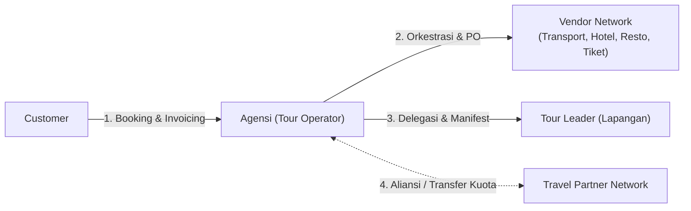
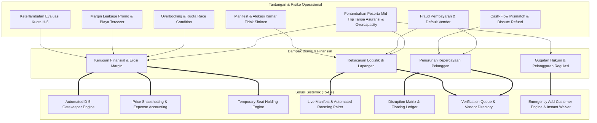
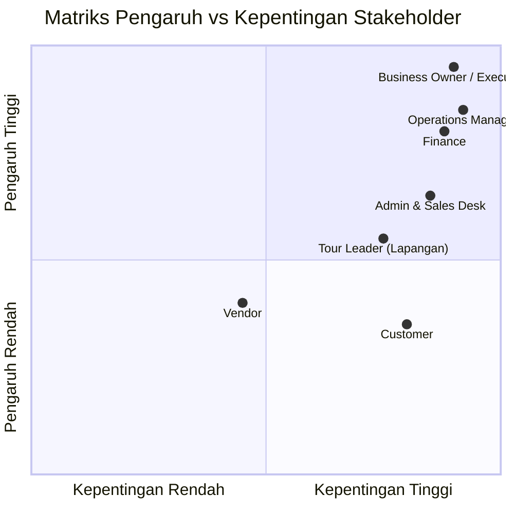

# 01 — Business Analysis & Strategic Discovery

## Document Information

| Item | Detail |
| :--- | :--- |
| **Document ID** | BA-01 |
| **Document Title** | Business Analysis & Strategic Discovery |
| **Product Name** | Travel & Tour Operations System (TMS) |
| **Document Type** | Business Analysis |
| **Phase / Milestone** | Entire Product / Foundation |
| **Document Version** | 1.2 |
| **Document Status** | Approved |
| **Implementation Status** | N/A |
| **Last Updated** | 2026-09-08 |
| **Author / Owner** | Product & Operations Team |

---

## 1. Executive Summary & Konteks Industri

Sektor industri perjalanan dan pariwisata (*travel & leisure*) di segmen penyelenggara wisata berkelompok (*group tours*) sangat bergantung pada ketepatan orkestrasi sumber daya, kepastian kuota, dan integritas data finansial. 

Organisasi beroperasi sebagai **Tour Operator / Orchestrator** yang merancang, mengemas (*packaging*), dan menyelenggarakan perjalanan wisata secara *end-to-end*. Peran ini membedakan organisasi dari sekadar agen tiket (*ticketing agent*); agensi bertanggung jawab langsung atas kualitas pengalaman perjalanan peserta mulai dari fase pra-perjalanan, pelaksanaan lapangan, hingga pasca-perjalanan.



---

## 2. Model Bisnis & Value Proposition

### 2.1 Lini Produk Utama
Organisasi melayani dua lini produk perjalanan wisata:

1. **Open Tour (Public Scheduled Groups):**
   - Perjalanan wisata publik berbasis kuota gabungan dari berbagai individu/keluarga independen.
   - Menggunakan jadwal berulang (*recurring schedules*) dengan struktur biaya terstandarisasi.
   - Sangat bergantung pada ambang batas kuota minimum peserta agar mencapai *Break-Even Point (BEP)*.
2. **Private / Custom Tour (B2B & Exclusive Groups):**
   - Perjalanan wisata privat untuk rombongan khusus (korporat, komunitas, keluarga besar).
   - Memerlukan fleksibilitas penyusunan penawaran (*quotation*), kustomisasi fasilitas (*Bill of Materials*), dan negosiasi harga sebelum jadwal dikunci.

### 2.2 Proposisi Nilai (*Value Proposition*)
- **Bagi Customer dan Traveler:** Customer memperoleh kepastian jadwal, transparansi fasilitas, dan perlindungan harga (*price locking*); setiap Traveler memperoleh jaminan resolusi jika terjadi disrupsi atau kuota tidak terpenuhi.
- **Bagi Mitra Vendor (*Vendors*):** Kepastian *demand*, penerbitan *Purchase Order (PO)* resmi, dan kejelasan jadwal pembayaran.
- **Bagi Manajemen Agensi (*Internal*):** Perlindungan margin keuntungan dari kebocoran diskon, otomatisasi mitigasi risiko kuota H-5, dan laporan keuangan per trip yang akurat.

---

## 3. Analisis Masalah & Risiko Bisnis (*Problem & Risk Analysis*)

Operasional agensi menghadapi tantangan ganda: inefisiensi proses manual saat ini (*As-Is*) dan potensi risiko skalabilitas di masa depan (*Potential Scaling Risks*). Sistem dirancang untuk menyelesaikan kedua ranah ini secara menyeluruh:



### Matriks Analisis Masalah & Mitigasi Risiko

| Ranah Analisis | Kondisi Masalah / Skenario Risiko | Dampak Bisnis / Finansial | Solusi Sistemik (*To-Be*) |
|---|---|---|---|
| **Evaluasi Kuota Keberangkatan** | Pengecekan jumlah peserta manual menjelang trip; sering terlewat saat *peak season*. | Kerugian finansial (DP vendor hangus jika terlambat batal) atau komplain massal jika pembatalan mendadak. | **Automated D-5 Gatekeeper**: Sistem otomatis mengunci evaluasi kuota peserta terverifikasi pada H-5 00:00 WIB dan mengarahkan ke meja keputusan. |
| **Penerapan Promo & Diskon** | Diskon dipotong manual oleh sales; fasilitas cuma-cuma (*free meals/merch*) tidak tercatat biayanya. | Kebocoran margin (*margin leakage*) dan beban biaya *perks* membebani pos operasional trip secara tidak wajar. | **Promo Overlay & Expense Accounting**: Diskon moneter dibatasi kuota/aturan, sedangkan biaya *complimentary perks* otomatis dialokasikan ke pos *Marketing Expense*. |
| **Integritas Harga Booking** | Perubahan harga paket di katalog di tengah transaksi booking yang belum lunas. | Perselisihan harga dengan pelanggan (*price dispute*) dan ketidakpercayaan terhadap kredibilitas agensi. | **Price Snapshotting Engine**: Harga transaksi dikunci permanen (*immutable snapshot*) begitu DP terverifikasi. |
| **Kapasitas & Alokasi Kursi (*Race Condition*)** | Beberapa staf sales membuat pesanan bersamaan untuk sisa 1-2 kursi terakhir pada *peak season*. | *Overbooking* melebihi kapasitas armada/hotel, memaksa pembatalan sepihak yang merusak reputasi. | **Temporary Seat Locking & Quota Hold**: Penguncian kursi sementara (*hold*) selama batas waktu pembayaran DP (misal: 2 jam) sebelum dilepas kembali. |
| **Alokasi Manifest & Kamar Hotel** | Rekap manual via WhatsApp; *solo traveler* ganjil menolak sekamar dengan lawan jenis atau menolak *single supplement fee*. | Bentrok pembagian kamar saat check-in hotel, fasilitas alergi makanan peserta terlewat di resto. | **Live Field Manifest & Rooming Pairer**: *Tour Leader* mengakses manifest real-time dengan penanda *Perk Badge* dan deteksi gender kamar sejak pendaftaran. |
| **Siklus Refund & Likuiditas Kas** | Peserta menuntut *Full Refund* seketika (H-5), sementara dana agensi masih terikat sebagai DP di vendor pihak ketiga. | Defisit likuiditas kas operasional (*cash-flow mismatch / floating fund gap*). | **Disruption Matrix & Floating Refund Queue**: 4 jalur resolusi terstruktur dengan antrean pencairan dana yang selaras dengan penarikan dana vendor. |
| **Verifikasi Pembayaran & Fraud** | Lonjakan transaksi membuat verifikasi mutasi manual rentan disusupi bukti transfer palsu. | Peserta fiktif masuk ke manifest resmi, mengunci kuota tanpa ada dana riil yang masuk. | **Verification Queue & Bank Mutation Log**: Antrean verifikasi terstruktur dengan pencatatan mutasi resmi sebelum status *Confirmed* dirilis. |
| **Keandalan Vendor & Force Majeure** | Vendor armada mogok di jalan, atau penutupan destinasi wisata mendadak akibat erupsi/cuaca buruk. | Trip terlantar di lapangan, tuntutan kompensasi biaya tiket yang tidak terpakai dari peserta. | **Field Incident Logger & Vendor Backup Directory**: Pencatatan insiden lapangan secara digital oleh *Tour Leader* untuk dasar rekonsiliasi dan direktori kontak vendor cadangan. |
| **Penambahan Peserta Mid-Trip (*Late Joiner*)** | Peserta menyusul di tengah perjalanan tanpa asuransi resmi, kapasitas kursi/kamar terlampaui, tiket destinasi habis, atau transaksi kas ilegal di lapangan. | Tuntutan hukum dan tanggung jawab penuh jika kecelakaan tanpa asuransi (*liability*), denda razia manifest transportasi KSOP, kerugian selisih harga kamar *walk-in*, dan kebocoran pendapatan kas (*field fraud*). | **Emergency Add-Customer Engine & Instant Waiver**: Validasi kapasitas kursi & kamar real-time, penerbitan invoice & e-sign waiver instan via sistem, pengikatan asuransi digital otomatis, dan pelarangan transaksi kas di lapangan. |

---

## 4. Struktur Biaya & Analisis Titik Impas (*Cost Structure & BEP*)

Model profitabilitas agensi pada sebuah keberangkatan tour (*Departure*) ditentukan oleh relasi antara **Biaya Tetap (*Fixed Costs*)** dan **Biaya Variabel (*Variable Costs*)**:

```text
Total Biaya Trip = Biaya Tetap (Armada + TL + Tol) + [Biaya Variabel per Pax × Jumlah Peserta Aktif]
Total Pendapatan = Harga Jual Paket Netto × Jumlah Peserta Aktif
Profit Trip      = Total Pendapatan - Total Biaya Trip - Alokasi Beban Diskon
```

### 4.1 Komponen Biaya Tetap (*Fixed Costs*)
Biaya yang nilainya tidak berubah berapapun jumlah peserta yang ikut dalam satu armada:
- Sewa bus/shuttle per unit.
- Honor (*fee*) harian Tour Leader dan akomodasi/konsumsi kru lapangan.
- Biaya operasional armada (bahan bakar, tol, parkir, retribusi rute).

> [!IMPORTANT]
> **Rasionalisasi Kuota Minimum ($N \ge 20$ Pax):**
> Keberadaan Biaya Tetap armada bus mewajibkan adanya batas kuota minimum 20 peserta aktif berbayar. Jika peserta $< 20$, margin penjualan tidak dapat menutup sewa armada tanpa agensi menanggung kerugian operasional (*negative margin*).

### 4.2 Komponen Biaya Variabel (*Variable Costs*)
Biaya yang muncul dan dihitung secara linear berdasarkan jumlah kepala peserta (*per pax*):
- Tiket masuk destinasi dan objek wisata.
- Konsumsi (*meals*) di restoran mitra.
- Alokasi tempat tidur hotel (*twin-sharing/triple-sharing*).
- Asuransi perjalanan dan *amenities/merchandise kit*.

---

### 4.3 Asumsi BEP dan Guardrails Finansial

- Nilai 20 pax adalah parameter per departure, bukan konstanta global. Setiap departure menyimpan `minQuota`, `maxQuota`, kapasitas per armada, mata uang, dan target margin.
- BEP dihitung dari biaya aktual atau terkomit, termasuk PO, biaya payment gateway, pajak, komisi, promo, subsidi, refund, dan biaya vendor yang tidak dapat dikembalikan.
- Formula dasar: `BEP Pax = Biaya Tetap / (Harga Jual Bersih per Pax - Biaya Variabel per Pax)`.
- Laporan membedakan gross revenue, net revenue, contribution margin, net profit, cash collected, dan outstanding receivable.
- Target 0% margin leakage adalah target kontrol; pengecualian wajib tercatat dengan alasan, approver, dan dampak finansial.

### 4.4 Perbedaan Operating Model

| Aspek | Open Tour | Private / Custom Tour |
|---|---|---|
| Demand | Kuota publik dan recurring departure | Inquiry, quotation, dan kontrak grup |
| Harga | Harga katalog dan promo terkontrol | Harga negosiasi dengan margin minimum |
| Konfirmasi | H-5 quota gate | Customer approval dan deposit kontrak |
| Scope | BOM standar | BOM/itinerary kustom dan change order |
| Pembatalan | Policy produk standar | Klausul kontrak dan biaya vendor aktual |

### 4.5 Operational Milestones dan KPI Governance

- H-30: review kapasitas, vendor, dan estimasi margin.
- H-14: review demand, cash collected, dan risiko pembatalan.
- H-7: review pelunasan, vendor readiness, dan exception list.
- H-5: quota decision gate dan komunikasi resolusi kepada pelanggan.
- H-3/H-1: finalisasi vendor, manifest, dokumen, dan emergency contact.
- H+1 sampai H+2: rekonsiliasi pendapatan, biaya, refund, dan margin.
- H+7: vendor settlement dan trip closure.

Setiap KPI wajib memiliki baseline, formula, sumber data, frekuensi, owner, target, dan toleransi pengecualian. KPI minimum: conversion rate, load factor, revenue per pax, contribution margin, refund turnaround, vendor fulfillment, complaint rate, repeat booking, dan payment verification time.

### 4.6 MVP dan Roadmap

- **MVP:** package/departure, booking/traveler, quota hold, invoice, payment verification, manifest, vendor PO, H-5 decision, basic refund, RBAC, dan audit trail.
- **Phase 2:** vendor scoring, partner transfer, rooming automation, advanced ledger, dan customer self-service disruption.
- **Phase 3:** late-joiner automation, instant insurance, payment/bank integrations, forecasting, dan pricing recommendations.
- Untuk MVP, late joiner ditolak secara default. Exception wajib disetujui Operations dan Finance; traveler hanya boleh masuk manifest setelah pembayaran, waiver, asuransi, dan kapasitas tervalidasi. Automated late-joiner pricing, instant insurance, live vendor synchronization, dan automatic PO revision adalah kapabilitas Phase 3.

---

## 5. Analisis Pemangku Kepentingan (*Stakeholder Analysis*)



### Rincian Peran dan Ekspektasi Stakeholder:

1. **Business Owner / Executive:**
   - **Tujuan:** Menjaga kelangsungan bisnis, profitabilitas bersih per trip, dan reputasi merek.
   - **Kewenangan Utama:** Pengambil keputusan akhir untuk pembatalan trip kuota H-5, persetujuan alokasi subsidi *Free Waiver*, dan penanganan *force majeure*.
2. **Operations Manager:**
   - **Tujuan:** Memastikan ketersediaan armada, akomodasi, dan penugasan *Tour Leader* berjalan mulus tanpa kendala logistik.
   - **Kewenangan Utama:** Mengatur master cetak biru paket (*BOM*), mengonfigurasi aturan jadwal berulang (*recurrence*), dan menerbitkan PO vendor.
3. **Finance:**
   - **Tujuan:** Akurasi penerimaan kas, pencegahan transaksi bodong, pembayaran tagihan vendor tepat waktu, dan kejelasan laporan laba-rugi trip.
   - **Kewenangan Utama:** Verifikasi bukti transfer DP/pelunasan, pemrosesan *refund*, dan *financial closing* keberangkatan.
4. **Sales / Admin Desk:**
   - **Tujuan:** Mempercepat konversi *leads* menjadi *booking*, kemudahan menerbitkan tagihan/invoice, dan fleksibilitas melayani pelanggan.
   - **Kewenangan Utama:** Membuat draf pemesanan, menerapkan kode promo yang valid, dan mengoordinasikan pengisian formulir registrasi peserta.
5. **Tour Leader (Field Coordinator):**
   - **Tujuan:** Kemudahan memverifikasi peserta di titik kumpul (*pick-up points*), mengetahui preferensi khusus, dan melaporkan insiden darurat secara cepat.
   - **Kewenangan Utama:** Memvalidasi manifest kehadiran dan mencatat pengecualian fasilitas di lapangan.
6. **Customer:**
   - **Peran:** Pemesan komersial yang memegang kewajiban pembayaran untuk booking.
   - **Tujuan:** Mendapatkan kepastian liburan yang aman, harga yang transparan tanpa biaya tersembunyi, dan kepastian penyelesaian jika trip terkendala.
7. **Vendor (Transport, Hotel, Resto, Tiket):**
   - **Tujuan:** Kepastian jadwal pemesanan, akurasi jumlah peserta (*rooming/pax list*), dan kelancaran pembayaran.

---

## 6. Sasaran Strategis & Metrik Keberhasilan Bisnis (*KPIs / OKRs*)

Implementasi sistem ini ditargetkan mencapai metrik keberhasilan bisnis sebagai berikut:

| Sasaran Strategis | Metrik Keberhasilan (KPI) | Target Pasca-Implementasi |
|---|---|---|
| **Pencegahan Margin Leakage** | Selisih harga jual faktual vs harga master akibat promo liar. | **0% kebocoran margin** (seluruh diskon terkunci via guardrails sistem). |
| **Mitigasi Kerugian Kuota H-5** | Waktu eksekusi keputusan saat peserta tidak mencapai kuota minimum. | **100% diputuskan tepat pada H-5** (tidak ada lagi kerugian akibat keterlambatan pembatalan ke vendor). |
| **Efisiensi Penerbitan Dokumen** | Durasi pembuatan Invoice, PO Vendor, dan Manifest Keberangkatan. | **Reduksi waktu $> 80\%$** melalui otomatisasi *template generator*. |
| **Kecepatan Rekonsiliasi Finansial** | Durasi *closing* laporan laba-rugi pasca-trip selesai. | **Maksimal 2x24 jam** setelah trip dinyatakan *Closed*. |
| **Kepuasan Pelanggan saat Disrupsi** | Durasi penanganan opsi resolusi (Reschedule/Transfer/Refund) saat trip dibatalkan. | **Selesai dalam $< 24$ jam** dengan rekam jejak audit yang transparan. |
