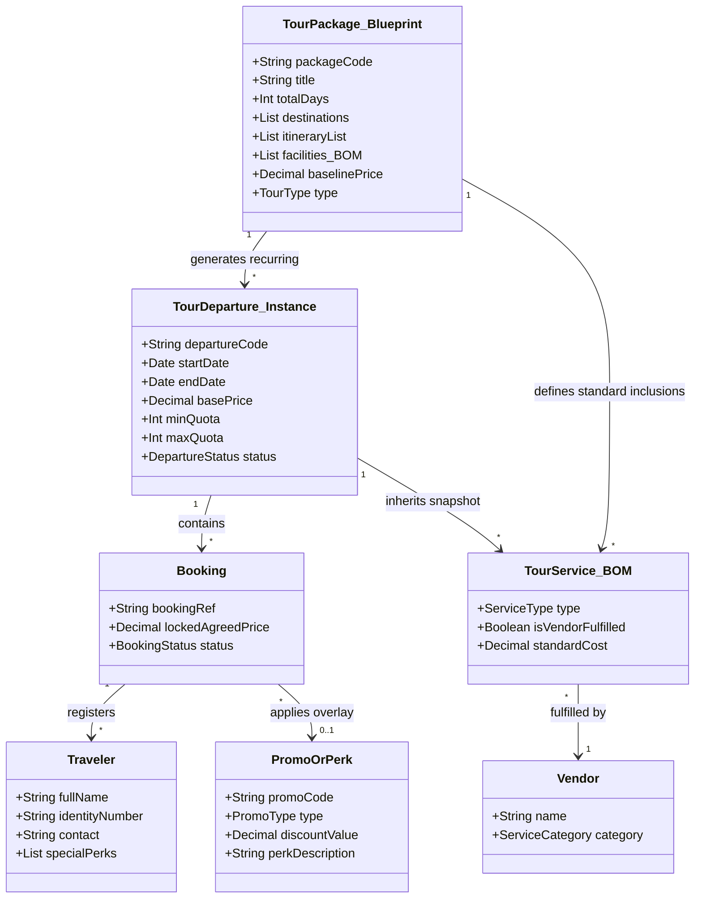
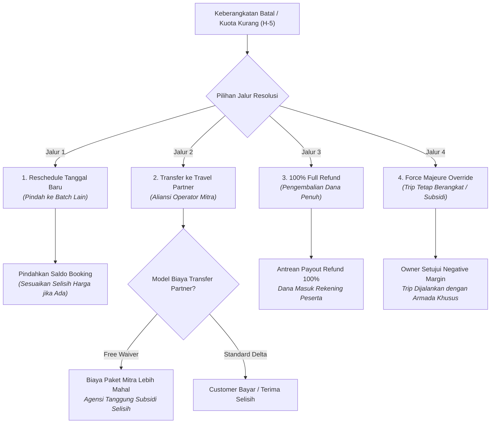

# 02 — Business Requirements Document (BRD)

## Document Information

| Item | Detail |
| :--- | :--- |
| **Document ID** | BRD-01 |
| **Document Title** | Business Requirements Document (BRD) |
| **Product Name** | Travel & Tour Operations System (TMS) |
| **Document Type** | Business Requirements Document |
| **Phase / Milestone** | Entire Product / Foundation |
| **Document Version** | 1.0 |
| **Document Status** | Draft |
| **Implementation Status** | N/A |
| **Last Updated** | 2026-08-28 |
| **Author / Owner** | Product & Operations Team |

---

## 1. Konteks Bisnis & Objektif Sistem

Dokumen Business Requirements Document (BRD) ini mendefinisikan spesifikasi kebutuhan bisnis, batasan domain, taksonomi aktor, dan seluruh aturan bisnis (*business rules*) formal yang mengatur operasional **Travel & Tour Operations System (TMS)** secara menyeluruh.

### 1.1 Peran Agensi sebagai Tour Orchestrator
Organisasi bertindak sebagai **Tour Operator / Orchestrator** yang bertanggung jawab mengorkestrasi perjalanan wisata secara terpadu (*end-to-end*):
- Merencanakan, mengemas (*packaging*), dan menjadwalkan tour (*Open Tour* berbasis kuota publik maupun *Private Tour* kustom).
- Mengelola *booking pipeline*, identitas *traveler*, dan penerbitan invoice pelanggan.
- Mengunci harga transaksi melalui mekanisme *price snapshotting*.
- Menerbitkan reservasi dan *Purchase Order (PO)* kepada jaringan vendor (*transportasi, hotel, resto, tiket wisata*).
- Mengevaluasi ambang batas kuota minimum keberangkatan secara otomatis pada **H-5 / D-5**.
- Mengelola meja resolusi disrupsi (*reschedule, partner transfer, full refund, override*).
- Menyediakan manifest digital interaktif untuk pemandu lapangan (*Tour Leader*).
- Menjalankan rekonsiliasi dan *financial closing* laba-rugi per keberangkatan.

---

## 2. Konsep Inti Domain Model

Domain bisnis dibangun di atas arsitektur data yang memisahkan cetak biru master paket dari eksekusi tanggal keberangkatannya:



### 2.1 Entitas Domain Utama
1. **Tour Package (Master Blueprint):** Cetak biru paket wisata yang mendefinisikan durasi hari, *itinerary*, destinasi, dan daftar fasilitas baku (*Bill of Materials / BOM*) beserta *baseline price*. Bersifat *reusable* dan stabil.
2. **Tour Departure (Decoupled Instance):** Eksekusi kalender spesifik dari suatu *Tour Package* pada tanggal tertentu. Memiliki siklus status mandiri (*Tentative* -> *Published_Fixed*), kuota kursi, alokasi *Tour Leader*, reservasi vendor, dan harga dasar yang terkunci mutlak (*immutable*) saat dirilis.
3. **Booking & Price Snapshot:** Kontrak reservasi komersial pelanggan yang mengunci harga total transaksi pada saat pembayaran DP terkonfirmasi (*Price Snapshot*), kebal terhadap fluktuasi harga di masa depan.
4. **Promo & Perks Overlay:** Lapisan modifikasi transaksi (diskon moneter % / nominal flat atau fasilitas cuma-cuma seperti *free meals/merchandise*) yang diterapkan di atas transaksi tanpa mengubah *base price* master paket.
5. **Traveler / Participant:** Individu peserta tour yang tercatat dalam manifest keberangkatan beserta hak fasilitas standar maupun fasilitas promo khusus (*Perk Badges*).
6. **Tour Leader:** Koordinator lapangan yang memimpin perjalanan, memvalidasi kehadiran, memverifikasi hak fasilitas peserta, dan mencatat insiden.
7. **Vendor & Travel Partner:** Pihak ketiga penyedia layanan operasional atau mitra operator luar untuk transfer peserta.

---

## 3. Taksonomi Aktor & Matriks Hak Akses (RBAC)

Sistem berinteraksi dengan 8 persona (7 aktor manusia dan 1 engine otomasi sistem):

| No | Aktor | Tanggung Jawab Utama | Lingkup Wewenang Sistem |
|---|---|---|---|
| 1 | **Customer / Lead Booker** | Mengajukan inquiry, mengisi formulir registrasi peserta, mengklaim promo, membayar tagihan DP & pelunasan, mengajukan resolusi/pembatalan jika berhalangan. | Akses publik / portal tamu (Read info paket, Create booking draft, Upload bukti bayar). |
| 2 | **Admin / Sales Desk** | Melayani inquiry pelanggan, membuat draf pesanan, mengaplikasikan kode promo valid, menerbitkan invoice, dan melayani meja resolusi disrupsi. | Create/Update Booking, Apply Promo, Trigger Invoice, Request Disruption Action. |
| 3 | **Finance & Settlement** | Memverifikasi pembayaran kas masuk (DP & pelunasan), memproses pencairan *refund*, membayar tagihan vendor (PO), dan menyusun laporan laba-rugi trip. | Approve Payment, Execute Payout/Refund, Record Expense Allocation, Financial Closing. |
| 4 | **Operations Manager** | Merancang master paket wisata (BOM), mengatur mesin rekurensi jadwal, menugaskan Tour Leader, dan menerbitkan PO/Voucher layanan vendor. | Create/Update Master Blueprint, Configure Recurrence, Assign TL, Issue Vendor PO. |
| 5 | **Tour Leader (Field)** | Mengakses manifest digital lapangan secara langsung, memverifikasi kehadiran peserta, memvalidasi hak fasilitas/perks, dan mencatat insiden. | Read Field Manifest, Check-in Attendees, View Perk Badges, Log Field Incidents. |
| 6 | **Business Owner / Executive** | Memantau kesehatan bisnis, memberikan persetujuan pembatalan trip kuota H-5, menyetujui subsidi *Free Waiver*, dan otorisasi kebijakan darurat. | Executive Dashboard, Approve D-5 Cancellation/Partner Transfer, Authorize Discretionary Override. |
| 7 | **Vendor & Travel Partner** | Menerima PO dan voucher pemesanan layanan, menyediakan fasilitas trip, atau menerima pelimpahan peserta dari agensi. | External Service Fulfillment, Invoice Claim. |
| 8 | **System Automation Engine** | Mengeksekusi pembuatan jadwal berulang, penguncian harga rilis, evaluasi kuota H-5 tepat waktu, dan kalkulasi tagihan/snapshot otomatis. | Background Cron, Recurrence Generator, D-5 Quota Evaluator, Price Snapshotter. |

---

## 4. Master Aturan Bisnis (Core Business Rules)

### 4.1 Penjadwalan & Penguncian Harga (*Price Immutability*)
- **Rule 4.1.1 (Recurrence Schedule Generation):** Sistem dapat men-generate jadwal keberangkatan (*Tour Departure*) secara otomatis melalui *Flexible Recurrence Engine* (pola mingguan, bulanan, atau interval kustom) maupun pembuatan manual *on-demand*.
- **Rule 4.1.2 (Tentative State Adjustments):** Jadwal yang baru terbentuk berstatus `TENTATIVE`. Staf Operasional/Admin berhak menggeser tanggal, mengubah kuota, atau menyesuaikan baseline harga sebelum dirilis.
- **Rule 4.1.3 (Price Immutability on Published):** Begitu status keberangkatan diubah menjadi `PUBLISHED_FIXED`, jadwal dan harga dasar (*base price*) terkunci mutlak (*immutable*). Perubahan pada master paket tidak boleh mengubah harga *Tour Departure* yang telah dirilis.

### 4.2 Pemesanan, DP, & Price Snapshotting
- **Rule 4.2.1 (Down Payment Requirement):** Reservasi baru berstatus `DRAFT_PENDING_DP`. Kursi peserta belum dihitung ke dalam kuota resmi keberangkatan sebelum DP diverifikasi oleh Finance.
- **Rule 4.2.2 (Temporary Quota Hold):** Sistem mengunci alokasi kursi sementara selama durasi batas waktu pembayaran (*invoice expiry time*, default: 2 jam). Jika melewati batas waktu tanpa bukti bayar, draf booking kedaluwarsa otomatis.
- **Rule 4.2.3 (Price Snapshotting on Confirmed):** Saat bukti bayar DP diverifikasi oleh Finance:
  - Status booking berubah menjadi `CONFIRMED`.
  - Sistem mengunci total nominal transaksi (*Price Snapshot*) ke dalam dokumen kontrak booking. Fluktuasi harga katalog di kemudian hari tidak berpengaruh pada tagihan booking tersebut.
  - Data seluruh peserta resmi masuk ke dalam **Manifest Keberangkatan** dan dihitung ke dalam kuota minimum aktif.

### 4.3 Promo & Complimentary Perks Engine
- **Rule 4.3.1 (Monetary Discount):** Diskon moneter (persentase % atau potongan nominal flat) diterapkan sebagai pengurang langsung pada total tagihan invoice pelanggan.
- **Rule 4.3.2 (Complimentary Facility Perks):** Fasilitas tambahan gratis (misal: *Free Extra Meals +1x*, *Merchandise Upgrade*, *Free Document Service*) tidak memotong nominal invoice pelanggan, melainkan:
  - Menambahkan penanda (*Perk Badge*) pada profil peserta di Manifest Keberangkatan.
  - Nilai biaya fasilitas tersebut dicatat otomatis sebagai beban pemasaran (*Marketing Expense Allocation*), terpisah dari biaya operasional murni trip.
- **Rule 4.3.3 (Promo Guardrails):** Kode promo tunduk pada validasi ketat sistem: batas kuota penggunaan, masa berlaku tanggal booking, batasan tipe paket, dan larangan penggabungan promo bertingkat (*non-stackable rule*) kecuali diizinkan secara eksplisit.

### 4.4 Evaluasi Kuota Minimum H-5 (D-5 Milestone Gate)
- **Rule 4.4.1 (D-5 Automatic Trigger):** Sistem wajib memicu evaluasi kuota secara otomatis tepat pada **H-5 kalender sebelum tanggal keberangkatan (pukul 00:00 WIB)**.
- **Rule 4.4.2 (Quota Threshold):** Sistem menghitung total peserta aktif terverifikasi ($N$).
  - **Kondisi Terpenuhi ($N \ge 20$ Pax):** Status keberangkatan berubah menjadi `CONFIRMED_DEPARTURE`. Sistem mengarahkan tim Operasional untuk menerbitkan PO final ke vendor dan menugaskan Tour Leader.
  - **Kondisi Tidak Terpenuhi ($N < 20$ Pax):** Status keberangkatan berubah menjadi `WAITING_OWNER_ACTION`. Sistem membekukan penjualan baru dan mengarahkan keberangkatan ke **Meja Resolusi Disrupsi**.

### 4.5 Matriks Resolusi Disrupsi & Akuntansi Subsidi
Jika keberangkatan tidak memenuhi kuota minimum atau dibatalkan oleh agensi pada H-5, Owner/Executive memilih satu dari 4 jalur resolusi resmi:



#### Aturan Finansial pada Jalur Disrupsi:
1. **Jalur 1 — Reschedule (Ganti Tanggal/Batch Lain):**
   - Dana DP/pembayaran yang telah masuk dipindahkan 100% ke booking jadwal baru.
   - Jika harga paket batch baru berbeda, selisih harga ditagihkan/dikembalikan sesuai aturan paket.
2. **Jalur 2 — Transfer ke Travel Partner (Aliansi Operator Luar):**
   - Agensi melimpahkan peserta ke mitra travel yang memiliki jadwal dan rute identik.
   - **Opsi Free Waiver (Customer Goodwill):** Jika harga mitra lebih mahal, agensi menyerap dan menanggung selisih biaya tersebut sebagai biaya penjaminan kepuasan pelanggan (*Goodwill Subsidy*). Pelanggan tidak dikenakan biaya tambahan.
   - **Opsi Standard Price Delta:** Selisih harga antara paket agensi dan paket mitra diperhitungkan secara transparan kepada pelanggan.
3. **Jalur 3 — 100% Full Refund (Pengembalian Dana Penuh):**
   - Seluruh dana pembayaran pelanggan (DP + pelunasan) dikembalikan 100% tanpa potongan administrasi apapun.
   - Payout refund dicatat dalam antrean pencairan dana Finance.
4. **Jalur 4 — Force Majeure & Executive Override:**
   - Owner dapat memutuskan trip tetap berangkat meskipun rugi (*negative margin*) menggunakan penyesuaian armada (misal: beralih dari bus besar ke minibus/shuttle) dengan otorisasi tertulis pada log audit sistem.

### 4.6 Kebijakan Pembatalan Mandiri oleh Peserta (Individual Cancellation)
Jika peserta membatalkan keikutsertaan secara sepihak sebelum keberangkatan:
- **Kebijakan Default (*Strict No-Refund*):** Seluruh dana pembayaran hangus (Rp 0 refund) dan kursi dikembalikan ke kuota kosong.
- **Kebijakan S&K Bertingkat (*Tiered Refund Terms*):** Jika paket memiliki klausul pengembalian bertingkat berdasarkan waktu pembatalan:
  $$\text{Hak Refund} = (\text{Total Pembayaran} \times \% \text{Refund S\&K}) - \text{Biaya Operasional Nyata}$$
- **Kebijakan Otorisasi Khusus (*Discretionary Override*):** Admin/Owner berwenang memasukkan nominal refund khusus atas pertimbangan kemanusiaan (*force majeure individu*) dengan mencantumkan alasan wajib pada log audit.

---

## 5. End-to-End Business Flow & BPMN Swimlane

Alur proses bisnis operasional dirangkai secara berurutan dalam diagram swimlane To-Be:

```mermaid
flowchart TD
    subgraph Operational["Operational & Tour Planning"]
        O1[Buat Master Package Blueprint & BOM] --> O2[Set Recurrence Schedule: Mingguan/Bulanan]
        O2 --> O3[Penugasan Tour Leader]
        O3 --> O4[Terbitkan PO & Service Voucher Vendor]
        O4 --> O5[Rilis Final Manifest ke TL]
        O5 --> O6[Tour Leader Pimpin Trip & Validasi Fasilitas]
    end

    subgraph System["System Automation Engines"]
        S1[Generate Draf Departure: TENTATIVE] --> S2[Publish Fixed: Lock Base Price]
        S2 --> S3[Price Snapshotting on DP Verified]
        S3 --> S4[Cron Trigger Evaluasi H-5 00:00 WIB]
        S4 --> S5{Evaluasi Kuota >= 20?}
        S5 -->|Ya| S6[Set Departure: CONFIRMED]
        S5 -->|Tidak| S7[Set Departure: WAITING OWNER ACTION]
    end

    subgraph Sales["Admin & Sales Desk"]
        A1[Pre-Publish Adjustment: Cek Tanggal/Kuota] --> A2[Publish Jadwal ke Publik]
        A2 --> A3[Buat Booking & Terapkan Promo/Perks]
        A3 --> A4[Terbitkan Invoice DP & Pelunasan]
        A4 --> A5{Penanganan Disrupsi H-5}
    end

    subgraph Customer["Customer / Traveler"]
        C1[Inquiry & Pilih Paket] --> C2[Isi Form Registrasi & Kode Promo]
        C2 --> C3[Bayar DP & Upload Struk]
        C3 --> C4[Bayar Pelunasan Sebelum H-5]
        C4 --> C5[Pelaksanaan Trip & Nikmati Fasilitas]
    end

    subgraph Finance["Finance & Settlement"]
        F1[Verifikasi Pembayaran DP & Pelunasan]
        F2[Pembayaran PO Tagihan Vendor]
        F3[Eksekusi Payout Refund / Subsidi]
        F4[Financial Closing Laba-Rugi Per Trip]
    end

    O1 --> S1 --> A1 --> A2 --> C1 --> C2 --> A3 --> A4 --> C3 --> F1 --> S3
    S3 --> C4 --> F1 --> S4
    S6 --> O3
    S7 --> A5
    A5 --> F3
    O6 --> F2 --> F4
```



---

## 6. Dekomposisi Modul Tingkat Tinggi

Sistem terdiri dari 10 modul fungsional terintegrasi:

```text
TRAVEL & TOUR OPERATIONS SYSTEM (TMS)
├── 01. Dashboard & Executive Analytics Module
├── 02. Tour Catalog & Blueprint Master Module (BOM, Baseline Pricing)
├── 03. Tour Operations & Departure Module (Recurrence, D-5 Engine, Manifest)
├── 04. Booking & Sales Pipeline Module (Price Snapshotting, Traveler Vault)
├── 05. Promo & Perks Overlay Engine (Monetary Discount, Complimentary Badges)
├── 06. Finance, Billing & Settlement Module (Invoicing, Refund Queue, Ledger)
├── 07. Vendor & Procurement Module (Master Directory, PO & Voucher Generator)
├── 08. Tour Leader Field Module (Live Manifest, Check-in, Perk Validator)
├── 09. Document Management & Template Vault (Invoice, PO, Voucher, Manifest)
└── 10. Access Control, Security & Audit Trail (RBAC, Override Logger)
```

---

## 7. Batasan Sistem & Asumsi Kunci (*Assumptions & Constraints*)

1. **Tour Departure sebagai Pusat Data (*Single Source of Truth*):** Seluruh dokumen keuangan, pesanan pelanggan, manifes peserta, dan penugasan vendor bermuara pada entitas spesifik *Tour Departure*.
2. **Keterikatan Harga Transaksi:** Sekali booking berstatus `CONFIRMED`, sistem dilarang keras mengubah nilai tagihan tanpa tindakan amandemen/pembatalan resmi.
3. **Pemberangkatan Tunggal vs Multi-Armada:** Standar kuota 20 pax dihitung untuk 1 unit bus medium/besar. Keberangkatan dengan $>40$ peserta akan memicu alokasi armada bus kedua (*Multi-Bus Batching*).
