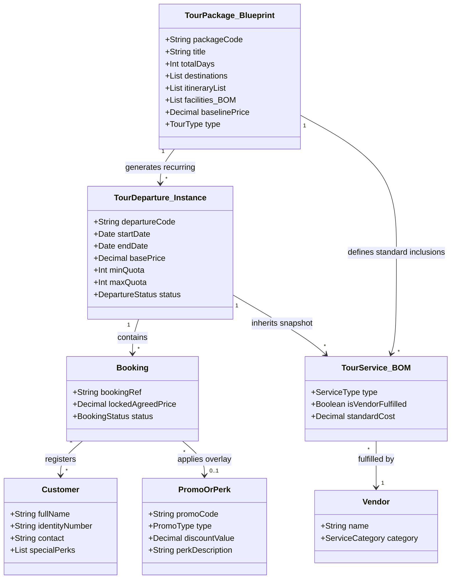
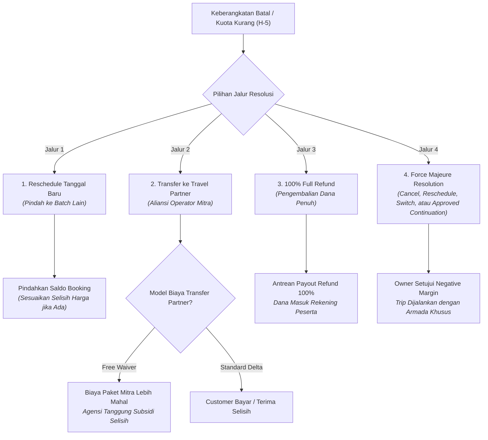
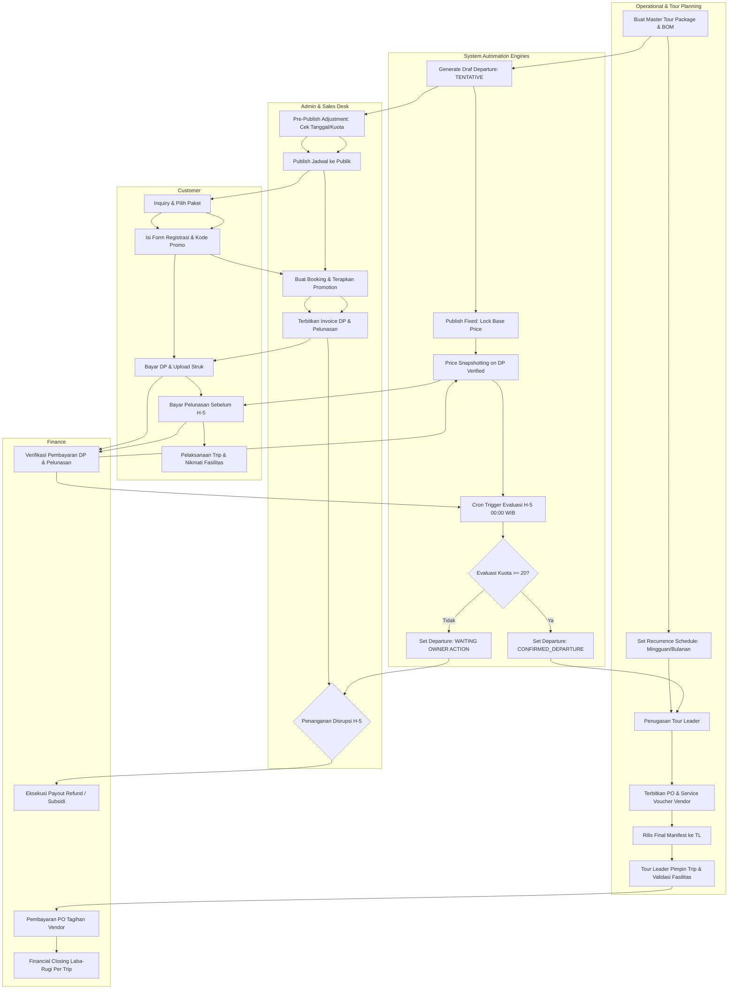

# 02 — Business Requirements Document (BRD)

## Document Information

| Item | Detail |
| :--- | :--- |
| **Document ID** | BRD-01 |
| **Document Title** | Business Requirements Document (BRD) |
| **Product Name** | Travel & Tour Operations System (TMS) |
| **Document Type** | Business Requirements Document |
| **Phase / Milestone** | Entire Product / Foundation |
| **Document Version** | 1.2 |
| **Document Status** | In Review |
| **Implementation Status** | N/A |
| **Last Updated** | 2026-09-01 |
| **Author / Owner** | Product & Operations Team |

---

## 1. Konteks Bisnis & Objektif Sistem

Dokumen Business Requirements Document (BRD) ini mendefinisikan spesifikasi kebutuhan bisnis, batasan domain, taksonomi aktor, dan seluruh aturan bisnis (*business rules*) formal yang mengatur operasional **Travel & Tour Operations System (TMS)** secara menyeluruh.

### 1.1 Peran Agensi sebagai Tour Orchestrator
Organisasi bertindak sebagai **Tour Operator / Orchestrator** yang bertanggung jawab mengorkestrasi perjalanan wisata secara terpadu (*end-to-end*):
- Merencanakan, mengemas (*packaging*), dan menjadwalkan tour (*Open Tour* berbasis kuota publik maupun *Private Tour* kustom).
- Mengelola *booking pipeline*, identitas *traveler*, dan penerbitan invoice pelanggan.
- Mengunci harga transaksi melalui mekanisme *price snapshotting*.
- Menerbitkan reservasi dan *Purchase Order (PO)* kepada jaringan vendor (*transportasi, hotel, resto, tiket wisata*).
- Mengevaluasi ambang batas kuota minimum keberangkatan secara otomatis pada **H-5 / D-5**.
- Mengelola meja resolusi disrupsi (*reschedule, partner transfer, full refund, override*).
- Menyediakan manifest digital interaktif untuk pemandu lapangan (*Tour Leader*).
- Menjalankan rekonsiliasi dan *financial closing* laba-rugi per keberangkatan.

---

## 2. Konsep Inti Domain Model

Domain bisnis dibangun di atas arsitektur data yang memisahkan cetak biru master paket dari eksekusi tanggal keberangkatannya:



### 2.1 Entitas Domain Utama
1. **Tour Package (Master Blueprint):** Cetak biru paket wisata yang mendefinisikan durasi hari, *itinerary*, destinasi, dan daftar fasilitas baku (*Bill of Materials / BOM*) beserta *baseline price*. Bersifat *reusable* dan stabil.
2. **Departure (Decoupled Instance):** Eksekusi kalender spesifik dari suatu *Tour Package* pada tanggal tertentu. Memiliki siklus status mandiri (*Tentative* -> *Published_Fixed*), kuota kursi, alokasi *Tour Leader*, reservasi vendor, dan harga dasar yang terkunci mutlak (*immutable*) saat dirilis.
3. **Booking & Price Snapshot:** Kontrak reservasi komersial pelanggan yang mengunci harga total transaksi pada saat pembayaran DP terkonfirmasi (*Price Snapshot*), kebal terhadap fluktuasi harga di masa depan.
4. **Promotion Overlay:** Lapisan modifikasi transaksi (diskon moneter % / nominal flat atau fasilitas cuma-cuma seperti *free meals/merchandise*) yang diterapkan di atas transaksi tanpa mengubah *base price* master paket.
5. **Customer:** Individu peserta tour yang tercatat dalam manifest keberangkatan beserta hak fasilitas standar maupun fasilitas promo khusus (*Perk Badges*).
6. **Tour Leader:** Koordinator lapangan yang memimpin perjalanan, memvalidasi kehadiran, memverifikasi hak fasilitas peserta, dan mencatat insiden.
7. **Vendor:** Pihak ketiga penyedia layanan operasional atau mitra operator luar untuk transfer peserta.

---

## 3. Taksonomi Aktor & Matriks Hak Akses (RBAC)

Sistem berinteraksi dengan 8 persona (7 aktor manusia dan 1 engine otomasi sistem):

| No | Aktor | Tanggung Jawab Utama | Lingkup Wewenang Sistem |
|---|---|---|---|
| 1 | **Customer** | Mengajukan inquiry, mengisi formulir registrasi peserta, mengklaim promo, membayar tagihan DP & pelunasan, mengajukan resolusi/pembatalan jika berhalangan. | Akses publik / portal tamu (Read info paket, Create booking draft, Upload bukti bayar). |
| 2 | **Admin / Sales Desk** | Melayani inquiry pelanggan, membuat draf pesanan, mengaplikasikan kode promo valid, menerbitkan invoice, dan melayani meja resolusi disrupsi. | Create/Update Booking, Apply Promo, Trigger Invoice, Request Disruption Action. |
| 3 | **Finance** | Memverifikasi pembayaran kas masuk (DP & pelunasan), memproses pencairan *refund*, membayar tagihan vendor (PO), dan menyusun laporan laba-rugi trip. | Approve Payment, Execute Payout/Refund, Record Expense Allocation, Financial Closing. |
| 4 | **Operations Manager** | Merancang master paket wisata (BOM), mengatur mesin rekurensi jadwal, menugaskan Tour Leader, dan menerbitkan PO/Voucher layanan vendor. | Create/Update Master Blueprint, Configure Recurrence, Assign TL, Issue Vendor PO. |
| 5 | **Tour Leader (Field)** | Mengakses manifest digital lapangan secara langsung, memverifikasi kehadiran peserta, memvalidasi hak fasilitas/perks, dan mencatat insiden. | Read Field Manifest, Check-in Attendees, View Perk Badges, Log Field Incidents. |
| 6 | **Business Owner / Executive** | Memantau kesehatan bisnis, memberikan persetujuan pembatalan trip kuota H-5, menyetujui subsidi *Free Waiver*, dan otorisasi kebijakan darurat. | Executive Dashboard, Approve D-5 Cancellation/Partner Transfer, Authorize Discretionary Override. |
| 7 | **Vendor** | Menerima PO dan voucher pemesanan layanan, menyediakan fasilitas trip, atau menerima pelimpahan peserta dari agensi. | External Service Fulfillment, Invoice Claim. |
| 8 | **System Automation Engine** | Mengeksekusi pembuatan jadwal berulang, penguncian harga rilis, evaluasi kuota H-5 tepat waktu, dan kalkulasi tagihan/snapshot otomatis. | Background Cron, Recurrence Generator, D-5 Quota Evaluator, Price Snapshotter. |

---

## 4. Master Aturan Bisnis (Core Business Rules)

### 4.0 Canonical Status Vocabulary

The following status values are normative. `CONFIRMED` applies only to a booking; `CONFIRMED_DEPARTURE` applies only to a departure.

| Aggregate | Canonical statuses |
|---|---|
| Departure | `TENTATIVE`, `PUBLISHED_FIXED`, `CONFIRMED_DEPARTURE`, `IN_OPERATION`, `COMPLETED`, `DISRUPTED`, `WAITING_OWNER_ACTION`, `CANCELLED` |
| Booking | `DRAFT`, `PENDING_PAYMENT`, `EXPIRED`, `CONFIRMED`, `FULLY_PAID`, `RESCHEDULED`, `TRANSFERRED`, `CANCELLED` |
| Payment / Refund | `UNPAID`, `PARTIALLY_PAID`, `PAID`, `REFUND_PENDING`, `REFUNDED` |

### 4.1 Penjadwalan & Penguncian Harga (*Price Immutability*)

Untuk Private / Custom Tour, lifecycle komersialnya adalah `REQUESTED` -> `PLANNING` -> `QUOTED` -> `NEGOTIATING` -> `AGREED` -> `BOOKING_CONFIRMED` -> `COMPLETED`, dengan `CANCELLED` sebagai terminal exception. Quotation memiliki versi, masa berlaku, persetujuan customer, dan status supplier commitment sendiri. Recurrence, minimum quota default 20 pax, dan H-5 quota gate hanya berlaku untuk Open Tour kecuali kontrak Private Tour menyatakan lain.
- **Rule 4.1.1 (Recurrence Schedule Generation):** Sistem dapat men-generate jadwal keberangkatan (*Departure*) secara otomatis melalui *Flexible Recurrence Engine* (pola mingguan, bulanan, atau interval kustom) maupun pembuatan manual *on-demand*.
- **Rule 4.1.2 (Tentative State Adjustments):** Jadwal yang baru terbentuk berstatus `TENTATIVE`. Staf Operasional/Admin berhak menggeser tanggal, mengubah kuota, atau menyesuaikan baseline harga sebelum dirilis.
- **Rule 4.1.3 (Price Immutability on Published):** Begitu status keberangkatan diubah menjadi `PUBLISHED_FIXED`, jadwal dan harga dasar (*base price*) terkunci mutlak (*immutable*). Perubahan pada master paket tidak boleh mengubah harga *Departure* yang telah dirilis.

### 4.2 Pemesanan, DP, & Price Snapshotting
- **Rule 4.2.1 (Down Payment Requirement):** Reservasi baru berstatus `PENDING_PAYMENT`. Kursi peserta belum dihitung ke dalam kuota resmi keberangkatan sebelum DP diverifikasi oleh Finance.
- **Rule 4.2.2 (Temporary Quota Hold):** Sistem mengunci alokasi kursi sementara selama durasi batas waktu pembayaran (*invoice expiry time*, default: 2 jam). Jika melewati batas waktu tanpa bukti bayar, draf booking kedaluwarsa otomatis.
- **Rule 4.2.3 (Price Snapshotting on Confirmed):** Saat bukti bayar DP diverifikasi oleh Finance:
  - Status booking berubah menjadi `CONFIRMED`.
  - Sistem mengunci total nominal transaksi (*Price Snapshot*) ke dalam dokumen kontrak booking. Fluktuasi harga katalog di kemudian hari tidak berpengaruh pada tagihan booking tersebut.
  - Data seluruh peserta resmi masuk ke dalam **Manifest Keberangkatan** dan dihitung ke dalam kuota minimum aktif.

### 4.3 Promotion Engine
- **Rule 4.3.1 (Monetary Discount):** Diskon moneter (persentase % atau potongan nominal flat) diterapkan sebagai pengurang langsung pada total tagihan invoice pelanggan.
- **Rule 4.3.2 (Complimentary Facility Perks):** Fasilitas tambahan gratis (misal: *Free Extra Meals +1x*, *Merchandise Upgrade*, *Free Document Service*) tidak memotong nominal invoice pelanggan, melainkan:
  - Menambahkan penanda (*Perk Badge*) pada profil peserta di Manifest Keberangkatan.
  - Nilai biaya fasilitas tersebut dicatat otomatis sebagai beban pemasaran (*Marketing Expense Allocation*), terpisah dari biaya operasional murni trip.
- **Rule 4.3.3 (Promo Guardrails):** Kode promo tunduk pada validasi ketat sistem: batas kuota penggunaan, masa berlaku tanggal booking, batasan tipe paket, dan larangan penggabungan promo bertingkat (*non-stackable rule*) kecuali diizinkan secara eksplisit.

### 4.4 Evaluasi Kuota Minimum H-5 (D-5 Milestone Gate)
- **Rule 4.4.1 (D-5 Automatic Trigger):** Sistem wajib memicu evaluasi kuota tepat pada **H-5 kalender sebelum tanggal keberangkatan (pukul 00:00 WIB)**. Evaluasi harus idempotent dan aman untuk diulang tanpa menggandakan notifikasi atau transaksi.
- **Rule 4.4.2 (Quota Threshold):** Sistem menghitung hanya traveler aktif dari booking dengan DP terverifikasi Finance. Inquiry, booking belum bayar, expired booking, temporary hold, dan bukti bayar yang belum diverifikasi tidak dihitung.
  - **Kondisi Terpenuhi ($N \ge 20$ Pax):** Status keberangkatan berubah menjadi `CONFIRMED_DEPARTURE`. Sistem mengarahkan tim Operasional untuk menerbitkan PO final ke vendor dan menugaskan Tour Leader.
  - **Kondisi Tidak Terpenuhi ($N < 20$ Pax):** Status keberangkatan berubah menjadi `WAITING_OWNER_ACTION`. Sistem membekukan penjualan baru dan konfirmasi pembayaran, lalu mengarahkan keberangkatan ke **Meja Resolusi Disrupsi**. Refund atau transfer tidak berjalan sebelum keputusan Owner.

### 4.5 Matriks Resolusi Disrupsi & Akuntansi Subsidi
Jika keberangkatan tidak memenuhi kuota minimum atau dibatalkan oleh agensi pada H-5, Owner/Executive memilih satu dari 4 jalur resolusi resmi:



#### Aturan Finansial pada Jalur Disrupsi:
1. **Jalur 1 — Reschedule (Ganti Tanggal/Batch Lain):**
   - Dana DP/pembayaran yang telah masuk dipindahkan 100% ke booking jadwal baru.
   - Jika harga paket batch baru berbeda, selisih harga ditagihkan/dikembalikan sesuai aturan paket.
2. **Jalur 2 — Transfer ke Travel Partner (Aliansi Operator Luar):**
   - Agensi melimpahkan peserta ke mitra travel yang memiliki jadwal dan rute identik.
   - **Opsi Free Waiver (Customer Goodwill):** Jika harga mitra lebih mahal, agensi menyerap dan menanggung selisih biaya tersebut sebagai biaya penjaminan kepuasan pelanggan (*Goodwill Subsidy*). Pelanggan tidak dikenakan biaya tambahan.
   - **Opsi Standard Price Delta:** Selisih harga antara paket agensi dan paket mitra diperhitungkan secara transparan kepada pelanggan.
3. **Jalur 3 — 100% Full Refund (Pengembalian Dana Penuh):**
   - Seluruh dana pembayaran pelanggan (DP + pelunasan) dikembalikan 100% tanpa potongan administrasi apapun.
   - Payout refund dicatat dalam antrean pencairan dana Finance.
4. **Jalur 4 — Force Majeure & Executive Override:**
   - Force majeure memerlukan keputusan Owner atau delegated disruption approver. Kelanjutan trip dengan margin negatif bukan default dan hanya boleh dilakukan bila ada rencana operasional, sumber dana, dan otorisasi tertulis pada audit log.

### 4.5.1 Resolution Controls

| Scenario | Allowed resolution | Required approval |
|---|---|---|
| Open Tour quota failure | Full refund, reschedule, or partner transfer when commercially supported | Owner |
| Force majeure / operational disruption | Cancel/refund, reschedule, switch plan/destination, or switch package | Owner or delegated disruption approver |

Every resolution must record customer consent where applicable, payment-balance treatment, vendor/PO treatment, resulting terminal states, approver, evidence, and timestamp. Quota failure does not automatically trigger a refund or transfer. Force majeure does not automatically imply that the trip continues at a negative margin.

### 4.5.2 Financial Calculation Rules

All amounts use the departure currency, two decimal places, and half-up rounding at the final invoice or settlement boundary. Monetary discounts are applied once, in the order recorded on the invoice, and are non-stackable unless explicitly permitted.

```text
eligible_discount = percentage_discount + flat_discount
net_invoice = gross_invoice - eligible_discount
remaining_balance = net_invoice - verified_paid_amount
transfer_delta = target_price - source_price
refund_amount = refundable_paid_amount - permitted_operational_deduction
subsidy_amount = max(0, target_price - customer_charge_after_waiver)
```

Each calculated amount stores its source-price snapshot and calculation-rule version. Revenue, discounts, taxes, payment fees, commissions, vendor costs, refunds, subsidies, and marketing-perk expenses remain separately identifiable.

### 4.6 Kebijakan Pembatalan Mandiri oleh Peserta (Individual Cancellation)
Jika peserta membatalkan keikutsertaan secara sepihak sebelum keberangkatan:
- **Kebijakan Default (*Strict No-Refund*):** Seluruh dana pembayaran hangus (Rp 0 refund) dan kursi dikembalikan ke kuota kosong.
- **Kebijakan S&K Bertingkat (*Tiered Refund Terms*):** Jika paket memiliki klausul pengembalian bertingkat berdasarkan waktu pembatalan:
  $$\text{Hak Refund} = (\text{Total Pembayaran} \times \% \text{Refund S\&K}) - \text{Biaya Operasional Nyata}$$
- **Kebijakan Otorisasi Khusus (*Discretionary Override*):** Admin/Owner berwenang memasukkan nominal refund khusus atas pertimbangan kemanusiaan (*force majeure individu*) dengan mencantumkan alasan wajib pada log audit.

### 4.7 Aturan Penambahan Peserta di Tengah Perjalanan (Mid-Trip Addition Policy)

Untuk MVP, late joiner ditolak secara default. Exception wajib disetujui Operations dan Finance; traveler hanya boleh masuk manifest setelah pembayaran, waiver, asuransi, dan kapasitas tervalidasi. Automated late-joiner pricing, instant insurance, live vendor synchronization, dan automatic PO revision adalah kapabilitas Phase 3.


Jika terdapat permintaan penambahan peserta baru saat tour sedang berlangsung (*in-progress / on-the-go*):
- **Rule 4.7.1 (Kriteria Kelayakan Mutlak / Gatekeeper):** Penambahan peserta susulan hanya dapat disetujui jika seluruh 4 syarat berikut bernilai `TRUE`:
  1. *Armada Transportasi:* Kursi legal kendaraan masih tersedia (dilarang menggunakan kursi lipat darurat atau melebihi kapasitas STNK/izin operasional).
  2. *Akomodasi Kamar Hotel:* Kamar hotel masih tersedia atau peserta menyetujui tambahan biaya kamar sendiri (*single room supplement*). Dilarang memaksakan penggabungan kamar (*sharing*) dengan peserta lain tanpa persetujuan tertulis.
  3. *Tiket Atraksi & Konservasi:* Kuota tiket destinasi berbasis identitas (NIK/Paspor) masih tersedia dan dapat dibeli resmi.
  4. *Polis Asuransi Instan:* Perlindungan asuransi perjalanan wajib terbit sebelum peserta menaiki kendaraan rombongan.
  > *Jika salah satu syarat bernilai FALSE, sistem dan Tour Leader wajib menolak penambahan tersebut secara tegas.*
- **Rule 4.7.2 (Pencegahan Kebocoran Kas & Larangan Transaksi Lapangan):** Tour Leader dan kru lapangan dilarang keras menerima uang tunai langsung. Seluruh penambahan peserta wajib diproses melalui sistem TMS via penerbitan *Emergency E-Invoice* dan pembayaran digital (QRIS / Virtual Account / Kartu Kredit) yang diverifikasi Finance.
- **Rule 4.7.3 (Formula Dynamic Pricing Mid-Trip):** Tagihan untuk peserta susulan (*Late Joiner*) dihitung secara otomatis oleh sistem dengan formula:
  $$\text{Total Tagihan} = \text{Prorated Variable Cost} + \text{Walk-in Variance Buffer (15-25\%)} + \text{Emergency Admin Surcharge} + \text{Single Room Fee (jika ada)}$$
- **Rule 4.7.4 (Sinkronisasi Live Manifest & Add-on PO Vendor):** Begitu pembayaran terverifikasi lunas dan peserta menandatangani *Digital Liability Waiver & Health Declaration*:
  - Data peserta otomatis masuk ke *Live Field Manifest* dengan penanda `Late-Joiner`.
  - Sistem otomatis menerbitkan revisi *Add-on Purchase Order (PO)* kepada vendor hotel, konsumsi, dan tiket yang bersangkutan.

---

## 5. End-to-End Business Flow & BPMN Swimlane

Alur proses bisnis operasional dirangkai secara berurutan dalam diagram swimlane To-Be:



---

## 6. Dekomposisi Modul Tingkat Tinggi

Sistem terdiri dari 10 modul fungsional terintegrasi:

```text
TRAVEL & TOUR OPERATIONS SYSTEM (TMS)
├── 01. Dashboard & Executive Analytics Module
├── 02. Tour Catalog & Blueprint Master Module (BOM, Baseline Pricing)
├── 03. Tour Operations & Departure Module (Recurrence, D-5 Engine, Live Manifest)
├── 04. Booking & Sales Pipeline Module (Price Snapshotting, Customer Vault, Emergency Add-Customer)
├── 05. Promotion Overlay Engine (Monetary Discount, Complimentary Badges)
├── 06. Finance, Billing & Settlement Module (Invoicing, Instant Pay, Refund Queue, Ledger)
├── 07. Vendor & Procurement Module (Master Directory, Add-on PO & Voucher Generator)
├── 08. Tour Leader Field Module (Live Manifest, Check-in, Late-Joiner Validator, Incident Log)
├── 09. Document Management & Template Vault (Invoice, PO, Voucher, Manifest, Digital Waiver)
└── 10. Access Control, Security & Audit Trail (RBAC, Override Logger)
```

---

## 7. Persyaratan Bisnis Prioritas dan Traceability

| ID | Persyaratan | Prioritas | Sumber |
|---|---|---|---|
| BR-FIN-001 | Sistem menghitung BEP dan margin per departure menggunakan biaya aktual/terkomit dan parameter departure, bukan threshold global. | MVP | BA 4.3 |
| BR-FIN-002 | Sistem memisahkan revenue, discount, commission, tax, payment fee, subsidy, refund, dan vendor cost dalam laporan trip. | MVP | BA 4.3 |
| BR-OPS-001 | Open Tour dan Private Tour memiliki lifecycle, pricing, approval, dan cancellation policy yang berbeda. | MVP | BA 4.4 |
| BR-OPS-002 | Sistem menjalankan milestone H-30 sampai H+7 dengan owner, SLA, status, dan escalation. | MVP | BA 4.5 |
| BR-GOV-001 | Refund, cancellation, chargeback, dan partner transfer harus memakai scenario policy dengan approver, evidence, SLA, funding source, dan terminal status. | MVP | BA 4.3/4.5 |
| BR-GOV-002 | Vendor dan partner wajib memiliki verification status, SLA, performance history, backup path, dan controlled bank-detail changes. | Phase 2 | BA 3 |
| BR-DATA-001 | Akses NIK, paspor, health, dan insurance data dibatasi berdasarkan kebutuhan peran; retention, masking, sharing, dan deletion harus tercatat. | MVP | BA 3/4.5 |
| BR-SCOPE-001 | Setiap capability diberi label MVP, Phase 2, Phase 3, atau Deferred sebelum implementation planning. | MVP | BA 4.6 |

### 7.1 Acceptance Rules

- Semua angka bisnis yang berubah antar departure disimpan sebagai konfigurasi departure atau kontrak.
- Status transition harus mencantumkan actor, precondition, audit event, dan terminal outcome.
- Override margin, refund, promo, atau capacity wajib menyimpan alasan, approver, timestamp, dan dampak finansial.
- Late joiner ditolak secara default pada MVP dan tidak boleh masuk manifest sebelum pembayaran, waiver, asuransi, serta validasi kapasitas selesai.
- Setiap KPI yang ditampilkan harus memiliki formula dan sumber data yang dapat diaudit.

---

## 8. Batasan Sistem & Asumsi Kunci (*Assumptions & Constraints*)

1. **Departure sebagai Pusat Data (*Single Source of Truth*):** Seluruh dokumen keuangan, pesanan pelanggan, manifes peserta, dan penugasan vendor bermuara pada entitas spesifik *Departure*.
2. **Keterikatan Harga Transaksi:** Sekali booking berstatus `CONFIRMED`, sistem dilarang keras mengubah nilai tagihan tanpa tindakan amandemen/pembatalan resmi.
3. **Pemberangkatan Tunggal vs Multi-Armada:** Kapasitas, `minQuota`, dan jumlah armada dikonfigurasi per departure berdasarkan kendaraan legal dan hasil BEP. Nilai 20 pax hanya menjadi default Open Tour sampai kebijakan bisnis menggantinya; departure dengan peserta melebihi kapasitas armada memerlukan rencana Multi-Bus Batching dan persetujuan Operations.


### 8.1 Policy Boundaries

- `minQuota` and BEP are configurable per departure; 20 pax is not a universal profitability rule.
- Private Tour may bypass Open Tour H-5 behavior when its signed contract defines another gate.
- Refund policy must be approved against applicable consumer, tax, privacy, and insurance obligations before production use.
- Customer funds, vendor deposits, subsidies, refunds, and operating cash must remain separately identifiable in financial reporting.
