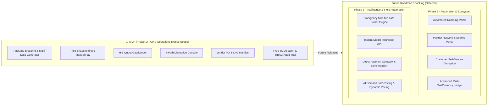

# 03 — Feature Catalog & Scope Definition

## Document Information

| Item | Detail |
| :--- | :--- |
| **Document ID** | SCOPE-01 |
| **Document Title** | Feature Catalog & Scope Definition |
| **Product Name** | Travel & Tour Operations System (TMS) |
| **Document Type** | Feature Catalog & Scope |
| **Phase / Milestone** | Entire Product / Foundation |
| **Document Version** | 1.1 |
| **Document Status** | Approved |
| **Implementation Status** | Planned |
| **Last Updated** | 2026-09-10 |
| **Author / Owner** | Product & Operations Team |

---

## 1. Konteks & Prinsip Penentuan Scope

Dokumen ini mendefinisikan katalog kapabilitas sistem (*Feature Catalog*) dan pembagian batasan ruang lingkup (*Scope Phasing*) untuk **Travel & Tour Operations System (TMS)**.

Sistem bertindak sebagai **Tour Orchestrator** yang mengelola orkestrasi paket wisata, jadwal keberangkatan (*departures*), pemesanan pelanggan, mitigasi risiko kuota H-5, orkestrasi vendor, hingga pelaporan laba-rugi per trip.

### 1.1 Prinsip Desain Scope
1. **Decoupled Architecture**: Pemisahan tegas antara Master Cetak Biru Paket (*Tour Package Blueprint*) dan Eksekusi Tanggal (*Tour Departure Instance*).
2. **Price Immutability**: Penguncian harga mutlak saat jadwal berstatus `PUBLISHED_FIXED` dan kontrak pesanan berstatus `CONFIRMED` (*Price Snapshotting*).
3. **Automated Risk Control**: Penegakan evaluasi kuota otomatis pada H-5 (00:00 WIB) untuk mencegah kerugian operasional akibat sewa armada bus.
4. **Disruption Governance**: Standardisasi 4 jalur resolusi disrupsi (*Reschedule, Partner Transfer, 100% Full Refund, Force Majeure Override*) dengan pemisahan beban akuntansi yang transparan.

### 1.2 Keselarasan Domain Model & Bounded Contexts
Katalog fitur ini diturunkan langsung dari model konseptual kanonikal pada [00 Domain Model](../technical/00_DOMAIN_MODEL.md). Setiap modul fungsional memetakan batasan konteks (*bounded context*) dan entitas domain inti sebagai berikut:

| Modul TMS | Bounded Context Acuan ([00 Domain Model](../technical/00_DOMAIN_MODEL.md)) | Entitas Domain Inti Terkait | Tanggung Jawab Utama |
| :--- | :--- | :--- | :--- |
| **DASH** (01. Dashboard & Analytics) | Supporting: Reporting | Metrics, Aggregates, Alerts | Visibilitas kesehatan operasional, milestone, dan risiko kuota. |
| **CAT** (02. Tour Catalog & Blueprint) | Tour Catalog (§6.2) | `Tour Package` / `Blueprint`, BOM | Definisi paket reusable, rute, fasilitas, dan kalkulasi BEP. |
| **OPS** (03. Operations & Departure) | Departure Management (§6.3) & Disruption | `Departure`, `Disruption Case` | Eksekusi tanggal, kuota, gate H-5, dispatch TL, dan resolusi disrupsi. |
| **BOOK** (04. Booking & Sales) | Booking and Sales (§6.4) | `Booking`, `Customer`, `Traveler` | Siklus reservasi, price snapshotting, dan vault data traveler. |
| **PROMO** (05. Promo & Perks) | Promotion and Perks (§6.5) | `Promotion` (Discount & Perk Badge) | Overlay diskon moneter dan pencatatan complimentary perks. |
| **FIN** (06. Finance & Settlement) | Billing (§6.6) & Finance (§6.9) | `Payment`, `General Ledger`, Ledger Entry | Invoicing, verifikasi bayar, refund payout, dan trip closing ledger. |
| **VEND** (07. Vendor & Procurement) | Procurement (§6.7) | `Vendor`, `Procurement Obligation` (PO) | Direktori vendor, penerbitan PO/voucher, dan tracking settlement. |
| **TL** (08. Field Operations) | Field Operations (§6.8) | `Manifest` (Field execution) | Live manifest lapangan, check-in peserta, dan logging insiden. |
| **DOC** (09. Document & Template) | Supporting: Documents (§6.10) | `Document` | Generator PDF invoice, voucher, PO, manifest, dan kuitansi. |
| **SEC** (10. Security & Access) | Identity & Access (§6.1) & Audit (§6.10) | User, Role, `Audit Record` | RBAC 7 peran, immutable audit trail, dan data privacy masking. |

---

## 2. Feature Catalog (Katalog Kapabilitas Sistem)

Seluruh kapabilitas fungsional didekomposisi ke dalam 10 modul utama dengan ID Kanonikal berformat `[DOMAIN]-[KATEGORI]-[NO]`.

```text
TRAVEL & TOUR OPERATIONS SYSTEM (TMS)
├── 01. Dashboard & Executive Analytics Module (DASH)
├── 02. Tour Catalog & Blueprint Master Module (CAT)
├── 03. Tour Operations & Departure Module (OPS)
├── 04. Booking & Sales Pipeline Module (BOOK)
├── 05. Promo & Perks Overlay Engine (PROMO)
├── 06. Finance, Billing & Settlement Module (FIN)
├── 07. Vendor & Procurement Module (VEND)
├── 08. Tour Leader Field Module (TL)
├── 09. Document Management & Template Vault (DOC)
└── 10. Access Control, Security & Audit Trail (SEC)
```

---

### Modul 01: Dashboard & Executive Analytics (`DASH`)

| Feature ID | Nama Fitur | Deskripsi Kapabilitas | Aktor / Persona |
| :--- | :--- | :--- | :--- |
| `DASH-EXEC-01` | Executive Health & Margin Dashboard | Visualisasi metrik kesehatan bisnis, utilisasi kuota (*load factor*), proyeksi pendapatan, dan kontribusi margin per batch keberangkatan. | Owner, Operations Manager |
| `DASH-OPS-02` | Operational Milestone Radar (H-30 s/d H+7) | Pelacakan status kesiapan operasional setiap batch keberangkatan berdasarkan tahapan milestone waktu. | Operations Manager, Admin |
| `DASH-RISK-03` | Quota & Disruption Warning Center | Peringatan dini keberangkatan yang mendekati H-5 dengan kuota di bawah ambang batas Break-Even Point (BEP). | Owner, Operations Manager, Admin |

---

### Modul 02: Tour Catalog & Blueprint Master (`CAT`)

| Feature ID | Nama Fitur | Deskripsi Kapabilitas | Aktor / Persona |
| :--- | :--- | :--- | :--- |
| `CAT-BLUE-01` | Master Package Blueprint Builder | Pengelolaan informasi dasar paket wisata (nama paket, durasi hari, destinasi, *day-by-day itinerary*, tipe: Open Tour / Private Tour). | Operations Manager |
| `CAT-BOM-02` | Facilities Bill of Materials (BOM) Configurator | Penyusunan daftar fasilitas baku (inclusions & exclusions), pemetaan jenis layanan vendor, dan alokasi biaya variabel standar per pax. | Operations Manager |
| `CAT-PRIC-03` | Baseline Cost & Target Margin Calculator | Kalkulasi harga dasar (*baseline price*) dan penetapan estimasi titik impas (*BEP Pax*) berdasarkan struktur biaya tetap dan variabel. | Operations Manager, Finance |

---

### Modul 03: Tour Operations & Departure (`OPS`)

| Feature ID | Nama Fitur | Deskripsi Kapabilitas | Aktor / Persona |
| :--- | :--- | :--- | :--- |
| `OPS-REC-01` | Flexible Recurrence & Multi-Date Generator | Pembentukan batch tanggal keberangkatan dari Master Blueprint yang sama, baik melalui pola berulang (*weekly, bi-weekly, monthly*) maupun pemilihan tanggal bebas/acak (*on-demand multi-date picker*) berstatus `TENTATIVE`. | System Automation Engine, Operations Manager |
| `OPS-ADJ-02` | Pre-Publish Departure Adjuster | Penyesuaian tanggal, batas kuota (`minQuota`, `maxQuota`), kapasitas armada, dan penyesuaian harga dasar sebelum jadwal dirilis ke publik. | Operations Manager, Admin |
| `OPS-LOCK-03` | Departure Publishing & Price Locking | Penguncian mutlak (*immutable*) harga dasar dan parameter batch saat status diubah menjadi `PUBLISHED_FIXED`. | Operations Manager |
| `OPS-GATE-04` | D-5 Automated Minimum Quota Gatekeeper | Evaluasi otomatis kuota peserta terverifikasi pada H-5 (00:00 WIB) yang memicu transisi ke `CONFIRMED_DEPARTURE` atau `WAITING_OWNER_ACTION`. | System Automation Engine |
| `OPS-DISR-05` | Disruption & Crisis Resolution Console | Meja eksekusi 4 jalur resolusi disrupsi (*Reschedule, Partner Transfer, Full Refund, Force Majeure*) dengan otorisasi Owner. | Business Owner, Admin, Operations Manager |
| `OPS-DISP-06` | Tour Leader & Resource Dispatcher | Penugasan pemandu wisata (Tour Leader) secara manual & bebas oleh Admin/Owner berdasarkan diskresi internal (tanpa restriksi algoritma/beban kerja), serta alokasi armada transportasi legal per batch keberangkatan. | Operations Manager, Admin, Owner |

---

### Modul 04: Booking & Sales Pipeline (`BOOK`)
*Mengimplementasikan Bounded Context **Booking and Sales** (§6.4).*

| Feature ID | Nama Fitur | Deskripsi Kapabilitas | Aktor / Persona |
| :--- | :--- | :--- | :--- |
| `BOOK-PIPE-01` | Order & Booking Management | Pembuatan reservasi pemesanan paket oleh Customer (pemesan komersial), pemilihan jadwal keberangkatan, dan pengelolaan siklus hidup booking (`DRAFT` $\rightarrow$ `PENDING_PAYMENT` $\rightarrow$ `CONFIRMED`). | Admin, Customer |
| `BOOK-HOLD-02` | Temporary Seat Locking & Quota Hold | Penguncian alokasi kursi sementara selama durasi batas waktu pembayaran (default: 2 jam) guna mencegah *overbooking*. | System Automation Engine |
| `BOOK-SNAP-03` | Price Snapshotting Engine | Penguncian permanen total nominal transaksi dan rincian harga saat pembayaran DP diverifikasi, kebal terhadap perubahan harga di kemudian hari. | System Automation Engine, Finance |
| `BOOK-VAULT-04`| Traveler Identity & Preference Vault | Registrasi data identitas peserta/traveler (Nama, NIK/Paspor, No. Kontak, Gender, Alergi/Kebutuhan Khusus) per pax yang terikat pada kontrak booking Customer. | Customer, Admin |
| `BOOK-CANC-05` | Individual Cancellation Handler | Pemrosesan pembatalan sepihak oleh peserta (*strict no-refund*, penalti S&K bertingkat, atau *discretionary override*). | Admin, Finance, Business Owner |
| `BOOK-QUOT-06` | Custom Tour Quotation Pipeline | Alur penyusunan proposal, negosiasi harga, dan persetujuan kontrak Private / Custom Tour. | Admin, Operations Manager |

---

### Modul 05: Promo & Perks Overlay (`PROMO`)
*Mengimplementasikan Bounded Context **Promotion and Perks** (§6.5).*

| Feature ID | Nama Fitur | Deskripsi Kapabilitas | Aktor / Persona |
| :--- | :--- | :--- | :--- |
| `PROMO-RULE-01`| Monetary Discount Engine | Penerapan diskon moneter (% atau nominal flat) sebagai pengurang langsung pada subtotal tagihan invoice (`Promotion` bertipe diskon komersial). | Admin, Customer |
| `PROMO-PERK-02`| Complimentary Perks & Badge Tracker | Penerapan fasilitas ekstra gratis (makan tambahan, merchandise) yang menghasilkan *Perk Badge* tanpa memotong nominal invoice (`Promotion` bertipe service entitlement). | Admin, Operations Manager |
| `PROMO-GRD-03` | Promo Guardrails & Quota Validator | Validasi batas kuota penggunaan promo, tanggal berlaku, pembatasan tipe paket, dan penegakan aturan *non-stackable*. | System Automation Engine |

---

### Modul 06: Finance, Billing & Settlement (`FIN`)
*Mengintegrasikan Bounded Context **Billing** (§6.6) dan **Finance** (§6.9).*

| Feature ID | Nama Fitur | Deskripsi Kapabilitas | Aktor / Persona |
| :--- | :--- | :--- | :--- |
| `FIN-INV-01`  | Dual Invoicing Engine (DP & Pelunasan) | Penerbitan invoice tagihan DP dan pelunasan bertahap dengan batas waktu (*due date*) otomatis (Domain Billing). | System Automation Engine, Admin |
| `FIN-VERIF-02`| Manual Payment Verification Queue | Antrean verifikasi bukti transfer kas masuk (DP dan pelunasan) sebelum status booking dirilis menjadi `CONFIRMED` (Domain Billing). | Finance |
| `FIN-REF-03`  | Disruption Refund Payout Queue | Pengelolaan dan eksekusi antrean pencairan dana pengembalian 100% akibat pembatalan trip H-5 tanpa potongan administrasi (Domain Billing/Finance). | Finance |
| `FIN-SUB-04`  | Goodwill Subsidy & Expense Reconciler | Pencatatan beban subsidi agensi (*Free Waiver* aliansi mitra) dan alokasi pos *Marketing Expense* untuk complimentary perks (Domain Finance). | Finance |
| `FIN-CLOSE-05`| Trip Financial Closing Ledger | Rekonsiliasi akhir laba-rugi per batch keberangkatan (pendapatan bersih, biaya vendor riil, komisi, refund, net profit) ke dalam buku besar trip (`General Ledger` / Domain Finance). | Finance |

---

### Modul 07: Vendor & Procurement (`VEND`)
*Mengimplementasikan Bounded Context **Procurement** (§6.7).*

| Feature ID | Nama Fitur | Deskripsi Kapabilitas | Aktor / Persona |
| :--- | :--- | :--- | :--- |
| `VEND-DIR-01`  | Vendor Master Directory | Direktori data mitra penyedia jasa (Transportasi, Hotel, Restoran, Tiket Objek Wisata, Operator Mitra Aliansi). | Operations Manager |
| `VEND-PO-02`   | Purchase Order (PO) & Voucher Generator | Penerbitan dokumen komitmen pengadaan (*Procurement Obligation*) berupa PO resmi dan Service Voucher layanan vendor berdasarkan jumlah peserta terkonfirmasi. | Operations Manager |
| `VEND-CLAIM-03`| Vendor Bill Settlement Tracker | Pelacakan status tagihan klaim vendor terhadap PO yang telah diterbitkan hingga status lunas (*settled*). | Finance |

---

### Modul 08: Tour Leader Field Operations (`TL`)
*Mengimplementasikan Bounded Context **Field Operations** (§6.8).*

| Feature ID | Nama Fitur | Deskripsi Kapabilitas | Aktor / Persona |
| :--- | :--- | :--- | :--- |
| `TL-MANI-01`   | Interactive Field Live Manifest | Akses manifest digital lapangan secara langsung (`Manifest` domain entity) berisi daftar peserta, titik jemput (*pick-up point*), dan kontak darurat. | Tour Leader |
| `TL-PERK-02`   | Perk Badge & Inclusion Validator | Indikator visual hak fasilitas khusus/promo peserta untuk verifikasi saat pembagian layanan di lapangan. | Tour Leader |
| `TL-ATTN-03`   | Digital Attendance & Check-in | Pencatatan kehadiran fisik peserta di titik kumpul perjalanan. | Tour Leader |
| `TL-INCD-04`   | Field Incident & Disruption Logger | Pencatatan kejadian luar biasa / kendala vendor di lapangan sebagai bukti rekonsiliasi klaim pasca-trip. | Tour Leader |

---

### Modul 09: Document Management & Templates (`DOC`)

| Feature ID | Nama Fitur | Deskripsi Kapabilitas | Aktor / Persona |
| :--- | :--- | :--- | :--- |
| `DOC-GEN-01`   | Standard Document PDF Generator | Pembuatan dokumen otomatis berbasis template standar (E-Invoice, Kuitansi Pembayaran, PO Vendor, Service Voucher). | System Automation Engine |
| `DOC-MANI-02`  | Exportable Trip Manifest Generator | Ekspor manifest keberangkatan ke format PDF/XLSX untuk pelaporan otoritas pelabuhan/KSOP, asuransi, dan manifest hotel. | Operations Manager, Admin |

---

### Modul 10: Access Control, Security & Audit Trail (`SEC`)

| Feature ID | Nama Fitur | Deskripsi Kapabilitas | Aktor / Persona |
| :--- | :--- | :--- | :--- |
| `SEC-RBAC-01`  | Role-Based Access Control (RBAC) | Pembatasan hak akses berbasis 7 peran pengguna (Admin, Operations, Finance, Tour Leader, Owner, Customer, Vendor). | System Admin |
| `SEC-AUDIT-02` | Immutable Audit Trail & Override Logger | Pencatatan log permanen untuk setiap tindakan kritis (pembatalan, *discretionary refund*, *quota override*, perubahan status). | System Automation Engine, System Admin |
| `SEC-MASK-03`  | Sensitive Data Masking | Proteksi privasi data identitas (NIK, nomor paspor, data medis/alergi) sesuai kebutuhan wewenang peran. | System Automation Engine |

---

## 3. Scope Phasing Matrix (Pemetaan Fase Rilis)

Fokus utama pengembangan sistem saat ini terkunci secara ketat pada **MVP (Phase 1 — Core Operations)** guna memastikan keandalan alur operasional dasar, perlindungan margin, dan stabilitas penanganan disrupsi H-5. 

Fitur-fitur **Phase 2** (otomatisasi ekosistem mitra & kamar) dan **Phase 3** (otomatisasi mutasi bank, late-joiner, asuransi instan, dan AI) dialokasikan sebagai **Future Backlog / Deferred** (ditangguhkan untuk rilis mendatang).



### 3.1 Rincian Matriks Fitur per Fase

| Feature ID | Nama Fitur | MVP (Phase 1) | Phase 2 (Deferred) | Phase 3 (Deferred) | Keterangan & Batasan |
| :--- | :--- | :---: | :---: | :---: | :--- |
| `DASH-EXEC-01` | Executive Health & Margin Dashboard | In-Scope | Enhanced | Enhanced | MVP: Tabel ringkasan & kalkulasi margin sederhana per departure. |
| `DASH-OPS-02` | Operational Milestone Radar | In-Scope | - | - | MVP: Tracking milestone H-30 s/d H+7. |
| `DASH-RISK-03` | Quota & Disruption Warning Center | In-Scope | - | - | MVP: Alert departure mendekati H-5 di bawah kuota BEP. |
| `CAT-BLUE-01` | Master Package Blueprint Builder | In-Scope | - | - | MVP: CRUD paket, durasi, itinerary, destinasi. |
| `CAT-BOM-02` | Facilities BOM Configurator | In-Scope | - | - | MVP: BOM standar fasilitas & variabel cost per pax. |
| `CAT-PRIC-03` | Baseline Cost & BEP Calculator | In-Scope | - | - | MVP: Formula BEP Pax berbasis Fixed & Variable Cost. |
| `OPS-REC-01` | Flexible Recurrence & Multi-Date Generator | In-Scope | - | - | MVP: Mendukung jadwal berulang berpola maupun pemilihan tanggal bebas/acak (*on-demand multi-date*). |
| `OPS-ADJ-02` | Pre-Publish Departure Adjuster | In-Scope | - | - | MVP: Edit tanggal/kuota sebelum publish. |
| `OPS-LOCK-03` | Departure Publishing & Price Locking | In-Scope | - | - | MVP: Lock base price mutlak saat `PUBLISHED_FIXED`. |
| `OPS-GATE-04`  | D-5 Automated Quota Gatekeeper | In-Scope | - | - | MVP: Cron H-5 00:00 WIB evaluasi kuota minimum (`minQuota`, default 20 pax). |
| `OPS-DISR-05` | Disruption & Crisis Resolution Console | In-Scope | - | - | MVP: Eksekusi 4 jalur disrupsi via internal desk. |
| `OPS-DISP-06` | Tour Leader & Resource Dispatcher | In-Scope | - | - | MVP: Penugasan TL bebas manual oleh Admin/Owner tanpa restriksi algoritma/beban kerja. |
| `BOOK-PIPE-01` | Order & Booking Management | In-Scope | - | - | MVP: Pembuatan booking internal & formulir publik. |
| `BOOK-HOLD-02` | Temporary Seat Locking & Quota Hold | In-Scope | - | - | MVP: Hold kuota 2 jam selama proses bayar DP. |
| `BOOK-SNAP-03` | Price Snapshotting Engine | In-Scope | - | - | MVP: Kunci harga transaksi saat DP terverifikasi. |
| `BOOK-VAULT-04`| Traveler Identity & Preference Vault | In-Scope | - | - | MVP: Vault data peserta terikat booking. |
| `BOOK-CANC-05` | Individual Cancellation Handler | In-Scope | - | - | MVP: Pembatalan peserta (No-refund / S&K / Override). |
| `BOOK-QUOT-06` | Custom Tour Quotation Pipeline | In-Scope | - | - | MVP: Siklus negosiasi & persetujuan Private Tour. |
| `PROMO-RULE-01`| Monetary Discount Engine | In-Scope | - | - | MVP: Diskon % dan flat terpotong pada invoice. |
| `PROMO-PERK-02`| Complimentary Perks & Badge Tracker | In-Scope | - | - | MVP: Perk Badges & alokasi Marketing Expense. |
| `PROMO-GRD-03` | Promo Guardrails & Quota Validator | In-Scope | - | - | MVP: Validasi kuota promo, validity, non-stackable. |
| `FIN-INV-01`  | Dual Invoicing Engine | In-Scope | - | - | MVP: Penerbitan invoice DP dan pelunasan. |
| `FIN-VERIF-02`| Manual Payment Verification Queue | In-Scope | - | - | MVP: Antrean verifikasi bukti transfer manual oleh Finance. |
| `FIN-REF-03`  | Disruption Refund Payout Queue | In-Scope | - | - | MVP: Antrean payout 100% full refund H-5. |
| `FIN-SUB-04`  | Goodwill Subsidy & Expense Reconciler | In-Scope | - | - | MVP: Pencatatan beban Free Waiver & Marketing Perk. |
| `FIN-CLOSE-05`| Trip Financial Closing Ledger | In-Scope | - | - | MVP: Rekonsiliasi laba-rugi paska-trip (maks H+2). |
| `VEND-DIR-01`  | Vendor Master Directory | In-Scope | Deferred | - | MVP: Master direktori vendor standar. Phase 2: Scoring. |
| `VEND-PO-02`   | Purchase Order & Voucher Generator | In-Scope | - | - | MVP: Generate PO dan service voucher PDF. |
| `VEND-CLAIM-03`| Vendor Bill Settlement Tracker | In-Scope | - | - | MVP: Pencatatan status pembayaran tagihan vendor. |
| `TL-MANI-01`   | Interactive Field Live Manifest | In-Scope | - | - | MVP: Manifest digital mobile-web view untuk TL. |
| `TL-PERK-02`   | Perk Badge & Inclusion Validator | In-Scope | - | - | MVP: Penanda hak fasilitas khusus peserta di manifest. |
| `TL-ATTN-03`   | Digital Attendance & Check-in | In-Scope | - | - | MVP: Check-in kehadiran fisik peserta. |
| `TL-INCD-04`   | Field Incident & Disruption Logger | In-Scope | - | - | MVP: Pencatatan log insiden darurat lapangan. |
| `DOC-GEN-01`   | Standard Document PDF Generator | In-Scope | - | - | MVP: Template PDF Invoice, Kuitansi, PO, Voucher. |
| `DOC-MANI-02`  | Exportable Trip Manifest Generator | In-Scope | - | - | MVP: Ekspor manifest ke PDF/XLSX. |
| `SEC-RBAC-01`  | Role-Based Access Control (RBAC) | In-Scope | - | - | MVP: Hak akses 7 peran (Admin, Ops, Finance, TL, Owner, Guest, Vendor). |
| `SEC-AUDIT-02` | Immutable Audit Trail & Override Logger | In-Scope | - | - | MVP: Pencatatan audit trail aksi kritis. |
| `SEC-MASK-03`  | Sensitive Data Masking | In-Scope | - | - | MVP: Proteksi data NIK/Paspor/Medis peserta. |
| `P2-ROOM-01`   | Automated Rooming Pairer | Out-of-Scope | Deferred | - | Phase 2: Algoritma pembagian kamar gender/relasi (Ditangguhkan). |
| `P2-PARTN-02`  | Travel Partner Portal & Scoring | Out-of-Scope | Deferred | - | Phase 2: Portal integrasi mitra aliansi & vendor rating (Ditangguhkan). |
| `P2-SELF-03`   | Customer Self-Service Disruption | Out-of-Scope | Deferred | - | Phase 2: Portal mandiri customer untuk opsi disrupsi (Ditangguhkan). |
| `P2-LEDG-04`   | Advanced Multi-Tax & Currency Ledger | Out-of-Scope | Deferred | - | Phase 2: Perhitungan multi-currency & pemisahan pajak (Ditangguhkan). |
| `P3-LATE-01`   | Automated Mid-Trip Late-Joiner Engine | Out-of-Scope | Out-of-Scope | Deferred | Phase 3: Dynamic pricing, auto add-on PO, instant waiver (Ditangguhkan). |
| `P3-INSU-02`   | Instant Digital Insurance Binding API | Out-of-Scope | Out-of-Scope | Deferred | Phase 3: Integrasi API asuransi instan *on-the-go* (Ditangguhkan). |
| `P3-GATE-03`   | Direct Payment Gateway & Bank Mutation | Out-of-Scope | Out-of-Scope | Deferred | Phase 3: Integrasi VA, QRIS, & Webhook mutasi bank (Ditangguhkan). |
| `P3-AI-04`     | AI Demand Forecasting & Dynamic Pricing | Out-of-Scope | Out-of-Scope | Deferred | Phase 3: Rekomendasi harga dinamis & prediksi kuota (Ditangguhkan). |

---

## 4. Batasan Ruang Lingkup MVP (Out-of-Scope Boundaries)

Berikut adalah batasan fungsional yang **secara tegas dikecualikan dari MVP (Phase 1)** dan ditangguhkan ke fase lanjutan:

1. **Penerimaan Uang Tunai di Lapangan (*No Cash in Field*)**: Tour Leader dilarang menerima kas langsung; sistem MVP tidak menyediakan fitur input kas lapangan.
2. **Otomatisasi Penambahan Peserta Susulan (*Automated Late-Joiner*)**: Pada MVP, peserta *walk-in* di tengah jalan ditolak secara default. Penanganan pengecualian harus disetujui manual oleh Operations dan Finance sebelum masuk ke manifest.
3. **Integrasi Pembayaran Otomatis Langsung (*Direct Payment Gateway*)**: Tidak ada auto-reconciliation gateway instan; seluruh bukti bayar diverifikasi melalui antrean verifikasi manual oleh Finance.
4. **Integrasi Tiket Pesawat Global (*GDS Flight Booking*)**: Sistem berfokus murni pada orkestrasi paket tour darat/laut (*land tour operations*), tanpa integrasi GDS penerbangan (Amadeus/Sabre).
5. **Aplikasi Mobile Native (*Native Apps*)**: Seluruh interaksi pengguna (termasuk Tour Leader dan Customer) diakomodasi melalui *Responsive Web Application*.
6. **Seluruh Fitur Lanjutan Phase 2 & Phase 3 (Deferred)**: Fitur pembagian kamar otomatis (*Rooming Pairer*), portal jaringan mitra aliansi, portal mandiri disrupsi pelanggan, integrasi API asuransi instan, serta analitik AI ditangguhkan (*deferred*) dari fase MVP.

---

## 5. Traceability & Hubungan Antar Dokumen

| Dokumen Sumber | Hubungan terhadap Feature Catalog & Scope |
| :--- | :--- |
| [00 Domain Model](../technical/00_DOMAIN_MODEL.md) | Fondasi konseptual kanonikal yang mendefinisikan entitas domain, bounded contexts, domain glossary, dan aturan kepemilikan (*core invariants*). |
| [01 Business Analysis](01_BUSINESS_ANALYSIS.md) | Menyediakan fondasi masalah operasional, model BEP, pemisahan Open/Private Tour, dan milestone H-30 s/d H+7. |
| [02 BRD](02_BRD.md) | Mendefinisikan konsep domain, taksonomi aktor RBAC, master aturan bisnis (Rule 4.1 - 4.7), dan swimlane BPMN. |
| [01 PRD MVP-1](../development/mvp-1/01_PRD.md) | Spesifikasi produk terperinci (User Stories, Acceptance Criteria) untuk fitur berlabel MVP-1. |
| [01 System Architecture](../technical/01_SYSTEM_ARCHITECTURE.md) | Blueprint arsitektur teknis yang mengimplementasikan seluruh modul pada katalog ini. |
