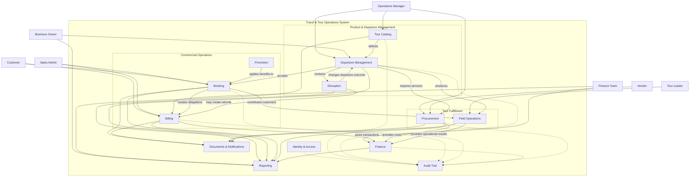
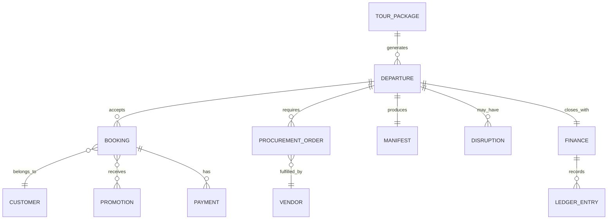
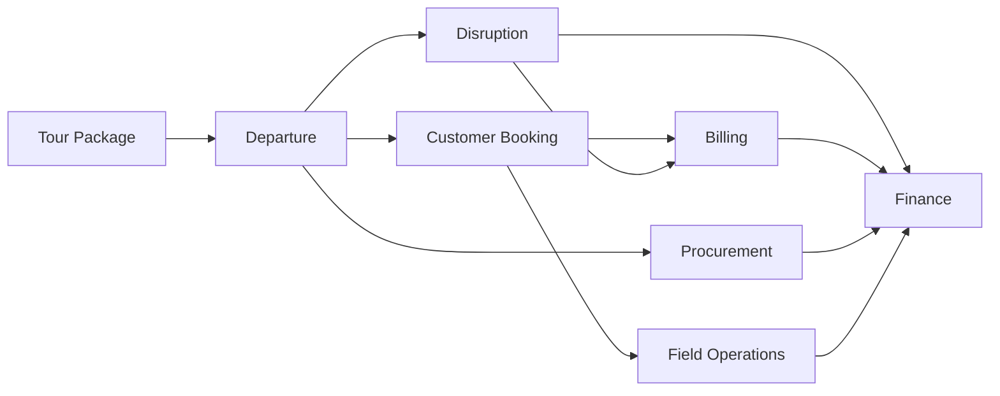

# 00 — TMS Domain Model

## Document Information

| Item | Detail |
| :--- | :--- |
| **Document ID** | DOMAIN-01 |
| **Document Title** | Travel & Tour Operations System Domain Model |
| **Product Name** | Travel & Tour Operations System (TMS) |
| **Document Type** | Conceptual and Functional Domain Model |
| **Phase / Milestone** | Entire Product / Foundation |
| **Document Version** | 1.0 |
| **Document Status** | Approved |
| **Implementation Status** | Planned |
| **Last Updated** | 2026-09-08 |
| **Author / Owner** | Product, Operations & Engineering Team |

---

## 1. Purpose and Scope

This document defines the high-level business domain model for the Travel & Tour Operations System (TMS).

It establishes the shared vocabulary and major relationships used by the following documents:

- [Business Requirements Document](../product/02_BRD.md)
- [Feature Catalog and Product Scope](../product/03_FEATURE_CATALOG_AND_SCOPE.md)
- System architecture
- Database design
- API contracts
- MVP functional requirements

This is a conceptual model. It does not yet define database tables, API payloads, implementation services, or infrastructure topology.

## 2. Modeling Decisions

The following decisions are part of this draft:

1. A customer is also a traveler in the current business model. The system does not introduce a separate customer-versus-traveler domain distinction at this stage.
2. Disruption and exception handling belongs inside the Departure Management domain because disruptions change the operational outcome of a specific departure.
3. Finance are treated as one domain boundary for trip-level financial accountability.
4. A Tour Package is a reusable definition, while a Departure is a date-specific operational execution.
5. A Booking represents a customer's reservation against one Departure.
6. The Departure is the operational center of gravity for bookings, fulfillment, manifest execution, disruption handling, and trip settlement.

## 3. Domain Glossary

| Term | Definition |
| :--- | :--- |
| **Tour Package** | Reusable master definition of a tour, including itinerary, inclusions, default services, and baseline commercial values. |
| **Departure** | Date-specific operational execution of a Tour Package with its own schedule, quota, price, fulfillment, and lifecycle. |
| **Customer** | Person who makes or is included in a booking and participates in the tour. |
| **Booking** | Commercial reservation made by a Customer against a Departure. |
| **Promotion** | Commercial or service benefit applied to an eligible booking or customer. |
| **Payment** | Money received from a Customer and associated with a booking obligation. |
| **Vendor** | External party that provides transport, accommodation, meals, activities, or operational support. |
| **Procurement Obligation** | Operational commitment to obtain a vendor service for a departure. |
| **Manifest** | Operational list of customers assigned to a departure. |
| **Disruption Case** | Controlled exception process used to resolve a departure problem, such as under-quota cancellation, rescheduling, or partner transfer. |
| **Finance** | Reconciliation of customer revenue, vendor costs, refunds, adjustments, and trip-level result. |
| **General Ledger** | Financial record of transactions and adjustments used for settlement and reporting. |
| **Document** | Business output such as invoice, receipt, voucher, purchase order, manifest, or refund confirmation. |
| **Audit Record** | Historical record of a significant action, decision, status change, or financial adjustment. |

## 4. High-Level Domain Map

## 5. Core Domain Relationships

The diagram expresses business relationships only. It is not a final database schema and does not prescribe table structure.

## 6. Domain Boundaries

### 6.1 Identity and Access

Responsible for authenticated users, role assignment, access decisions, and controlled authorization. This domain supports the other domains but does not own their business records.

### 6.2 Tour Catalog

Responsible for reusable tour definitions. It owns the package-level itinerary, destinations, inclusions, service requirements, and default commercial values.

A change to a blueprint must not silently mutate a departure that has already been published.

### 6.3 Departure Management

Responsible for the date-specific execution of a package. It owns schedule, quota, publication readiness, operational status, and departure-level decisions.

This boundary also owns disruption and exception handling because those decisions directly change the outcome of a departure.

### 6.4 Booking and Sales

Responsible for the commercial reservation lifecycle. A booking belongs to one departure and records the customer's commercial commitment, selected benefits, and participation status.

### 6.5 Promotion and Perks

Responsible for controlled commercial overlays and customer benefits. Promotions may affect booking value or service entitlements but do not mutate the underlying package blueprint.

### 6.6 Billing

Responsible for customer payment obligations, payment evidence, verification, allocation, outstanding balances, and refund instructions.

### 6.7 Procurement

Responsible for vendor records, service requirements, purchase orders, service confirmations, and vendor-side operational commitments for a departure.

### 6.8 Field Operations

Responsible for converting confirmed bookings into an operational manifest and supporting Tour Leader activities such as check-in, perk validation, and incident recording.

### 6.9 Finance

Responsible for recording customer revenue, vendor costs, refunds, adjustments, marketing or goodwill costs, trip-level reconciliation, and financial closing.

### 6.10 Documents, Notifications, Reporting, and Audit Trail

These are supporting capabilities that consume domain information and provide traceability, communication, and operational visibility. They should not become the source of truth for the underlying business decisions.

## 7. Core Ownership Rules

| Domain Object | Primary Owner | Key Responsibility |
| :--- | :--- | :--- |
| Tour Package | Catalog | Maintains reusable product definition |
| Departure | Departure Management | Controls date-specific execution and operational outcome |
| Booking | Booking | Controls commercial reservation lifecycle |
| Payment | Billing | Controls verification and allocation of customer money |
| Procurement Obligation | Procurement | Controls service fulfillment commitment |
| Manifest | Field Operations | Controls execution-facing participant list |
| Disruption Case | Departure Management | Controls exception decision and resulting departure action |
| Finance | Finance | Controls reconciliation and closing |
| Ledger Entry | Finance | Records financial impact |
| Audit Record | Audit capability | Records significant actions and decisions |

## 8. Core Business Invariants

These rules should remain true regardless of user interface or implementation approach:

1. A Booking belongs to exactly one Departure.
2. A Departure is generated from one Tour Package.
3. A published departure has its own operational values and does not silently inherit later blueprint changes.
4. A confirmed booking price must be based on an agreed commercial snapshot, not a later recalculation from mutable package data.
5. A customer's confirmed participation must not exceed the departure quota.
6. A Payment must not be allocated more than once.
7. A refund or financial adjustment requires an eligible reason and an authorized action.
8. A disruption decision must be associated with the affected departure and recorded for auditability.
9. A Tour Leader can access operational information only for assigned departures.
10. A departure cannot be financially closed while required settlement items remain unresolved.
11. Significant status changes, overrides, approvals, and financial adjustments must produce audit records.
12. Documents and reports reflect domain records; they do not independently change business state.

## 9. High-Level Business Flow

## 10. Initial Domain Events

The following events are candidates for later functional and technical specifications:

- `PackageBlueprintPublished`
- `DepartureCreated`
- `DeparturePublished`
- `BookingCreated`
- `PaymentVerified`
- `BookingPriceLocked`
- `D5EvaluationTriggered`
- `DepartureConfirmed`
- `DepartureCancelled`
- `VendorTransferApproved`
- `CustomerCheckedIn`
- `RefundApproved`
- `FinancialSettlementStarted`
- `FinancialClosingCompleted`

These are business events for analysis. They are not yet defined as message schemas or API webhooks.

## 11. Open Decisions for Next Revision

1. Can one booking contain multiple customers, or is one booking limited to one customer?
2. Does the system allow a customer to hold multiple bookings for the same departure?
3. Which departure values become immutable at publication, and which remain editable by authorized users?
4. Is the manifest generated automatically from confirmed bookings, or explicitly published by Operations?
5. Which financial records belong in the operational ledger versus an external accounting system?
6. Are vendor services modeled as departure-level requirements only, or can they also be assigned to individual bookings?
7. Which disruption actions are available for under-quota cancellation, force majeure, and individual cancellation?

## 12. Relationship to Future Documents

| Future Document | Use of This Model |
| :--- | :--- |
| Feature Catalog and Product Scope | Maps capabilities to domains and release phases |
| MVP-1 PRD | Defines user-facing workflows around domain capabilities |
| MVP-1 FRD | Defines states, triggers, validations, and exceptions |
| System Architecture | Defines technical modules and integration boundaries |
| Database Design | Converts approved concepts into persistent data structures |
| API Contracts | Exposes approved domain operations and representations |
| Test Traceability | Verifies invariants, workflows, and domain events |
