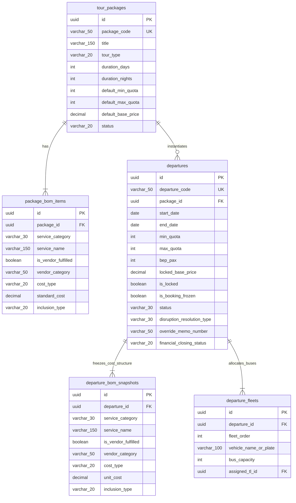
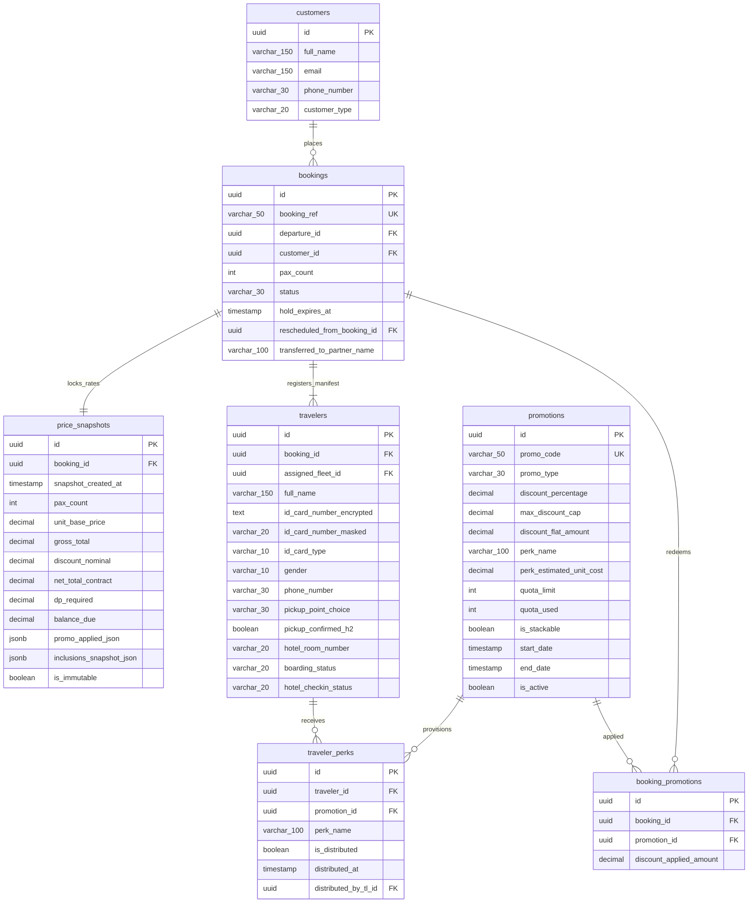
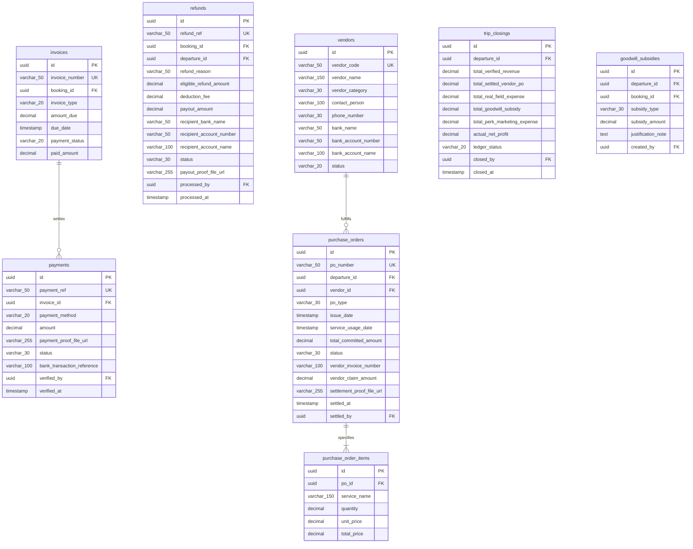
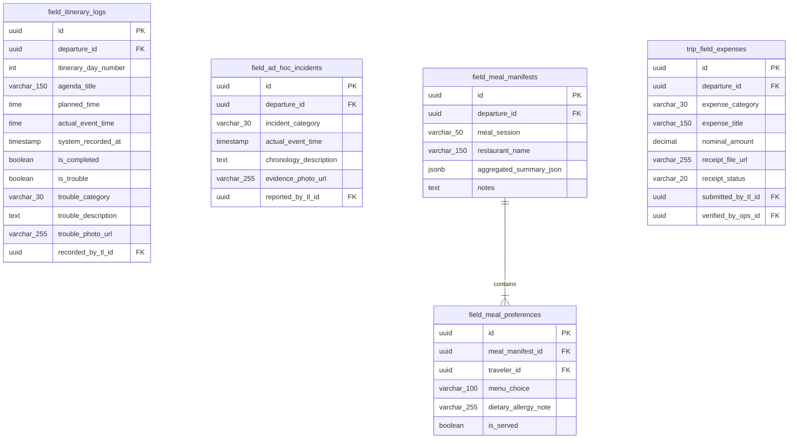

# 02 — Database Design & Physical Data Architecture (MVP-1)

## Document Information

| Item | Detail |
| :--- | :--- |
| **Document ID** | DB-MVP1 |
| **Document Title** | Database Design & Physical Data Architecture — MVP-1 (Core Operations) |
| **Product Name** | Travel & Tour Operations System (TMS) |
| **Document Type** | Technical Architecture & Database Design |
| **Phase / Milestone** | MVP-1 |
| **Document Version** | 1.0 |
| **Document Status** | Approved |
| **Implementation Status** | Planned |
| **Last Updated** | 2026-10-07 |
| **Author / Owner** | Engineering & Data Architecture Team |

---

## 1. Pendahuluan & Prinsip Desain Data

Dokumen ini mendefinisikan desain basis data relasional (*Physical Database Architecture*) dan Kamus Data Komprehensif (*Data Catalogue*) untuk rilis **MVP-1 (TMS Core Operations)**. Desain ini merupakan turunan langsung dari dokumen:
- [00 Domain Model](00_DOMAIN_MODEL.md)
- [01 PRD MVP-1](../development/mvp-1/01_PRD.md)
- [02 FRD MVP-1](../development/mvp-1/02_FRD.md)
- [02 BRD](../product/02_BRD.md)

### 1.1 Prinsip Arsitektur Data
1. **Strict Decoupling (Blueprint vs. Execution)**: Cetak biru master paket (`tour_packages` & `package_bom_items`) terpisah total dari instans keberangkatan operasional (`departures` & `departure_bom_snapshots`). Modifikasi pada master paket di masa mendatang tidak akan pernah memutasi jadwal yang sedang atau telah berjalan.
2. **Deterministic Price Snapshotting**: Harga transaksi pelanggan dikunci ke dalam tabel *append-only* `price_snapshots` begitu pembayaran DP diverifikasi (`CONFIRMED`). Tagihan dan kuitansi selanjutnya membaca snapshot ini, bukan harga katalog yang dapat berubah.
3. **Auditability & Non-repudiation**: Setiap mutasi status kritis (transisi state departure, booking, PO, serta discretionary override) dicatat ke dalam `audit_logs` dengan payload metadata JSONB dan identitas aktor. Modifikasi dan penghapusan (`UPDATE`/`DELETE`) dilarang keras pada level database.
4. **Data Isolation & Security Masking**: Kolom identitas sensitif peserta (NIK/Paspor) disimpan dalam dua representasi: kolom ciphertext terenkripsi (`id_card_number_encrypted`) dan kolom tampilan termasking publik (`id_card_number_masked`), sesuai aturan `SEC-MASK-03` dan `BR-DATA-001`.
5. **High-Precision Financials**: Seluruh data moneter menggunakan tipe data `DECIMAL(14, 2)` guna mencegah kehilangan presisi akibat representasi floating point.
6. **Timezone Awareness**: Seluruh timestamp disimpan dalam format `TIMESTAMPTZ` (UTC) dengan rendering aplikasi terstandarisasi ke `Asia/Jakarta` (WIB, UTC+7).

---

## 2. Master Entity Relationship Diagram (ERD)

Diagram ERD berikut memetakan entitas utama sistem dan relasi antar-domain sesuai dekomposisi 10 modul TMS MVP-1.

```mermaid
erDiagram
    users ||--o{ audit_logs : "records_action"
    users ||--o{ departures : "created_by"
    users ||--o{ departure_fleets : "assigned_tour_leader"
    users ||--o{ payments : "verified_by"
    users ||--o{ refunds : "processed_by"
    users ||--o{ purchase_orders : "issued_by"
    users ||--o{ trip_field_expenses : "submitted_by"
    users ||--o{ trip_closings : "closed_by"

    tour_packages ||--|{ package_bom_items : "defines_bom"
    tour_packages ||--o{ departures : "generates"

    departures ||--|{ departure_bom_snapshots : "snapshots_bom"
    departures ||--|{ departure_fleets : "dispatches_fleets"
    departures ||--o{ bookings : "hosts"
    departures ||--o{ purchase_orders : "obligates"
    departures ||--o{ field_itinerary_logs : "tracks_agenda"
    departures ||--o{ field_ad_hoc_incidents : "logs_incidents"
    departures ||--o{ field_meal_manifests : "records_meals"
    departures ||--o{ trip_field_expenses : "incurs_expenses"
    departures ||--o| trip_closings : "closes_financials"
    departures ||--o{ goodwill_subsidies : "incurs_subsidies"

    customers ||--o{ bookings : "places"
    customers ||--o{ custom_quotations : "requests"

    bookings ||--|{ travelers : "registers_pax"
    bookings ||--|| price_snapshots : "freezes_price"
    bookings ||--|{ invoices : "bills"
    bookings ||--o{ booking_promotions : "claims"
    bookings ||--o{ refunds : "claims_refund"
    bookings ||--o{ goodwill_subsidies : "granted_subsidy"

    travelers ||--o{ traveler_perks : "entitled_to"
    travelers ||--o{ field_meal_preferences : "prefers_menu"
    travelers }o--o| departure_fleets : "seated_in"

    promotions ||--o{ booking_promotions : "applied_to"
    promotions ||--o{ traveler_perks : "provisions"

    invoices ||--o{ payments : "receives"

    vendors ||--o{ purchase_orders : "fulfills"
    purchase_orders ||--|{ purchase_order_items : "contains"

    field_meal_manifests ||--|{ field_meal_preferences : "manifests_choices"
```



---

## 3. Modular Sub-ERD & Domain Relationships

### 3.1 Catalog, Blueprint & Departure Operations (CAT & OPS)



### 3.2 Bookings, Vault, Pricing & Promotions (BOOK & PROMO)



### 3.3 Billing, Finance, Procurement & Settlements (FIN & VEND)



### 3.4 Tour Leader Field Portal & Operational Archives (TL & OPS-HIST)



---

## 4. Kamus Data Komprehensif (Complete Data Catalogue)

### 4.1 Modul 10: Access Control, Security & Audit (`SEC`)

#### Tabel `users`
Menyimpan data identitas kredensial akun seluruh staf internal agensi.

| Nama Kolom | Tipe Data | Nullable | Default | Relasi / Keterangan |
| :--- | :--- | :---: | :--- | :--- |
| `id` | `UUID` | No | `gen_random_uuid()` | Primary Key unik pengguna internal. |
| `full_name` | `VARCHAR(150)` | No | - | Nama lengkap petugas/karyawan. |
| `email` | `VARCHAR(150)` | No | - | Email login resmi (Unique). |
| `password_hash` | `VARCHAR(255)` | No | - | Hash sandi argon2id / bcrypt. |
| `role` | `VARCHAR(20)` | No | - | Enum: `OWNER`, `OPERATIONS`, `FINANCE`, `SALES_ADMIN`, `TOUR_LEADER`. |
| `phone_number` | `VARCHAR(30)` | Yes | NULL | Nomor kontak WhatsApp staf. |
| `status` | `VARCHAR(20)` | No | `'ACTIVE'` | Enum: `ACTIVE`, `INACTIVE`. |
| `created_at` | `TIMESTAMPTZ` | No | `CURRENT_TIMESTAMP` | Waktu registrasi akun. |
| `updated_at` | `TIMESTAMPTZ` | No | `CURRENT_TIMESTAMP` | Waktu modifikasi terakhir. |

*Indeks*:
- `idx_users_email` UNIQUE (`email`)
- `idx_users_role` (`role`)

---

#### Tabel `audit_logs` (`SEC-AUDIT-02`)
Merekam seluruh aksi kritis sistem, perubahan state mesin, dan otorisasi override Owner. Bersifat *Append-Only* (larangan keras `UPDATE`/`DELETE`).

| Nama Kolom | Tipe Data | Nullable | Default | Relasi / Keterangan |
| :--- | :--- | :---: | :--- | :--- |
| `id` | `UUID` | No | `gen_random_uuid()` | Primary Key audit log. |
| `timestamp` | `TIMESTAMPTZ` | No | `CURRENT_TIMESTAMP` | Waktu persis kejadian tercatat pada server. |
| `actor_id` | `UUID` | Yes | NULL | FK $\rightarrow$ `users.id` (NULL jika dieksekusi cron sistem). |
| `actor_role` | `VARCHAR(30)` | No | - | Peran aktor: `OWNER`, `OPERATIONS`, `FINANCE`, `SALES_ADMIN`, `TOUR_LEADER`, `SYSTEM`. |
| `ip_address` | `VARCHAR(45)` | Yes | NULL | Alamat IPv4/IPv6 klien saat memicu aksi. |
| `event_type` | `VARCHAR(100)` | No | - | Kode tipe aksi (misal: `PAYMENT_APPROVED`, `DEPARTURE_OVERRIDDEN`, `GATEKEEPER_EVALUATED`). |
| `entity_name` | `VARCHAR(50)` | No | - | Nama entitas yang terpengaruh (`departures`, `bookings`, `purchase_orders`). |
| `entity_id` | `UUID` | No | - | UUID target record entitas. |
| `previous_state`| `VARCHAR(50)` | Yes | NULL | Status awal sebelum transisi. |
| `new_state` | `VARCHAR(50)` | Yes | NULL | Status akhir setelah transisi. |
| `justification_note` | `TEXT` | Yes | NULL | Alasan wajib pada aksi diskresi Owner / refund. |
| `metadata_payload` | `JSONB` | Yes | NULL | Rincian payload tambahan (angka finansial, referensi bank, kuota pax). |

*Indeks*:
- `idx_audit_entity` (`entity_name`, `entity_id`)
- `idx_audit_timestamp` (`timestamp` DESC)
- `idx_audit_actor` (`actor_id`)

---

### 4.2 Modul 02: Tour Catalog & Master Blueprint (`CAT`)

#### Tabel `tour_packages` (`CAT-BLUE-01`)
Menyimpan cetak biru master paket tur yang bersifat *reusable*.

| Nama Kolom | Tipe Data | Nullable | Default | Relasi / Keterangan |
| :--- | :--- | :---: | :--- | :--- |
| `id` | `UUID` | No | `gen_random_uuid()` | Primary Key paket wisata. |
| `package_code` | `VARCHAR(50)` | No | - | Kode kanonikal paket unik (misal: `PKG-BROMO-01`). |
| `title` | `VARCHAR(150)` | No | - | Nama judul paket wisata komersial. |
| `slug` | `VARCHAR(150)` | No | - | URL slug unik untuk etalase publik. |
| `tour_type` | `VARCHAR(20)` | No | `'OPEN_TOUR'` | Enum: `OPEN_TOUR`, `PRIVATE_TOUR`. |
| `duration_days` | `INT` | No | `1` | Total durasi hari tur ($N$ Hari). |
| `duration_nights` | `INT` | No | `0` | Total durasi malam menginap ($N$ Malam). |
| `destinations_list` | `JSONB` | No | `'[]'` | Daftar array string nama destinasi yang dikunjungi. |
| `day_by_day_itinerary` | `JSONB` | No | `'[]'` | Struktur baku agenda harian tur (waktu, lokasi, aktivitas). |
| `default_min_quota` | `INT` | No | `10` | Batas kuota minimum standar keberangkatan. |
| `default_max_quota` | `INT` | No | `35` | Batas kapasitas kursi armada bus standar. |
| `default_base_price` | `DECIMAL(14,2)`| No | `0.00` | Baseline harga jual per pax sebelum promo. |
| `status` | `VARCHAR(20)` | No | `'ACTIVE'` | Enum: `ACTIVE`, `INACTIVE`. |
| `created_by` | `UUID` | Yes | NULL | FK $\rightarrow$ `users.id` (petugas Ops pembuat master). |
| `created_at` | `TIMESTAMPTZ` | No | `CURRENT_TIMESTAMP` | Waktu cetak biru dibuat. |
| `updated_at` | `TIMESTAMPTZ` | No | `CURRENT_TIMESTAMP` | Waktu pembaruan cetak biru. |

*Indeks*:
- `idx_tour_packages_code` UNIQUE (`package_code`)
- `idx_tour_packages_slug` UNIQUE (`slug`)
- `idx_tour_packages_status` (`status`)

---

#### Tabel `package_bom_items` (`CAT-BOM-02`, `CAT-PRIC-03`)
Menyimpan rincian *Bill of Materials* (BOM) fasilitas penyusun paket.

| Nama Kolom | Tipe Data | Nullable | Default | Relasi / Keterangan |
| :--- | :--- | :---: | :--- | :--- |
| `id` | `UUID` | No | `gen_random_uuid()` | Primary Key item fasilitas BOM. |
| `package_id` | `UUID` | No | - | FK $\rightarrow$ `tour_packages.id` (ON DELETE CASCADE). |
| `service_category` | `VARCHAR(30)` | No | - | Enum: `TRANSPORTATION`, `ACCOMMODATION`, `MEAL`, `ATTRACTION_TICKET`, `GUIDING`, `LOGISTICS`. |
| `service_name` | `VARCHAR(150)` | No | - | Deskripsi fasilitas (misal: "Sewa Bus Pariwisata 35-Seat"). |
| `is_vendor_fulfilled`| `BOOLEAN` | No | `true` | True jika dipenuhi pihak ke-3, False jika internal agensi. |
| `vendor_category` | `VARCHAR(50)` | Yes | NULL | Kategori vendor mitra jika `is_vendor_fulfilled = true`. |
| `cost_type` | `VARCHAR(20)` | No | `'VARIABLE_PER_PAX'` | Enum: `FIXED_TOTAL` (Bus/TL), `VARIABLE_PER_PAX` (Tiket/Makan/Hotel). |
| `standard_cost` | `DECIMAL(14,2)`| No | `0.00` | Estimasi biaya baku standar (IDR). |
| `inclusion_type` | `VARCHAR(20)` | No | `'INCLUSION'` | Enum: `INCLUSION` (masuk paket), `EXCLUSION` (tidak masuk). |
| `notes` | `TEXT` | Yes | NULL | Catatan spesifikasi teknis fasilitas. |
| `created_at` | `TIMESTAMPTZ` | No | `CURRENT_TIMESTAMP` | Waktu dibuat. |
| `updated_at` | `TIMESTAMPTZ` | No | `CURRENT_TIMESTAMP` | Waktu diperbarui. |

*Indeks*:
- `idx_package_bom_package_id` (`package_id`)
- `idx_package_bom_category` (`service_category`)

---

### 4.3 Modul 03: Tour Operations & Departure (`OPS`)

#### Tabel `departures` (`OPS-REC-01`, `OPS-LOCK-03`, `OPS-GATE-04`, `OPS-DISR-05`)
Instans operasional keberangkatan tur berbasis kalender jadwal spesifik.

| Nama Kolom | Tipe Data | Nullable | Default | Relasi / Keterangan |
| :--- | :--- | :---: | :--- | :--- |
| `id` | `UUID` | No | `gen_random_uuid()` | Primary Key departure. |
| `departure_code` | `VARCHAR(50)` | No | - | Kode unik keberangkatan (misal: `DEP-BALI-20261105`). |
| `package_id` | `UUID` | No | - | FK $\rightarrow$ `tour_packages.id` (cetak biru sumber). |
| `start_date` | `DATE` | No | - | Tanggal mulai trip lapangan. |
| `end_date` | `DATE` | No | - | Tanggal selesai trip lapangan. |
| `min_quota` | `INT` | No | - | Kuota minimum kelulusan trip pada H-5. |
| `max_quota` | `INT` | No | - | Kapasitas kursi maksimum (akumulasi seluruh armada bus). |
| `bep_pax` | `INT` | No | - | Kuota titik impas terhitung ($\lceil FC / CM \rceil$). |
| `locked_base_price`| `DECIMAL(14,2)`| No | - | Harga dasar publik terkunci permanen saat publish. |
| `is_locked` | `BOOLEAN` | No | `false` | True saat status berubah ke `PUBLISHED_FIXED`. |
| `is_booking_frozen` | `BOOLEAN` | No | `false` | True saat gagal kuota H-5 (`WAITING_OWNER_ACTION`). |
| `status` | `VARCHAR(30)` | No | `'TENTATIVE'` | Enum kanonikal: `TENTATIVE`, `PUBLISHED_FIXED`, `CONFIRMED_DEPARTURE`, `WAITING_OWNER_ACTION`, `IN_OPERATION`, `COMPLETED`, `CANCELLED`. |
| `disruption_resolution_type` | `VARCHAR(30)` | Yes | NULL | Enum jalur krisis: `RESCHEDULE`, `PARTNER_TRANSFER`, `REFUND_100`, `OVERRIDE`. |
| `disruption_notes` | `TEXT` | Yes | NULL | Catatan pertimbangan Owner atas resolusi disrupsi. |
| `override_memo_number` | `VARCHAR(50)`| Yes | NULL | Nomor memo resmi jika Owner mengeksekusi Jalur 4 (Override). |
| `disruption_resolved_at` | `TIMESTAMPTZ` | Yes | NULL | Waktu ketuk palu resolusi oleh Owner. |
| `disruption_resolved_by` | `UUID` | Yes | NULL | FK $\rightarrow$ `users.id` (Owner pembuat keputusan). |
| `financial_closing_status` | `VARCHAR(20)` | No | `'OPEN'` | Enum: `OPEN`, `PENDING_REVIEW`, `CLOSED`. |
| `created_by` | `UUID` | Yes | NULL | FK $\rightarrow$ `users.id` (petugas Ops pembuat jadwal). |
| `created_at` | `TIMESTAMPTZ` | No | `CURRENT_TIMESTAMP` | Waktu dibuat. |
| `updated_at` | `TIMESTAMPTZ` | No | `CURRENT_TIMESTAMP` | Waktu modifikasi status/data. |

*Indeks*:
- `idx_departures_code` UNIQUE (`departure_code`)
- `idx_departures_cron_gate` (`status`, `start_date`) — *Kritis untuk CRON H-5 Gatekeeper*
- `idx_departures_package_status` (`package_id`, `status`)

---

#### Tabel `departure_fleets` (`OPS-DISP-06`)
Mewadahi alokasi multi-armada bus (*Multi-Bus Batching*) pada keberangkatan yang sama saat terjadi lonjakan peserta.

| Nama Kolom | Tipe Data | Nullable | Default | Relasi / Keterangan |
| :--- | :--- | :---: | :--- | :--- |
| `id` | `UUID` | No | `gen_random_uuid()` | Primary Key unit armada bus keberangkatan. |
| `departure_id` | `UUID` | No | - | FK $\rightarrow$ `departures.id` (ON DELETE CASCADE). |
| `fleet_order` | `INT` | No | `1` | Urutan unit armada (Bus 1, Bus 2, dst.). |
| `vehicle_name_or_plate` | `VARCHAR(100)` | Yes | NULL | Nomor plat bus atau identitas unit dari PO vendor bus. |
| `bus_capacity` | `INT` | No | `35` | Jumlah kapasitas tempat duduk armada bus ini. |
| `assigned_tl_id` | `UUID` | Yes | NULL | FK $\rightarrow$ `users.id` (Tour Leader penanggung jawab armada ini). |
| `notes` | `TEXT` | Yes | NULL | Catatan fasilitas armada (misal: "Toilet, Legrest"). |
| `created_at` | `TIMESTAMPTZ` | No | `CURRENT_TIMESTAMP` | Waktu armada didaftarkan. |
| `updated_at` | `TIMESTAMPTZ` | No | `CURRENT_TIMESTAMP` | Waktu pembaruan armada. |

*Indeks*:
- `idx_departure_fleets_dep_order` UNIQUE (`departure_id`, `fleet_order`)
- `idx_departure_fleets_assigned_tl` (`assigned_tl_id`)

---

#### Tabel `departure_bom_snapshots` (`OPS-REC-01`, `INV-01`)
Snapshot terpisah dari seluruh item BOM yang disalin ke departure pada saat digenerate, mengamankan departure dari mutasi cetak biru di kemudian hari.

| Nama Kolom | Tipe Data | Nullable | Default | Relasi / Keterangan |
| :--- | :--- | :---: | :--- | :--- |
| `id` | `UUID` | No | `gen_random_uuid()` | Primary Key snapshot BOM departure. |
| `departure_id` | `UUID` | No | - | FK $\rightarrow$ `departures.id` (ON DELETE CASCADE). |
| `service_category` | `VARCHAR(30)` | No | - | Enum kategori fasilitas. |
| `service_name` | `VARCHAR(150)` | No | - | Nama fasilitas. |
| `is_vendor_fulfilled`| `BOOLEAN` | No | `true` | Status pemenuhan pihak ketiga. |
| `vendor_category` | `VARCHAR(50)` | Yes | NULL | Kategori vendor. |
| `cost_type` | `VARCHAR(20)` | No | - | `FIXED_TOTAL` atau `VARIABLE_PER_PAX`. |
| `unit_cost` | `DECIMAL(14,2)`| No | `0.00` | Nilai biaya unit terkunci (IDR). |
| `inclusion_type` | `VARCHAR(20)` | No | `'INCLUSION'` | Inklusi atau eksklusi. |
| `created_at` | `TIMESTAMPTZ` | No | `CURRENT_TIMESTAMP` | Waktu snapshot disalin. |

*Indeks*:
- `idx_dep_bom_departure` (`departure_id`)

---

### 4.4 Modul 04: Booking Pipeline, Seat Hold & Traveler Vault (`BOOK`)

#### Tabel `customers` (`BOOK-PIPE-01`)
Pihak pemesan komersial yang memiliki tanggung jawab finansial atas booking.

| Nama Kolom | Tipe Data | Nullable | Default | Relasi / Keterangan |
| :--- | :--- | :---: | :--- | :--- |
| `id` | `UUID` | No | `gen_random_uuid()` | Primary Key customer. |
| `full_name` | `VARCHAR(150)` | No | - | Nama pemesan / penanggung jawab tagihan. |
| `email` | `VARCHAR(150)` | No | - | Alamat email korespondensi invoice. |
| `phone_number` | `VARCHAR(30)` | No | - | Nomor WhatsApp aktif. |
| `customer_type` | `VARCHAR(20)` | No | `'INDIVIDUAL'` | Enum: `INDIVIDUAL`, `CORPORATE`. |
| `created_at` | `TIMESTAMPTZ` | No | `CURRENT_TIMESTAMP` | Waktu pendaftaran pertama. |
| `updated_at` | `TIMESTAMPTZ` | No | `CURRENT_TIMESTAMP` | Waktu pembaruan data pemesan. |

*Indeks*:
- `idx_customers_email` (`email`)
- `idx_customers_phone` (`phone_number`)

---

#### Tabel `bookings` (`BOOK-PIPE-01`, `BOOK-HOLD-02`, `BOOK-CANC-05`)
Mewakili transaksi reservasi kursi komersial pada satu jadwal keberangkatan.

| Nama Kolom | Tipe Data | Nullable | Default | Relasi / Keterangan |
| :--- | :--- | :---: | :--- | :--- |
| `id` | `UUID` | No | `gen_random_uuid()` | Primary Key transaksi booking. |
| `booking_ref` | `VARCHAR(50)` | No | - | Kode unik pemesanan (misal: `BKG-202610-0087`). |
| `departure_id` | `UUID` | No | - | FK $\rightarrow$ `departures.id`. |
| `customer_id` | `UUID` | No | - | FK $\rightarrow$ `customers.id`. |
| `pax_count` | `INT` | No | `1` | Total jumlah peserta yang didaftarkan. |
| `booking_channel` | `VARCHAR(30)` | No | `'ONLINE_DIRECT'`| Enum: `ONLINE_DIRECT`, `SALES_ADMIN`. |
| `status` | `VARCHAR(30)` | No | `'PENDING_PAYMENT'`| Enum kanonikal: `DRAFT`, `PENDING_PAYMENT`, `EXPIRED`, `CONFIRMED`, `FULLY_PAID`, `RESCHEDULED`, `TRANSFERRED`, `CANCELLED`, `COMPLETED`. |
| `hold_expires_at` | `TIMESTAMPTZ` | Yes | NULL | Batas waktu 2 jam hold kursi (`now() + 120 min`). |
| `rescheduled_from_booking_id` | `UUID` | Yes | NULL | FK self $\rightarrow$ `bookings.id` (jika turunan dari Jalur 1). |
| `transferred_to_partner_name` | `VARCHAR(100)`| Yes | NULL | Nama agensi mitra jika Jalur 2 dieksekusi. |
| `cancellation_reason` | `TEXT` | Yes | NULL | Alasan pembatalan mandiri / diskresi. |
| `cancelled_at` | `TIMESTAMPTZ` | Yes | NULL | Waktu status dibatalkan. |
| `notes` | `TEXT` | Yes | NULL | Catatan permintaan khusus pelanggan. |
| `created_at` | `TIMESTAMPTZ` | No | `CURRENT_TIMESTAMP` | Waktu booking diajukan. |
| `updated_at` | `TIMESTAMPTZ` | No | `CURRENT_TIMESTAMP` | Waktu modifikasi status. |

*Indeks*:
- `idx_bookings_ref` UNIQUE (`booking_ref`)
- `idx_bookings_hold_expiry` (`status`, `hold_expires_at`) — *Kritis untuk CRON Seat Hold Expiry*
- `idx_bookings_departure_status` (`departure_id`, `status`)

---

#### Tabel `price_snapshots` (`BOOK-SNAP-03`, `INV-02`)
Mengunci rincian harga komersial secara permanen saat DP terverifikasi. Tidak boleh diubah atau dihapus.

| Nama Kolom | Tipe Data | Nullable | Default | Relasi / Keterangan |
| :--- | :--- | :---: | :--- | :--- |
| `id` | `UUID` | No | `gen_random_uuid()` | Primary Key price snapshot. |
| `booking_id` | `UUID` | No | - | FK $\rightarrow$ `bookings.id` (Unique 1-to-1). |
| `snapshot_created_at`| `TIMESTAMPTZ`| No | `CURRENT_TIMESTAMP` | Waktu persis DP diverifikasi dan harga dikunci. |
| `currency` | `VARCHAR(10)` | No | `'IDR'` | Mata uang kontrak. |
| `pax_count` | `INT` | No | - | Jumlah pax terdaftar saat penguncian. |
| `unit_base_price` | `DECIMAL(14,2)`| No | - | Harga dasar per orang saat transaksi dibuat. |
| `gross_total` | `DECIMAL(14,2)`| No | - | Total kotor ($P \times \text{pax\_count}$). |
| `discount_nominal` | `DECIMAL(14,2)`| No | `0.00` | Nilai total potongan diskon voucher yang sah. |
| `net_total_contract` | `DECIMAL(14,2)`| No | - | Nilai kontrak bersih wajib bayar pelanggan. |
| `dp_required` | `DECIMAL(14,2)`| No | - | Kewajiban nominal uang muka DP. |
| `balance_due` | `DECIMAL(14,2)`| No | - | Sisa tagihan pelunasan (Jatuh tempo H-7). |
| `promo_applied_json` | `JSONB` | Yes | NULL | Rincian voucher promo yang diaplikasikan. |
| `inclusions_snapshot_json` | `JSONB` | No | `'[]'` | Daftar fasilitas yang termasuk saat transaksi. |
| `is_immutable` | `BOOLEAN` | No | `true` | Penanda integritas mutlak database. |

*Indeks*:
- `idx_price_snapshots_booking` UNIQUE (`booking_id`)

---

#### Tabel `travelers` (`BOOK-VAULT-04`, `SEC-MASK-03`)
Identitas individual peserta tur yang didaftarkan ke manifest lapangan keberangkatan.

| Nama Kolom | Tipe Data | Nullable | Default | Relasi / Keterangan |
| :--- | :--- | :---: | :--- | :--- |
| `id` | `UUID` | No | `gen_random_uuid()` | Primary Key traveler/pax. |
| `booking_id` | `UUID` | No | - | FK $\rightarrow$ `bookings.id` (ON DELETE CASCADE). |
| `assigned_fleet_id` | `UUID` | Yes | NULL | FK $\rightarrow$ `departure_fleets.id` (alokasi bus peserta). |
| `full_name` | `VARCHAR(150)` | No | - | Nama lengkap resmi peserta sesuai KTP/Paspor. |
| `id_card_number_encrypted` | `TEXT` | No | - | Ciphertext NIK/Paspor terenkripsi (AES-256-GCM). |
| `id_card_number_masked` | `VARCHAR(20)` | No | - | NIK termasking aman (misal: `320101******0001`). |
| `id_card_type` | `VARCHAR(10)` | No | `'KTP'` | Enum: `KTP`, `PASSPORT`. |
| `gender` | `VARCHAR(10)` | No | - | Enum: `MALE`, `FEMALE`. |
| `phone_number` | `VARCHAR(30)` | Yes | NULL | Nomor kontak WhatsApp traveler. |
| `dietary_notes` | `TEXT` | Yes | NULL | Catatan alergi makan (Vegetarian, Seafood, dll.). |
| `special_medical_notes` | `TEXT` | Yes | NULL | Riwayat asma, mabuk perjalanan, dll. |
| `pickup_point_choice` | `VARCHAR(30)` | No | `'MAIN_MEETING_POINT'` | Enum: `POINT_A_EN_ROUTE`, `MAIN_MEETING_POINT`. |
| `pickup_confirmed_h2` | `BOOLEAN` | No | `false` | Status konfirmasi ulang titik jemput pada H-2. |
| `pickup_confirmed_at` | `TIMESTAMPTZ` | Yes | NULL | Waktu admin mencatat konfirmasi titik jemput. |
| `hotel_room_number` | `VARCHAR(20)` | Yes | NULL | Nomor alokasi kamar hotel fisik dari TL. |
| `boarding_status` | `VARCHAR(20)` | No | `'WAITING'` | Enum: `WAITING`, `BOARDED`, `NO_SHOW`. |
| `boarded_at` | `TIMESTAMPTZ` | Yes | NULL | Waktu ketuk absensi boarding oleh Tour Leader. |
| `hotel_checkin_status`| `VARCHAR(20)` | No | `'WAITING'` | Enum: `WAITING`, `ROOMED`. |
| `hotel_checkin_at` | `TIMESTAMPTZ` | Yes | NULL | Waktu penyerahan kunci kamar hotel oleh TL. |
| `created_at` | `TIMESTAMPTZ` | No | `CURRENT_TIMESTAMP` | Waktu pendaftaran. |
| `updated_at` | `TIMESTAMPTZ` | No | `CURRENT_TIMESTAMP` | Waktu pembaruan data/status presensi. |

*Indeks*:
- `idx_travelers_booking` (`booking_id`)
- `idx_travelers_fleet_pickup` (`assigned_fleet_id`, `pickup_point_choice`, `boarding_status`)

---

#### Tabel `custom_quotations` (`BOOK-QUOT-06`)
Menyimpan proposal penawaran harga khusus untuk paket wisata privat (*Private Tour*).

| Nama Kolom | Tipe Data | Nullable | Default | Relasi / Keterangan |
| :--- | :--- | :---: | :--- | :--- |
| `id` | `UUID` | No | `gen_random_uuid()` | Primary Key proposal quotation. |
| `quotation_ref` | `VARCHAR(50)` | No | - | Nomor dokumen proposal (misal: `QOT-202610-0012`). |
| `customer_id` | `UUID` | No | - | FK $\rightarrow$ `customers.id`. |
| `title` | `VARCHAR(150)` | No | - | Judul rencana perjalanan privat. |
| `duration_days` | `INT` | No | `1` | Estimasi total hari. |
| `duration_nights` | `INT` | No | `0` | Estimasi total malam. |
| `target_pax` | `INT` | No | - | Estimasi jumlah rombongan peserta. |
| `estimated_total_cost` | `DECIMAL(14,2)`| No | `0.00` | Estimasi total biaya pengadaan vendor. |
| `quoted_price_per_pax` | `DECIMAL(14,2)`| No | `0.00` | Penawaran harga per pax kepada klien. |
| `status` | `VARCHAR(30)` | No | `'REQUESTED'` | Enum: `REQUESTED`, `PLANNING`, `QUOTED`, `NEGOTIATING`, `AGREED`, `BOOKING_CONFIRMED`. |
| `version` | `INT` | No | `1` | Nomor revisi proposal harga. |
| `valid_until` | `DATE` | No | - | Batas kedaluwarsa masa berlaku proposal. |
| `created_by` | `UUID` | Yes | NULL | FK $\rightarrow$ `users.id` (Sales Admin perancang penawaran). |
| `created_at` | `TIMESTAMPTZ` | No | `CURRENT_TIMESTAMP` | Waktu proposal dibuat. |
| `updated_at` | `TIMESTAMPTZ` | No | `CURRENT_TIMESTAMP` | Waktu proposal dinegosiasikan. |

*Indeks*:
- `idx_quotations_ref` UNIQUE (`quotation_ref`)
- `idx_quotations_customer` (`customer_id`)

---

### 4.5 Modul 05: Promo & Perks Overlay Engine (`PROMO`)

#### Tabel `promotions` (`PROMO-RULE-01`, `PROMO-PERK-02`, `PROMO-GRD-03`)
Menyimpan konfigurasi kode voucher diskon moneter dan fasilitas ekstra gratis (*Complimentary Perks*).

| Nama Kolom | Tipe Data | Nullable | Default | Relasi / Keterangan |
| :--- | :--- | :---: | :--- | :--- |
| `id` | `UUID` | No | `gen_random_uuid()` | Primary Key konfigurasi promosi. |
| `promo_code` | `VARCHAR(50)` | No | - | Kode voucher unik (misal: `EARLYBIRD10`, `FREEPERKMEAL`). |
| `promo_title` | `VARCHAR(150)` | No | - | Nama program promosi komersial. |
| `promo_type` | `VARCHAR(30)` | No | - | Enum: `PERCENTAGE_DISCOUNT`, `FLAT_DISCOUNT`, `COMPLIMENTARY_PERK`. |
| `discount_percentage` | `DECIMAL(5,2)` | Yes | NULL | Persentase diskon jika bertipe persentase. |
| `max_discount_cap` | `DECIMAL(14,2)`| Yes | NULL | Batas nominal maksimum pemotongan diskon persentase. |
| `discount_flat_amount` | `DECIMAL(14,2)`| Yes | NULL | Nominal pemotongan tetap jika bertipe flat IDR. |
| `perk_name` | `VARCHAR(100)` | Yes | NULL | Nama fasilitas gratis (misal: "Extra Seafood Dinner"). |
| `perk_estimated_unit_cost` | `DECIMAL(14,2)`| Yes | NULL | Estimasi biaya per orang yang dialokasikan ke marketing. |
| `perk_badge_icon` | `VARCHAR(50)` | Yes | NULL | Identifier ikon lencana manifest (misal: `icon-meal-gold`). |
| `quota_limit` | `INT` | No | `100` | Batas maksimum kuota klaim voucher promo. |
| `quota_used` | `INT` | No | `0` | Total voucher yang telah berhasil terverifikasi. |
| `is_stackable` | `BOOLEAN` | No | `false` | True jika diizinkan digabung dengan voucher lain. |
| `start_date` | `TIMESTAMPTZ` | No | - | Batas awal periode klaim. |
| `end_date` | `TIMESTAMPTZ` | No | - | Batas akhir periode klaim. |
| `applicable_tour_type` | `VARCHAR(20)` | No | `'ALL'` | Enum: `ALL`, `OPEN_TOUR`, `PRIVATE_TOUR`. |
| `is_active` | `BOOLEAN` | No | `true` | Sakelar status aktivasi program. |
| `created_at` | `TIMESTAMPTZ` | No | `CURRENT_TIMESTAMP` | Waktu dibuat. |
| `updated_at` | `TIMESTAMPTZ` | No | `CURRENT_TIMESTAMP` | Waktu diperbarui. |

*Indeks*:
- `idx_promotions_code` UNIQUE (`promo_code`)
- `idx_promotions_active_period` (`is_active`, `start_date`, `end_date`)

---

#### Tabel `booking_promotions` (`INV-03`)
Menghubungkan kode promo yang berhasil digunakan pada booking tertentu.

| Nama Kolom | Tipe Data | Nullable | Default | Relasi / Keterangan |
| :--- | :--- | :---: | :--- | :--- |
| `id` | `UUID` | No | `gen_random_uuid()` | Primary Key junction promo. |
| `booking_id` | `UUID` | No | - | FK $\rightarrow$ `bookings.id` (ON DELETE CASCADE). |
| `promotion_id` | `UUID` | No | - | FK $\rightarrow$ `promotions.id`. |
| `discount_applied_amount` | `DECIMAL(14,2)`| No | `0.00` | Nominal diskon tunai riil yang dipotong pada invoice. |
| `created_at` | `TIMESTAMPTZ` | No | `CURRENT_TIMESTAMP` | Waktu promo diaplikasikan. |

*Indeks*:
- `idx_bkg_promo_unique` UNIQUE (`booking_id`, `promotion_id`)

---

#### Tabel `traveler_perks` (`TL-PERK-04`)
Melacak pemenuhan dan distribusi lencana fasilitas complimentary kepada peserta di lapangan oleh Tour Leader.

| Nama Kolom | Tipe Data | Nullable | Default | Relasi / Keterangan |
| :--- | :--- | :---: | :--- | :--- |
| `id` | `UUID` | No | `gen_random_uuid()` | Primary Key fasilitas perk peserta. |
| `traveler_id` | `UUID` | No | - | FK $\rightarrow$ `travelers.id` (ON DELETE CASCADE). |
| `promotion_id` | `UUID` | No | - | FK $\rightarrow$ `promotions.id`. |
| `perk_name` | `VARCHAR(100)` | No | - | Nama fasilitas ekstra yang berhak diterima. |
| `is_distributed` | `BOOLEAN` | No | `false` | True saat Tour Leader mengetuk lencana di portal lapangan. |
| `distributed_at` | `TIMESTAMPTZ` | Yes | NULL | Waktu fisik serah terima fasilitas di lapangan. |
| `distributed_by_tl_id` | `UUID` | Yes | NULL | FK $\rightarrow$ `users.id` (Tour Leader yang menyerahkan). |
| `created_at` | `TIMESTAMPTZ` | No | `CURRENT_TIMESTAMP` | Waktu diinisialisasi dari booking. |

*Indeks*:
- `idx_traveler_perks_pax` (`traveler_id`)

---

### 4.6 Modul 06: Finance, Billing & Settlement (`FIN`)

#### Tabel `invoices` (`FIN-INV-01`)
Menerbitkan tagihan komersial bertahap (Dual-Invoicing: DP dan Pelunasan).

| Nama Kolom | Tipe Data | Nullable | Default | Relasi / Keterangan |
| :--- | :--- | :---: | :--- | :--- |
| `id` | `UUID` | No | `gen_random_uuid()` | Primary Key dokumen invoice. |
| `invoice_number` | `VARCHAR(50)` | No | - | Nomor unik invoice (misal: `INV-202610-0087-DP`). |
| `booking_id` | `UUID` | No | - | FK $\rightarrow$ `bookings.id`. |
| `invoice_type` | `VARCHAR(20)` | No | - | Enum: `DP`, `SETTLEMENT`, `RESCHEDULE_DELTA`. |
| `amount_due` | `DECIMAL(14,2)`| No | - | Nilai nominal yang wajib disetor pelanggan. |
| `due_date` | `TIMESTAMPTZ` | No | - | Batas waktu pembayaran (Hold 2 Jam / H-7). |
| `payment_status` | `VARCHAR(20)` | No | `'UNPAID'` | Enum kanonikal: `UNPAID`, `PARTIALLY_PAID`, `PAID`, `EXPIRED`, `CANCELLED`. |
| `paid_amount` | `DECIMAL(14,2)`| No | `0.00` | Akumulasi nominal dana terverifikasi masuk. |
| `created_at` | `TIMESTAMPTZ` | No | `CURRENT_TIMESTAMP` | Waktu invoice diterbitkan. |
| `updated_at` | `TIMESTAMPTZ` | No | `CURRENT_TIMESTAMP` | Waktu mutasi status bayar. |

*Indeks*:
- `idx_invoices_number` UNIQUE (`invoice_number`)
- `idx_invoices_booking_type` (`booking_id`, `invoice_type`)
- `idx_invoices_status_due` (`payment_status`, `due_date`)

---

#### Tabel `payments` (`FIN-INV-02`, `INV-06`)
Mencatat bukti transfer bank yang diserahkan pelanggan dan verifikasi Finance.

| Nama Kolom | Tipe Data | Nullable | Default | Relasi / Keterangan |
| :--- | :--- | :---: | :--- | :--- |
| `id` | `UUID` | No | `gen_random_uuid()` | Primary Key mutasi pembayaran. |
| `payment_ref` | `VARCHAR(50)` | No | - | Kode unik transaksi (misal: `PAY-202610-0112`). |
| `invoice_id` | `UUID` | No | - | FK $\rightarrow$ `invoices.id`. |
| `payment_method` | `VARCHAR(20)` | No | `'BANK_TRANSFER'`| Enum: `BANK_TRANSFER`, `QRIS`. |
| `amount` | `DECIMAL(14,2)`| No | - | Nominal transfer yang dilaporkan pelanggan. |
| `payment_proof_file_url` | `VARCHAR(255)`| No | - | Tautan penyimpanan berkas gambar struk/mutasi. |
| `bank_target_account` | `VARCHAR(50)` | No | - | Rekening bank agensi tujuan transfer. |
| `status` | `VARCHAR(30)` | No | `'UNDER_REVIEW'`| Enum: `UNDER_REVIEW`, `VERIFIED`, `REJECTED`. |
| `bank_transaction_reference`| `VARCHAR(100)`| Yes | NULL | Nomor referensi mutasi rekening koran bank. |
| `verified_by` | `UUID` | Yes | NULL | FK $\rightarrow$ `users.id` (petugas Finance pemverifikasi). |
| `verified_at` | `TIMESTAMPTZ` | Yes | NULL | Waktu verifikasi dana masuk disetujui. |
| `rejection_reason` | `TEXT` | Yes | NULL | Alasan penolakan bukti struk jika ditolak. |
| `created_at` | `TIMESTAMPTZ` | No | `CURRENT_TIMESTAMP` | Waktu bukti struk diunggah. |
| `updated_at` | `TIMESTAMPTZ` | No | `CURRENT_TIMESTAMP` | Waktu hasil verifikasi disimpan. |

*Indeks*:
- `idx_payments_ref` UNIQUE (`payment_ref`)
- `idx_payments_invoice` (`invoice_id`)
- `idx_payments_status` (`status`)

---

#### Tabel `refunds` (`FIN-REF-03`, `OPS-DISR-05`)
Mengatur antrean kerja pencairan kas pengembalian dana 100% akibat disrupsi H-5 atau diskresi pembatalan.

| Nama Kolom | Tipe Data | Nullable | Default | Relasi / Keterangan |
| :--- | :--- | :---: | :--- | :--- |
| `id` | `UUID` | No | `gen_random_uuid()` | Primary Key instruksi refund. |
| `refund_ref` | `VARCHAR(50)` | No | - | Nomor referensi refund (misal: `REF-202610-0043`). |
| `booking_id` | `UUID` | No | - | FK $\rightarrow$ `bookings.id`. |
| `departure_id` | `UUID` | No | - | FK $\rightarrow$ `departures.id`. |
| `refund_reason` | `VARCHAR(50)` | No | - | Enum: `DISRUPTION_H5_CANCEL`, `CUSTOMER_CANCELLATION_OVERRIDE`, `RESCHEDULE_CREDIT_SURPLUS`. |
| `eligible_refund_amount` | `DECIMAL(14,2)`| No | - | Total hak restitusi yang dihitung sistem. |
| `deduction_fee` | `DECIMAL(14,2)`| No | `0.00` | Potongan administrasi ($0$ jika disrupsi kuota H-5). |
| `payout_amount` | `DECIMAL(14,2)`| No | - | Nilai bersih kas keluar yang wajib ditransfer. |
| `recipient_bank_name` | `VARCHAR(50)` | No | - | Nama bank tujuan milik pelanggan. |
| `recipient_account_number` | `VARCHAR(50)` | No | - | Nomor rekening tujuan pencairan kas. |
| `recipient_account_name` | `VARCHAR(100)`| No | - | Nama pemilik buku rekening pelanggan. |
| `status` | `VARCHAR(30)` | No | `'REFUND_PENDING'`| Enum kanonikal: `REFUND_PENDING`, `REFUNDED`, `REJECTED`. |
| `payout_proof_file_url` | `VARCHAR(255)`| Yes | NULL | Tautan berkas bukti transfer keluar Finance. |
| `payout_bank_reference` | `VARCHAR(100)`| Yes | NULL | Nomor transaksi mutasi bank pengeluaran kas. |
| `processed_by` | `UUID` | Yes | NULL | FK $\rightarrow$ `users.id` (petugas Finance pelaksana transfer). |
| `processed_at` | `TIMESTAMPTZ` | Yes | NULL | Waktu uang ditransfer keluar. |
| `notes` | `TEXT` | Yes | NULL | Catatan pertimbangan Finance. |
| `created_at` | `TIMESTAMPTZ` | No | `CURRENT_TIMESTAMP` | Waktu antrean refund terbentuk. |
| `updated_at` | `TIMESTAMPTZ` | No | `CURRENT_TIMESTAMP` | Waktu status pencairan diperbarui. |

*Indeks*:
- `idx_refunds_ref` UNIQUE (`refund_ref`)
- `idx_refunds_booking` (`booking_id`)
- `idx_refunds_status` (`status`)

---

#### Tabel `trip_closings` (`FIN-CLOSE-05`, `OPS-HIST-08`)
Menyimpan penutupan buku laba-rugi aktual trip yang menjadi *immutable ledger* pada H+2.

| Nama Kolom | Tipe Data | Nullable | Default | Relasi / Keterangan |
| :--- | :--- | :---: | :--- | :--- |
| `id` | `UUID` | No | `gen_random_uuid()` | Primary Key closing ledger trip. |
| `departure_id` | `UUID` | No | - | FK $\rightarrow$ `departures.id` (Unique 1-to-1). |
| `total_verified_revenue` | `DECIMAL(14,2)`| No | `0.00` | Akumulasi total penerimaan kas pelanggan terverifikasi. |
| `total_settled_vendor_po` | `DECIMAL(14,2)`| No | `0.00` | Akumulasi tagihan seluruh PO vendor berstatus `SETTLED`. |
| `total_real_field_expense`| `DECIMAL(14,2)`| No | `0.00` | Akumulasi biaya riil lapangan TL (nota terlampir). |
| `total_goodwill_subsidy` | `DECIMAL(14,2)`| No | `0.00` | Akumulasi beban subsidi agensi (Free Waiver mitra). |
| `total_perk_marketing_expense`| `DECIMAL(14,2)`| No| `0.00` | Akumulasi alokasi biaya fasilitas marketing perk. |
| `actual_net_profit` | `DECIMAL(14,2)`| No | `0.00` | Laba bersih aktual trip ($Rev - PO - Real - Sub - Perk$). |
| `ledger_status` | `VARCHAR(20)` | No | `'OPEN'` | Enum: `OPEN`, `PENDING_REVIEW`, `CLOSED`. |
| `closed_by` | `UUID` | Yes | NULL | FK $\rightarrow$ `users.id` (Finance Settlement Officer). |
| `closed_at` | `TIMESTAMPTZ` | Yes | NULL | Waktu buku trip dikunci permanen. |
| `notes` | `TEXT` | Yes | NULL | Catatan rekonsiliasi audit keuangan trip. |
| `created_at` | `TIMESTAMPTZ` | No | `CURRENT_TIMESTAMP` | Waktu inisialisasi draf closing. |
| `updated_at` | `TIMESTAMPTZ` | No | `CURRENT_TIMESTAMP` | Waktu closing dieksekusi. |

*Indeks*:
- `idx_trip_closings_departure` UNIQUE (`departure_id`)
- `idx_trip_closings_status` (`ledger_status`)

---

#### Tabel `goodwill_subsidies` (`FIN-SUB-04`)
Mencatat pemisahan beban subsidi kepuasan pelanggan agensi (Jalur 2 Free Waiver) dari biaya operasional trip murni.

| Nama Kolom | Tipe Data | Nullable | Default | Relasi / Keterangan |
| :--- | :--- | :---: | :--- | :--- |
| `id` | `UUID` | No | `gen_random_uuid()` | Primary Key subsidi goodwill. |
| `departure_id` | `UUID` | No | - | FK $\rightarrow$ `departures.id`. |
| `booking_id` | `UUID` | No | - | FK $\rightarrow$ `bookings.id`. |
| `subsidy_type` | `VARCHAR(30)` | No | - | Enum: `PARTNER_TRANSFER_WAIVER`, `MARKETING_PERK`. |
| `subsidy_amount` | `DECIMAL(14,2)`| No | `0.00` | Nilai moneter subsidi yang ditanggung agensi. |
| `justification_note` | `TEXT` | No | - | Catatan justifikasi pembebanan ke pos biaya marketing/agency. |
| `created_by` | `UUID` | Yes | NULL | FK $\rightarrow$ `users.id` (Owner / Finance). |
| `created_at` | `TIMESTAMPTZ` | No | `CURRENT_TIMESTAMP` | Waktu pencatatan beban subsidi. |

*Indeks*:
- `idx_goodwill_dep_booking` (`departure_id`, `booking_id`)

---

### 4.7 Modul 07: Vendor & Procurement Management (`VEND`)

#### Tabel `vendors` (`VEND-DIR-01`)
Direktori master mitra pihak ketiga penyedia layanan operasional tur.

| Nama Kolom | Tipe Data | Nullable | Default | Relasi / Keterangan |
| :--- | :--- | :---: | :--- | :--- |
| `id` | `UUID` | No | `gen_random_uuid()` | Primary Key vendor rekanan. |
| `vendor_code` | `VARCHAR(50)` | No | - | Kode unik vendor (misal: `VND-BUS-001`). |
| `vendor_name` | `VARCHAR(150)` | No | - | Nama resmi perusahaan / pool PO Bus / Hotel. |
| `vendor_category` | `VARCHAR(30)` | No | - | Enum: `BUS_FLEET`, `HOTEL`, `LOCAL_AGENT`, `ATTRACTION`, `RESTAURANT`, `INSURANCE`. |
| `contact_person` | `VARCHAR(100)` | No | - | Nama PIC operasional mitra. |
| `phone_number` | `VARCHAR(30)` | No | - | Nomor telepon / WhatsApp PIC. |
| `email` | `VARCHAR(150)` | Yes | NULL | Alamat email pemesanan PO resmi. |
| `address` | `TEXT` | Yes | NULL | Alamat kantor / pool vendor. |
| `bank_name` | `VARCHAR(50)` | No | - | Nama bank penampung pembayaran agensi. |
| `bank_account_number` | `VARCHAR(50)` | No | - | Nomor rekening bank resmi vendor. |
| `bank_account_name` | `VARCHAR(100)`| No | - | Nama pemilik buku rekening vendor. |
| `status` | `VARCHAR(20)` | No | `'ACTIVE'` | Enum: `ACTIVE`, `INACTIVE`. |
| `created_at` | `TIMESTAMPTZ` | No | `CURRENT_TIMESTAMP` | Waktu pendaftaran rekanan. |
| `updated_at` | `TIMESTAMPTZ` | No | `CURRENT_TIMESTAMP` | Waktu pembaruan profil vendor. |

*Indeks*:
- `idx_vendors_code` UNIQUE (`vendor_code`)
- `idx_vendors_category` (`vendor_category`)

---

#### Tabel `purchase_orders` (`VEND-PO-02`, `VEND-CLAIM-03`)
Mencatat komitmen pengikatan pemesanan layanan kepada vendor mitra.

| Nama Kolom | Tipe Data | Nullable | Default | Relasi / Keterangan |
| :--- | :--- | :---: | :--- | :--- |
| `id` | `UUID` | No | `gen_random_uuid()` | Primary Key purchase order. |
| `po_number` | `VARCHAR(50)` | No | - | Nomor unik PO (misal: `PO-BUS-20261105-01`). |
| `departure_id` | `UUID` | No | - | FK $\rightarrow$ `departures.id`. |
| `vendor_id` | `UUID` | No | - | FK $\rightarrow$ `vendors.id`. |
| `po_type` | `VARCHAR(30)` | No | `'STANDARD_H5_FULFILLMENT'`| Enum: `EARLY_PEAK_RESERVATION`, `STANDARD_H5_FULFILLMENT`. |
| `issue_date` | `TIMESTAMPTZ` | No | `CURRENT_TIMESTAMP` | Tanggal penerbitan dokumen PO resmi. |
| `service_usage_date`| `DATE` | No | - | Tanggal pemakaian unit/kamar/layanan. |
| `total_committed_amount` | `DECIMAL(14,2)`| No | - | Nilai kontrak yang disepakati dengan vendor. |
| `status` | `VARCHAR(30)` | No | `'DRAFT'` | Enum kanonikal: `DRAFT`, `ISSUED`, `VERIFIED`, `SETTLED`, `CANCELLED`. |
| `vendor_invoice_number` | `VARCHAR(100)`| Yes | NULL | Nomor invoice klaim yang dikirim pihak vendor. |
| `vendor_invoice_file_url`| `VARCHAR(255)`| Yes | NULL | Tautan berkas tagihan invoice dari vendor. |
| `vendor_claim_amount` | `DECIMAL(14,2)`| Yes | NULL | Nilai tagihan riil klaim yang diajukan vendor. |
| `settlement_proof_file_url`| `VARCHAR(255)`| Yes | NULL | Tautan bukti transfer pelunasan kas agensi. |
| `settled_at` | `TIMESTAMPTZ` | Yes | NULL | Waktu transfer pelunasan diselesaikan Finance. |
| `settled_by` | `UUID` | Yes | NULL | FK $\rightarrow$ `users.id` (petugas Finance). |
| `cancellation_reason`| `TEXT` | Yes | NULL | Alasan pembatalan PO jika trip dibatalkan. |
| `created_by` | `UUID` | Yes | NULL | FK $\rightarrow$ `users.id` (Operations Manager). |
| `created_at` | `TIMESTAMPTZ` | No | `CURRENT_TIMESTAMP` | Waktu draf PO terbentuk. |
| `updated_at` | `TIMESTAMPTZ` | No | `CURRENT_TIMESTAMP` | Waktu status komitmen diperbarui. |

*Indeks*:
- `idx_po_number` UNIQUE (`po_number`)
- `idx_po_departure` (`departure_id`)
- `idx_po_vendor` (`vendor_id`)
- `idx_po_status` (`status`)

---

#### Tabel `purchase_order_items`
Rincian baris kuantitas dan harga satuan item komitmen pengadaan PO.

| Nama Kolom | Tipe Data | Nullable | Default | Relasi / Keterangan |
| :--- | :--- | :---: | :--- | :--- |
| `id` | `UUID` | No | `gen_random_uuid()` | Primary Key baris item PO. |
| `po_id` | `UUID` | No | - | FK $\rightarrow$ `purchase_orders.id` (ON DELETE CASCADE). |
| `service_name` | `VARCHAR(150)` | No | - | Nama rincian layanan (misal: "Sewa Bus Pariwisata AC 35s"). |
| `quantity` | `DECIMAL(10,2)`| No | `1.00` | Jumlah unit armada, kamar hotel, atau kuantitas pax. |
| `unit_price` | `DECIMAL(14,2)`| No | - | Harga satuan yang disepakati (IDR). |
| `total_price` | `DECIMAL(14,2)`| No | - | Subtotal komitmen ($Qty \times Unit Price$). |
| `notes` | `TEXT` | Yes | NULL | Catatan spesifikasi penyerahan. |
| `created_at` | `TIMESTAMPTZ` | No | `CURRENT_TIMESTAMP` | Waktu item disusun. |

*Indeks*:
- `idx_po_items_po_id` (`po_id`)

---

### 4.8 Modul 08: Tour Leader Field Operations (`TL`, `OPS-HIST-08`)

#### Tabel `field_itinerary_logs` (`TL-ITIN-02`)
Mencatat pelacakan agenda perjalanan tur di lapangan dengan pola *Dual-Timestamp* dan unggahan foto kendala/trouble.

| Nama Kolom | Tipe Data | Nullable | Default | Relasi / Keterangan |
| :--- | :--- | :---: | :--- | :--- |
| `id` | `UUID` | No | `gen_random_uuid()` | Primary Key catatan agenda lapangan. |
| `departure_id` | `UUID` | No | - | FK $\rightarrow$ `departures.id` (ON DELETE CASCADE). |
| `itinerary_day_number` | `INT` | No | `1` | Hari pelaksanaan tur (Hari 1, Hari 2, dst.). |
| `agenda_title` | `VARCHAR(150)` | No | - | Judul agenda kegiatan (diwarisi dari cetak biru). |
| `planned_time` | `TIME` | Yes | NULL | Waktu yang direncanakan pada jadwal cetak biru. |
| `actual_event_time` | `TIME` | Yes | NULL | Jam riil kejadian di lapangan (fleksibel diketik manual TL). |
| `system_recorded_at`| `TIMESTAMPTZ` | No | `CURRENT_TIMESTAMP` | Timestamp server saat tombol simpan ditekan (Audit Trail). |
| `is_completed` | `BOOLEAN` | No | `false` | True saat TL mengetuk centang `[✓ Selesai]`. |
| `is_trouble` | `BOOLEAN` | No | `false` | True jika terjadi kendala/trouble pada agenda ini. |
| `trouble_category` | `VARCHAR(30)` | Yes | NULL | Enum: `TRAFFIC`, `FLEET_BREAKDOWN`, `ATTRACTION_CLOSED`, `WEATHER`, `MEDICAL`, `OTHER`. |
| `trouble_description` | `TEXT` | Yes | NULL | Kronologi narasi kendala lapangan oleh TL. |
| `trouble_photo_url` | `VARCHAR(255)`| Yes | NULL | Tautan bukti foto kendala yang dijepret via kamera ponsel TL. |
| `recorded_by_tl_id` | `UUID` | Yes | NULL | FK $\rightarrow$ `users.id` (Tour Leader pelapor). |
| `created_at` | `TIMESTAMPTZ` | No | `CURRENT_TIMESTAMP` | Waktu baris terbentuk. |
| `updated_at` | `TIMESTAMPTZ` | No | `CURRENT_TIMESTAMP` | Waktu modifikasi status agenda. |

*Indeks*:
- `idx_itinerary_logs_dep_day` (`departure_id`, `itinerary_day_number`)
- `idx_itinerary_logs_trouble` (`departure_id`, `is_trouble`)

---

#### Tabel `field_ad_hoc_incidents` (`TL-LOG-03`)
Mencatat peristiwa insidental ad-hoc di luar rancangan agenda baku tur.

| Nama Kolom | Tipe Data | Nullable | Default | Relasi / Keterangan |
| :--- | :--- | :---: | :--- | :--- |
| `id` | `UUID` | No | `gen_random_uuid()` | Primary Key catatan insiden ad-hoc. |
| `departure_id` | `UUID` | No | - | FK $\rightarrow$ `departures.id` (ON DELETE CASCADE). |
| `incident_category` | `VARCHAR(30)` | No | - | Enum: `ROUTE_DIVERSION`, `SPONTANEOUS_STOP`, `MEDICAL_EMERGENCY`, `PARTICIPANT_DISPUTE`, `OTHER`. |
| `actual_event_time` | `TIMESTAMPTZ` | No | - | Waktu insidental kejadian di lapangan. |
| `chronology_description` | `TEXT` | No | - | Narasi lengkap kronologi kejadian ad-hoc. |
| `evidence_photo_url`| `VARCHAR(255)`| Yes | NULL | Tautan foto bukti lapangan via kamera ponsel TL. |
| `reported_by_tl_id` | `UUID` | Yes | NULL | FK $\rightarrow$ `users.id` (Tour Leader pelapor). |
| `created_at` | `TIMESTAMPTZ` | No | `CURRENT_TIMESTAMP` | Waktu rekam data. |

*Indeks*:
- `idx_ad_hoc_departure` (`departure_id`)

---

#### Tabel `field_meal_manifests` (`TL-MEAL-05`, `INV-05`)
Mewadahi rekonsiliasi konsumsi rombongan pada rumah makan lokal tanpa sistem PO.

| Nama Kolom | Tipe Data | Nullable | Default | Relasi / Keterangan |
| :--- | :--- | :---: | :--- | :--- |
| `id` | `UUID` | No | `gen_random_uuid()` | Primary Key sesi makan manifest. |
| `departure_id` | `UUID` | No | - | FK $\rightarrow$ `departures.id` (ON DELETE CASCADE). |
| `meal_session` | `VARCHAR(50)` | No | - | Sesi agenda makan (misal: `DAY1_LUNCH`, `DAY2_DINNER`). |
| `restaurant_name` | `VARCHAR(150)` | No | - | Nama rumah makan lokal yang disinggahi. |
| `aggregated_summary_json` | `JSONB` | Yes | NULL | Rekapitulasi kuantitas porsi per menu (misal: `{"ayam": 18, "nila": 12}`). |
| `notes` | `TEXT` | Yes | NULL | Catatan pelayanan pihak resto. |
| `created_at` | `TIMESTAMPTZ` | No | `CURRENT_TIMESTAMP` | Waktu sesi dibuat. |
| `updated_at` | `TIMESTAMPTZ` | No | `CURRENT_TIMESTAMP` | Waktu rekapitulasi diperbarui. |

*Indeks*:
- `idx_meal_manifest_dep_session` (`departure_id`, `meal_session`)

---

#### Tabel `field_meal_preferences` (`TL-MEAL-05`)
Mencatat pilihan varian menu dan pantangan alergi individual traveler untuk distribusi hidangan.

| Nama Kolom | Tipe Data | Nullable | Default | Relasi / Keterangan |
| :--- | :--- | :---: | :--- | :--- |
| `id` | `UUID` | No | `gen_random_uuid()` | Primary Key preferensi menu individual. |
| `meal_manifest_id` | `UUID` | No | - | FK $\rightarrow$ `field_meal_manifests.id` (ON DELETE CASCADE). |
| `traveler_id` | `UUID` | No | - | FK $\rightarrow$ `travelers.id` (ON DELETE CASCADE). |
| `menu_choice` | `VARCHAR(100)` | No | - | Pilihan menu hidangan (misal: "Ayam Bakar Madu"). |
| `dietary_allergy_note` | `VARCHAR(255)`| Yes | NULL | Catatan pantangan khusus peserta. |
| `is_served` | `BOOLEAN` | No | `false` | True saat hidangan telah tersaji di meja peserta. |
| `created_at` | `TIMESTAMPTZ` | No | `CURRENT_TIMESTAMP` | Waktu preferensi disimpan. |

*Indeks*:
- `idx_meal_pref_manifest_pax` UNIQUE (`meal_manifest_id`, `traveler_id`)

---

#### Tabel `trip_field_expenses` (`OPS-HIST-08`)
Mencatat pengeluaran riil lapangan non-PO yang diserahkan Tour Leader pada H+1 beserta berkas fisik bon/nota.

| Nama Kolom | Tipe Data | Nullable | Default | Relasi / Keterangan |
| :--- | :--- | :---: | :--- | :--- |
| `id` | `UUID` | No | `gen_random_uuid()` | Primary Key pos pengeluaran lapangan. |
| `departure_id` | `UUID` | No | - | FK $\rightarrow$ `departures.id` (ON DELETE CASCADE). |
| `expense_category` | `VARCHAR(30)` | No | - | Enum: `BBM`, `TOL`, `RESTO_NON_PO`, `PARKING`, `RETRIBUTION`, `AD_HOC_MISC`. |
| `expense_title` | `VARCHAR(150)` | No | - | Uraian pos biaya (misal: "Tol Trans Jawa PP Bus 1"). |
| `nominal_amount` | `DECIMAL(14,2)`| No | - | Nilai pengeluaran riil kas (IDR). |
| `receipt_file_url` | `VARCHAR(255)`| No | - | Tautan foto/scan fisik bon/nota bukti kas keluar (Wajib). |
| `receipt_status` | `VARCHAR(20)` | No | `'ATTACHED'` | Enum: `ATTACHED`, `VERIFIED`. |
| `submitted_by_tl_id` | `UUID` | Yes | NULL | FK $\rightarrow$ `users.id` (Tour Leader pelapor). |
| `verified_by_ops_id` | `UUID` | Yes | NULL | FK $\rightarrow$ `users.id` (Admin Ops penerima berkas fisik). |
| `notes` | `TEXT` | Yes | NULL | Keterangan rincian struk kas. |
| `created_at` | `TIMESTAMPTZ` | No | `CURRENT_TIMESTAMP` | Waktu nota diunggah ke sistem pada H+1. |
| `updated_at` | `TIMESTAMPTZ` | No | `CURRENT_TIMESTAMP` | Waktu nota diverifikasi. |

*Indeks*:
- `idx_trip_expenses_dep` (`departure_id`)
- `idx_trip_expenses_category` (`expense_category`)

---

### 4.9 Modul 09: Document Management (`DOC`)

#### Tabel `generated_documents` (`DOC-GEN-01`, `DOC-MANI-02`)
Menyimpan riwayat seluruh berkas digital PDF dan spreadsheet XLSX yang diterbitkan secara resmi oleh sistem.

| Nama Kolom | Tipe Data | Nullable | Default | Relasi / Keterangan |
| :--- | :--- | :---: | :--- | :--- |
| `id` | `UUID` | No | `gen_random_uuid()` | Primary Key arsip dokumen. |
| `document_number` | `VARCHAR(100)` | No | - | Nomor dokumen terdaftar unik. |
| `document_type` | `VARCHAR(50)` | No | - | Enum: `CUSTOMER_INVOICE`, `PAYMENT_RECEIPT`, `VENDOR_PO`, `SERVICE_VOUCHER`, `TRIP_MANIFEST_PDF`, `TRIP_MANIFEST_XLSX`, `TRIP_HISTORY_ARCHIVE`. |
| `entity_type` | `VARCHAR(50)` | No | - | Tipe entitas pemilik (`BOOKING`, `DEPARTURE`, `PURCHASE_ORDER`). |
| `entity_id` | `UUID` | No | - | UUID entitas target yang dihubungkan. |
| `file_url` | `VARCHAR(255)`| No | - | URL lokasi penyimpanan berkas (S3/Cloud Storage). |
| `file_format` | `VARCHAR(10)` | No | `'PDF'` | Format ekstensi berkas: `PDF`, `XLSX`. |
| `generated_by_user_id` | `UUID` | Yes | NULL | FK $\rightarrow$ `users.id` (NULL jika di-generate oleh sistem otomatis). |
| `created_at` | `TIMESTAMPTZ` | No | `CURRENT_TIMESTAMP` | Waktu penerbitan dokumen. |

*Indeks*:
- `idx_documents_number` UNIQUE (`document_number`)
- `idx_documents_entity` (`entity_type`, `entity_id`)

---

## 5. Aturan Integritas Data, Enums & Database Constraints

### 5.1 Matriks Nilai Enum Terstandarisasi

Guna menjamin konsistensi data di seluruh lapisan aplikasi dan basis data, nilai kolom status wajib divalidasi menggunakan tipe `ENUM` PostgreSQL atau `CHECK CONSTRAINT`:

```sql
-- 1. Status Keberangkatan (Departures)
CREATE TYPE departure_status_enum AS ENUM (
    'TENTATIVE', 
    'PUBLISHED_FIXED', 
    'CONFIRMED_DEPARTURE', 
    'WAITING_OWNER_ACTION', 
    'IN_OPERATION', 
    'COMPLETED', 
    'CANCELLED'
);

-- 2. Status Pemesanan (Bookings)
CREATE TYPE booking_status_enum AS ENUM (
    'DRAFT', 
    'PENDING_PAYMENT', 
    'EXPIRED', 
    'CONFIRMED', 
    'FULLY_PAID', 
    'RESCHEDULED', 
    'TRANSFERRED', 
    'CANCELLED', 
    'COMPLETED'
);

-- 3. Status Tagihan & Pembayaran (Invoices & Payments)
CREATE TYPE payment_status_enum AS ENUM (
    'UNPAID', 
    'PARTIALLY_PAID', 
    'PAID', 
    'EXPIRED', 
    'CANCELLED'
);

CREATE TYPE verification_status_enum AS ENUM (
    'UNDER_REVIEW', 
    'VERIFIED', 
    'REJECTED'
);

-- 4. Status Refund
CREATE TYPE refund_status_enum AS ENUM (
    'REFUND_PENDING', 
    'REFUNDED', 
    'REJECTED'
);

-- 5. Status Purchase Order Vendor
CREATE TYPE po_status_enum AS ENUM (
    'DRAFT', 
    'ISSUED', 
    'VERIFIED', 
    'SETTLED', 
    'CANCELLED'
);

-- 6. Status Kehadiran Presensi Lapangan
CREATE TYPE boarding_status_enum AS ENUM (
    'WAITING', 
    'BOARDED', 
    'NO_SHOW'
);

CREATE TYPE rooming_status_enum AS ENUM (
    'WAITING', 
    'ROOMED'
);
```

### 5.2 Database Triggers & Aturan Immutability

#### A. Trigger Penguncian Harga Dasar Departure (`INV-01`)
Mencegah modifikasi kolom harga dasar `locked_base_price` jika status keberangkatan telah mencapai `PUBLISHED_FIXED` atau status setelahnya:

```sql
CREATE OR REPLACE FUNCTION check_departure_price_immutability()
RETURNS TRIGGER AS $$
BEGIN
    IF OLD.status IN ('PUBLISHED_FIXED', 'CONFIRMED_DEPARTURE', 'IN_OPERATION', 'COMPLETED') THEN
        IF NEW.locked_base_price <> OLD.locked_base_price THEN
            RAISE EXCEPTION 'PRICE_IS_LOCKED: Departure base price is immutable once published.';
        END IF;
    END IF;
    RETURN NEW;
END;
$$ LANGUAGE plpgsql;

CREATE TRIGGER trg_prevent_departure_price_mutation
BEFORE UPDATE ON departures
FOR EACH ROW
EXECUTE FUNCTION check_departure_price_immutability();
```

#### B. Trigger Immutability pada Tabel `price_snapshots` (`INV-02`)
Menolak segala bentuk operasi `UPDATE` dan `DELETE` pada tabel snapshot harga:

```sql
CREATE OR REPLACE FUNCTION enforce_snapshot_immutability()
RETURNS TRIGGER AS $$
BEGIN
    RAISE EXCEPTION 'SNAPSHOT_IS_IMMUTABLE: Records in price_snapshots cannot be updated or deleted.';
END;
$$ LANGUAGE plpgsql;

CREATE TRIGGER trg_protect_price_snapshots
BEFORE UPDATE OR DELETE ON price_snapshots
FOR EACH ROW
EXECUTE FUNCTION enforce_snapshot_immutability();
```

#### C. Trigger Immutability pada Tabel `audit_logs` (`SEC-AUDIT-02`)
Menjamin keutuhan audit trail dari manipulasi internal:

```sql
CREATE OR REPLACE FUNCTION enforce_audit_immutability()
RETURNS TRIGGER AS $$
BEGIN
    RAISE EXCEPTION 'AUDIT_LOG_IMMUTABLE: Audit trail records are strictly append-only.';
END;
$$ LANGUAGE plpgsql;

CREATE TRIGGER trg_protect_audit_logs
BEFORE UPDATE OR DELETE ON audit_logs
FOR EACH ROW
EXECUTE FUNCTION enforce_audit_immutability();
```

---

## 6. Strategi Pengindeksan & Optimasi Kueri Cron

Untuk mendukung performa tinggi pada otomasi terjadwal (*cron jobs*) dan operasional lapangan dengan latensi minimal:

1. **CRON-01 D-5 Quota Gatekeeper (`OPS-GATE-04`)**:
   Kueri harian pukul 00:00 WIB memfilter keberangkatan `PUBLISHED_FIXED` dengan `start_date = CURRENT_DATE + 5`.
   - **Indeks**: `CREATE INDEX idx_dep_gatekeeper ON departures (status, start_date) WHERE status = 'PUBLISHED_FIXED';`
2. **CRON-02 Temporary Seat Hold Expiry (`BOOK-HOLD-02`)**:
   Kueri setiap 2 menit mencari reservasi kedaluwarsa.
   - **Indeks**: `CREATE INDEX idx_bkg_hold_expiry ON bookings (status, hold_expires_at) WHERE status = 'PENDING_PAYMENT';`
3. **CRON-04 & CRON-05 Milestone Radar & Risk Center (`DASH-RISK-03`)**:
   Kueri harian memindai rentang H-30 hingga H+7.
   - **Indeks**: `CREATE INDEX idx_dep_radar_window ON departures (start_date, end_date, status);`
4. **Live Field Manifest & Attendance Checklist (`TL-ATTN-01`, `DOC-MANI-02`)**:
   Query daftar peserta per bus berdasarkan urutan penjemputan (Titik A lebih awal).
   - **Indeks**: `CREATE INDEX idx_travelers_manifest_order ON travelers (assigned_fleet_id, pickup_point_choice, full_name);`

---

## 7. Ketertelusuran Basis Data ke FRD & Domain Model

| Tabel Database | Modul FRD Terkait | Domain Model ([00 Domain Model](00_DOMAIN_MODEL.md)) | Invarian Sistem Terpenuhi |
| :--- | :--- | :--- | :--- |
| `users` | `SEC-RBAC-01` | Identity & Access (§6.1) | RBAC Enforcement |
| `audit_logs` | `SEC-AUDIT-02` | Audit Trail (§6.10) | Append-Only Non-repudiation |
| `tour_packages` | `CAT-BLUE-01` | Tour Catalog (§6.2) | Decoupled Architecture |
| `package_bom_items` | `CAT-BOM-02`, `CAT-PRIC-03` | Tour Catalog (§6.2) | BOM Configurator & BEP |
| `departures` | `OPS-REC-01`, `OPS-LOCK-03`, `OPS-GATE-04`, `OPS-DISR-05` | Departure Management (§6.3) | `INV-01`, `INV-04`, Idempotent Gate |
| `departure_fleets` | `OPS-DISP-06` | Departure Management (§6.3) | Multi-Bus Batching & TL Mapping |
| `departure_bom_snapshots`| `CAT-BLUE-01`, `OPS-REC-01` | Departure Management (§6.3) | Snapshotting BOM departure |
| `customers` | `BOOK-PIPE-01` | Booking and Sales (§6.4) | Commercial Reservation Party |
| `bookings` | `BOOK-PIPE-01`, `BOOK-HOLD-02`, `BOOK-CANC-05` | Booking and Sales (§6.4) | 2-Hour Seat Hold Lifecycle |
| `price_snapshots` | `BOOK-SNAP-03` | Booking and Sales (§6.4) | `INV-02`, Price Immutability |
| `travelers` | `BOOK-VAULT-04`, `SEC-MASK-03` | Field Operations (§6.8) | Manifest Vault, NIK Masking, Pick-up Points |
| `custom_quotations`| `BOOK-QUOT-06` | Booking and Sales (§6.4) | Private Tour Quoting Pipeline |
| `promotions` | `PROMO-RULE-01`, `PROMO-PERK-02`, `PROMO-GRD-03` | Promotion and Perks (§6.5) | `INV-03`, Non-Stackable Guardrails |
| `booking_promotions`| `PROMO-RULE-01` | Promotion and Perks (§6.5) | Monetary Discount Mapping |
| `traveler_perks` | `TL-PERK-04`, `PROMO-PERK-02` | Field Operations (§6.8) | Perk Badge Distribution Tracking |
| `invoices` | `FIN-INV-01` | Billing (§6.6) | Dual-Invoicing Engine (DP & Settle) |
| `payments` | `FIN-INV-02` | Billing (§6.6) | Manual Verification Queue, `INV-06` |
| `refunds` | `FIN-REF-03`, `OPS-DISR-05` | Finance (§6.9) | 100% Full Refund Payout Queue |
| `trip_closings` | `FIN-CLOSE-05`, `OPS-HIST-08` | Finance (§6.9) | H+2 Immutable Financial Closing Ledger |
| `goodwill_subsidies`| `FIN-SUB-04` | Finance (§6.9) | Partner Transfer Goodwill Allocation |
| `vendors` | `VEND-DIR-01` | Procurement (§6.7) | Vendor Master Directory |
| `purchase_orders` | `VEND-PO-02`, `VEND-CLAIM-03` | Procurement (§6.7) | PO Commitment & 3-Way Matching |
| `purchase_order_items` | `VEND-PO-02` | Procurement (§6.7) | Service Itemization |
| `field_itinerary_logs` | `TL-ITIN-02` | Field Operations (§6.8) | Dual-Timestamp & Photo Evidence |
| `field_ad_hoc_incidents`| `TL-LOG-03` | Field Operations (§6.8) | Incident Timeline Logger |
| `field_meal_manifests` | `TL-MEAL-05` | Field Operations (§6.8) | `INV-05`, Non-PO Restaurant Aggregator |
| `field_meal_preferences`| `TL-MEAL-05` | Field Operations (§6.8) | Menu & Dietary Allocation |
| `trip_field_expenses` | `OPS-HIST-08` | Departure Management (§6.3) | H+1 Real Receipt Archive |
| `generated_documents` | `DOC-GEN-01`, `DOC-MANI-02` | Documents (§6.10) | Standard PDF / Manifest Exports |
